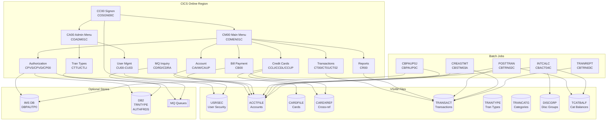

# System CardDemo - Overview for User Stories

**Version:** 2025-03-12  
**Purpose:** Single source of truth for creating well-structured User Stories

---

## 📊 Platform Statistics

- **Technology Stack:** COBOL, CICS, VSAM, JCL, RACF, Assembler; optional DB2, IMS DB, MQ
- **Architecture Pattern:** Mainframe online (CICS) + batch processing; VSAM key-sequenced data stores
- **Key Capabilities:** Credit card account management, transaction processing, bill payment, reporting, user administration
- **Application Entry Point:** CC00 transaction (COSGN00C program)
- **User Roles:** Regular User, Admin User

---

## 🏗️ High-Level Architecture

### Technology Stack
**Core Language:** COBOL (IBM Enterprise COBOL)  
**Transaction Monitor:** CICS (Customer Information Control System)  
**Primary Storage:** VSAM KSDS (Key-Sequenced Data Sets) with Alternate Indexes  
**Batch:** JCL (Job Control Language) with SORT, IDCAMS, IEBGENER utilities  
**Security:** RACF (Resource Access Control Facility)  
**Assembler:** MVSWAIT (timer control), COBDATFT (date format conversion)  
**Optional – DB2:** Relational storage for transaction types and fraud analytics  
**Optional – IMS DB:** Hierarchical database for authorization records  
**Optional – MQ:** Asynchronous messaging for authorization and account inquiries

### Architectural Patterns
- **Program-to-Program Control Transfer:** CICS XCTL for screen navigation between COBOL programs
- **Shared Copybooks:** Common data structures shared across programs via COPY statements
- **VSAM KSDS with AIX:** Primary data store with alternate-index access for cross-references
- **Batch/Online Separation:** Online (CICS) programs handle interactive use; batch COBOL handles nightly processing
- **BMS Maps:** Basic Mapping Support screen definitions drive the CICS terminal interface
- **GDG (Generation Data Groups):** Used for versioned backup and history datasets

---

## 📚 Module Catalog

<!-- MODULE_LIST_START -->
**Modules:** authentication, accounts, credit-cards, transactions, bill-payment, reports, user-management, batch-processing, authorization, transaction-type-db2, mq-integration
<!-- MODULE_LIST_END -->

---

### 1. Authentication
**ID:** `authentication`  
**Purpose:** Controls application access; validates user credentials against the USRSEC file and routes users to the appropriate menu (Admin or User).  
**Key Components:**
- `COSGN00C` (CICS program) – Signon screen logic
- `COSGN00` (BMS map) – Signon screen layout
- `CSUSR01Y` (copybook) – User security record structure
- `USRSEC` VSAM file – User ID / password / user-type store

**CICS Transactions:**
- `CC00` → `COSGN00C` – Application entry point / signon

**Business Rules:**
- Admin users (user-type = `A`) are routed to Admin Menu (COADM01C)
- Regular users (user-type = `U`) are routed to Main Menu (COMEN01C)
- Failed login returns an error message on the signon screen
- Default credentials: `ADMIN001` / `PASSWORD` (admin), `USER0001` / `PASSWORD` (user)

**User Story Examples:**
- As a cardholder, I want to log in with my user ID and password so that I can access my account
- As an admin, I want incorrect login attempts to display an error so that unauthorized access is prevented

---

### 2. Accounts
**ID:** `accounts`  
**Purpose:** Allows users to view and update credit card account details.  
**Key Components:**
- `COACTVWC` (CICS program) – Account view logic
- `COACTUPC` (CICS program) – Account update logic
- `COACTVW` / `COACTUP` (BMS maps) – Account screen layouts
- `CVACT01Y` (copybook) – Account record structure (300-byte, KSDS)
- `ACCTFILE` VSAM – Account master file

**CICS Transactions:**
- `CAVW` → `COACTVWC` – View account details
- `CAUP` → `COACTUPC` – Update account information

**Account Record Fields:**
```
ACCT-ID                 PIC 9(11)       Account identifier
ACCT-ACTIVE-STATUS      PIC X(01)       Y=Active, N=Inactive
ACCT-CURR-BAL           PIC S9(10)V99   Current balance
ACCT-CREDIT-LIMIT       PIC S9(10)V99   Credit limit
ACCT-CASH-CREDIT-LIMIT  PIC S9(10)V99   Cash advance limit
ACCT-OPEN-DATE          PIC X(10)       YYYY-MM-DD
ACCT-EXPIRAION-DATE     PIC X(10)       YYYY-MM-DD
ACCT-REISSUE-DATE       PIC X(10)       YYYY-MM-DD
ACCT-CURR-CYC-CREDIT    PIC S9(10)V99   Cycle credits
ACCT-CURR-CYC-DEBIT     PIC S9(10)V99   Cycle debits
ACCT-ADDR-ZIP           PIC X(10)       Billing zip code
ACCT-GROUP-ID           PIC X(10)       Disclosure group identifier
```

**Business Rules:**
- Account balance is updated by batch posting (CBTRN02C) and interest calculation (CBACT04C)
- Credit limit and cash limit are set at account creation; admin update required for changes
- Group ID links account to interest rate disclosure group

**User Story Examples:**
- As a cardholder, I want to view my current balance so that I can track my spending
- As a cardholder, I want to update my billing address so that my statements are delivered correctly

---

### 3. Credit Cards
**ID:** `credit-cards`  
**Purpose:** Enables users to list, view, and update credit card records associated with their account.  
**Key Components:**
- `COCRDLIC` (CICS) – Credit card list
- `COCRDSLC` (CICS) – Credit card view/select
- `COCRDUPC` (CICS) – Credit card update
- `COCRDLI` / `COCRDSL` / `COCRDUP` (BMS maps)
- `CVACT02Y` (copybook) – Card record structure (150-byte)
- `CVACT03Y` (copybook) – Card/account/customer cross-reference (50-byte)
- `CARDFILE` VSAM – Card master file
- `CARDXREF` VSAM – Card-to-account-to-customer cross-reference (AIX)

**CICS Transactions:**
- `CCLI` → `COCRDLIC` – List credit cards for an account
- `CCDL` → `COCRDSLC` – View/select a credit card
- `CCUP` → `COCRDUPC` – Update credit card details

**Card Record Fields:**
```
CARD-NUM              PIC X(16)   16-digit card number (primary key)
CARD-ACCT-ID          PIC 9(11)   Linked account ID
CARD-CVV-CD           PIC 9(03)   Card verification value
CARD-EMBOSSED-NAME    PIC X(50)   Name on card
CARD-EXPIRAION-DATE   PIC X(10)   Expiry YYYY-MM-DD
CARD-ACTIVE-STATUS    PIC X(01)   Y=Active
```

**Business Rules:**
- Cards are linked to accounts via CARDXREF (card → account → customer)
- Card status changes affect authorization eligibility
- Multiple cards may be linked to a single account

**User Story Examples:**
- As a cardholder, I want to view all cards on my account so that I can manage them
- As a cardholder, I want to update my card's active status so that I can deactivate a lost card

---

### 4. Transactions
**ID:** `transactions`  
**Purpose:** Provides online listing, detail viewing, and manual addition of transaction records.  
**Key Components:**
- `COTRN00C` (CICS) – Transaction list
- `COTRN01C` (CICS) – Transaction view/detail
- `COTRN02C` (CICS) – Transaction add (manual entry)
- `COTRN00` / `COTRN01` / `COTRN02` (BMS maps)
- `CVTRA05Y` (copybook) – Online transaction record (350-byte VSAM KSDS)
- `CVTRA06Y` (copybook) – Daily transaction record (350-byte sequential)
- `TRANSACT` VSAM KSDS – Online transaction file (with AIX on card number)

**CICS Transactions:**
- `CT00` → `COTRN00C` – List transactions
- `CT01` → `COTRN01C` – View transaction detail
- `CT02` → `COTRN02C` – Add transaction manually

**Transaction Record Fields:**
```
TRAN-ID               PIC X(16)     Unique transaction identifier
TRAN-TYPE-CD          PIC X(02)     Transaction type code
TRAN-CAT-CD           PIC 9(04)     Transaction category code
TRAN-SOURCE           PIC X(10)     Source system/channel
TRAN-DESC             PIC X(100)    Description
TRAN-AMT              PIC S9(09)V99 Signed dollar amount
TRAN-MERCHANT-ID      PIC 9(09)     Merchant identifier
TRAN-MERCHANT-NAME    PIC X(50)     Merchant name
TRAN-MERCHANT-CITY    PIC X(50)     Merchant city
TRAN-MERCHANT-ZIP     PIC X(10)     Merchant zip
TRAN-CARD-NUM         PIC X(16)     Associated card number
TRAN-ORIG-TS          PIC X(26)     Origination timestamp
TRAN-PROC-TS          PIC X(26)     Processing timestamp
```

**Business Rules:**
- Online transaction file (TRANSACT VSAM) is the source for reporting and batch processing
- Daily transactions in DALYTRAN sequential file are posted to accounts by CBTRN02C
- Transaction type codes and category codes are reference data (TRANTYPE / TRANCATG VSAM files)
- Rejected transactions written to DALYREJS file during batch posting

**User Story Examples:**
- As a cardholder, I want to list my recent transactions so that I can monitor my charges
- As a cardholder, I want to view the details of a specific transaction so that I can verify merchant information
- As a cardholder, I want to manually add a transaction so that I can record a payment

---

### 5. Bill Payment
**ID:** `bill-payment`  
**Purpose:** Allows cardholders to make bill payments against their credit card account balance.  
**Key Components:**
- `COBIL00C` (CICS) – Bill payment screen logic
- `COBIL00` (BMS map) – Bill payment screen
- Reads from `ACCTFILE` / `CARDFILE` / `CARDXREF` VSAM

**CICS Transactions:**
- `CB00` → `COBIL00C` – Bill payment

**Business Rules:**
- Payment reduces current cycle debit balance
- Account must be active to accept payments
- Payment amounts validated to prevent negative or zero entries

**User Story Examples:**
- As a cardholder, I want to make a bill payment so that I can reduce my outstanding balance
- As a cardholder, I want to see my current balance before paying so that I know the amount owed

---

### 6. Reports
**ID:** `reports`  
**Purpose:** Generates transaction detail reports and account statements both online (submitted via CICS) and via batch.  
**Key Components:**
- `CORPT00C` (CICS) – Transaction report request screen
- `CORPT00` (BMS map) – Report request screen
- `CBTRN03C` (batch) – Transaction detail report printer
- `CBSTM03A` / `CBSTM03B` (batch) – Account statement generator (plain text and HTML)
- `CVTRA03Y` (copybook) – Transaction type reference
- `CVTRA04Y` (copybook) – Transaction category reference

**CICS Transactions:**
- `CR00` → `CORPT00C` – Request transaction report (TRANREPT batch job)

**Batch Jobs:**
- `TRANREPT` (CBTRN03C) – Print transaction detail report
- `CREASTMT` (CBSTM03A) – Generate account statement

**Business Rules:**
- Reports are date-range filtered via DATEPARM sequential file
- Statement includes plain-text and HTML formats
- Report submitted from CICS triggers TRANREPT batch job via internal reader

**User Story Examples:**
- As a cardholder, I want to generate a transaction report for a date range so that I can review my spending
- As a cardholder, I want to receive a monthly account statement so that I have a formal record of activity

---

### 7. User Management
**ID:** `user-management`  
**Purpose:** Administrative functions to list, add, update, and delete user accounts in the USRSEC security file.  
**Key Components:**
- `COUSR00C` (CICS) – List users
- `COUSR01C` (CICS) – Add user
- `COUSR02C` (CICS) – Update user
- `COUSR03C` (CICS) – Delete user
- `COUSR00`–`COUSR03` (BMS maps)
- `CSUSR01Y` (copybook) – User security record
- `USRSEC` VSAM – User security file

**CICS Transactions:**
- `CU00` → `COUSR00C` – List all users
- `CU01` → `COUSR01C` – Add a user
- `CU02` → `COUSR02C` – Update user details
- `CU03` → `COUSR03C` – Delete a user

**Business Rules:**
- Only admin users can access the user management screens
- User types: `A` (admin), `U` (regular user)
- Deletion removes the user record from USRSEC; access is immediately revoked
- User IDs are 8 characters; passwords are stored in USRSEC

**User Story Examples:**
- As an admin, I want to list all users so that I can audit access
- As an admin, I want to add a new user so that they can access the system
- As an admin, I want to delete a user so that terminated employees lose access

---

### 8. Batch Processing
**ID:** `batch-processing`  
**Purpose:** Nightly/periodic batch jobs for transaction posting, interest calculation, file maintenance, and report generation.  
**Key Components:**
- `CBTRN01C` – Transaction validation and preprocessing
- `CBTRN02C` – Daily transaction posting (POSTTRAN); updates account balances and category balance file
- `CBTRN03C` – Transaction detail report (TRANREPT)
- `CBACT01C` – Account file utility
- `CBACT02C` – Account file utility
- `CBACT03C` – Account file utility
- `CBACT04C` – Interest calculation (INTCALC); applies interest using disclosure group rates
- `CBCUS01C` – Customer file utility
- `CBSTM03A` / `CBSTM03B` – Statement generation (CREASTMT)
- `CBEXPORT` / `CBIMPORT` – Data export/import utilities
- `COBSWAIT` – Job wait step (WAITSTEP)

**Key Batch Jobs (full sequence):**
```
CLOSEFIL  → Close VSAM files in CICS
ACCTFILE  → Refresh account master
CARDFILE  → Refresh card master
CUSTFILE  → Refresh customer master
XREFFILE  → Refresh card/account/customer cross-reference
TRANBKP   → Backup transaction file
TRANCATG  → Load transaction category types
TRANTYPE  → Load transaction types
DISCGRP   → Load disclosure groups
TCATBALF  → Load transaction category balance file
POSTTRAN  → Post daily transactions (CBTRN02C)
INTCALC   → Calculate interest (CBACT04C)
COMBTRAN  → Combine system + daily transaction files (SORT)
CREASTMT  → Generate account statements (CBSTM03A)
TRANREPT  → Generate transaction report (CBTRN03C)
OPENFIL   → Reopen VSAM files in CICS
```

**Business Rules:**
- Transactions in DALYTRAN are validated; rejects go to DALYREJS
- Interest computed per account group using DISCGRP rate table
- Statement generated from TRANSACT VSAM file
- GDGs used for versioned transaction backups

**User Story Examples:**
- As a system operator, I want to run the nightly batch cycle so that all transactions are posted
- As a product owner, I want interest to be automatically calculated nightly so that balances stay current
- As an auditor, I want rejected transactions recorded so that I can investigate failures

---

### 9. Authorization (IMS-DB2-MQ)
**ID:** `authorization`  
**Purpose:** Optional module — processes real-time credit card authorization requests received via MQ, stores results in IMS DB, records fraud data in DB2.  
**Key Components:**
- `COPAUA0C` (CICS) – Authorization request processor (MQ-triggered)
- `COPAUS0C` (CICS) – Pending authorization summary screen
- `COPAUS1C` (CICS) – Pending authorization detail screen (mark as fraud)
- `CBPAUP0C` (batch) – Purge expired authorizations
- `COPAU00` / `COPAU01` (BMS maps)
- IMS DBDs: `DBPAUTP0` (HIDAM primary), `DBPAUTX0` (secondary index)
- DB2 tables: `AUTHFRDS` (fraud records), `XAUTHFRD` (extended fraud data)
- MQ queues: authorization request queue and reply queue
- Copybooks: `CCPAURQY` (request), `CCPAURLY` (reply), `CCPAUERY` (IMS segment), `CIPAUDTY`, `CIPAUSMY`

**CICS Transactions:**
- `CPVS` → `COPAUS0C` – View pending authorization summary
- `CPVD` → `COPAUS1C` – View authorization details / mark fraud
- `CP00` → `COPAUA0C` – Process authorization (MQ-triggered)

**Batch Jobs:**
- `CBPAUP0J` (CBPAUP0C) – Purge expired authorizations; restore available credit

**MQ Message Format (Authorization Request):**
```
CCPAURQY copybook fields:
  Authorization request ID, card number, merchant info,
  transaction amount, timestamp, request type
```

**Business Rules:**
- Authorization request validated against account balance and card status
- Approved/declined response sent back via MQ reply queue
- Authorization stored in IMS DB (DBPAUTP0)
- Suspicious transactions can be flagged as fraud; stored in DB2 AUTHFRDS table
- Batch job purges authorizations older than expiry threshold; restores credit

**User Story Examples:**
- As a cardholder, I want to see pending authorizations on my account so that I can identify suspicious activity
- As a fraud analyst, I want to mark an authorization as fraudulent so that it is recorded in the fraud database
- As a system operator, I want expired authorizations purged nightly so that available credit is restored

---

### 10. Transaction Type DB2
**ID:** `transaction-type-db2`  
**Purpose:** Optional module — maintains transaction type and category reference data in DB2 tables; supports add, update, delete via CICS and batch.  
**Key Components:**
- `COTRTLIC` (CICS) – Transaction type list/update/delete (demonstrates DB2 cursor and delete)
- `COTRTUPC` (CICS) – Transaction type add/edit (demonstrates DB2 insert and update)
- `COBTUPDT` (batch) – Batch maintain transaction type table (MNTTRDB2)
- `COTRTLI` / `COTRTUP` (BMS maps)
- DB2 tables: `TRNTYPE`, `TRNTYCAT` (transaction types and categories)
- DB2 extended index tables: `XTRNTYPE`, `XTRNTYCAT`
- Copybooks: `CSDB2RPY`, `CSDB2RWY`

**CICS Transactions:**
- `CTTU` → `COTRTUPC` – Add/edit transaction type (DB2 insert/update)
- `CTLI` → `COTRTLIC` – List/update/delete transaction types (DB2 cursor + delete)

**Batch Jobs:**
- `MNTTRDB2` (COBTUPDT) – Batch maintenance of DB2 transaction type table
- `CREADB21` (DSNTEP4) – Create/load DB2 tables on first install
- `TRANEXTR` (DSNTIAUL) – Extract DB2 data to VSAM for VSAM-based programs

**DB2 Tables:**
```
TRNTYPE:   TRAN-TYPE-CD (PK), TRAN-TYPE-DESC, ...
TRNTYCAT:  TRAN-TYPE-CD, TRAN-CAT-CD (PK), TRAN-CAT-DESC, ...
```

**Business Rules:**
- Transaction types flow from DB2 (master) to VSAM (operational) via TRANEXTR job
- Admin users access transaction type management via Admin Menu (CA00)
- DB2 cursors used for list/paginated display of transaction types

**User Story Examples:**
- As an admin, I want to add a new transaction type in DB2 so that it is available for transaction classification
- As an admin, I want to delete obsolete transaction types so that the reference data stays clean

---

### 11. MQ Integration
**ID:** `mq-integration`  
**Purpose:** Optional module — demonstrates MQ request/response pattern for system date inquiry and account detail inquiry from an external client.  
**Key Components:**
- `CODATE01` (CICS) – System date inquiry via MQ (CDRD transaction)
- `COACCT01` (CICS) – Account details inquiry via MQ (CDRA transaction)

**CICS Transactions:**
- `CDRD` → `CODATE01` – Respond to MQ request for system date
- `CDRA` → `COACCT01` – Respond to MQ request for account details

**Business Rules:**
- External MQ client sends request to designated queue; CICS program reads, processes, and replies
- Account inquiry reads from ACCTFILE VSAM and returns account balance and status
- Date inquiry returns the current system date/time

**User Story Examples:**
- As an integration developer, I want to query account details via MQ so that distributed systems can access account data asynchronously
- As an integration developer, I want to retrieve the system date via MQ so that external applications can synchronize timestamps

---

## 🔄 Architecture Diagram



---

## 📊 Data Models

### Account Record (`CVACT01Y`, ACCTFILE VSAM KSDS, 300 bytes)
```cobol
01  ACCOUNT-RECORD.
    05  ACCT-ID                    PIC 9(11)        Account number (primary key)
    05  ACCT-ACTIVE-STATUS         PIC X(01)        Y=Active, N=Inactive
    05  ACCT-CURR-BAL              PIC S9(10)V99    Current balance (signed)
    05  ACCT-CREDIT-LIMIT          PIC S9(10)V99    Credit limit
    05  ACCT-CASH-CREDIT-LIMIT     PIC S9(10)V99    Cash advance limit
    05  ACCT-OPEN-DATE             PIC X(10)        YYYY-MM-DD open date
    05  ACCT-EXPIRAION-DATE        PIC X(10)        YYYY-MM-DD expiry
    05  ACCT-REISSUE-DATE          PIC X(10)        YYYY-MM-DD last reissue
    05  ACCT-CURR-CYC-CREDIT       PIC S9(10)V99    Credits this cycle
    05  ACCT-CURR-CYC-DEBIT        PIC S9(10)V99    Debits this cycle
    05  ACCT-ADDR-ZIP              PIC X(10)        Billing zip code
    05  ACCT-GROUP-ID              PIC X(10)        Disclosure group ID
```

### Customer Record (`CVCUS01Y`, CUSTFILE VSAM KSDS, 500 bytes)
```cobol
01  CUSTOMER-RECORD.
    05  CUST-ID                    PIC 9(09)        Customer ID (primary key)
    05  CUST-FIRST-NAME            PIC X(25)
    05  CUST-MIDDLE-NAME           PIC X(25)
    05  CUST-LAST-NAME             PIC X(25)
    05  CUST-ADDR-LINE-1           PIC X(50)
    05  CUST-ADDR-LINE-2           PIC X(50)
    05  CUST-ADDR-LINE-3           PIC X(50)
    05  CUST-ADDR-STATE-CD         PIC X(02)
    05  CUST-ADDR-COUNTRY-CD       PIC X(03)
    05  CUST-ADDR-ZIP              PIC X(10)
    05  CUST-PHONE-NUM-1           PIC X(15)
    05  CUST-PHONE-NUM-2           PIC X(15)
    05  CUST-SSN                   PIC 9(09)        Social Security Number
    05  CUST-GOVT-ISSUED-ID        PIC X(20)
    05  CUST-DOB-YYYY-MM-DD        PIC X(10)
    05  CUST-EFT-ACCOUNT-ID        PIC X(10)
    05  CUST-PRI-CARD-HOLDER-IND   PIC X(01)        Y=Primary cardholder
    05  CUST-FICO-CREDIT-SCORE     PIC 9(03)        FICO credit score
```

### Card Record (`CVACT02Y`, CARDFILE VSAM KSDS, 150 bytes)
```cobol
01  CARD-RECORD.
    05  CARD-NUM                   PIC X(16)        Card number (primary key)
    05  CARD-ACCT-ID               PIC 9(11)        Linked account ID
    05  CARD-CVV-CD                PIC 9(03)        CVV security code
    05  CARD-EMBOSSED-NAME         PIC X(50)        Name embossed on card
    05  CARD-EXPIRAION-DATE        PIC X(10)        YYYY-MM-DD expiry
    05  CARD-ACTIVE-STATUS         PIC X(01)        Y=Active
```

### Transaction Record (`CVTRA05Y`, TRANSACT VSAM KSDS, 350 bytes)
```cobol
01  TRAN-RECORD.
    05  TRAN-ID                    PIC X(16)        Transaction ID (primary key)
    05  TRAN-TYPE-CD               PIC X(02)        Type code (ref: TRANTYPE)
    05  TRAN-CAT-CD                PIC 9(04)        Category code (ref: TRANCATG)
    05  TRAN-SOURCE                PIC X(10)        Source channel
    05  TRAN-DESC                  PIC X(100)       Description
    05  TRAN-AMT                   PIC S9(09)V99    Amount (signed)
    05  TRAN-MERCHANT-ID           PIC 9(09)        Merchant ID
    05  TRAN-MERCHANT-NAME         PIC X(50)        Merchant name
    05  TRAN-MERCHANT-CITY         PIC X(50)        Merchant city
    05  TRAN-MERCHANT-ZIP          PIC X(10)        Merchant zip
    05  TRAN-CARD-NUM              PIC X(16)        Associated card number
    05  TRAN-ORIG-TS               PIC X(26)        Origination timestamp
    05  TRAN-PROC-TS               PIC X(26)        Processing timestamp
```

### User Security Record (`CSUSR01Y`, USRSEC VSAM, 80 bytes)
```
USER-ID             PIC X(08)    Login user ID (primary key)
USER-PASSWORD       PIC X(08)    Password
USER-TYPE           PIC X(01)    A=Admin, U=Regular User
USER-FNAME          PIC X(20)    First name
USER-LNAME          PIC X(20)    Last name
```

### Cross-Reference Record (`CVACT03Y`, CARDXREF VSAM KSDS, 50 bytes)
```
FD-XREF-CARD-NUM    PIC X(16)   Card number (primary key)
FD-XREF-CUST-NUM    PIC 9(09)   Customer ID
FD-XREF-ACCT-ID     PIC 9(11)   Account ID
```

---

## 📋 Business Rules by Module

### Authentication
- User record must exist in USRSEC with matching password
- User type field routes to correct menu: `A` → Admin Menu, `U` → User Menu
- Session context passed via CICS commarea (COCOM01Y copybook)

### Accounts
- Balance = prior balance + cycle credits − cycle debits
- Interest calculation uses ACCT-GROUP-ID to look up rate in DISCGRP file
- Account must be active (ACCT-ACTIVE-STATUS = `Y`) for transactions to be processed

### Credit Cards
- Card-to-account relationship maintained via CARDXREF (AIX on CARDFILE)
- Card expiry checked during authorization processing
- Active status (`Y`/`N`) controls whether card can be used for purchases

### Transactions
- Transaction type codes (2-char) and category codes (4-digit) are reference data
- Daily transaction file (DALYTRAN) is input to POSTTRAN batch; outputs to TRANSACT VSAM
- Rejected transactions (invalid card, inactive account, etc.) written to DALYREJS

### Bill Payment
- Payment credited to ACCT-CURR-CYC-CREDIT field
- Payment amount must be positive and not exceed outstanding balance
- Payment recorded as a transaction in TRANSACT VSAM

### Reports
- Date range parameters provided via DATEPARM sequential file
- Statement output in two formats: plain text (STMTFILE) and HTML (HTMLFILE)
- CICS report request submits TRANREPT JCL via internal reader

### User Management
- Admin-only access enforced via CICS security and user-type check
- USRSEC VSAM updated directly by COUSR01C (add), COUSR02C (update), COUSR03C (delete)

### Authorization (Optional)
- MQ request triggers COPAUA0C via CICS MQ bridge
- Authorization approved/declined based on available credit and card status
- Two-phase commit across IMS DB and DB2 for fraud recording
- Batch purge (CBPAUP0J) runs daily to expire old authorizations and restore credit

### Transaction Type DB2 (Optional)
- DB2 TRNTYPE table is the master; VSAM TRANTYPE file is a working copy extracted by TRANEXTR
- Cursor-based paging used in COTRTLIC for list display
- Admin menu access required

---

## 🎯 Patterns for User Stories

### Navigation Pattern (CICS XCTL)
All screen navigation uses `EXEC CICS XCTL PROGRAM(...)`. Each program receives context via a commarea. User Stories involving multi-screen flows should account for commarea state management.

### Templates by Domain

#### Account Management Stories
**Pattern:** As a [cardholder/admin], I want [account action] so that [financial visibility/control]
- As a cardholder, I want to view my account balance so that I know how much credit is available
- As a cardholder, I want to update my billing zip code so that my address is current

#### Transaction Stories
**Pattern:** As a [cardholder/operator], I want [transaction action] so that [tracking/accuracy]
- As a cardholder, I want to see transactions sorted by date so that I can find recent charges
- As an operator, I want the batch to post transactions nightly so that balances are always current

#### Administrative Stories
**Pattern:** As an admin, I want [admin action] so that [governance/security]
- As an admin, I want to add a user with the correct type so that they receive the right access level
- As an admin, I want to delete terminated users so that security is maintained

#### Optional Module Stories
**Pattern:** As a [analyst/operator], I want [optional capability] so that [risk/integration value]
- As a fraud analyst, I want to flag authorizations as fraudulent so that the risk team is alerted
- As an integration developer, I want to query account data via MQ so that distributed systems stay synchronized

### Story Complexity Guidelines
- **Simple (1-2 pts):** Single-screen CRUD using existing BMS map + VSAM read/write
- **Medium (3-5 pts):** Multi-file read with business validation (e.g., bill payment, account update)
- **Complex (5-8 pts):** Cross-technology integration (MQ + IMS + DB2), batch job coordination, multi-step CICS flows

### Acceptance Criteria Patterns
- **Authentication:** Given valid credentials, when I sign on, then I am routed to the correct menu
- **Validation:** Given an inactive account, when I attempt a transaction, then an error message is displayed
- **Data Integrity:** Given a posted transaction, when I view the transaction list, then the record appears with correct amounts
- **Batch Completion:** Given daily transactions exist, when POSTTRAN runs, then account balances reflect the posted amounts
- **Error Handling:** Given invalid input, when I submit the form, then a descriptive error message is displayed on screen

---

## ⚡ Performance Budgets

- **CICS Response Time:** < 2 seconds per screen interaction (P95)
- **Batch POSTTRAN:** Must complete before CICS region reopens (within batch window)
- **VSAM I/O:** KSDS random access < 50ms per record
- **Interest Calculation (INTCALC):** Must process all active accounts within nightly batch window
- **MQ Round-Trip:** < 5 seconds for authorization request/response cycle

---

## 🚨 Readiness Considerations

### Technical Risks
- **VSAM File Contention:** CICS holds files open; batch requires CLOSEFIL/OPENFIL steps around file updates → Always run CLOSEFIL before batch file refresh jobs
- **DB2 Optional Module Dependency:** Transaction type management requires DB2 setup (CREADB21) before TRANEXTR can populate VSAM → DB2 must be initialized before first use
- **MQ Queue Configuration:** Authorization and MQ inquiry modules require MQ channel and queue setup → Coordinate with MQ administrator
- **IMS DB Setup:** Authorization module requires IMS DBA to define DBPAUTP0 and associated PSBs

### Tech Debt
- **Typo in Field Names:** `ACCT-EXPIRAION-DATE` and `CARD-EXPIRAION-DATE` have a typo (should be EXPIRATION) → Copybook change requires recompile of all dependent programs
- **Mixed Case Conventions:** Some programs use lower-case `.cbl` extensions, others use `.CBL` → No functional impact but tools may need case-insensitive handling

### Sequencing for US Development
1. **Foundation:** Authentication → Accounts → Credit Cards
2. **Core Flows:** Transactions → Bill Payment → Reports
3. **Administration:** User Management
4. **Batch:** Batch Processing (coordinate with online)
5. **Optional:** Authorization → Transaction Type DB2 → MQ Integration

---

## 📈 Success Metrics

### Adoption
- **Target:** All active cardholders able to sign on and view their account without assistance
- **Engagement:** Weekly active users performing at least one transaction view per cycle
- **Retention:** Monthly bill payment usage rate

### Business Impact
- **Batch Reliability:** 99.9% successful nightly batch completion rate (zero failed POSTTRAN runs)
- **Transaction Accuracy:** Zero discrepancies between DALYTRAN posted amounts and account balance updates
- **Authorization Response Time:** < 5 second MQ round-trip for 95% of authorization requests

---

*Last updated: 2025-03-12*
