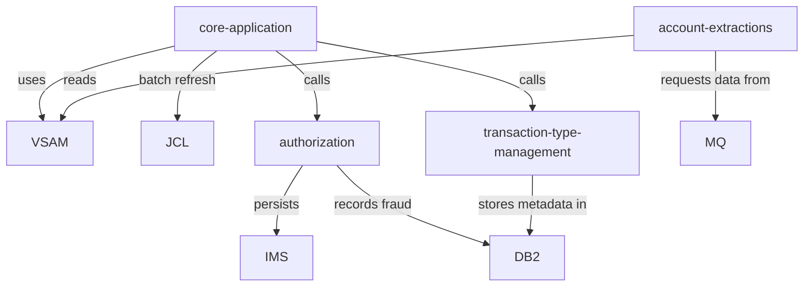

# System CardDemo - Overview for User Stories

**Version:** March 12, 2026  
**Purpose:** Single source of truth for writing accurate user stories that drive modernization work against the CardDemo credit card management platform.

---

## 📊 Platform Statistics
- **Technology Stack:** COBOL 6.x (CICS/TS), BMS maps, IBM JCL, VSAM KSDS, optional DB2/IMS/MQ integrations, RACF security, assorted utilities.
- **Architecture Pattern:** Transaction-centric mainframe stack with decoupled batch and online layers plus optional relational and messaging bridges for modernization scenarios.
- **Key Capabilities:** Account/card management, interactive transaction review, batch posting, pending authorization workflow, DB2-backed metadata management, MQ-based data extraction/responses.
- **Supported Languages:** English-only BMS screens (no multilingual resource bundles); all text lives in map definitions and copybooks.

---

## 🏗️ High-Level Architecture
### Technology Stack
**Backend:** COBOL programs orchestrated by CICS (TS 6.3+) for online paths and JCL-driven batch jobs on z/OS.  
**Frontend:** CICS screens rendered via BMS map sets under `app/bms`.  
**Database:** VSAM KSDS files for operational data plus optional DB2 schemas for metadata/fraud analytics and IMS HIDAM for authorization history.  
**Cache:** None—state is either in VSAM or inferred from persistent DB2/IMS data.  
**Others:** IBM MQ queues for asynchronous integrations, RACF for security, scheduler files (`app/scheduler`) for job definitions, assorted utilities under `app/scripts` and `samples` for reference.

### Architectural Patterns
- **Transaction Boundary Enforcement:** Every interactive path begins with a CICS transaction (e.g., `CC00`, `CT02`, `CT01`) that routes to a COBOL program and map set pair.
- **Batch Orchestration:** JCL jobs (`ACCTFILE`, `CARDFILE`, `TRANBKP`, etc.) refresh VSAM datasets and extract data for optional modules.
- **Dual Persistence:** Operational reads/writes hit VSAM, while the optional transaction-type and authorization modules maintain mirrored records in DB2 (for metadata/fraud) or IMS (for authorizations).
- **MQ Event Bridge:** MQ queues (`AWS.M2.CARDDEMO.PAUTH.REQUEST`, `CARDDEMO.REQUEST.QUEUE`, etc.) provide asynchronous touchpoints for cloud clients, system-date inquiries, and account extraction requests.
- **Security Composition:** RACF-enforced user ids (`ADMIN001`, `USER0001`) gate access; CICS programs consult `CSUSR01Y.cpy` structures for authentication states.

---

## 📚 Module Catalog
<!-- MODULE_LIST_START -->
**Modules:** core-application, authorization, transaction-type-management, account-extractions
<!-- MODULE_LIST_END -->

### 1. Core Application
**ID:** `core-application`  
**Purpose:** Deliver the baseline credit card management experience (sign-on, account/card/transaction maintenance, bill payment, statements, reports).  
**Key Components:** `app/cbl/` COBOL programs (`COSGN00C`, `COACTVW`, `COCRDUP`, `COTRN00C`, etc.), `app/bms/` map sets (screens like `COSGN00`, `COACTUP`), VSAM copybooks (`CVACT01Y`, `CVTRA06Y`, `CSUSR01Y`), and control files (`app/proc`, `app/jcl`).  
**Public APIs:**  
- `CICS CC00` → `COSGN00C` (sign-on, navigation).  
- `CICS CT00/CT01/CT02` → transaction list/view/add programs (`COTRN00C`, `COTRN01C`, `COTRN02C`).  
- `CICS CAUP` & `CCUP` → account/card update screens.  
- Batch jobs (`ACCTFILE`, `CARDFILE`, `TRANBKP`, `CREASTMT`) that refresh VSAM datasets.  
**User Story Examples:**  
- As a **consumer**, I want to view my card balance and transactions (via `CT01` and `CA00`) so I can verify charges before paying a bill.  
- As a **support analyst**, I want `CBIL00C` to generate statements and reports so I can email monthly summaries to customers.

### 2. Authorization
**ID:** `authorization`  
**Purpose:** Simulate real-time credit card authorization flows with MQ-triggered requests, business rules, IMS persistence, and DB2-based fraud tracking.  
**Key Components:** `app/app-authorization-ims-db2-mq/` COBOL (`COPAUA0C`, `COPAUS0C`, `COPAUS1C`, `COPAUS2C`, `CBPAUP0C`), map sets (`COPAU00`, `COPAU01`), IMS DBD/PSB artifacts, DB2 table `AUTHFRDS`, MQ configuration (`AWS.M2.CARDDEMO.PAUTH.REQUEST/REPLY`).  
**Public APIs:**  
- `MQ queue AWS.M2.CARDDEMO.PAUTH.REQUEST` accepts comma-delimited authorization payloads (fields in order: AUTH-DATE, AUTH-TIME, CARD-NUM, …, TRANSACTION-ID).  
- `MQ queue AWS.M2.CARDDEMO.PAUTH.REPLY` returns CARD-NUM, TRANSACTION-ID, AUTH-ID-CODE, AUTH-RESP-CODE/REASON, APPROVED-AMT.  
- `CICS transactions CP00/CPVS/CPVD` provide summary, detail, and fraud-marking workflows.  
- Batch job `CBPAUP0J` purges expired authorizations daily.  
**User Story Examples:**  
- As a **fraud analyst**, I want to mark an authorization as fraudulent (PF5 → `CPVD`) so that DB2 audit records reflect the investigation.  
- As an **integration engineer**, I want MQ responses to return `AUTH-RESP-CODE` within 500 ms so downstream call centers can reply to merchants instantly.

### 3. Transaction Type Management
**ID:** `transaction-type-management`  
**Purpose:** Demonstrate DB2 extension for maintaining transaction-type metadata that feeds into the core VSAM processing pipeline.  
**Key Components:** `app/app-transaction-type-db2/` programs (`COTRTUPC`, `COTRTLIC`, `COBTUPDT`), BMS maps (`COTRTUP`, `COTRTLI`), DB2 tables `TRANSACTION_TYPE` and `TRANSACTION_TYPE_CATEGORY`, jobs `CREADB21`, `TRANEXTR`, `MNTTRDB2`.  
**Public APIs:**  
- `CICS CTLI`/`CTTU` transactions for list/update/delete/add, with forward/backward cursor behavior in DB2.  
- `JCL TRANEXTR` extracts DB2 rows into VSAM-friendly files consumed by `COTRN00C` flows.  
- DB2 static SQL statements (host variables + SQLCA) inside COBOL programs.  
**User Story Examples:**  
- As an **admin**, I want to edit transaction descriptions through `CTLI` so that customer-facing categories stay accurate.  
- As an **automation engineer**, I want `TRANEXTR` to run nightly and deliver VSAM files so the Transaction List screen sees the latest codes.

### 4. Account Extractions
**ID:** `account-extractions`  
**Purpose:** Showcase MQ-driven account inquiries (system date and account detail) that integrate VSAM data with asynchronous messaging. The module acts as an MQ-to-VSAM bridge enabling external cloud or batch clients to query mainframe data without direct 3270 sessions.  
**Key Components:**
- `app/app-vsam-mq/cbl/CODATE01.cbl` — CICS program (transaction `CDRD`) that listens on the MQ request queue and replies with the current system date/time obtained via `EXEC CICS ASKTIME`/`FORMATTIME`.
- `app/app-vsam-mq/cbl/COACCT01.cbl` — CICS program (transaction `CDRA`) that listens on the MQ request queue and replies with account details read directly from the `ACCTDAT` VSAM KSDS file using the `CVACT01Y` copybook layout.
- `app/app-vsam-mq/csd/CRDDEMOM.csd` — CICS resource definitions (PROGRAM, TRANSACTION, LIBRARY) for the `CARDDEMO` CSD group.
- MQ queues: `CARDDEMO.REQUEST.QUEUE` (inbound), `CARD.DEMO.REPLY.DATE` / `CARD.DEMO.REPLY.ACCT` (reply), `CARD.DEMO.ERROR` (faults).

**Public APIs:**
- **MQ Date Request:** 1000-byte message with any function code → reply on `CARD.DEMO.REPLY.DATE` containing `SYSTEM DATE : MM-DD-YYYY` and `SYSTEM TIME : HH:MM:SS`.
- **MQ Account Request:** 1000-byte message with `WS-FUNC='INQA'` and `WS-KEY=<11-digit account ID>` → reply on `CARD.DEMO.REPLY.ACCT` with formatted account fields (ID, status, balances, dates, group ID) or `INVALID REQUEST PARAMETERS` if the account is not found.
- `CICS CDRD` transaction triggers `CODATE01`; `CICS CDRA` triggers `COACCT01` via the MQ trigger monitor.

**Request Message Layout (shared, 1000 bytes):**
```
WS-FUNC   PIC X(04)  — 'INQA' for account, any value for date
WS-KEY    PIC 9(11)  — account ID (numeric); 0 for date requests
WS-FILLER PIC X(985) — padding
```

**Dependencies:**
- Base CardDemo application (VSAM `ACCTDAT` dataset, `CVACT01Y` copybook).
- IBM MQ queue manager with CICS-MQ bridge configured.
- IBM MQ COBOL copybooks (`CMQGMOV`, `CMQMDV`, `CMQODV`, `CMQPMOV`, `CMQV`, `CMQTML`).

**Business Rules:**
- Account requests require `WS-FUNC = 'INQA'` AND `WS-KEY > 0`; any other combination returns an inline error reply.
- `MQGMO-WAITINTERVAL` is set to 5000 ms; the program exits gracefully on `MQRC-NO-MSG-AVAILABLE`.
- All MQ GET/PUT pairs are protected by `MQGMO-SYNCPOINT` / `MQPMO-SYNCPOINT` with CICS `SYNCPOINT` at the top of each loop iteration.
- MQ API errors are written to `CARD.DEMO.ERROR` and trigger program termination.

**User Story Examples:**  
- As a **cloud integration tester**, I want to send a `DATE` request and see system date response so downstream services can synchronize clocks.  
- As a **data extraction architect**, I need `INQA` requests to return account balances and statuses derived from `CVACT01Y` fields so data-lake pipelines can ingest current account snapshots.
- As an **integration engineer**, I want MQ operation failures to be captured in `CARD.DEMO.ERROR` with MQCC/MQRC codes so I can diagnose queue configuration issues without checking CICS journals.

---

## 🔄 Architecture Diagram
```mermaid
flowchart LR
    subgraph Interactive
        User[Regular user via 3270] -->|CICS transaction| CICS
        Admin[Admin user] -->|CA00/CTLI/CTTU| CICS
    end
    CICS --> COBOL[COBOL programs + BMS maps]
    COBOL --> VSAM[VSAM KSDS datasets]
    COBOL --> MQ[IBM MQ queues]
    COBOL --> DB2[DB2 tables (fraud, transaction types)]
    COBOL --> IMS[IMS HIDAM (Authorization history)]
    MQ --> AuthorizationModule[Authorization MQ listeners]
    MQ --> AccountExtraction[Account extraction listeners]
```



---

## 📊 Data Models
### Account Record (`CVACT01Y` copybook)
```cobol
01 ACCOUNT-RECORD.
   05 ACCT-ID                           PIC 9(11).
   05 ACCT-ACTIVE-STATUS                PIC X(01).
   05 ACCT-CURR-BAL                     PIC S9(10)V99.
   05 ACCT-CREDIT-LIMIT                 PIC S9(10)V99.
   05 ACCT-OPEN-DATE                    PIC X(10).
   05 ACCT-EXPIRAION-DATE               PIC X(10).
   05 ACCT-REISSUE-DATE                 PIC X(10).
   05 ACCT-CURR-CYC-CREDIT              PIC S9(10)V99.
   05 ACCT-ADDR-ZIP                     PIC X(10).
```

### Daily Transaction Record (`CVTRA06Y` copybook)
```cobol
01 DALYTRAN-RECORD.
   05 DALYTRAN-ID                     PIC X(16).
   05 DALYTRAN-TYPE-CD                PIC X(02).
   05 DALYTRAN-CAT-CD                 PIC 9(04).
   05 DALYTRAN-SOURCE                 PIC X(10).
   05 DALYTRAN-DESC                   PIC X(100).
   05 DALYTRAN-AMT                    PIC S9(09)V99.
   05 DALYTRAN-MERCHANT-ID            PIC 9(09).
   05 DALYTRAN-CARD-NUM               PIC X(16).
   05 DALYTRAN-ORIG-TS                PIC X(26).
```

### Authorization Fraud Table (`AUTHFRDS`)
Fields persisted when CPVD marks fraud: CARD_NUM, AUTH_TS, AUTH_RESP_CODE, AUTH_FRAUD, FRAUD_RPT_DATE, ACCT_ID, CUST_ID.  Every fraud row includes merchant/context fields (MERCHANT_NAME, MERCHANT_CITY, MERCHANT_STATE, MERCHANT_ZIP, MATCH_STATUS).

---

## 📋 Business Rules by Module
### Core Application
- Account records keep `ACCT-ACTIVE-STATUS`; bill payments only post when status = 'A'.  
- Transaction additions (`CT02`) must reconcile against VSAM daily transaction limits and update category balances (e.g., `CVTRA02Y`).

### Authorization
- Authorization requests older than 30 days are purged by `CBPAUP0J`.  
- Fraud flags set via `CPVD` cascade to DB2 `AUTHFRDS` for audit + analytics.  
- Business rules enforce two-phase commit between IMS (authorization details) and DB2 (fraud records).

### Transaction Type Management
- `TRANSACTION_TYPE_CATEGORY` rows enforce `DELETE RESTRICT` so core processing never sees orphaned categories.  
- Updates to transaction descriptions feed `TRANEXTR` nightly to refresh VSAM metadata before online interactions.

### Account Extractions
- `CDRA`/`CDRD` MQ payloads require request IDs and consistent correlation identifiers; responses must include `SYSTEM-DATE` or `ACCOUNT-DATA` before showing to the user.

---

## 👥 Actors & Journeys
- **Regular User:** Logs in via `CC00`, navigates account/card/transaction menus, edits cards with `CCUP`, reviews statements from `COBIL00C`.  
- **Admin User:** Uses `ADMIN001` to access `CA00`, maintain users (`CU01`–`CU03`), and optionally manage transaction types (`CTLI`, `CTTU`).  
- **Cloud Integration Actor:** Sends MQ messages (`CARDDEMO.REQUEST.QUEUE`, `AWS.M2.CARDDEMO.PAUTH.REQUEST`) and expects replies within <1s to display to merchant or data lake dashboards.

---

## 🌐 Internationalization and Translation
### i18n File Structure
There are no separate locale bundles—text lives directly in CICS BMS map sets under `app/bms` and copybooks in `app/cpy`.  Each screen defines static English labels, so US-based user stories assume English-only content.  Translation effort requires editing BMS maps and re-deploying via `app/app-*.bms` definitions.

---

## 🎯 Form and Listing Patterns
### Component Structure Analysis
- **Forms:** Each CICS form is a BMS map (e.g., `COPAU00` for authorization summary, `COACTUP` for account updates). COBOL programs handle field-level validation before issuing `SEND MAP` commands.  
- **Lists:** Screens such as `COTRN00`, `COCRDLI`, and `COPAU00` render lists via BMS, with PF7/PF8 paging controls driving forward/back cursor logic in COBOL.  
- **Validation:** COBOL routines enforce PIC-based validation and use `SQLCA` for DB2 error handling; there is no JavaScript or client-side tooling.  
- **Notifications:** Success/failure feedback is embedded within the BMS map (e.g., `COPAUS0C` writes status lines), with no global toast system.

---

## 🧾 User Story Development Patterns
- **Pattern:** _As a [persona], I want [action] so that [value]._  
- **Stories to clone:** e.g., “As an admin, I want to add a transaction type via `CTTU` so that new business requirements appear immediately in the Admin menu.”  
- **Complexity Guidance:**  
  - **Simple (1-2 pts):** Add attributes to an existing screen or copybook; repoint an MQ queue to a new request type.  
  - **Medium (3-5 pts):** Change DB2 SQL or add new fields to `CVTRA06Y`; adjust MV structure and update JCL extraction logic.  
  - **Complex (5-8 pts):** Wire a new MQ integration plus follow-up DB2/IMS persistence and batch refreshes.
- **Acceptance Criteria Patterns:**  
  - **Authentication:** Verify `ADMIN001` and `USER0001` credentials before allowing menu access.  
  - **Validation:** Delta updates must respect PIC masks and `SQLCA` success codes.  
  - **Performance:** Transactions should notify users within 1.5s interactively; MQ responses should arrive in under 1s.  
  - **Error Handling:** Display BMS error lines when MQ fails or VSAM locks occur; avoid silent failures.

---

## ⚡ Performance Budgets
- **CICS Interactive:** P95 < 1.5 seconds for map flips and transaction responses (CC00, CT01, CPVD).  
- **MQ Round-trip:** Authorization and extraction request/response within 1 second end-to-end.  
- **Batch Chain:** ACCTFILE→CARDFILE→TRANBKP sequence should finish within 5 minutes during nightly refresh.  
- **DB2 Queries:** Cursor scans for CTLI or fraud history should return < 300 ms per page under production load.

---

## 🚨 Readiness Considerations
### Technical Risks
- **IMS Availability:** Authorization module requires HIDAM IMS; mitigation: provision IMS test copy before enabling `COPAUA0C`.  
- **DB2 Schema Drift:** `TRANSACTION_TYPE` and `AUTHFRDS` schema names must match the environment referenced in `COTRTUPC` and `COPAUS2C`; plan for schema branding and run `CREADB21`.  
### Tech Debt
- **Duplication:** VSAM/DB2 dual persistence duplicates metadata. Address by documenting sync timings and keeping `TRANEXTR` definitions accurate.  
### Sequencing for User Stories
- **Prerequisites:** Base `core-application` installed, VSAM datasets loaded, `CBPAUP0J` defined.  
- **Recommended order:** Start with core flows → optional MQ integrations → DB2/IMS pairing → nightly batch refinements.

---

## 📈 Success Metrics
### Adoption
- **Target:** 90% of modernization pilot users successfully run at least one MQ transaction (CDRD/CDRA or authorization) in their first week.  
- **Engagement:** Track PF-key usage for pending authorizations (`CPVS`/`CPVD`) and transaction-type screens (`CTLI`/`CTTU`).  
- **Retention:** Expect administrators to revisit transaction metadata dashboards at least weekly to keep categories current.

### Business Impact
- **Metric-1:** Reduce manual authorization investigation time by 20% after fraud markers populate DB2 `AUTHFRDS`.  
- **Metric-2:** Improve customer support accuracy by ensuring `TRANEXTR` keeps VSAM transaction types aligned with DB2 metadata.

---

_Last updated: March 12, 2026._
