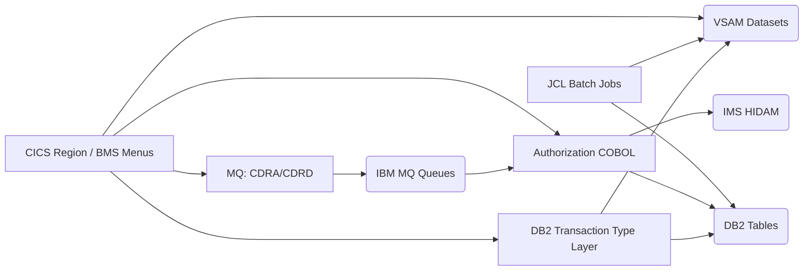
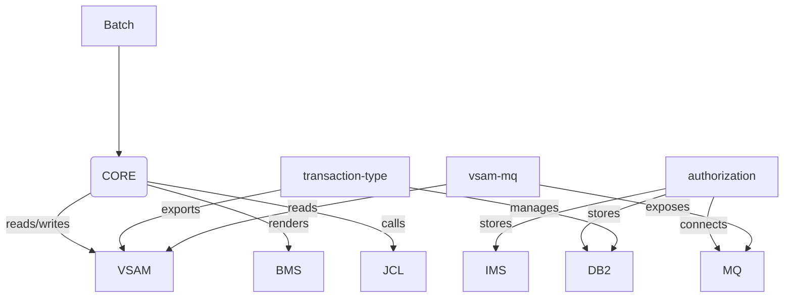

# System CardDemo - Overview for User Stories

**Version:** March 12, 2026  
**Purpose:** Single source of truth for engineers and Product Owners to describe and size user stories against the current CardDemo mainframe stack.

---

## 📊 Platform Statistics
- **Technology Stack:** COBOL (including DB2 precompiler), CICS/BMS, JCL batch, VSAM KSDS/ESDS/RRDS, IMS hierarchical, MQ messaging, DB2 relational, assembler utilities, and supporting scripts for compilation/deployment.  
- **Architecture Pattern:** Transactional CICS front end for online use plus orchestrated JCL batch jobs for data initialization and overnight processing; optional IMS/DB2/MQ extension layers for advanced scenarios.  
- **Key Capabilities:** Account/card management, transaction inquiry, bill payments, account extraction, transaction type administration, credit card authorization simulation, statement reporting, and batch data lifecycle (load/copy/extract).  
- **Supported Languages:** English-only BMS captions and prompts; no locale files (all UI text lives in the BMS maps under `app/bms`).

## 👥 Actors and Journeys
- **Regular cardholder:** Signs on through `CC00`, navigates `CM00` menu, views account (`CAVW`), browses transactions (`CT00` list with `COTRN00` map), checks individual transactions (`CT01`), and initiates bill payments (`CB00`).  
- **Admin user:** Uses ADMIN001 to open `CA00`, manages users (`CU00`/`CU01`/`CU02`/`CU03`), maintains transaction types (`CTTU`, `CTLI` when DB2 optional module installed), and audits statements/reports (`CR00`, `CBSTM03A/B`).  
- **Ops/integration persona:** Deploys optional `CP00`/`CPVS`/`CPVD` for authorizations via MQ/IMS/DB2, or MQ-based inquiries (`CDRD`, `CDRA`), and monitors batch jobs (`POSTTRAN`, `CREASTMT`, etc.) to keep VSAM/DB2/IMS datasets synchronized.

## 🏗️ High-Level Architecture
### Technology Stack
**Backend:** COBOL 6.x / CICS 5+ with BMS screens and assembler hooks  
**Frontend:** CICS BMS maps rendered through terminal emulators (TN3270)  
**Database:** VSAM KSDS/ESDS/RRDS stores (customer, account, card, transactions, statements), optional DB2 tables for transaction types and fraud analytics, IMS HIDAM for authorizations  
**Messaging:** IBM MQ queues for authorization requests/responses and account inquiries  
**Batch Framework:** JCL jobs under `app/jcl` orchestrate dataset setup, transaction posting, statement generation, and extensions such as `TRANEXTR`, `CREADB21`, `CBPAUP0J`  
**Others:** `app/asm`, `app/csd`, `app/ctl`, `app/proc`, `app/data`, `scripts/` for deployment helpers and staging

### Architectural Patterns
- **Transaction Gateway:** CICS transactions orchestrate BMS screens and call COBOL programs (`app/cbl`) plus copybooks (`app/cpy`) to populate VSAM records or to emit MQ messages.  
- **Service Layer:** COBOL programs encapsulate business logic (account updates, transaction posting, bill payment, authorization decisions) and rely on shared copybooks to standardize record layouts.  
- **Data Synchronization:** Batch jobs refresh VSAM datasets, extract DB2/IMS data, and maintain control files; optional DB2/IMS integration ensures dual-write consistency.  
- **Integration:** MQ listeners (`app/app-vsam-mq`) provide request/response patterns; authorization flows combine MQ, VSAM, IMS, and DB2 with two-phase commit semantics.  
- **Authentication:** RACF-managed CICS logon (users such as ADMIN001/USER0001) pairs with the CC00 transaction and `COSGN00C` program to gate access to `CM00` menu options.

## 📚 Module Catalog

<!-- MODULE_LIST_START -->
**Modules:** core, authorization, transaction-type, vsam-mq
<!-- MODULE_LIST_END -->

### 1. Core
**ID:** `core`  
**Purpose:** Deliver the baseline credit card lifecycle (accounts, cards, transactions, statements, payments, user management) through CICS/BMS screens and batch JCL jobs.  
**Key Components:** `app/cbl` COBOL programs (e.g., `COSGN00C`, `COACTVWC`, `COTRN00C`, `CBSTM03A`), BMS maps (`app/bms/COSGN00.bms`, `COTRN00.bms`, `COACTVW.bms`), copybooks (`app/cpy/CVACT01Y.cpy`, `CVCUS01Y.cpy`, `CVTRA06Y.cpy`), JCL jobs (`app/jcl/ACCTFILE.jcl`, `POSTTRAN.jcl`, `CREASTMT.jcl`), CICS definitions (`app/csd/`), and VSAM data files under `app/data`.  
**Public APIs:**  
- `CC00` / `COSGN00C`: signon and character-based entry validation.  
- `CM00` / `COMEN01C`: menu hub that routes to other services.  
- `CAVW`/`COACTVWC`, `CAUP`/`COACTUPC`: account view/update flows.  
- `CCLI`/`COCRDLIC`, `CCUP`/`COCRDUPC`: card list/update.  
- `CT00`/`COTRN00C`, `CT01`, `CT02`: transaction list/add flows and `COTRN00` BMS list layout.  
- `CB00`/`COBIL00C`: bill payment screen, `CR00`/`CORPT00C` for reports, and `CU00`-`CU03` for user CRUD.  
- Batch jobs (`ACCTFILE`, `CARDFILE`, `TRANBKP`, `POSTTRAN`, `CREASTMT`, `TRANREPT`, `INTCALC`) to seed, process, and report on VSAM datasets.  
**User Story Examples:**  
- As a cardholder, I want to view my current balance and open transactions so I can spot anomalies before statement generation.  
- As a responsible user, I want to pay my bill and have the system show the updated cycle credit/balance immediately.  
- As an admin, I want to onboard a new user through the user-management screens so they can start using CardDemo.

### 2. Authorization
**ID:** `authorization`  
**Purpose:** Simulate real-time credit card authorization by combining MQ requests, VSAM lookups, IMS hierarchical storage, and DB2 fraud tracking.  
**Key Components:** MQ-aware programs under `app/app-authorization-ims-db2-mq/cbl`, PSBs/DBDs under `ims/`, DB2 DDL & scripts from `ddl/`, CICS definitions from `csd/`, copybooks that capture MQ message layouts, and `CBPAUP0J`/`COPAUS2C` batch jobs for purging expired authorizations.  
**Public APIs:**  
- `CP00`/`COPAUA0C`: MQ-triggered authorization processing, `CPVS`/`COPAU00C` for summary, and `CPVD`/`COPAU01C` for details plus fraud toggling.  
- MQ queues (e.g., `CARDDEMO.REQUEST.QUEUE` and `CARDDEMO.RESPONSE.QUEUE`) that carry `AuthorizationRequest`/`AuthorizationResponse` payloads with correlation IDs.  
- Batch job `CBPAUP0J` to purge expired authorizations, ensuring IMS/DB2 stay clean.  
**User Story Examples:**  
- As an ops user, I want MQ-driven authorizations to be validated against VSAM-cached account rules and IMS storage before sending a response.  
- As a fraud analyst, I want to flag suspicious authorizations and have entries captured in the DB2 `AUTHFRDS` table.

### 3. Transaction Type
**ID:** `transaction-type`  
**Purpose:** Let administrators manage transaction type reference data using DB2, while keeping VSAM consumers synchronized for core processing.  
**Key Components:** COBOL programs `COTRTUPC`, `COTRTLIC`, `COBTUPDT` in `app/app-transaction-type-db2/cbl`, BMS maps `COTRTLI.bms`, `COTRTUP.bms`, DB2 declarations/DDL in `dcl/` and `ddl/`, CICS plans/plans definitions in `csd/`, and batch jobs `CREADB21`, `TRANEXTR`, `MNTTRDB2`.  
**Public APIs:**  
- `CTTU`/`COTRTUPC`: transaction-type add/edit.  
- `CTLI`/`COTRTLIC`: list/update/delete with forward/backward cursor support.  
- `CREADB21`: DB2 schema creation.  
- `TRANEXTR`: exports DB2 data into VSAM-friendly files consumed by base applications.  
- `MNTTRDB2`: batch maintenance to align DB2 and VSAM.  
**User Story Examples:**  
- As an admin, I want to update a transaction type description in DB2 and immediately see the change reflected in the VSAM-backed transaction list.  
- As an ops engineer, I want the DB2-to-VSAM extract job to complete within the nightly window so `CTTU` edits remain available online.

### 4. VSAM MQ
**ID:** `vsam-mq`  
**Purpose:** Demonstrate asynchronous MQ patterns that expose VSAM data (account details and system date) to distributed clients.  
**Key Components:** COBOL programs `CODATE01`, `COACCT01` under `app/app-vsam-mq/cbl`, MQ-related copybooks describing request/response formats, `csd/` with MQ connection definitions, and configuration for `CARDDEMO.REQUEST.QUEUE`/`CARDDEMO.RESPONSE.QUEUE`.  
**Public APIs:**  
- `CDRD`/`CODATE01`: system-date inquiry via MQ request/response.  
- `CDRA`/`COACCT01`: account-detail inquiry via MQ with request message carrying account number, plus response message with 300-byte payload (see message structure in README).  
**User Story Examples:**  
- As an integration partner, I want to send an MQ request to retrieve the current system date so my downstream scheduler aligns with the mainframe clock.  
- As a remote service, I want to fetch account data by number via MQ so I can display cardholder details without screening the CICS UI.

## 🔄 Architecture Diagram


## 🔗 Dependency Diagram


## 📊 Data Models
### CUSTOMER-RECORD (app/cpy/CVCUS01Y.cpy)
```cobol
01 CUSTOMER-RECORD.
    05 CUST-ID                                 PIC 9(09).
    05 CUST-FIRST-NAME                         PIC X(25).
    05 CUST-MIDDLE-NAME                        PIC X(25).
    05 CUST-LAST-NAME                          PIC X(25).
    05 CUST-ADDR-LINE-1                        PIC X(50).
    05 CUST-ADDR-LINE-2                        PIC X(50).
    05 CUST-ADDR-LINE-3                        PIC X(50).
    05 CUST-ADDR-STATE-CD                      PIC X(02).
    05 CUST-ADDR-COUNTRY-CD                    PIC X(03).
    05 CUST-ADDR-ZIP                           PIC X(10).
    05 CUST-PHONE-NUM-1                        PIC X(15).
    05 CUST-PHONE-NUM-2                        PIC X(15).
    05 CUST-SSN                                PIC 9(09).
    05 CUST-GOVT-ISSUED-ID                     PIC X(20).
    05 CUST-DOB-YYYY-MM-DD                     PIC X(10).
    05 CUST-EFT-ACCOUNT-ID                     PIC X(10).
    05 CUST-PRI-CARD-HOLDER-IND                PIC X(01).
    05 CUST-FICO-CREDIT-SCORE                  PIC 9(03).
    05 FILLER                                  PIC X(168).
```

### ACCOUNT-RECORD (app/cpy/CVACT01Y.cpy)
```cobol
01 ACCOUNT-RECORD.
    05 ACCT-ID                           PIC 9(11).
    05 ACCT-ACTIVE-STATUS                PIC X(01).
    05 ACCT-CURR-BAL                     PIC S9(10)V99.
    05 ACCT-CREDIT-LIMIT                 PIC S9(10)V99.
    05 ACCT-CASH-CREDIT-LIMIT            PIC S9(10)V99.
    05 ACCT-OPEN-DATE                    PIC X(10).
    05 ACCT-EXPIRAION-DATE               PIC X(10).
    05 ACCT-REISSUE-DATE                 PIC X(10).
    05 ACCT-CURR-CYC-CREDIT              PIC S9(10)V99.
    05 ACCT-CURR-CYC-DEBIT               PIC S9(10)V99.
    05 ACCT-ADDR-ZIP                     PIC X(10).
    05 ACCT-GROUP-ID                     PIC X(10).
    05 FILLER                            PIC X(178).
```

### DALYTRAN-RECORD (app/cpy/CVTRA06Y.cpy)
```cobol
01 DALYTRAN-RECORD.
    05 DALYTRAN-ID                             PIC X(16).
    05 DALYTRAN-TYPE-CD                        PIC X(02).
    05 DALYTRAN-CAT-CD                         PIC 9(04).
    05 DALYTRAN-SOURCE                         PIC X(10).
    05 DALYTRAN-DESC                           PIC X(100).
    05 DALYTRAN-AMT                            PIC S9(09)V99.
    05 DALYTRAN-MERCHANT-ID                    PIC 9(09).
    05 DALYTRAN-MERCHANT-NAME                  PIC X(50).
    05 DALYTRAN-MERCHANT-CITY                  PIC X(50).
    05 DALYTRAN-MERCHANT-ZIP                   PIC X(10).
    05 DALYTRAN-CARD-NUM                       PIC X(16).
    05 DALYTRAN-ORIG-TS                        PIC X(26).
    05 DALYTRAN-PROC-TS                        PIC X(26).
    05 FILLER                                  PIC X(20).
```

### AUTHFRDS Table (DB2 schema in `app/app-authorization-ims-db2-mq/ddl`)
```sql
CREATE TABLE AUTHFRDS (
    CARD_NUM              CHAR(16)    NOT NULL,
    AUTH_TS                TIMESTAMP   NOT NULL,
    AUTH_TYPE              CHAR(4),
    AUTH_RESP_CODE         CHAR(2),
    TRANSACTION_AMT        DECIMAL(12,2),
    MATCH_STATUS           CHAR(1),
    AUTH_FRAUD             CHAR(1),
    PRIMARY KEY(CARD_NUM,AUTH_TS)
);
```

## 📋 Business Rules by Module
### Core
- Transaction posting (POSTTRAN) must balance debit/credit writes to VSAM file before `CREASTMT` generates statements.  
- Account updates only accept `ACCT-ACTIVE-STATUS` values `Y` or `N` and block updates when accounts are delinquent (status enforced in `COACTUPC`).  
- User management screens (`CU00`-`CU03`) require ADMIN role and log activity to VSAM security file (`USRSEC`).

### Authorization
- MQ requests are correlated by `REQUEST-ID` and must contain valid account numbers; missing data triggers `CP00` declines.  
- Authorizations are persisted in IMS HIDAM and mirrored into `AUTHFRDS` DB2 table for fraud analytics.  
- Batch purge job `CBPAUP0J` deletes items older than the configured expiration window before `TRANEXTR` runs.

### Transaction Type
- DB2 transactions maintain referential integrity: `TRANSACTION_TYPE_CATEGORY` entries require a matching `TRANSACTION_TYPE` row and enforce `DELETE RESTRICT`.  
- Any change via `CTTU` or `MNTTRDB2` must trigger `TRANEXTR` so VSAM consumer files align before the next business day.  
- Cursor-based navigation in `CTLI` enforces page-size limits and forbids edits when the row is locked.

### VSAM MQ
- MQ listeners reject requests when VSAM account files are unavailable or when MQCONN/MQQUEUE resources cannot be acquired, surfacing error text via `COACCT01`.  
- Responses include fixed-length payloads: 300-byte account data, 10-byte date string; fields are padded to preserve record alignment.

## 🌐 Internationalization and Translation
- All UI text lives in the English-only BMS maps under `app/bms/`. There are no locale directories, JSON files, or `.properties` bundles; captions such as `Account Number :` are hard-coded in maps (example: `COACTVW.bms` defines `Account Number :` at `POS=(5,19)`).  
- Because terminals render the mapset directly, translation would require duplicated map sets per language rather than runtime switching. No secondary language resources are present in the repo.

## 📋 Form and Listing Patterns
### Component Structure
- **Forms:** Each CICS screen uses a BMS map (`DFHMSD` + `DFHMDF` definitions) combined with a COBOL program. Fields that capture data (e.g., `ACCTSID` on `COACTVW`) declare `VALIDN` or `FSET` attributes to enforce fill rules before the COBOL program executes.  
- **Lists:** `COTRN00.bms` and similar list maps render repeated sections (e.g., `SEL0001`/`SEL0002` for selection dots, `TRNID01`/`TDATE01` rows for each transaction). Lists are paginated via control fields `Page:` and `PAGENUM`, and the COBOL programs manage forward/backward paging by reloading VSAM sequential records.

### Implementation Patterns
1. **Form Validation:** COBOL programs reference BMS `VALIDN` definitions and custom logic (`IF ACCT-STATUS NOT IN 'YN'`) to reject invalid submissions and set `DFHRESP` messages.  
2. **Notification:** Feedback is delivered via BMS map lines (e.g., filler lines toggled by the COBOL program to show success/error) because there is no separate toast/snackbar layer. Error states are often written to `DFHRESP` or mapped into dedicated `MSG-AREA` fields.  
3. **List Rendering:** CICS/COPST programs feed `COBTRN00` and similar maps with row-wise data; the programs populate a fixed number of display rows (typically 3–5) and rely on `DFHMSD` `CTRL=(ALARM,FREEKB)` to allow function-key navigation.  
4. **Search/Filter:** BMS fields like `TRNIDIN` (`Search Tran ID:`) accept keywords, and COBOL code uses sequential VSAM READ NEXT with keys derived from copybooks.

## 🎯 User Story Patterns
### Templates by Domain
- **Core (Account/Card):** As a cardholder, I want to … so that …  
- **Admin:** As an admin, I want to … so that …  
- **Authorization:** As an MQ partner, I want to … so that …  
- **Transaction Type:** As a transaction-type manager, I want to … so that …

### Story Complexity Guidelines
- **Simple (1-2 pts):** Modify a BMS label or copybook field, add a new field to an existing COBOL record, or adjust validation in `COACTUP`.  
- **Medium (3-5 pts):** Extend a CICS screen that calls multiple copybooks, adjust BMS lists, or add a new batch step like an extra validation job.  
- **Complex (5-8 pts):** Add a DB2-backed flow (transaction-type extension), coordinate DB2/IMS/MQ interactions, or reshape a SET/LIST pattern requiring new VSAM exports and JCL orchestration.

### Acceptance Criteria Patterns
- **Core:** Given the user opens `CAVW`, when they submit a valid account ID, then VSAM returns the account record, fields are populated, and an `OK` message appears before any commit.  
- **Authorization:** Given an MQ request arrives, when the account exists and passes fraud rules, then a response message with `AUTH_RESP_CODE='00'` is emitted and a row is inserted into `AUTHFRDS`.  
- **Transaction Type:** Given a DB2 `UPDATE` via `CTTU`, when commit succeeds, then `TRANEXTR` produces VSAM-friendly output; if commit fails, then rollback occurs and the user sees a DB2 SQLCA error.  
- **VSAM MQ:** Given an MQ `ACCT` request with `ACCOUNT-NUMBER`, then the response payload must include the 300-byte account record that matches the VSAM file and the queue message must be correlated by `REQUEST-ID`/`RESPONSE-ID`.

## ⚡ Performance Budgets
- **CICS Online Response:** < 2 s P95 for menu/dashboard screens (CC00 → CM00 → detail screens).  
- **Batch Jobs:** < 5 min for dataset loads (`ACCTFILE`, `CARDFILE`) and < 3 min for nightly jobs (`POSTTRAN`, `CREASTMT`) when run in optimized z/OS environment.  
- **MQ Roundtrip:** < 500 ms for `CP00`/`CDRA` request/response cycles under normal load, excluding MQ queue manager throttling.  
- **DB2/IMS Inserts:** < 250 ms per authorization record when running within `CP00` to keep the two-phase commit window small.

## 🚨 Readiness Considerations
### Technical Risks
- **Mainframe dependency:** Requires CICS, RACF, VSAM, DB2, IMS, and MQ; onboarding customer requires z/OS/IBMi environment → Mitigation: Provide detailed install instructions and rely on optional modules only when prerequisites satisfied.  
- **Manual deployment:** Compilations and resource definitions (JCL, CSD) are manual, increasing drift risk → Mitigation: Use provided scripts (`scripts/local_compile.sh`) and keep CSD definitions synchronized.

### Tech Debt
- **Testing:** No automated regression suite; coverage relies on manual jobs and terminal screens → Resolution: Document key smoke tests and plan for modernization (e.g., wrapper tests via emulators).  
- **Documentation drift:** BMS maps and copybooks evolve manually → Resolution: Treat system-overview.md + module guides as living contract, update when a new COBOL version lands.

### Sequencing for US
- **Prerequisites:** Base `core` module installed before optional `authorization`, `transaction-type`, or `vsam-mq`.  
- **Recommended order:** 1) Deploy back-end VSAM datasets and user menus. 2) Enable optional DB2 transaction-type paths (requires `TRANEXTR`/`CREADB21`). 3) Add MQ/IMS authorizations once MQ and IMS resources exist. 4) Roll out MQ-based account/date inquiries last, as they assume the base account dataset is consistent.

## 📈 Success Metrics
### Adoption
- **Target:** 100% of demo users can complete the account/view/bill-pay journey via `CM00` within the first 20 minutes of a session.  
- **Engagement:** Track number of `CT00`/`CB00` hits per session to ensure transaction screens remain the most-used features.  
- **Retention:** Users revisit the demo weekly to verify batch job results (statements, statements) and nightly data loads.

### Business Impact
- **Metric 1:** `POSTTRAN` and `CREASTMT` jobs must complete in target windows to avoid stale billing data, preserving fidelity for migration proofs-of-concept.  
- **Metric 2:** Authorization module should process MQ requests within 1 s with <1% declines caused by system errors, proving mainframe modernization readiness.

*Last updated: March 12, 2026*
