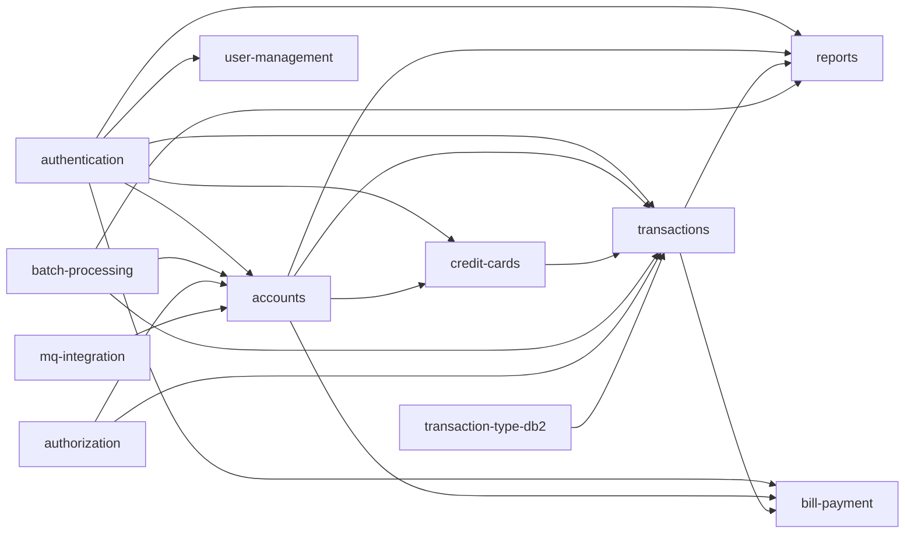

# System CardDemo - Overview for User Stories

**Version:** 2026-03-06  
**Purpose:** Single source of truth for creating well-structured User Stories

---

## 📊 Platform Statistics

- **Technology Stack:** COBOL, CICS, VSAM (KSDS/AIX), JCL, RACF, Assembler; optional: DB2, IMS DB, MQ
- **Architecture Pattern:** Mainframe online (CICS) + batch (JCL) with VSAM persistent storage
- **Key Capabilities:** Credit card management, account management, transaction processing, bill payment, reporting, user management
- **Application Entry Point:** CICS transaction `CC00` (Signon screen)
- **User Roles:** Regular Users, Admin Users
- **Credentials (sample):** Admin: `ADMIN001/PASSWORD`, User: `USER0001/PASSWORD`

---

## 🏗️ High-Level Architecture

### Technology Stack
**Primary Language:** COBOL  
**Transaction Monitor:** CICS (online OLTP programs)  
**Batch Runtime:** JCL (Job Control Language)  
**Storage:** VSAM (KSDS with Alternate Indexes)  
**Security:** RACF  
**Assembler Utilities:** MVSWAIT (batch timer), COBDATFT (date format conversion)  
**Optional Extensions:** DB2 (relational), IMS DB (hierarchical), MQ (messaging)

### Architectural Patterns
- **Online (CICS):** Pseudo-conversational transactions; programs communicate via COMMAREA (`CARDDEMO-COMMAREA`)
- **Batch (JCL):** Sequential file processing; VSAM indexed file updates; batch-to-online file sharing managed by CLOSEFIL/OPENFIL jobs
- **Commarea Navigation:** Programs pass control using `CDEMO-TO-TRANID`/`CDEMO-TO-PROGRAM` in the shared commarea
- **Authentication:** RACF for system-level security; application-level user/password validation against USRSEC VSAM file
- **Data Storage:** VSAM KSDS files for all master data (accounts, cards, customers, transactions, cross-reference, user security)
- **Reporting:** Online programs trigger batch JCL via extra-partition TDQ; batch generates plain text and HTML statements

### VSAM File Inventory

| DD Name    | Description                     | Key Field           |
|:-----------|:--------------------------------|:--------------------|
| ACCTFILE   | Account master (300-byte rec)   | ACCT-ID (9(11))     |
| CARDFILE   | Credit card master (150-byte)   | CARD-NUM (X(16))    |
| CUSTFILE   | Customer master (500-byte rec)  | CUST-ID (9(09))     |
| TRANFILE   | Transaction master              | FD-TRANS-ID         |
| XREFFILE   | Card-Account-Customer cross-ref | CARD-NUM (AIX: ACCT-ID) |
| USRSEC     | User security file              | User ID             |
| DISCGRP    | Disclosure group / interest rates | DIS-GROUP-KEY     |
| TCATBALF   | Transaction category balances   | TRAN-CAT-KEY        |
| DALYTRAN   | Daily transaction input (sequential) | —              |
| DALYREJS   | Rejected transactions (sequential) | —               |

---

## 📚 Module Catalog

<!-- MODULE_LIST_START -->
**Modules:** authentication, accounts, credit-cards, transactions, bill-payment, reports, user-management, batch-processing, authorization, transaction-type-db2, mq-integration
<!-- MODULE_LIST_END -->

---

### 1. Authentication
**ID:** `authentication`  
**Purpose:** Signon validation and session establishment for all CardDemo users  
**Type:** Online (CICS)  
**Key Components:**
- `COSGN00C` – Signon screen program (Transaction `CC00`, BMS map `COSGN00`)
- `COCOM01Y` – Shared COMMAREA copybook (`CARDDEMO-COMMAREA`)
- `CSUSR01Y` – User security data structure
- VSAM file `USRSEC` – User credentials store
- JCL `DUSRSECJ` – Initial load of USRSEC

**CICS Transaction:** `CC00`  
**BMS Map:** `COSGN00`

**Flow:**
1. User invokes `CC00` transaction
2. `COSGN00C` presents signon screen
3. User enters User ID and Password
4. Program validates credentials against USRSEC VSAM file
5. On success, sets user type (Admin `A` / User `U`) in COMMAREA and transfers to main menu (`CM00` or `CA00`)

**User Story Examples:**
- As a **cardholder**, I want to sign in with my user ID and password so that I can access my account information securely
- As an **admin user**, I want to authenticate and be routed to the Admin Menu so that I can manage users and system data
- As a **security auditor**, I want invalid login attempts to be rejected with an error message so that unauthorized access is prevented

---

### 2. Accounts
**ID:** `accounts`  
**Purpose:** View and update credit card account information  
**Type:** Online (CICS) + Batch  
**Key Components:**
- `COACTVWC` – Account View (Transaction `CAVW`, BMS map `COACTVW`)
- `COACTUPC` – Account Update (Transaction `CAUP`, BMS map `COACTUP`)
- `CBACT01C` – Batch: Read/print account records
- `CBACT02C` – Batch: Account data processing
- `CBACT03C` – Batch: Account-level operations
- `CBACT04C` – Batch: Interest calculation (INTCALC job)
- `CVACT01Y` – Account record structure (ACCT-ID, balances, limits, dates, group)
- `CVACT02Y` – Account cross-reference structure
- `CVACT03Y` – Account additional data structure
- VSAM file `ACCTFILE` – Account master

**Account Record Fields (CVACT01Y):**

| Field                  | Type         | Description                    |
|:-----------------------|:-------------|:-------------------------------|
| ACCT-ID                | 9(11)        | Account identifier             |
| ACCT-ACTIVE-STATUS     | X(01)        | Account status (active/inactive) |
| ACCT-CURR-BAL          | S9(10)V99    | Current balance                |
| ACCT-CREDIT-LIMIT      | S9(10)V99    | Credit limit                   |
| ACCT-CASH-CREDIT-LIMIT | S9(10)V99    | Cash credit limit              |
| ACCT-OPEN-DATE         | X(10)        | Account open date              |
| ACCT-EXPIRAION-DATE    | X(10)        | Account expiration date        |
| ACCT-REISSUE-DATE      | X(10)        | Card reissue date              |
| ACCT-CURR-CYC-CREDIT   | S9(10)V99    | Current cycle credits          |
| ACCT-CURR-CYC-DEBIT    | S9(10)V99    | Current cycle debits           |
| ACCT-ADDR-ZIP          | X(10)        | ZIP code for billing           |
| ACCT-GROUP-ID          | X(10)        | Disclosure group identifier    |

**Business Rules:**
- Account status controls whether transactions can be posted
- Interest is calculated by batch job INTCALC using disclosure group rates from DISCGRP file
- Credit limit and cash credit limit are separate caps
- Current cycle credit/debit accumulators reset each statement cycle

**User Story Examples:**
- As a **cardholder**, I want to view my account balance and credit limit so that I can manage my spending
- As a **cardholder**, I want to update my account details so that my billing information is current
- As a **batch operator**, I want to run the interest calculation job (INTCALC) so that accrued interest is applied to all active accounts

---

### 3. Credit Cards
**ID:** `credit-cards`  
**Purpose:** List, view, and update credit card records linked to an account  
**Type:** Online (CICS)  
**Key Components:**
- `COCRDLIC` – Credit Card List (Transaction `CCLI`, BMS map `COCRDLI`)
- `COCRDSLC` – Credit Card View/Detail (Transaction `CCDL`, BMS map `COCRDSL`)
- `COCRDUPC` – Credit Card Update (Transaction `CCUP`, BMS map `COCRDUP`)
- `CVCRD01Y` – Card record structure
- `CVACT02Y` – Card-account cross-reference
- VSAM `CARDFILE` – Card master
- VSAM `XREFFILE` – Card/Account/Customer cross-reference

**Card Record Fields (CVACT02Y / CARDFILE):**

| Field                | Type    | Description                     |
|:---------------------|:--------|:--------------------------------|
| CARD-NUM             | X(16)   | 16-digit credit card number     |
| CARD-ACCT-ID         | 9(11)   | Linked account ID               |
| CARD-CVV-CD          | 9(03)   | Card verification value         |
| CARD-EMBOSSED-NAME   | X(50)   | Name on card                    |
| CARD-EXPIRAION-DATE  | X(10)   | Card expiration date            |
| CARD-ACTIVE-STATUS   | X(01)   | Card active/inactive flag       |

**User Story Examples:**
- As a **cardholder**, I want to see all credit cards linked to my account so that I can manage them
- As a **cardholder**, I want to view the details of a specific card so that I can verify its status
- As a **cardholder**, I want to update card information so that my embossed name is correct
- As an **account manager**, I want to deactivate a card so that it cannot be used for new transactions

---

### 4. Transactions
**ID:** `transactions`  
**Purpose:** List, view, and add financial transactions; batch posting and reporting  
**Type:** Online (CICS) + Batch  
**Key Components:**
- `COTRN00C` – Transaction List (Transaction `CT00`, BMS map `COTRN00`)
- `COTRN01C` – Transaction View/Detail (Transaction `CT01`, BMS map `COTRN01`)
- `COTRN02C` – Transaction Add (Transaction `CT02`, BMS map `COTRN02`)
- `CBTRN01C` – Batch: Transaction read utility
- `CBTRN02C` – Batch: Post daily transactions (POSTTRAN job)
- `CBTRN03C` – Batch: Transaction report generation (TRANREPT job, submitted from CICS)
- `CVTRA01Y`–`CVTRA07Y` – Transaction data structures
- VSAM `TRANFILE` – Transaction master (indexed by transaction ID, AIX on date)
- Sequential `DALYTRAN` – Daily transaction input file
- Sequential `DALYREJS` – Rejected transactions output

**Transaction Processing (POSTTRAN / CBTRN02C):**
1. Read records from DALYTRAN sequential file
2. Look up card number in XREFFILE to get account/customer
3. Validate account status and credit limits
4. Write accepted transactions to TRANFILE (indexed VSAM)
5. Update account balances in ACCTFILE
6. Update transaction category balances in TCATBALF
7. Write rejected records to DALYREJS

**Key Transaction Fields:**
- Transaction ID, Card Number, Transaction Type Code (2-char), Category Code (4-digit)
- Transaction Amount, Description, Merchant, Date/Time

**Business Rules:**
- Transactions reference DISCGRP (disclosure group) for interest rate determination
- Category balances (TCATBALF) track spending by type/category per account
- AIX on TRANFILE enables date-range queries for reporting
- Online transaction add (`CT02`) creates real-time entries to TRANFILE

**User Story Examples:**
- As a **cardholder**, I want to see a list of my recent transactions so that I can review my spending
- As a **cardholder**, I want to view details of a specific transaction so that I can verify charges
- As a **cardholder**, I want to add a new transaction so that I can record a purchase
- As a **batch operator**, I want to run the POSTTRAN job so that daily transactions are posted to accounts
- As a **batch operator**, I want to generate a transaction report so that I can audit daily activity

---

### 5. Bill Payment
**ID:** `bill-payment`  
**Purpose:** Allow cardholders to pay their account balance online  
**Type:** Online (CICS)  
**Key Components:**
- `COBIL00C` – Bill Payment (Transaction `CB00`, BMS map `COBIL00`)
- `CVACT01Y` – Account record (reads/updates balance)
- VSAM `ACCTFILE` – Account master
- VSAM `TRANFILE` – Creates a payment transaction record

**Business Rules:**
- Bill payment posts a credit transaction to the account
- Updates `ACCT-CURR-BAL` and `ACCT-CURR-CYC-CREDIT` in ACCTFILE
- Creates a transaction record in TRANFILE for audit trail
- Payment applies to full outstanding balance

**User Story Examples:**
- As a **cardholder**, I want to pay my credit card bill online so that I can reduce my balance
- As a **cardholder**, I want to receive confirmation of my payment so that I know it was processed
- As a **financial auditor**, I want bill payment transactions to appear in the transaction history so that payments are traceable

---

### 6. Reports
**ID:** `reports`  
**Purpose:** Generate transaction reports and account statements  
**Type:** Online trigger + Batch execution  
**Key Components:**
- `CORPT00C` – Online Report Request (Transaction `CR00`, BMS map `CORPT00`) — submits batch JCL via extra-partition TDQ
- `CBSTM03A` – Batch: Generate account statements in plain text and HTML formats (CREASTMT job)
- `CBSTM03B` – Batch: Statement subroutine called by CBSTM03A
- `CBTRN03C` – Batch: Transaction report (TRANREPT job)
- JCL `CREASTMT.JCL`, `TRANREPT.jcl`

**Technical Features demonstrated in CBSTM03A:**
1. Mainframe Control block addressing
2. ALTER and GO TO statements
3. COMP and COMP-3 variables
4. 2-dimensional arrays
5. Call to subroutines

**Report Types:**
- **Account Statement:** Per-account transaction listing in text/HTML format
- **Transaction Report:** Summary/detail transaction report submitted from online

**Business Rules:**
- Online report request submits JCL to internal reader TDQ
- Statement covers current cycle transactions
- HTML and plain text outputs generated in parallel

**User Story Examples:**
- As a **cardholder**, I want to request a transaction report online so that I can get a statement without contacting support
- As a **batch operator**, I want to generate monthly account statements so that customers receive their billing summaries
- As a **financial auditor**, I want transaction reports in HTML format so that they can be shared electronically

---

### 7. User Management
**ID:** `user-management`  
**Purpose:** Admin functions to list, add, update, and delete application users  
**Type:** Online (CICS)  
**Key Components:**
- `COADM01C` – Admin Menu (Transaction `CA00`, BMS map `COADM01`)
- `COUSR00C` – List Users (Transaction `CU00`, BMS map `COUSR00`)
- `COUSR01C` – Add User (Transaction `CU01`, BMS map `COUSR01`)
- `COUSR02C` – Update User (Transaction `CU02`, BMS map `COUSR02`)
- `COUSR03C` – Delete User (Transaction `CU03`, BMS map `COUSR03`)
- `CSUSR01Y` – User record data structure
- VSAM `USRSEC` – User security file

**Business Rules:**
- Only users with Admin type (`CDEMO-USRTYP-ADMIN = 'A'`) can access admin menu
- User management operations are restricted to admin role
- User type determines available menu options and accessible transactions

**User Story Examples:**
- As an **admin**, I want to list all users so that I can audit system access
- As an **admin**, I want to add a new user so that new employees can access the system
- As an **admin**, I want to update a user's password or type so that access is kept current
- As an **admin**, I want to delete a user so that departed employees lose access

---

### 8. Batch Processing
**ID:** `batch-processing`  
**Purpose:** Core batch jobs for data loading, transaction posting, interest calculation, and statement generation  
**Type:** Batch (JCL)  
**Key Components:**
- `CBACT01C`–`CBACT04C` – Account processing utilities and interest calculation
- `CBCUS01C` – Customer file batch processing
- `CBTRN01C`–`CBTRN03C` – Transaction batch processing (post, report)
- `CBSTM03A`/`CBSTM03B` – Statement generation
- `CBEXPORT`/`CBIMPORT` – Data export/import utilities
- `COBSWAIT` – Batch wait utility (WAITSTEP job)
- `MVSWAIT.asm` / `COBDATFT.asm` – Assembler utilities
- JCL library: `app/jcl/`
- Scheduler definitions: `app/scheduler/CardDemo.ca7`, `CardDemo.controlm`

**Full Batch Sequence (run in order):**

| Job        | Program    | Purpose                                      |
|:-----------|:-----------|:---------------------------------------------|
| CLOSEFIL   | IEFBR14    | Close VSAM files opened by CICS              |
| ACCTFILE   | IDCAMS     | Refresh Account master from sample data      |
| CARDFILE   | IDCAMS     | Refresh Card master from sample data         |
| XREFFILE   | IDCAMS     | Load Card-Account-Customer cross-reference   |
| CUSTFILE   | IDCAMS     | Refresh Customer master from sample data     |
| TRANBKP    | IDCAMS     | Create/refresh Transaction master            |
| TRANCATG   | IDCAMS     | Load Transaction category types to VSAM      |
| TRANTYPE   | IDCAMS     | Load Transaction type reference to VSAM      |
| DISCGRP    | IDCAMS     | Load Disclosure group (interest rates)       |
| TCATBALF   | IDCAMS     | Refresh Transaction category balance file    |
| DUSRSECJ   | IEBGENER   | Initial load of User security file           |
| POSTTRAN   | CBTRN02C   | Post daily transactions to master files      |
| INTCALC    | CBACT04C   | Calculate interest on account balances       |
| COMBTRAN   | SORT       | Combine system + daily transaction files     |
| CREASTMT   | CBSTM03A   | Generate account statements (text + HTML)    |
| TRANIDX    | IDCAMS     | Define/build AIX on transaction file         |
| TRANREPT   | CBTRN03C   | Generate transaction report (from online)    |
| OPENFIL    | IEFBR14    | Open VSAM files for CICS                     |
| WAITSTEP   | COBSWAIT   | Timed wait between batch steps               |

**Business Rules:**
- CLOSEFIL/OPENFIL bracket batch window; files cannot be updated by CICS during batch
- POSTTRAN rejects invalid transactions to DALYREJS
- Interest calculation uses DISCGRP rates keyed by ACCT-GROUP-ID + transaction type/category
- Scheduler support for CA7 and Control-M

**User Story Examples:**
- As a **batch operator**, I want to run the daily transaction posting cycle so that all cardholder activity is reflected
- As a **batch operator**, I want CLOSEFIL/OPENFIL to gate CICS access so that data integrity is maintained during batch
- As a **DevOps engineer**, I want to integrate the batch schedule into Control-M/CA7 so that jobs run automatically

---

### 9. Authorization (Optional – IMS/DB2/MQ)
**ID:** `authorization`  
**Purpose:** Credit card authorization request processing using MQ, IMS, and DB2  
**Type:** Online (CICS) + Batch; requires IMS DB, DB2, and MQ  
**Key Components:**
- `COPAUS0C` – Pending Authorization Summary (Transaction `CPVS`, BMS map `COPAU00`) — reads IMS and VSAM
- `COPAUS1C` – Pending Authorization Details (Transaction `CPVD`, BMS map `COPAU01`) — updates IMS, inserts DB2
- `COPAUA0C` – Process Authorization Requests (Transaction `CP00`) — MQ trigger; request/response; IMS insert/update
- `COPAUS2C` – Authorization supplementary processing
- `CBPAUP0C` – Batch: Purge expired authorizations (CBPAUP0J job)
- IMS DBDs: `DBPAUTP0`, `DBPAUTX0`, `PADFLDBD`, `PASFLDBD`
- DB2 DDL: `AUTHFRDS.ddl`, `XAUTHFRD.ddl`
- MQ: Request/response pattern for authorization processing

**Flow:**
1. Authorization request arrives via MQ (`COPAUA0C`, triggered by MQ message)
2. Customer data retrieved from IMS DB
3. Authorization decision recorded in IMS and DB2
4. Cardholder can view pending authorizations (`CPVS`) and details (`CPVD`)
5. Expired authorizations purged by batch job `CBPAUP0J`

**Business Rules:**
- Authorizations expire after a defined period; CBPAUP0J purges them
- Authorization details transition states between IMS (pending) and DB2 (finalized)
- MQ request/response pattern provides async processing

**User Story Examples:**
- As a **cardholder**, I want to view pending authorizations so that I can see charges being processed
- As a **cardholder**, I want to see authorization details so that I can verify a specific pending charge
- As a **batch operator**, I want to purge expired authorizations so that IMS/DB2 do not accumulate stale records

---

### 10. Transaction Type Management (Optional – DB2)
**ID:** `transaction-type-db2`  
**Purpose:** Manage transaction type and category reference data stored in DB2  
**Type:** Online (CICS) + Batch; requires DB2  
**Key Components:**
- `COTRTUPC` – Transaction Type Add/Edit (Transaction `CTTU`, BMS map `COTRTUP`) — DB2 update/insert
- `COTRTLIC` – Transaction Type List/Update/Delete (Transaction `CTLI`, BMS map `COTRTLI`) — DB2 cursor, delete
- `COBTUPDT` – Batch: Maintain transaction type table (MNTTRDB2 job)
- DB2 DDL: `TRNTYCAT.ddl`, `TRNTYPE.ddl`, `XTRNTYCAT.ddl`, `XTRNTYPE.ddl`
- DCL: `DCLTRCAT.dcl`, `DCLTRTYP.dcl`
- JCL: `CREADB21.jcl` (creates DB2 tables), `MNTTRDB2.jcl`, `TRANEXTR.jcl`

**Business Rules:**
- Transaction types (2-char codes) and categories (4-digit codes) are reference data
- DB2 is authoritative source; batch TRANEXTR exports to VSAM for online use
- Admin menu options 5 and 6 enable only when this module is installed

**DB2 Tables:**
- `TRNTYPE` – Transaction type codes and descriptions
- `TRNTYCAT` – Transaction type-to-category mapping

**User Story Examples:**
- As an **admin**, I want to add a new transaction type in DB2 so that new card products can be supported
- As an **admin**, I want to list and update transaction types so that reference data stays accurate
- As a **batch operator**, I want to extract DB2 transaction types to VSAM so that online programs have current reference data

---

### 11. MQ Integration (Optional)
**ID:** `mq-integration`  
**Purpose:** MQ-based inquiry interfaces for account and date information  
**Type:** Online (CICS); requires MQ  
**Key Components:**
- `CODATE01` – System Date Inquiry via MQ (Transaction `CDRD`)
- `COACCT01` – Account Details Inquiry via MQ (Transaction `CDRA`)

**Patterns Demonstrated:**
- MQ request/response pattern
- Synchronous MQ call from CICS
- Integration with VSAM account data via MQ channel

**User Story Examples:**
- As a **system integrator**, I want to query the system date via MQ so that downstream systems can synchronize
- As a **distributed application**, I want to inquire account details via MQ transaction `CDRA` so that I can retrieve account data asynchronously

---

## 🔄 Architecture Diagram

```mermaid
graph TD
    User([Regular User]) -->|CC00| COSGN00C[Signon - COSGN00C]
    Admin([Admin User]) -->|CC00| COSGN00C

    COSGN00C -->|CM00| COMEN01C[Main Menu - COMEN01C]
    COSGN00C -->|CA00| COADM01C[Admin Menu - COADM01C]

    COMEN01C -->|CAVW| COACTVWC[Account View]
    COMEN01C -->|CAUP| COACTUPC[Account Update]
    COMEN01C -->|CCLI| COCRDLIC[Card List]
    COMEN01C -->|CCDL| COCRDSLC[Card View]
    COMEN01C -->|CCUP| COCRDUPC[Card Update]
    COMEN01C -->|CT00| COTRN00C[Transaction List]
    COMEN01C -->|CT01| COTRN01C[Transaction View]
    COMEN01C -->|CT02| COTRN02C[Transaction Add]
    COMEN01C -->|CR00| CORPT00C[Report Request]
    COMEN01C -->|CB00| COBIL00C[Bill Payment]
    COMEN01C -->|CPVS| COPAUS0C[Auth Summary - optional]

    COADM01C -->|CU00| COUSR00C[List Users]
    COADM01C -->|CU01| COUSR01C[Add User]
    COADM01C -->|CU02| COUSR02C[Update User]
    COADM01C -->|CU03| COUSR03C[Delete User]
    COADM01C -->|CTTU| COTRTUPC[Tran Type Edit - optional]
    COADM01C -->|CTLI| COTRTLIC[Tran Type List - optional]

    CORPT00C -->|TDQ| TRANREPT[Batch: TRANREPT]

    subgraph VSAM Files
        ACCTFILE[(ACCTFILE)]
        CARDFILE[(CARDFILE)]
        CUSTFILE[(CUSTFILE)]
        TRANFILE[(TRANFILE)]
        XREFFILE[(XREFFILE)]
        USRSEC[(USRSEC)]
        DISCGRP[(DISCGRP)]
        TCATBALF[(TCATBALF)]
    end

    subgraph Batch Jobs
        POSTTRAN[POSTTRAN - CBTRN02C]
        INTCALC[INTCALC - CBACT04C]
        CREASTMT[CREASTMT - CBSTM03A]
        TRANREPT
    end

    COACTVWC --> ACCTFILE
    COACTUPC --> ACCTFILE
    COBIL00C --> ACCTFILE
    COBIL00C --> TRANFILE
    COCRDLIC --> CARDFILE
    COCRDLIC --> XREFFILE
    COTRN00C --> TRANFILE
    COTRN02C --> TRANFILE
    COUSR00C --> USRSEC
    POSTTRAN --> ACCTFILE
    POSTTRAN --> TRANFILE
    POSTTRAN --> TCATBALF
    INTCALC --> ACCTFILE
    INTCALC --> DISCGRP
    INTCALC --> TCATBALF
```



---

## 🔄 Module Dependency Diagram



---

## 📊 Data Models

### Account Record (`CVACT01Y`, ACCTFILE)
```cobol
01 ACCOUNT-RECORD.
   05 ACCT-ID                  PIC 9(11).
   05 ACCT-ACTIVE-STATUS       PIC X(01).   -- 'Y'/'N'
   05 ACCT-CURR-BAL            PIC S9(10)V99.
   05 ACCT-CREDIT-LIMIT        PIC S9(10)V99.
   05 ACCT-CASH-CREDIT-LIMIT   PIC S9(10)V99.
   05 ACCT-OPEN-DATE           PIC X(10).   -- YYYY-MM-DD
   05 ACCT-EXPIRAION-DATE      PIC X(10).   -- YYYY-MM-DD
   05 ACCT-REISSUE-DATE        PIC X(10).   -- YYYY-MM-DD
   05 ACCT-CURR-CYC-CREDIT     PIC S9(10)V99.
   05 ACCT-CURR-CYC-DEBIT      PIC S9(10)V99.
   05 ACCT-ADDR-ZIP            PIC X(10).
   05 ACCT-GROUP-ID            PIC X(10).   -- links to DISCGRP
   05 FILLER                   PIC X(178).
```

### Card Record (`CVACT02Y`, CARDFILE)
```cobol
01 CARD-RECORD.
   05 CARD-NUM                 PIC X(16).   -- primary key
   05 CARD-ACCT-ID             PIC 9(11).
   05 CARD-CVV-CD              PIC 9(03).
   05 CARD-EMBOSSED-NAME       PIC X(50).
   05 CARD-EXPIRAION-DATE      PIC X(10).
   05 CARD-ACTIVE-STATUS       PIC X(01).
   05 FILLER                   PIC X(59).
```

### Customer Record (`CVCUS01Y`, CUSTFILE)
```cobol
01 CUSTOMER-RECORD.
   05 CUST-ID                  PIC 9(09).
   05 CUST-FIRST-NAME          PIC X(25).
   05 CUST-MIDDLE-NAME         PIC X(25).
   05 CUST-LAST-NAME           PIC X(25).
   05 CUST-ADDR-LINE-1         PIC X(50).
   05 CUST-ADDR-LINE-2         PIC X(50).
   05 CUST-ADDR-LINE-3         PIC X(50).
   05 CUST-ADDR-STATE-CD       PIC X(02).
   05 CUST-ADDR-COUNTRY-CD     PIC X(03).
   05 CUST-ADDR-ZIP            PIC X(10).
   05 CUST-PHONE-NUM-1         PIC X(15).
   05 CUST-PHONE-NUM-2         PIC X(15).
   05 CUST-SSN                 PIC 9(09).
   05 CUST-GOVT-ISSUED-ID      PIC X(20).
   05 CUST-DOB-YYYY-MM-DD      PIC X(10).
   05 CUST-EFT-ACCOUNT-ID      PIC X(10).
   05 CUST-PRI-CARD-HOLDER-IND PIC X(01).
   05 CUST-FICO-CREDIT-SCORE   PIC 9(03).
   05 FILLER                   PIC X(168).
```

### Transaction Category Balance (`CVTRA01Y` / `CVTRA02Y`, TCATBALF)
```cobol
01 TRAN-CAT-BAL-RECORD.
   05 TRAN-CAT-KEY.
      10 TRANCAT-ACCT-ID       PIC 9(11).
      10 TRANCAT-TYPE-CD       PIC X(02).   -- transaction type code
      10 TRANCAT-CD            PIC 9(04).   -- category code
   05 TRAN-CAT-BAL             PIC S9(09)V99.
   05 FILLER                   PIC X(22).
```

### Disclosure Group / Interest Rate (`CVTRA02Y`, DISCGRP)
```cobol
01 DIS-GROUP-RECORD.
   05 DIS-GROUP-KEY.
      10 DIS-ACCT-GROUP-ID     PIC X(10).  -- matches ACCT-GROUP-ID
      10 DIS-TRAN-TYPE-CD      PIC X(02).
      10 DIS-TRAN-CAT-CD       PIC 9(04).
   05 DIS-INT-RATE             PIC S9(04)V99.
   05 FILLER                   PIC X(28).
```

### COMMAREA (`COCOM01Y`)
```cobol
01 CARDDEMO-COMMAREA.
   05 CDEMO-GENERAL-INFO.
      10 CDEMO-FROM-TRANID     PIC X(04).
      10 CDEMO-FROM-PROGRAM    PIC X(08).
      10 CDEMO-TO-TRANID       PIC X(04).
      10 CDEMO-TO-PROGRAM      PIC X(08).
      10 CDEMO-USER-ID         PIC X(08).
      10 CDEMO-USER-TYPE       PIC X(01).  -- 'A'=Admin, 'U'=User
      10 CDEMO-PGM-CONTEXT     PIC 9(01).  -- 0=enter, 1=re-enter
   05 CDEMO-CUSTOMER-INFO.
      10 CDEMO-CUST-ID         PIC 9(09).
      10 CDEMO-CUST-FNAME      PIC X(25).
      10 CDEMO-CUST-MNAME      PIC X(25).
      10 CDEMO-CUST-LNAME      PIC X(25).
   05 CDEMO-ACCOUNT-INFO.
      10 CDEMO-ACCT-ID         PIC 9(11).
      10 CDEMO-ACCT-STATUS     PIC X(01).
   05 CDEMO-CARD-INFO.
      10 CC-ACCT-ID            PIC X(11).
      10 CC-CARD-NUM           PIC X(16).
      10 CC-CUST-ID            PIC X(09).
```

---

## 📋 Business Rules by Module

### Authentication
- Users must provide valid User ID (8 chars) and Password (8 chars) to enter the system
- Credentials validated against USRSEC VSAM file
- User type (`A`=Admin, `U`=User) determines menu routing (Admin → `CA00`, User → `CM00`)
- Admin users access user management, transaction type management (if DB2 module installed)
- Regular users access account, card, transaction, bill payment, and report functions

### Accounts
- Account status flag controls whether transactions can post against the account
- Credit limit: total credit line; cash credit limit: sub-limit for cash advances
- Interest accrued by batch INTCALC (CBACT04C) using rates from DISCGRP file keyed by account group
- Current cycle credit/debit accumulators are updated by batch POSTTRAN and reset at statement cycle end
- Account GROUP-ID links the account to a set of interest rates in DISCGRP

### Credit Cards
- Each card is linked to exactly one account (CARD-ACCT-ID)
- Card active status controls whether the card can be used for transactions
- CVV stored for verification purposes
- XREFFILE maintains bi-directional lookups: Card → Account and Account → Cards

### Transactions
- All transactions require a valid card number resolvable to an account via XREFFILE
- Transaction type (2-char) and category (4-digit) codes classify spending
- Daily transactions (DALYTRAN) are posted by POSTTRAN batch; rejected to DALYREJS if invalid
- Category balance file (TCATBALF) aggregates spending by account/type/category for interest calculation
- AIX on TRANFILE supports date-range queries used by reports

### Bill Payment
- Bill payment creates a credit transaction entry in TRANFILE
- Reduces ACCT-CURR-BAL and increases ACCT-CURR-CYC-CREDIT
- Payment is processed online immediately (real-time VSAM update)

### Interest Calculation
- INTCALC (CBACT04C) reads TCATBALF sequentially
- Looks up interest rate from DISCGRP using account group + type/category combination
- Applies accrued interest and updates ACCTFILE balance
- Must run after POSTTRAN and before next CICS open (OPENFIL)

### User Management
- Admin role required for all user management operations
- USRSEC VSAM file is the authoritative user store
- User type field determines menu access after successful signon

---

## 🖥️ Online Transaction Map

| Transaction | Program    | BMS Map  | Function                      | Role   |
|:------------|:-----------|:---------|:------------------------------|:-------|
| CC00        | COSGN00C   | COSGN00  | Signon                        | All    |
| CM00        | COMEN01C   | COMEN01  | Main Menu                     | User   |
| CAVW        | COACTVWC   | COACTVW  | Account View                  | User   |
| CAUP        | COACTUPC   | COACTUP  | Account Update                | User   |
| CCLI        | COCRDLIC   | COCRDLI  | Credit Card List              | User   |
| CCDL        | COCRDSLC   | COCRDSL  | Credit Card View              | User   |
| CCUP        | COCRDUPC   | COCRDUP  | Credit Card Update            | User   |
| CT00        | COTRN00C   | COTRN00  | Transaction List              | User   |
| CT01        | COTRN01C   | COTRN01  | Transaction View              | User   |
| CT02        | COTRN02C   | COTRN02  | Transaction Add               | User   |
| CR00        | CORPT00C   | CORPT00  | Transaction Report Request    | User   |
| CB00        | COBIL00C   | COBIL00  | Bill Payment                  | User   |
| CPVS        | COPAUS0C   | COPAU00  | Pending Auth Summary (opt)    | User   |
| CPVD        | COPAUS1C   | COPAU01  | Pending Auth Details (opt)    | User   |
| CP00        | COPAUA0C   | —        | Process Auth Requests (opt)   | System |
| CA00        | COADM01C   | COADM01  | Admin Menu                    | Admin  |
| CU00        | COUSR00C   | COUSR00  | List Users                    | Admin  |
| CU01        | COUSR01C   | COUSR01  | Add User                      | Admin  |
| CU02        | COUSR02C   | COUSR02  | Update User                   | Admin  |
| CU03        | COUSR03C   | COUSR03  | Delete User                   | Admin  |
| CTTU        | COTRTUPC   | COTRTUP  | Tran Type Add/Edit (opt)      | Admin  |
| CTLI        | COTRTLIC   | COTRTLI  | Tran Type List/Del (opt)      | Admin  |
| CDRD        | CODATE01   | —        | System Date via MQ (opt)      | System |
| CDRA        | COACCT01   | —        | Account Details via MQ (opt)  | System |

---

## 🎯 Patterns for User Stories

### Templates by Domain

#### Account Management Stories
- As a **cardholder**, I want to [view/update] my account [field] so that [benefit]
- As a **batch operator**, I want to run [job] so that [data integrity/processing goal]

#### Card Management Stories
- As a **cardholder**, I want to [list/view/update] my card so that [benefit]
- As an **account manager**, I want to [activate/deactivate] a card so that [access control goal]

#### Transaction Stories
- As a **cardholder**, I want to [view/add] transactions so that [spending visibility/entry goal]
- As a **batch operator**, I want to post daily transactions so that account balances reflect current activity

#### Admin Stories
- As an **admin**, I want to [add/update/delete] users so that [access management goal]
- As an **admin**, I want to [add/update/delete] transaction types so that [reference data goal]

### Story Complexity Guidelines

| Complexity    | Points | Examples                                                              |
|:--------------|:-------|:----------------------------------------------------------------------|
| Simple        | 1–2    | Read-only views (Account View, Card View, Transaction View)           |
| Medium        | 3–5    | Update with validation (Account Update, Card Update, Add User)        |
| Complex       | 5–8    | Batch job integration (POSTTRAN, INTCALC, statement generation)       |
| Very Complex  | 8–13   | New optional module integration (authorization with IMS/DB2/MQ)       |

### Acceptance Criteria Patterns

**Online CRUD:**
- Given a valid User ID and Password → User is authenticated and routed to correct menu
- Given an invalid credential → Error message displayed, access denied
- Given an account ID on the Account View screen → Account details are displayed within 2 seconds
- Given a valid update to account/card/user → Record updated in VSAM, confirmation message shown
- Given an invalid field value → Field highlighted with error message, no update performed

**Batch Processing:**
- Given DALYTRAN file with N transactions → POSTTRAN posts valid transactions, rejects invalid to DALYREJS
- Given active accounts → INTCALC applies correct interest rates from DISCGRP per account group
- Given transaction data → CREASTMT generates both plain text and HTML statement files
- Given OPENFIL/CLOSEFIL → VSAM files transition between batch-exclusive and CICS-shared states

**Authorization (Optional):**
- Given a pending authorization in IMS → Cardholder can view summary and details online
- Given expired authorizations → CBPAUP0J batch purges them without affecting active ones

---

## ⚡ Performance Budgets

- **Online Screen Response:** < 2 seconds for CICS transactions under normal load
- **Batch POSTTRAN:** Process full daily transaction file within nightly batch window
- **INTCALC:** Complete interest calculation for all accounts within batch window
- **Statement Generation (CREASTMT):** Produce statements for all accounts before next business day
- **VSAM Operations:** All KSDS random-access reads < 50ms P95

---

## 🚨 Readiness Considerations

### Technical Risks
- **VSAM File Contention:** Online and batch share VSAM files; CLOSEFIL/OPENFIL gates required — Mitigation: always run CLOSEFIL before batch updates, OPENFIL after
- **COMMAREA Size Limit:** CICS COMMAREA limited to 32KB; current structure is within limits — Mitigation: monitor growth if new fields added
- **Optional Module Coupling:** Authorization module requires IMS, DB2, and MQ simultaneously — Mitigation: install and test each optional module independently

### Tech Debt
- **Spelling typo in copybooks:** `ACCT-EXPIRAION-DATE` and `CARD-EXPIRAION-DATE` — Impact: any modernization must preserve field names for VSAM compatibility
- **Mixed case filenames:** Some `.cbl` files use uppercase extension (`.CBL`) — Impact: case-sensitive systems must handle both
- **Hard-coded credentials in docs:** Sample credentials (`ADMIN001/PASSWORD`) in README — Impact: must replace in any production deployment

### Sequencing for US
- **Prerequisites:** Authentication module must be complete before any other module
- **Recommended development order:** authentication → accounts → credit-cards → transactions → bill-payment → reports → user-management → batch-processing → optional modules
- **Batch/Online coordination:** CLOSEFIL/OPENFIL jobs must be tested as part of any batch job story

---

## 📈 Success Metrics

### Adoption
- **User Login Success Rate:** > 99% of valid credential attempts succeed
- **Transaction Posting Rate:** > 99.9% of valid daily transactions posted by POSTTRAN
- **Batch Completion:** 100% of nightly batch jobs complete within maintenance window

### Business Impact
- **Statement Accuracy:** Account statements match sum of posted transactions + interest
- **Authorization Processing:** Pending authorizations processed within defined SLA
- **Data Integrity:** Zero discrepancies between TRANFILE totals and ACCTFILE balances after POSTTRAN

---

*Last updated: 2026-03-06*
