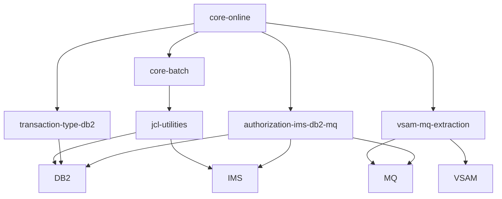

# System CardDemo - Overview for User Stories

**Version:** March 12, 2026  
**Purpose:** Single source of truth for engineers and Product Owners to write User Stories that reflect CardDemo's mainframe architecture, business context, and integrations.

---

## 📊 Platform Statistics
- **Technology Stack:** COBOL (CICS/IMS/DB2), CICS TS, JCL/IDCAMS/SORT, VSAM KSDS (AIX), IBM MQ, IMS HIDAM, DB2, RACF, Assembler utilities, helper scripts (shell + awk).
- **Architecture Pattern:** Transaction-first mainframe layering with CICS online presentation, JCL-driven batch orchestration, and optional MQ/DB2/IMS service integrations.
- **Key Capabilities:** Credit card account/card lifecycle, transaction posting, statement generation, admin controls, pending authorizations, transaction-type stewardship, MQ-driven data extraction, and supporting JCL utilities.
- **Supported Languages:** English-only 3270 BMS label text, COBOL business logic, and JCL control statements.

---

## 🏗️ High-Level Architecture

### Technology Stack
**Backend:** COBOL programs compiled for CICS (CO*), batch programs (CB*), and Assembler services (maclib/*.MAC).  
**Frontend:** 3270 BMS screens defined under `app/bms/` and tied to CICS map sets (COSGN00, COMEN01, etc.).  
**Database:** VSAM KSDS files (ACCTDATA, CARDDATA, TRANSACT, USRSEC, TRANTYPE) plus optional DB2 tables (`TRANSACTION_TYPE`, `AUTHFRDS`) and IMS HIDAM structures for authorizations.  
**Cache:** CICS transient storage (channels/queues managed via `app/csd/` and COBOL working storage).  
**Others:** JCL/IDCAMS/SORT for batch, IBM MQ for asynchronous authorizations and data extractions, RACF for security, CA7/Control-M scheduler definitions in `app/scheduler/`, and shell helper scripts for orchestration.

### Architectural Patterns
- **Online vs. Batch separation:** CICS programs handle interactive requirements (`core-online`), while JCL jobs keep VSAM datasets and statements synchronized (`core-batch`).
- **Repository + Service Layer:** Shared copybooks (`app/cpy/`, `app/cpy-bms/`) define data models consumed by both online and batch programs; COBOL routines call VSAM, DB2, or IMS via service definitions (`app/csd/`).
- **IA/Batch orchestration:** Batch controller JCL (ACCTFILE, POSTTRAN, CREASTMT) ensures data freshness before statements are generated; scheduler scripts in `scripts/` offer automation anchors.
- **Integration pipelines:** Optional modules (`authorization-ims-db2-mq`, `transaction-type-db2`, `vsam-mq-extraction`) extend the core with MQ queues, DB2 tables, and IMS databases while reusing VSAM cross-reference files.

---

## 📚 Module Catalog

<!-- MODULE_LIST_START -->
**Modules:** core-online, core-batch, authorization-ims-db2-mq, transaction-type-db2, vsam-mq-extraction, jcl-utilities
<!-- MODULE_LIST_END -->

### 1. Core Online
**ID:** `core-online`  
**Purpose:** Deliver CICS-powered 3270 screens for Regular Users and Admins to manage accounts, cards, transactions, bills, and users without leaving the mainframe.  
**Key Components:** COBOL programs (`app/cbl/COCRD*`, `COACT*`, `COTRN*`, `COBIL00`, `COUSR*`), BMS maps (`app/bms/COSGN00`, `COACTVW`, `COCRDLI`, `COTRN00`), shared copybooks (`app/cpy/CVACT01Y`, `CVCRD01Y`, `CVTRA06Y`), CICS definitions (`app/csd/*.CS`), VSAM datasets (`AWS.M2.CARDDEMO.*`), and RACF definitions (implied by `app/csd`).  
**Public APIs:**
- `CC00` / `COSGN00`: Credential entry + pass-through to the main menu.
- `CM00` / `COMEN01`: Main menu hub (navigates to accounts, cards, transactions, reports, admin options).
- `CAVW` / `COACTVW`: Account view with context-sensitive PF keys.
- `CAUP` / `COACTUPC`: Account update.
- `CCLI` / `COCRDLI`: Credit card list screen.
- `CCDL` / `COCRDSLC`: Card detail review.
- `CCUP` / `COCRDUPC`: Card update.
- `CT00` / `COTRN00`: Transaction list with pagination.
- `CT01` / `COTRN01`: Transaction detail review.
- `CT02` / `COTRN02`: Transaction add.
- `CR00` / `CORPT00`: Report generation.
- `CB00` / `COBIL00`: Bill payment.
- `CA00` / `COADM01`: Admin menu + jump to `CU00`-`CU03` for user management.
- `CU00`-`CU03`: User list/add/update/delete flows.
**User Story Examples:**
- As a Regular User, I want to view my account balances and recent transactions so that I can confirm payments before a statement closes.  
- As an Admin, I want to add a new user via the Admin menu and assign access so that support staff can help cardholders.  
- As a cardholder, I want to mark a transaction for investigation before posting so that I can flag suspect activity.

### 2. Core Batch
**ID:** `core-batch`  
**Purpose:** Keep VSAM datasets, transaction postings, statements, and reporting files synchronized via scheduled JCL (ACCTFILE, TRANFILE, POSTTRAN, CREASTMT).  
**Key Components:** JCL catalog entries (`app/jcl/*.jcl`), IDCAMS/IEFBR14 job steps, COBOL batch programs (`app/cbl/CB*`, `CBTRN02C`, `CBSTM03A`, `CBACT04C`), sort/control cards (`app/ctl/`), scheduler definitions (`app/scheduler/`), and helper scripts (`scripts/run_full_batch.sh`, `remote_submit.sh`).  
**Public APIs:**
- `ACCTFILE`/`CARDFILE`/`CUSTFILE`/`XREFFILE`: Initial VSAM load jobs.
- `TRANFILE`/`TRANBKP`/`POSTTRAN`: Daily transaction posting pipeline.
- `COMBTRAN` + `CREASTMT`: Statement assembly and report distribution.
- `TRANIDX`: Rebuild transaction indexes after bulk updates.
- `INTCALC`: Interest calculation job.
- `CBPAUP0J`: Purge expired records (shared with authorization module).  
**User Story Examples:**
- As a Batch Operator, I want to run TRANFILE before POSTTRAN so that transaction data is fresh for cardholder queries.  
- As a Compliance Analyst, I want CREASTMT to run immediately after TRANBKP so that statements reflect the latest ledger data.  
- As an Automation Owner, I want the scripts in `scripts/` to submit ACCTFILE in the correct HLQ so that deployment teams can refresh demo data quickly.

### 3. Authorization IMS-DB2-MQ
**ID:** `authorization-ims-db2-mq`  
**Purpose:** Optional extension that simulates real-world credit card authorizations via MQ, stores records in IMS, and flags fraud in DB2.  
**Key Components:** COBOL programs (`COPAUA0C`, `COPAUS0C`, `COPAUS1C`, `COPAUS2C`, `CBPAUP0C`), MQ configuration files, IMS DBD/PSB definitions (`app/app-authorization-ims-db2-mq/ims/`), DB2 table DDL (`AUTHFRDS`, `XAUTHFRD`), BMS maps (`COPAU00`, `COPAU01`), MQ queues (`AWS.M2.CARDDEMO.PAUTH.REQUEST`, `.REPLY`).  
**Public APIs:**
- `CP00`: Process authorization request (MQ trigger).  
- `CPVS`: Authorization summary screen.  
- `CPVD`: Authorization detail screen + fraud flagging.  
- MQ queues: `PAUTH.REQUEST` (input) and `PAUTH.REPLY` (output).  
- DB2 `AUTHFRDS` table: Fraud record insert and query.  
**User Story Examples:**
- As a Merchant Emulator, I want to send an MQ request to CP00 and receive a response so that I can validate the authorization workflow.  
- As a Fraud Analyst, I want to view `CPVD` to tag suspicious requests and persist that flag in DB2.  
- As a Platform Engineer, I want `CBPAUP0J` to purge authorizations older than 30 days so that the IMS filesystem stays lean.

### 4. Transaction Type DB2
**ID:** `transaction-type-db2`  
**Purpose:** Optional DB2-backed admin module that keeps transaction type metadata in sync between DB2 reference tables and the VSAM transaction catalog.  
**Key Components:** CICS programs (`COTRTUPC`, `COTRTLIC`), BMS maps (`COTRTUP`, `COTRTLI`), DB2 tables (`TRANSACTION_TYPE`, `TRANSACTION_TYPE_CATEGORY`), DB2 JCL (`CREADB21`, `TRANEXTR`, `MNTTRDB2`), static SQL copybooks (`app/app-transaction-type-db2/dcl/`).  
**Public APIs:**
- `CTTU`: Transaction type add/edit (static embedded SQL).  
- `CTLI`: Transaction type list/update/delete with cursor navigation.  
- Utility jobs: `CREADB21` (create DB2 tables), `TRANEXTR` (extract VSAM file), `MNTTRDB2` (batch maintenance).  
**User Story Examples:**
- As an Admin, I want to add a new transaction type via CTUU so that marketing can classify new fees.  
- As Database Operations, I want TRANEXTR to run after CTLI updates so that VSAM references the latest categories.  
- As a Developer, I want the DB2 precompiler patterns documented so I can build future data-driven screens.

### 5. VSAM MQ Extraction
**ID:** `vsam-mq-extraction`  
**Purpose:** Optional module demonstrating MQ-driven data extractions for system date and account inquiries.  
**Key Components:** CICS programs (`CODATE01`, `COACCT01`), MQ definitions (`CARDDEMO.REQUEST.QUEUE`, `.RESPONSE.QUEUE`), VSAM files for account data, and MQ message structures defined in `app/app-vsam-mq/README.md`.  
**Public APIs:**
- `CDRD`: MQ system date request/response.  
- `CDRA`: MQ account detail inquiry request/response.  
- MQ message schemas: Date request/response, account request/response (fields such as `REQUEST-TYPE`, `ACCOUNT-NUMBER`, `ACCOUNT-DATA`).  
**User Story Examples:**
- As an Integration Tester, I want to request the system date through MQ so I can coordinate cross-system scheduling.  
- As a Partner System, I want to query account details via CDRA and receive VSAM-backed payloads for reconciliation.

### 6. JCL Utilities
**ID:** `jcl-utilities`  
**Purpose:** Collection of optional jobs that move data in/out of the environment (FTP, Text-to-PDF, DB2/IMS load-unload, internal reader).  
**Key Components:** `FTPJCL.JCL`, `TXT2PDF1.JCL`, `CBIMPORT.jcl`/`CBEXPORT.jcl`, `INTRDRJ1.JCL`/`INTRDRJ2.JCL`, supporting control cards under `app/ctl/`.  
**Public APIs:**
- `FTPJCL`: FTP transfer templates for data exchange.  
- `TXT2PDF1`: Text-to-PDF conversion job.  
- `CBIMPORT`/`CBEXPORT`: DB2 data movement helpers.  
- `INTRDRJ1`/`INTRDRJ2`: Internal reader utilities for dataset validation.  
**User Story Examples:**
- As an Integration Engineer, I want FTPJCL to stage export files for downstream systems.  
- As a Release Engineer, I want TXT2PDF1 to archive transaction logs for audit review.

---

## 🔄 Architecture Diagrams

```mermaid
flowchart LR
  Terminal[3270 Terminal]
  Terminal --> CICS[CICS Region<br/>(app/csd + COBOL + BMS)]
  CICS --> VSAM[VSAM KSDS (ACCTDATA, CARDDATA, TRANSACT, USRSEC, TRANTYPE)]
  CICS --> DB2[DB2 Schema (TRANSACTION_TYPE, AUTHFRDS)]
  CICS --> IMS[IMS HIDAM (AUTHPU Database)]
  CICS --> MQ[MQ (PAUTH.REQUEST / RESPONSE, CARDDEMO.*)]
  JCL[JCL + IDCAMS + SORT]
  JCL --> VSAM
  JCL --> DB2
  JCL --> IMS
  Scripts[Scripts / Scheduler]
  Scripts --> JCL
  subgraph Optional Modules
    Auth[authorization-ims-db2-mq]
    TxType[transaction-type-db2]
    VSAMMQ[vsam-mq-extraction]
  end
  Auth --> IMS
  Auth --> DB2
  Auth --> MQ
  TxType --> DB2
  TxType --> VSAM
  VSAMMQ --> MQ
  VSAMMQ --> VSAM
```



---

## 📊 Data Models

### Account Record
```cobol
01  ACCOUNT-RECORD.
    05  ACCT-ID             PIC 9(11).
    05  ACCT-ACTIVE-STATUS  PIC X(01).
    05  ACCT-CURR-BAL       PIC S9(10)V99.
    05  ACCT-CREDIT-LIMIT   PIC S9(10)V99.
    05  ACCT-CASH-CREDIT-LIM PIC S9(10)V99.
    05  ACCT-OPEN-DATE      PIC X(10).
    05  ACCT-EXPIRAION-DATE PIC X(10).
    05  ACCT-REISSUE-DATE   PIC X(10).
    05  ACCT-CURR-CYC-CREDIT PIC S9(10)V99.
    05  ACCT-CURR-CYC-DEBIT PIC S9(10)V99.
    05  ACCT-ADDR-ZIP       PIC X(10).
    05  ACCT-GROUP-ID       PIC X(10).
```

### Transaction Record (DAILYTRAN)
```cobol
01  DALYTRAN-RECORD.
    05  DALYTRAN-ID        PIC X(16).
    05  DALYTRAN-TYPE-CD   PIC X(02).
    05  DALYTRAN-CAT-CD    PIC 9(04).
    05  DALYTRAN-SOURCE    PIC X(10).
    05  DALYTRAN-DESC      PIC X(100).
    05  DALYTRAN-AMT       PIC S9(09)V99.
    05  DALYTRAN-MERCHANT-ID PIC 9(09).
    05  DALYTRAN-MERCHANT-NAME PIC X(50).
    05  DALYTRAN-MERCHANT-CITY PIC X(50).
    05  DALYTRAN-MERCHANT-ZIP PIC X(10).
    05  DALYTRAN-CARD-NUM  PIC X(16).
    05  DALYTRAN-ORIG-TS   PIC X(26).
```

### Fraud Record (DB2)
```sql
CREATE TABLE AUTHFRDS (
  CARD_NUM CHAR(16) NOT NULL,
  AUTH_TS TIMESTAMP NOT NULL,
  AUTH_TYPE CHAR(4),
  CARD_EXPIRY_DATE CHAR(4),
  PROCESSING_CODE CHAR(6),
  TRANSACTION_AMT DECIMAL(12,2),
  FRAUD_RPT_DATE DATE,
  ACCT_ID DECIMAL(11),
  PRIMARY KEY(CARD_NUM, AUTH_TS)
);
```

### Dataset Catalog Highlights
`app/catlg/LISTCAT.txt` describes these VSAM datasets and their attributes:
- `AWS.M2.CARDDEMO.ACCTDATA.*` (300-byte records, 11-digit keys).
- `AWS.M2.CARDDEMO.CARDDATA.*` (card-centric KSDS with 16-digit keys).
- `AWS.M2.CARDDEMO.TRANSACT.VSAM.KSDS` (350-byte daily transactions).
- `AWS.M2.CARDDEMO.USRSEC.VSAM.KSDS` (user credentials and roles).
- `AWS.M2.CARDDEMO.TRANTYPE.VSAM.KSDS` (transaction type metadata used by DB2 sync jobs).

---

## 📋 Business Rules by Module

### core-online - Rules
- All CICS transactions require an active `ACCT-ID` and a valid signon via `CC00`.
- Card updates cannot proceed if VSAM `CARDDATA` entry is in use by `core-batch` jobs (`TRANBKP`, `POSTTRAN`).
- PF5+PF7/PF8 keys govern paging; new screens must honor the existing PF key assignments.

### core-batch - Rules
- Batch jobs must run in this order for refresh: data loads (ACCTFILE/CARDFILE/CUSTFILE, etc.) → transaction loads (`TRANFILE`, `TRANBKP`) → posting (`POSTTRAN`, `COMBTRAN`) → statements (`CREASTMT`).
- Each job must end with condition code 0000 and include IDCAMS catalog steps when touching VSAM.
- `TRANIDX` rebuilds keys after `TRANFILE`/`TRANBKP` to keep online lookups performant.

### authorization-ims-db2-mq - Rules
- Authorization requests older than 30 days are purged by `CBPAUP0J` to prevent IMS growth.
- MQ responses must echo the `AUTH-ID-CODE` + correlation token sent in the request.
- Fraud marking (`CF5` / DB2 update) writes a row to `AUTHFRDS` and flags `AUTH_FRAUD` columns for analytics.

### transaction-type-db2 - Rules
- DB2 tables must enforce foreign key `TRANSACTION_TYPE_CATEGORY` → `TRANSACTION_TYPE` with `DELETE RESTRICT` to avoid orphan categories.
- `CTLI` uses forward/backward cursor paging; any new screen must reuse the existing cursor definition.
- After any change via `CTTU` or batch job, `TRANEXTR` must refresh VSAM companion files within the same window.

### vsam-mq-extraction - Rules
- MQ request/response pair must set `REQUEST-ID` and match it in the response before CICS updates UI fields.
- Account extracts only return data for VSAM records that exist (no synthetic accounts).
- System date requests never touch VSAM; they respond from CICS program `CODATE01`.

### jcl-utilities - Rules
- FTP/TXT2PDF jobs run manually; outputs must land in configured dataset names before moves.
- DB2 load/unload (CBIMPORT/CBEXPORT) and IMS load/unload use dedicated `DD` statements to avoid dataset contention.
- Internal reader jobs (`INTRDRJ1/J2`) must not run concurrently with active `ACCTFILE`/`CARDFILE` jobs.

---

## 🌐 Internationalization and Translation

### i18n File Structure
CardDemo does not use a separate `i18n` directory. All screen text lives in 3270 BMS map sets under `app/bms/`, which embed English literals. Translating a screen means editing the map set BMS messages and regenerating the associated COBOL include (`.CPY-BMS`). There are no locale JSON files or runtime language switches.

### Key Text Patterns
Map sets typically follow `LABEL` + `DATA` pairs with `PF` key indicators. Messages live in the BMS literal area and are hard-coded English strings (e.g., `MAPIVIEW`, `PF1=HELP`). Any localization effort must update map literals and rebuild the `.MAC` resources.

---

## 🧾 Form and Listing Patterns

### Component Structure Analysis
- **Forms:** Every interactive screen is a BMS map (`app/bms/`). Layout is 80x24 patches with direct field placements; there are no Vue/React forms.
- **Validation:** COBOL programs use `88` level condition names (e.g., `CCARD-NO-VALUE`) and explicit `IF` chains for data checks. Field validation is synchronous (before `EXEC CICS SEND MAPSET` returns). Error lists appear in dedicated message lines.
- **Notifications:** Messages appear on the `MSG` line of each map and are triggered via `PF` keys; PF5 highlights fraud, PF7/PF8 handle scrolling.
- **Listings:** Transaction/admin lists use `PF7`/`PF8` and `S` selection codes built in BMS; underlying programs page with `READ VSAM` loops capped at 24 rows.

### Patterns Observed
- **Reusability:** Shared copybooks (`CVACT01Y`, `CVTRA06Y`) define record structures used across screens and batch jobs, ensuring field layouts remain consistent.
- **Modal behavior:** BMS screens emulate modal dialogs – CICS programs navigate via `XCTL`/`LINK` and rely on PF keys to drive transitions.
- **Listing & actions:** For each list (e.g., `CT00` transaction list), there is an action column (enter `S` to select) and `PF5`/`PF7`/`PF8` for extra actions.

---

## 🎯 User Story Templates and Acceptance Criteria Patterns

### Templates by Domain
- **Account Stories:** As a cardholder, I want to [action] so that [outcome].  
- **Admin Stories:** As an admin, I want to [maintenance action] so that [business value].  
- **Integration Stories:** As an external system, I want to [produce/consume MQ payload] so that [reconciliation].

### Story Complexity
- **Simple (1-2 pts):** Adjust label text on an existing BMS map, tweak field order, or add validation flags within `core-online`.  
- **Medium (3-5 pts):** Introduce a new screen that reuses shared copybooks and calls existing COBOL logic, or add a new DB2-backed transaction-processing path.  
- **Complex (5-8 pts):** Implement a new MQ workflow (authorization+fraud), add a DB2-backed admin module, or rebuild a batch pipeline while keeping VSAM consistency.

### Acceptance Criteria Patterns
- Online flows must render BMS screens that reflect dataset values within two seconds and display PF key hints.
- Batch jobs must complete with IDCAMS CC 0, and JCL names must match the ones listed in `app/jcl/`.
- MQ interactions must echo the correlation ID and include required fields from the message formats defined in the extension READMEs.
- DB2 operations must handle SQLCA, commit/rollback when errors occur, and not violate referential constraints.

---

## ⚡ Performance Budgets
- **Load Time (Online):** 3270 response < 2 seconds per screen transition (P95).  
- **API Response:** CICS programs must read VSAM records and render the map within 500 ms after data fetch.  
- **Batch Pipeline:** Daily posting + statement generation sequence completes within 5 minutes in the demo environment.  
- **DB2 Queries:** P95 execution < 1 second for transaction type cursors.  
- **MQ Latency:** Authorization request/response roundtrip < 1 second (excluding client delays).

---

## 🚨 Readiness Considerations

### Technical Risks
- **RISK-1:** Modernization requires a functioning CICS/DB2/IMS/MQ stack → Mitigate by providing scripts (e.g., `scripts/remote_compile.sh`, `scripts/remote_submit.sh`) and sample JCL for resource creation.
- **RISK-2:** VSAM datasets are stateful; running `TRANFILE`/`POSTTRAN` in the wrong order corrupts accounts → Document job sequencing and prefer automation via `scripts/run_full_batch.sh`.

### Tech Debt
- **DEBT-1:** Map set maintenance is manual → Future-proof with BMS generation tooling or adopt a map preprocessor.
- **DEBT-2:** Copybook duplication between `app/cpy/` and extension folders → Consider centralizing high-level data definitions.

### Sequencing for User Stories
- **Prerequisites:** `core-online` depends on `core-batch` jobs having run, optional modules require DB2/IMS/MQ setup, and `RACF` entries must exist for new transactions.  
- **Recommended order:** Build or update VSAM/JCL first (`core-batch`), then refresh online flows (`core-online`), and finally integrate optional modules (`authorization-ims-db2-mq`, `transaction-type-db2`, `vsam-mq-extraction`).

---

## 📈 Success Metrics

### Adoption
- **Target:** 100% of demo users execute at least one online transaction per session.  
- **Engagement:** Track PF key usage (PF5/PF7/PF8) to measure how often navigation patterns are used.  
- **Retention:** Ensure batch refresh (ACCTFILE/POSTTRAN/CREASTMT) runs nightly to keep data accurate for returning users.

### Business Impact
- **Metric-1:** Reduce manual data refresh steps by 80% through scripted job submissions.  
- **Metric-2:** Increase fraud detection coverage by logging and reviewing `AUTHFRDS` entries written from `authorization-ims-db2-mq`.

*Last updated: March 12, 2026*
