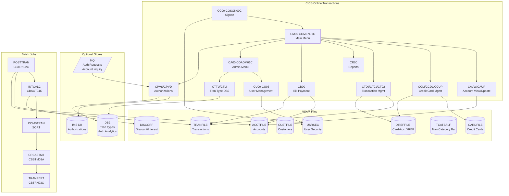
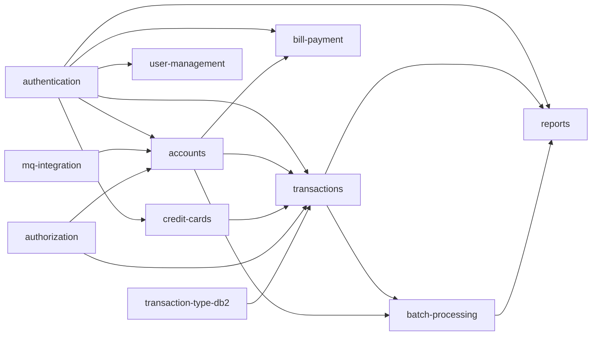

# System CardDemo - Overview for User Stories

**Version:** 2025-03  
**Purpose:** Single source of truth for creating well-structured User Stories

---

## 📊 Platform Statistics

- **Technology Stack:** COBOL, CICS, VSAM, JCL, RACF, Assembler (+ optional DB2, IMS DB, MQ)
- **Architecture Pattern:** CICS Online Transactions + JCL Batch Pipeline + VSAM Data Store
- **Key Capabilities:** Credit card management, account operations, transaction processing, batch reporting, optional authorizations
- **User Roles:** Regular Users (card/account/transaction management), Admin Users (user management)
- **Online Transactions:** 24 CICS transactions (13 base + 4 admin + 7 optional)
- **Batch Jobs:** 20+ JCL jobs in sequential pipeline

---

## 🏗️ High-Level Architecture

### Technology Stack
**COBOL Programs:** Primary business logic for all online (CICS) and batch (JCL) processing  
**CICS:** Transaction processing, screen management via BMS maps, inter-program COMMAREA passing  
**VSAM KSDS/AIX:** Primary data store — USRSEC, ACCTFILE, CARDFILE, CUSTFILE, TRANFILE, XREFFILE, TCATBALF, DISCGRP  
**JCL:** Batch processing pipeline for end-of-day transaction posting, interest calculation, statement generation  
**RACF:** Security (user authentication backed by USRSEC VSAM file)  
**Assembler:** MVSWAIT (timer control for batch), COBDATFT (date format conversion)  
**Optional DB2:** Transaction Type management, Authorization audit/fraud analytics  
**Optional IMS DB:** Authorization hierarchical storage  
**Optional MQ:** Authorization request/response, account inquiry channel  

### Architectural Patterns
- **COMMAREA Passing:** All CICS programs share state via CARDDEMO-COMMAREA (user context, account context, navigation)
- **BMS Maps:** Each screen has a BMS map definition + copybook for field access
- **File I/O:** Programs read/write VSAM files directly using EXEC CICS FILE commands
- **Batch File Pipeline:** Sequential batch jobs process daily transactions, update balances, generate statements
- **Optional Modules:** Three optional extensions add DB2, IMS DB, and MQ capabilities

---

## 📚 Module Catalog

<!-- MODULE_LIST_START -->
**Modules:** authentication, accounts, credit-cards, transactions, bill-payment, reports, user-management, batch-processing, authorization, transaction-type-db2, mq-integration
<!-- MODULE_LIST_END -->

### 1. Authentication
**ID:** `authentication`  
**Purpose:** User signon, credential validation, session establishment via COMMAREA  
**Key Components:** COSGN00C.cbl (program), COSGN00.bms (BMS map), USRSEC VSAM file  
**Transaction:** CC00  
**User Story Examples:**
- As a user, I want to sign in with my user ID and password so that I can access the application securely
- As an admin, I want the system to reject invalid credentials so that unauthorized access is prevented

### 2. Accounts
**ID:** `accounts`  
**Purpose:** View and update credit card account information; batch account maintenance and interest calculation  
**Key Components:** COACTVWC.cbl (CAVW - view), COACTUPC.cbl (CAUP - update), CBACT01C-04C (batch), ACCTFILE VSAM  
**Transactions:** CAVW (view), CAUP (update)  
**Batch Jobs:** INTCALC (CBACT04C - interest calculation), ACCTFILE (IDCAMS - refresh)  
**User Story Examples:**
- As a user, I want to view my account balance and credit limit so that I know my available credit
- As a user, I want to update my account details so that my information stays current
- As a system, I want to calculate monthly interest so that balances reflect accurate charges

### 3. Credit Cards
**ID:** `credit-cards`  
**Purpose:** List, view, and update credit card records; manage card active status  
**Key Components:** COCRDLIC.cbl (CCLI - list), COCRDSLC.cbl (CCDL - view), COCRDUPC.cbl (CCUP - update), CARDFILE VSAM  
**Transactions:** CCLI (list), CCDL (view/select), CCUP (update)  
**User Story Examples:**
- As a user, I want to see all credit cards associated with my account so that I can manage them
- As a user, I want to update a card's active status so that I can activate or deactivate cards
- As an admin, I want to view card details (masked CVV) so that I can assist customers

### 4. Transactions
**ID:** `transactions`  
**Purpose:** List, view, and add financial transactions; link to accounts via card cross-reference  
**Key Components:** COTRN00C.cbl (CT00 - list), COTRN01C.cbl (CT01 - view), COTRN02C.cbl (CT02 - add), CBTRN01C-03C (batch), TRANFILE VSAM, XREFFILE VSAM  
**Transactions:** CT00 (list), CT01 (view), CT02 (add)  
**Batch Jobs:** POSTTRAN (CBTRN02C - post daily transactions), COMBTRAN (SORT - combine files), TRANREPT (CBTRN03C - report)  
**User Story Examples:**
- As a user, I want to view my transaction history so that I can track spending
- As a user, I want to add a transaction so that purchases are recorded
- As a system, I want to post daily transactions to account balances so that records are accurate

### 5. Bill Payment
**ID:** `bill-payment`  
**Purpose:** Process bill payments against account balance; create payment transaction record  
**Key Components:** COBIL00C.cbl (CB00), ACCTFILE VSAM (balance update), TRANFILE VSAM (payment record)  
**Transaction:** CB00  
**User Story Examples:**
- As a user, I want to make a bill payment so that I reduce my outstanding balance
- As a user, I want to see my current balance before making a payment so that I know how much to pay
- As a system, I want to validate payment amount against balance so that overpayments are prevented

### 6. Reports
**ID:** `reports`  
**Purpose:** Generate transaction reports for a date range; submit batch report jobs via internal reader  
**Key Components:** CORPT00C.cbl (CR00), CBSTM03A.CBL/CBSTM03B.CBL (batch statement), CBTRN03C.cbl (batch report)  
**Transaction:** CR00  
**Batch Jobs:** CREASTMT (CBSTM03A - produce statement), TRANREPT (CBTRN03C - transaction report)  
**User Story Examples:**
- As a user, I want to generate a transaction report for a date range so that I can review activity
- As a user, I want to download/print my statement so that I have a record of transactions
- As a system, I want to produce monthly statements so that customers receive billing documents

### 7. User Management
**ID:** `user-management`  
**Purpose:** Admin-only CRUD operations for application users in USRSEC VSAM file  
**Key Components:** COUSR00C.cbl (CU00 - list), COUSR01C.cbl (CU01 - add), COUSR02C.cbl (CU02 - update), COUSR03C.cbl (CU03 - delete), COADM01C.cbl (CA00 - admin menu), USRSEC VSAM  
**Transactions:** CU00, CU01, CU02, CU03, CA00  
**Access:** Admin users only (CDEMO-USRTYP-ADMIN = 'A')  
**User Story Examples:**
- As an admin, I want to list all users so that I can manage the user base
- As an admin, I want to add a new user so that they can access the application
- As an admin, I want to delete a user so that access is revoked when needed

### 8. Batch Processing
**ID:** `batch-processing`  
**Purpose:** End-of-day sequential batch pipeline: file setup, transaction posting, interest calculation, statement generation  
**Key Components:** CBTRN02C.cbl (POSTTRAN), CBACT04C.cbl (INTCALC), CBSTM03A.CBL (CREASTMT), CBCUS01C.cbl, CBEXPORT.cbl, CBIMPORT.cbl, all JCL jobs  
**Batch Pipeline (in order):**
1. CLOSEFIL - Close VSAM files in CICS
2. ACCTFILE/CARDFILE/CUSTFILE/XREFFILE - Refresh master files
3. POSTTRAN (CBTRN02C) - Post daily transactions, update account balances
4. INTCALC (CBACT04C) - Calculate interest using DISCGRP rates
5. COMBTRAN (SORT) - Combine transaction files
6. CREASTMT (CBSTM03A) - Produce transaction statements
7. TRANREPT (CBTRN03C) - Generate transaction reports
8. OPENFIL - Reopen files in CICS
**User Story Examples:**
- As an operations team, I want the batch pipeline to run automatically so that balances are updated nightly
- As a system, I want to reject invalid transactions during POSTTRAN so that bad records are captured in DALYREJS
- As an operations team, I want to monitor batch job completion so that I can address failures quickly

### 9. Authorization (Optional)
**ID:** `authorization`  
**Purpose:** Real-time credit card authorization via MQ with IMS DB storage and DB2 fraud analytics  
**Key Components:** COPAUA0C.cbl (CP00 - MQ trigger processor), COPAUS0C.cbl (CPVS - pending auth summary), COPAUS1C.cbl (CPVD - auth details), CBPAUP0C.cbl (batch purge), IMS DB, DB2 CARDAUTHDB  
**Transactions:** CP00 (MQ-triggered), CPVS, CPVD  
**Batch Jobs:** CBPAUP0J (CBPAUP0C - purge expired authorizations)  
**User Story Examples:**
- As a merchant system, I want to send authorization requests via MQ so that transactions are approved in real-time
- As a user, I want to view pending authorizations on my account so that I know upcoming charges
- As a fraud team, I want declined authorizations logged to DB2 so that fraud patterns can be analyzed

### 10. Transaction Type DB2 (Optional)
**ID:** `transaction-type-db2`  
**Purpose:** Manage transaction type reference data in DB2 using embedded static SQL; admin CRUD via CICS  
**Key Components:** COTRTUPC.cbl (CTTU - add/edit), COTRTLIC.cbl (CTLI - list/update/delete), COBTUPDT.cbl (batch maintenance), DB2 transaction type tables  
**Transactions:** CTTU, CTLI  
**Batch Jobs:** CREADB21 (DB2 setup), TRANEXTR (extract to VSAM), MNTTRDB2 (COBTUPDT - batch maintenance)  
**User Story Examples:**
- As an admin, I want to add new transaction types in DB2 so that new transaction categories are supported
- As an admin, I want to list and delete obsolete transaction types so that reference data stays clean
- As a system, I want to extract DB2 transaction types to VSAM so that online programs can use them

### 11. MQ Integration (Optional)
**ID:** `mq-integration`  
**Purpose:** MQ-based account and system date inquiry using request/response messaging pattern  
**Key Components:** CODATE01.cbl (CDRD - system date inquiry), COACCT01.cbl (CDRA - account details inquiry)  
**Transactions:** CDRD, CDRA  
**User Story Examples:**
- As an external system, I want to query account details via MQ so that I can integrate without direct VSAM access
- As an external system, I want to query the mainframe system date via MQ so that date-sensitive operations are synchronized

---

## 🔄 Architecture Diagram



---

## 🔄 Module Dependency Diagram



---

## 📊 Data Models

### Account (CVACT01Y.cpy)
```cobol
01  ACCOUNT-RECORD.                          (RECLN 300)
    05  ACCT-ID                    PIC 9(11)
    05  ACCT-ACTIVE-STATUS         PIC X(01)   -- 'Y'=active, 'N'=inactive
    05  ACCT-CURR-BAL              PIC S9(10)V99
    05  ACCT-CREDIT-LIMIT          PIC S9(10)V99
    05  ACCT-CASH-CREDIT-LIMIT     PIC S9(10)V99
    05  ACCT-OPEN-DATE             PIC X(10)   -- YYYY-MM-DD
    05  ACCT-EXPIRAION-DATE        PIC X(10)   -- YYYY-MM-DD
    05  ACCT-REISSUE-DATE          PIC X(10)   -- YYYY-MM-DD
    05  ACCT-CURR-CYC-CREDIT       PIC S9(10)V99
    05  ACCT-CURR-CYC-DEBIT        PIC S9(10)V99
    05  ACCT-ADDR-ZIP              PIC X(10)
    05  ACCT-GROUP-ID              PIC X(10)   -- links to DISCGRP interest rates
```

### Customer (CVCUS01Y.cpy)
```cobol
01  CUSTOMER-RECORD.                         (RECLN 500)
    05  CUST-ID                    PIC 9(09)
    05  CUST-FIRST-NAME            PIC X(25)
    05  CUST-MIDDLE-NAME           PIC X(25)
    05  CUST-LAST-NAME             PIC X(25)
    05  CUST-ADDR-LINE-1/2/3       PIC X(50) each
    05  CUST-ADDR-STATE-CD         PIC X(02)
    05  CUST-ADDR-COUNTRY-CD       PIC X(03)
    05  CUST-ADDR-ZIP              PIC X(10)
    05  CUST-PHONE-NUM-1/2         PIC X(15) each
    05  CUST-SSN                   PIC 9(09)
    05  CUST-GOVT-ISSUED-ID        PIC X(20)
    05  CUST-DOB-YYYY-MM-DD        PIC X(10)
    05  CUST-EFT-ACCOUNT-ID        PIC X(10)
    05  CUST-PRI-CARD-HOLDER-IND   PIC X(01)
    05  CUST-FICO-CREDIT-SCORE     PIC 9(03)
```

### Credit Card (CVACT02Y.cpy)
```cobol
01  CARD-RECORD.                             (RECLN 150)
    05  CARD-NUM                   PIC X(16)  -- 16-digit card number (key)
    05  CARD-ACCT-ID               PIC 9(11)  -- links to ACCOUNT-RECORD
    05  CARD-CVV-CD                PIC 9(03)
    05  CARD-EMBOSSED-NAME         PIC X(50)
    05  CARD-EXPIRAION-DATE        PIC X(10)  -- YYYY-MM-DD
    05  CARD-ACTIVE-STATUS         PIC X(01)  -- 'Y'=active, 'N'=inactive
```

### User Security (CSUSR01Y.cpy)
```cobol
01 SEC-USER-DATA.
    05 SEC-USR-ID                  PIC X(08)  -- login ID (key)
    05 SEC-USR-FNAME               PIC X(20)
    05 SEC-USR-LNAME               PIC X(20)
    05 SEC-USR-PWD                 PIC X(08)  -- plaintext password
    05 SEC-USR-TYPE                PIC X(01)  -- 'A'=admin, 'U'=user
```

### Transaction (CVTRA series)
```cobol
01  TRAN-RECORD.                             (RECLN 350)
    05  TRAN-ID                    PIC X(16)  -- unique transaction ID (key)
    05  TRAN-TYPE-CD               PIC X(02)  -- transaction type code
    05  TRAN-CAT-CD                PIC 9(04)  -- category code
    05  TRAN-SOURCE                PIC X(10)  -- origination source
    05  TRAN-DESC                  PIC X(100) -- description
    05  TRAN-AMT                   PIC S9(10)V99
    05  TRAN-CARD-NUM              PIC X(16)  -- links to CARD-RECORD
    05  TRAN-MERCHANT-ID           PIC 9(15)
    05  TRAN-MERCHANT-NAME         PIC X(50)
    05  TRAN-MERCHANT-CITY         PIC X(50)
    05  TRAN-MERCHANT-ZIP          PIC X(10)
    05  TRAN-ORIG-TS               PIC X(26)  -- origination timestamp
    05  TRAN-PROC-TS               PIC X(26)  -- processing timestamp
```

### COMMAREA (COCOM01Y.cpy)
```cobol
01 CARDDEMO-COMMAREA.
    05 CDEMO-GENERAL-INFO.
       10 CDEMO-FROM-TRANID        PIC X(04)  -- source transaction
       10 CDEMO-FROM-PROGRAM       PIC X(08)  -- source program
       10 CDEMO-TO-TRANID          PIC X(04)  -- target transaction
       10 CDEMO-TO-PROGRAM         PIC X(08)  -- target program
       10 CDEMO-USER-ID            PIC X(08)  -- authenticated user
       10 CDEMO-USER-TYPE          PIC X(01)  -- 'A'=admin, 'U'=user
       10 CDEMO-PGM-CONTEXT        PIC 9(01)  -- 0=enter, 1=reenter
    05 CDEMO-CUSTOMER-INFO.
       10 CDEMO-CUST-ID            PIC 9(09)
    05 CDEMO-ACCOUNT-INFO.
       10 CDEMO-ACCT-ID            PIC 9(11)
       10 CDEMO-ACCT-STATUS        PIC X(01)
    05 CDEMO-CARD-INFO.
       10 CDEMO-CARD-NUM           PIC 9(16)
```

### Transaction Category Balance (CVTRA01Y.cpy)
```cobol
01  TRAN-CAT-BAL-RECORD.                     (RECLN 50)
    05  TRAN-CAT-KEY.
       10 TRANCAT-ACCT-ID          PIC 9(11)
       10 TRANCAT-TYPE-CD          PIC X(02)
       10 TRANCAT-CD               PIC 9(04)
    05  TRAN-CAT-BAL               PIC S9(09)V99
```

### Disclosure Group / Interest Rates (CVTRA02Y.cpy)
```cobol
01  DIS-GROUP-RECORD.                        (RECLN 50)
    05  DIS-GROUP-KEY.
       10 DIS-ACCT-GROUP-ID        PIC X(10)
       10 DIS-TRAN-TYPE-CD         PIC X(02)
       10 DIS-TRAN-CAT-CD          PIC 9(04)
    05  DIS-INT-RATE               PIC S9(04)V99  -- interest rate %
```

---

## 📋 Business Rules by Module

### Authentication Rules
- User ID is 8 characters, Password is 8 characters
- User type 'A' grants admin access; user type 'U' grants regular user access
- Failed login displays error message on signon screen
- PF3 key logs out and displays thank-you message
- Session context stored in CARDDEMO-COMMAREA passed between programs

### Account Rules
- ACCT-ACTIVE-STATUS must be 'Y' for account to be operational
- Credit limit cannot be exceeded (ACCT-CURR-BAL vs ACCT-CREDIT-LIMIT)
- Cash credit limit is a sub-limit of overall credit limit
- ACCT-GROUP-ID links to DISCGRP file for interest rate determination
- Interest calculated monthly via CBACT04C using DISCGRP rates by type/category

### Credit Card Rules
- CARD-ACTIVE-STATUS 'Y'=active, 'N'=inactive
- Card links to account via CARD-ACCT-ID; cross-reference stored in XREFFILE
- Card number is 16 digits (primary key)
- CVV stored in VSAM (3 digits)

### Transaction Rules
- Transaction ID is 16 characters (unique key)
- Transaction type code (2 chars) + category code (4 digits) classify each transaction
- Daily transactions staged in DALYTRAN file, posted in batch by CBTRN02C
- Rejected transactions written to DALYREJS with rejection reason
- Transaction amount updates ACCT-CURR-BAL and TRAN-CAT-BAL-RECORD

### Bill Payment Rules
- Bill payment creates a transaction record in TRANFILE
- Payment updates ACCT-CURR-BAL (reduces balance)
- Payment amount validated against current account balance
- Payment type code typically 'PY' with appropriate category

### Report Rules
- Reports submitted to internal reader as JCL jobs
- Date range required for report generation (current date - 1 as default previous)
- CBSTM03A produces statement; CBTRN03C produces detail report
- Reports run as batch jobs submitted from CICS (CORPT00C)

### User Management Rules
- Only admin users (TYPE='A') can access user management functions
- Admin menu (CA00) checks CDEMO-USER-TYPE before allowing access
- User ID must be unique in USRSEC VSAM
- Password stored in plaintext (8-char field)
- User type must be 'A' (admin) or 'U' (regular user)

### Batch Processing Rules
- Files must be closed in CICS before batch jobs run (CLOSEFIL)
- Files must be reopened in CICS after batch completes (OPENFIL)
- POSTTRAN reads DALYTRAN sequential file; rejects go to DALYREJS
- INTCALC reads TCATBALF sequentially; looks up rate in DISCGRP
- Batch jobs run in strict sequential order (job dependency chain)

---

## 🌐 CICS Transaction Flow

### User Navigation Flow
```
CC00 (Signon) → CM00 (Main Menu) → CAVW (Account View) → CAUP (Account Update)
                                 → CCLI (Card List) → CCDL (Card View) → CCUP (Card Update)
                                 → CT00 (Tran List) → CT01 (Tran View)
                                                    → CT02 (Tran Add)
                                 → CR00 (Reports)
                                 → CB00 (Bill Payment)
                                 → CPVS (Pending Auth) → CPVD (Auth Detail) [optional]
```

### Admin Navigation Flow
```
CC00 (Signon) → CA00 (Admin Menu) → CU00 (User List) → CU01 (Add User)
                                                       → CU02 (Update User)
                                                       → CU03 (Delete User)
                                  → CTLI (Tran Type List) [optional]
                                  → CTTU (Tran Type Add/Edit) [optional]
```

### Key Navigation Mechanism
- ENTER key: processes current screen action
- PF3 key: returns to previous screen
- PF4 key: clears current screen
- PF5/PF6/PF7/PF8: scroll / page up-down (where applicable)

---

## 🎯 Patterns for User Stories

### Templates by Domain

#### Account Management Stories
- As a **regular user**, I want to view my account balance and credit limit so that I know my available credit
- As a **regular user**, I want to update my account contact information so that my records are accurate
- As a **batch system**, I want to calculate monthly interest charges so that account balances reflect accrued interest

#### Credit Card Stories
- As a **regular user**, I want to see all credit cards on my account so that I can identify which cards are active
- As a **regular user**, I want to deactivate a lost/stolen card so that unauthorized use is prevented

#### Transaction Stories
- As a **regular user**, I want to view my transaction history so that I can track my spending
- As a **regular user**, I want to add a manual transaction so that purchases are recorded
- As a **batch system**, I want to post daily transactions to account balances so that records remain accurate

#### Bill Payment Stories
- As a **regular user**, I want to make a bill payment against my account so that I reduce my outstanding balance
- As a **regular user**, I want to see my balance before paying so that I know my payment options

#### Reports Stories
- As a **regular user**, I want to generate a transaction report for a date range so that I can review my activity
- As a **regular user**, I want to receive a monthly statement so that I have a record of all transactions

#### Admin/User Management Stories
- As an **admin**, I want to add new users to the system so that staff can access CardDemo
- As an **admin**, I want to update a user's type (admin/regular) so that access privileges are correct
- As an **admin**, I want to delete a user so that terminated employees lose access

#### Authorization Stories (Optional)
- As a **merchant system**, I want to submit authorization requests via MQ so that transactions can be approved in real-time
- As a **regular user**, I want to view pending authorizations so that I can see pre-authorized charges

### Story Complexity Guidelines
- **Simple (1-2 pts):** Screen navigation, read-only data display (CAVW, CT00-CT01, CU00)
- **Medium (3-5 pts):** CRUD with validation and VSAM update (CAUP, CCUP, CT02, CB00, CU01-03)
- **Complex (5-8 pts):** Multi-file batch jobs, MQ integration, cross-system transactions (POSTTRAN, INTCALC, authorization processing)

### Acceptance Criteria Patterns
- **Authentication:** Must validate user ID and password against USRSEC; must set USER-TYPE in COMMAREA
- **Validation:** Must check required fields; must display error on BMS map error field; must NOT proceed on invalid input
- **File Operations:** Must handle FILE-NOT-FOUND with appropriate message; must handle duplicate key on insert
- **Navigation:** PF3 must always return to previous screen; ENTER must process action
- **Admin Access:** Admin-only screens must verify CDEMO-USER-TYPE='A'; must redirect non-admin to main menu
- **Batch Completions:** Must write completion counts to SYSOUT; must write rejects to DALYREJS with reason code

---

## ⚡ Performance Budgets

- **CICS Response Time:** < 2s per transaction (screen display and file I/O)
- **Batch Job (POSTTRAN):** Daily transaction file processed within batch window (typically overnight)
- **Batch Job (INTCALC):** Interest calculation completed before statement generation
- **VSAM File I/O:** KSDS random read < 50ms; sequential batch read limited by DASD speed
- **MQ Request/Response:** Authorization response < 5s for real-time approval (optional module)

---

## 🚨 Readiness Considerations

### Technical Risks
- **Password Security:** Plaintext passwords in USRSEC VSAM — migration must implement password hashing
- **COMMAREA Size:** Fixed-size COMMAREA limits extensibility without CICS channel/container migration
- **Batch Window:** Sequential batch pipeline requires careful scheduling; failure at any step may require rerun from beginning
- **Date Handling:** Uses FUNCTION CURRENT-DATE and FUNCTION DATE-OF-INTEGER; Y2K-safe but needs timezone consideration

### Tech Debt
- **Typo in field names:** `ACCT-EXPIRAION-DATE` and `CARD-EXPIRAION-DATE` have misspellings (missing 'T') — preserved in data structures
- **Mixed case file extensions:** Some files use .CBL vs .cbl — build scripts must handle both
- **UNUSED1Y.cpy:** Unused copybook in cpy/ directory

### Sequencing for US
- **Prerequisites:** Authentication module must work before any other module can be tested end-to-end
- **Recommended order:** authentication → accounts → credit-cards → transactions → bill-payment → reports → user-management → batch-processing → (optional) authorization → transaction-type-db2 → mq-integration

---

## 📈 Success Metrics

### Adoption
- **Target:** All mainframe operations staff trained on application within 30 days
- **Engagement:** Transaction add (CT02) and bill payment (CB00) used daily by regular users
- **Retention:** Batch pipeline runs successfully every business day without manual intervention

### Business Impact
- **Account Accuracy:** 100% of daily transactions posted by POSTTRAN without errors
- **Statement Generation:** Monthly statements produced for all active accounts within batch window
- **Authorization Processing:** Real-time authorization response within 5 seconds (optional module)

---

*Last updated: March 2025*
