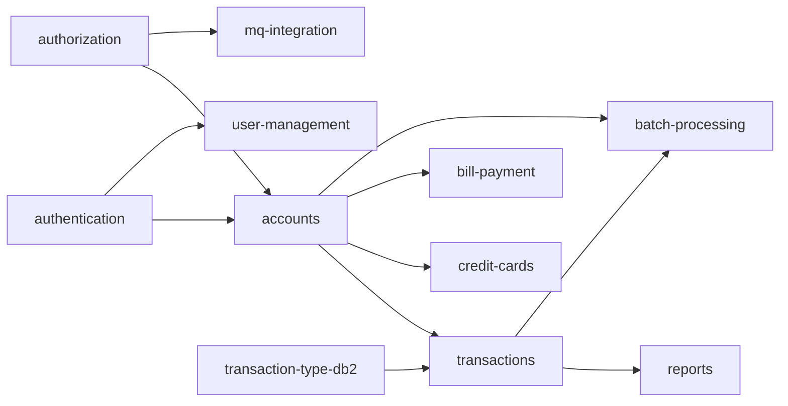

# System CardDemo - Overview for User Stories

**Version:** 2025-03-06  
**Purpose:** Single source of truth for creating well-structured User Stories

---

## 📊 Platform Statistics

- **Technology Stack:** COBOL, CICS, VSAM (KSDS/ESDS/RRDS), JCL, RACF, Assembler; optional DB2, IMS DB, IBM MQ
- **Architecture Pattern:** CICS Online Transaction Processing + Batch JCL pipeline; mainframe-hosted
- **Key Capabilities:** Credit card account management, transaction processing, bill payment, reporting, user/security administration, optional authorization via MQ/IMS/DB2
- **Application Version:** CardDemo v1.0 (AWS mainframe modernization reference application)

---

## 🏗️ High-Level Architecture

### Technology Stack
**Core Language:** IBM COBOL  
**Transaction Processor:** IBM CICS (Customer Information Control System)  
**Primary Data Store:** VSAM KSDS (Key-Sequenced Dataset) with Alternate Indexes  
**Batch Engine:** JCL (Job Control Language) with utility programs and COBOL batch programs  
**Security:** RACF (Resource Access Control Facility)  
**System Programming:** IBM Assembler (MVSWAIT, COBDATFT utilities)

**Optional Extensions:**  
- **DB2:** Transaction Type Management; Fraud Analytics  
- **IMS DB:** Hierarchical store for authorization data (HIDAM)  
- **IBM MQ:** Authorization request/response; Account extraction

### Architectural Patterns
- **CICS Transaction Pattern:** Each online function is mapped to a CICS transaction ID → COBOL program → BMS map (3270 screen). Programs pass state via COMMAREA.
- **Batch Pipeline:** Sequential JCL jobs read/write VSAM files, produce reports, calculate interest, and post transactions.
- **Optional MQ Trigger:** COPAUA0C is triggered by MQ message arrival (CP00 transaction) to process card authorization requests asynchronously.
- **Copybook-Driven Data Access:** Shared copybooks (e.g., CVACT01Y, CVCUS01Y) define VSAM record layouts used across online and batch programs.
- **COMMAREA State Management:** CICS programs pass navigation state (current program, next program, account/card IDs) via COCOM01Y copybook-defined COMMAREA.

---

## 📚 Module Catalog

<!-- MODULE_LIST_START -->
**Modules:** authentication, accounts, credit-cards, transactions, bill-payment, reports, user-management, batch-processing, authorization, transaction-type-db2, mq-integration
<!-- MODULE_LIST_END -->

---

### 1. Authentication
**ID:** `authentication`  
**Purpose:** Controls user sign-on and access to the CardDemo application. Validates credentials against the USRSEC VSAM file and routes users to appropriate menus based on user type (regular/admin).  
**Key Components:**
- `COSGN00C` – CICS COBOL signon program
- `COSGN00` / `COSGN00.bms` – BMS 3270 signon screen (mapset)
- `CSUSR01Y.cpy` – User security record layout
- USRSEC VSAM file (`AWS.M2.CARDDEMO.USRSEC.PS`)

**CICS Transactions:**
| Transaction | Program  | Function |
|:-----------|:---------|:---------|
| CC00       | COSGN00C | Display signon screen and authenticate user |

**Authentication Flow:**
1. User enters User ID (8 chars) and Password (8 chars) on CC00 screen
2. COSGN00C reads USRSEC VSAM file with user ID as key
3. Password is compared; user type (`SEC-USR-TYPE`) determines routing
4. Admin users → Admin Menu (CA00); Regular users → Main Menu (CM00)

**User Story Examples:**
- As a **cardholder**, I want to sign in with my user ID and password so I can access account management functions.
- As an **administrator**, I want to sign in with elevated credentials so I can access admin-only functions.
- As a **security auditor**, I want failed login attempts to display error messages so unauthorized access is prevented.

---

### 2. Accounts
**ID:** `accounts`  
**Purpose:** Enables cardholders and administrators to view and update credit card account information including balances, credit limits, and account status.  
**Key Components:**
- `COACTVWC` – Account View CICS program (CAVW transaction)
- `COACTUPC` – Account Update CICS program (CAUP transaction)
- `CBACT01C` – Batch: Read account records sequentially
- `CBACT02C` – Batch: Read account by account ID
- `CBACT03C` – Batch: Update account records
- `CBACT04C` – Batch: Interest calculation (uses TCATBALF discount groups)
- `CVACT01Y.cpy` – Account record layout (300-byte, RECLN=300)
- `COACTVW.bms` / `COACTUP.bms` – BMS screen maps

**CICS Transactions:**
| Transaction | Program   | Function |
|:-----------|:---------|:---------|
| CAVW       | COACTVWC | View account details |
| CAUP       | COACTUPC | Update account information |

**Account Data Model (`CVACT01Y`):**
```cobol
01  ACCOUNT-RECORD.
    05  ACCT-ID                  PIC 9(11).        -- Account identifier
    05  ACCT-ACTIVE-STATUS       PIC X(01).        -- Account status (A/I)
    05  ACCT-CURR-BAL            PIC S9(10)V99.    -- Current balance
    05  ACCT-CREDIT-LIMIT        PIC S9(10)V99.    -- Credit limit
    05  ACCT-CASH-CREDIT-LIMIT   PIC S9(10)V99.    -- Cash credit limit
    05  ACCT-OPEN-DATE           PIC X(10).        -- Open date YYYY-MM-DD
    05  ACCT-EXPIRAION-DATE      PIC X(10).        -- Expiration date
    05  ACCT-REISSUE-DATE        PIC X(10).        -- Reissue date
    05  ACCT-CURR-CYC-CREDIT     PIC S9(10)V99.    -- Current cycle credits
    05  ACCT-CURR-CYC-DEBIT      PIC S9(10)V99.    -- Current cycle debits
    05  ACCT-ADDR-ZIP            PIC X(10).        -- ZIP code
    05  ACCT-GROUP-ID            PIC X(10).        -- Discount group ID
```

**User Story Examples:**
- As a **cardholder**, I want to view my current account balance and credit limit so I understand my available credit.
- As a **cardholder**, I want to update my billing address ZIP code so my account reflects current information.
- As a **batch operator**, I want interest calculated on outstanding balances nightly so accounts are updated accurately.

---

### 3. Credit Cards
**ID:** `credit-cards`  
**Purpose:** Enables listing, viewing, and updating credit card details associated with an account. Supports multiple cards per account via VSAM cross-reference.  
**Key Components:**
- `COCRDLIC` – Credit card list CICS program (CCLI transaction)
- `COCRDSLC` – Credit card view/select CICS program (CCDL transaction)
- `COCRDUPC` – Credit card update CICS program (CCUP transaction)
- `CVACT02Y.cpy` – Card record layout (150-byte)
- `CVACT03Y.cpy` – Card cross-reference layout (account-to-card mapping)
- `COCRDLI.bms` / `COCRDSL.bms` / `COCRDUP.bms` – BMS screen maps
- CARDDATA VSAM (`AWS.M2.CARDDEMO.CARDDATA.PS`)
- CARDXREF VSAM (`AWS.M2.CARDDEMO.CARDXREF.PS`)

**CICS Transactions:**
| Transaction | Program   | Function |
|:-----------|:---------|:---------|
| CCLI       | COCRDLIC | List credit cards for an account |
| CCDL       | COCRDSLC | View credit card details |
| CCUP       | COCRDUPC | Update credit card information |

**Card Data Model (`CVACT02Y`):**
```cobol
01  CARD-RECORD.
    05  CARD-NUM              PIC X(16).    -- 16-digit card number
    05  CARD-ACCT-ID          PIC 9(11).    -- Linked account ID
    05  CARD-CVV-CD           PIC 9(03).    -- CVV code
    05  CARD-EMBOSSED-NAME    PIC X(50).    -- Cardholder name on card
    05  CARD-EXPIRAION-DATE   PIC X(10).    -- Expiration date
    05  CARD-ACTIVE-STATUS    PIC X(01).    -- Status (A=Active, I=Inactive)
```

**User Story Examples:**
- As a **cardholder**, I want to list all cards linked to my account so I can manage each card.
- As a **cardholder**, I want to view card details including expiration date so I know when my card expires.
- As a **cardholder**, I want to activate or deactivate a card so I can control card usage.

---

### 4. Transactions
**ID:** `transactions`  
**Purpose:** Manages the full lifecycle of credit card financial transactions in CardDemo. Provides online CICS screens for listing, viewing, and adding transactions, plus a batch JCL pipeline for end-of-day posting, reporting, and data migration. Every spending event, payment, and fee ultimately produces a record in the TRANSACT VSAM KSDS.  
**Key Components:**
- `COTRN00C` – Transaction list CICS program (CT00); browse TRANSACT KSDS 10 records per page with PF7/PF8 paging
- `COTRN01C` – Transaction detail view CICS program (CT01); keyed read by TRAN-ID
- `COTRN02C` – Add new transaction CICS program (CT02); validates card via CCXREF, resolves account, calls CSUTLDTC date utility, writes to TRANSACT VSAM
- `CBTRN01C` – Batch: Sequential read utility for TRANSACT VSAM
- `CBTRN02C` – Batch: Post daily transactions from DALYTRAN PS file to TRANSACT VSAM; validates card/account, updates TCATBAL category balances, writes rejects to DALYREJS (POSTTRAN job)
- `CBTRN03C` – Batch: Generate dated transaction detail report with page/account/grand totals; reads TRANTYPE and TRANCATG reference files (TRANREPT job, triggered from CICS CR00)
- `CBEXPORT` – Batch: Export full customer+account+card+transaction profiles to multi-record flat file for branch migration
- `CBIMPORT` – Batch: Import migration export file; validate checksums; split into normalized VSAM output files
- `CVTRA05Y.cpy` – TRANSACT VSAM record layout (KSDS, 350-byte, key=TRAN-ID, AIX on TRAN-CARD-NUM)
- `CVTRA06Y.cpy` – DALYTRAN daily transaction record layout (same 350-byte structure)
- `CVTRA01Y.cpy` – Transaction category balance record (TCATBALF, 50-byte)
- `CVTRA02Y.cpy` – Disclosure group / interest rate record (DISCGRP, 50-byte)
- `CVTRA03Y.cpy` – Transaction type reference record (TRANTYPE VSAM, 60-byte)
- `CVTRA04Y.cpy` – Transaction category reference record (TRANCATG VSAM, 60-byte)
- `CVTRA07Y.cpy` – Report header and detail line layouts for CBTRN03C
- `COTRN00.bms` / `COTRN01.bms` / `COTRN02.bms` – BMS screen maps
- TRANSACT VSAM (`AWS.M2.CARDDEMO.TRANSACT.VSAM.KSDS`)
- DALYTRAN file (`AWS.M2.CARDDEMO.DALYTRAN.PS`)

**CICS Transactions:**
| Transaction | Program   | Function |
|:-----------|:---------|:---------|
| CT00       | COTRN00C | List transactions — 10/page, PF7/PF8 browse, card-number filter via COMMAREA |
| CT01       | COTRN01C | View full transaction detail by TRAN-ID |
| CT02       | COTRN02C | Add new transaction; validates card, account, and date before writing to VSAM |

**Batch Jobs:**
| Job       | Program   | Purpose |
|:---------|:---------|:-------|
| POSTTRAN  | CBTRN02C | Post DALYTRAN to TRANSACT; RC=0 clean, RC=4 on rejects |
| TRANREPT  | CBTRN03C | Generate transaction detail report for a date range |
| TRANBKP   | IDCAMS   | Backup TRANSACT before posting |
| COMBTRAN  | SORT     | Combine daily and system transactions |
| TRANIDX   | IDCAMS   | Rebuild TRANSACT card-number AIX post-posting |
| CBEXPORT  | CBEXPORT | Export all data for branch migration |
| CBIMPORT  | CBIMPORT | Import migration export file |

**Transaction Data Model (`CVTRA05Y`):**
```cobol
01  TRAN-RECORD.
    05  TRAN-ID              PIC X(16).       -- Transaction identifier (primary key)
    05  TRAN-TYPE-CD         PIC X(02).       -- Type code → refs TRANTYPE VSAM / DB2
    05  TRAN-CAT-CD          PIC 9(04).       -- Category code → refs TRANCATG VSAM
    05  TRAN-SOURCE          PIC X(10).       -- Source system
    05  TRAN-DESC            PIC X(100).      -- Description
    05  TRAN-AMT             PIC S9(09)V99.   -- Amount (signed)
    05  TRAN-MERCHANT-ID     PIC 9(09).       -- Merchant identifier
    05  TRAN-MERCHANT-NAME   PIC X(50).       -- Merchant name
    05  TRAN-MERCHANT-CITY   PIC X(50).       -- Merchant city
    05  TRAN-MERCHANT-ZIP    PIC X(10).       -- Merchant ZIP
    05  TRAN-CARD-NUM        PIC X(16).       -- Card number used (AIX key)
    05  TRAN-ORIG-TS         PIC X(26).       -- Original transaction timestamp
    05  TRAN-PROC-TS         PIC X(26).       -- Processing/posting timestamp
    05  FILLER               PIC X(20).       -- Reserved (total = 350 bytes)
```

**Dependencies:**
- Upstream: `authentication` (signon required), `accounts` (ACCTDAT VSAM for CT02 validation), `credit-cards` (CARDXREF for card→account lookup)
- Downstream: `reports` (CBTRN03C), `bill-payment` (writes payment transactions to TRANSACT), `batch-processing` (TCATBALF consumed by interest calculation)
- Optional: `transaction-type-db2` manages the type codes referenced by TRAN-TYPE-CD

**Business Rules:**
- TRAN-ID is a 16-character unique key; COTRN02C generates it at add-time; CBTRN02C uses DALYTRAN-ID
- CBTRN02C validates card number (reason 100 = not in XREFFILE) then account (reason 101 = not in ACCTFILE); rejects go to DALYREJS with RC=4
- CBTRN02C updates TCATBAL category-balance buckets for each accepted transaction — critical for CBACT04C interest calculation
- TRANIDX (AIX rebuild) must run after POSTTRAN to keep card-number lookups accurate
- CBTRN03C report filters by TRAN-PROC-TS date range supplied via DATEPARM file
- CBEXPORT/CBIMPORT include transactions as part of full customer-profile migration records

**User Story Examples:**
- As a **cardholder**, I want to list my recent transactions so I can monitor spending.
- As a **cardholder**, I want to view full transaction details including merchant information so I can verify a charge.
- As an **operator**, I want to add a transaction manually so charges missing from the daily file can be recorded.
- As a **batch operator**, I want daily transactions posted to accounts overnight so balances reflect all activity.
- As a **batch operator**, I want rejected transactions written to a reject file so I can identify and resolve data issues.
- As a **cardholder**, I want to export my transaction history so I can analyze spending in external tools.

---

### 5. Bill Payment
**ID:** `bill-payment`  
**Purpose:** Enables cardholders to submit bill payments against their credit card account balance.  
**Key Components:**
- `COBIL00C` – Bill payment CICS program (CB00 transaction)
- `COBIL00.bms` – BMS screen map for bill payment
- `CVACT01Y.cpy` – Account record (reads/updates balance)
- `CVTRA05Y.cpy` – Transaction record (creates payment transaction)

**CICS Transactions:**
| Transaction | Program  | Function |
|:-----------|:---------|:---------|
| CB00       | COBIL00C | Submit bill payment |

**Business Rules:**
- Payment amount must be positive
- Payment creates a credit transaction record in the transaction VSAM file
- Account current balance is reduced by payment amount
- Cycle credit balance is updated

**User Story Examples:**
- As a **cardholder**, I want to make a bill payment so my balance is reduced and account remains in good standing.
- As a **cardholder**, I want to see my current balance before paying so I can choose a payment amount.
- As a **cardholder**, I want a confirmation after payment so I know it was processed successfully.

---

### 6. Reports
**ID:** `reports`  
**Purpose:** Provides on-demand and scheduled transaction reports and account statements.  
**Key Components:**
- `CORPT00C` – Report request CICS program (CR00 transaction); submits TRANREPT batch job via internal reader
- `CBTRN03C` – Batch: Transaction report generator (TRANREPT job)
- `CBSTM03A.CBL` – Batch: Statement generation program (CREASTMT job)
- `CBSTM03B.CBL` – Batch: Statement generation support program
- `CORPT00.bms` – BMS screen for report request

**CICS Transactions:**
| Transaction | Program  | Function |
|:-----------|:---------|:---------|
| CR00       | CORPT00C | Request transaction report (launches batch via internal reader) |

**Batch Jobs:**
| Job      | Program  | Function |
|:--------|:---------|:---------|
| TRANREPT | CBTRN03C | Generate transaction report |
| CREASTMT | CBSTM03A | Generate account statements (GDG output) |

**User Story Examples:**
- As a **cardholder**, I want to generate a transaction report for a date range so I can review spending history.
- As a **batch operator**, I want monthly account statements generated automatically so customers receive statements.
- As an **auditor**, I want to access historical statements stored in GDG so I can audit account activity.

---

### 7. User Management
**ID:** `user-management`  
**Purpose:** Allows administrators to manage system user accounts in the USRSEC security file.  
**Key Components:**
- `COADM01C` – Admin menu CICS program (CA00 transaction)
- `COUSR00C` – List users CICS program (CU00 transaction)
- `COUSR01C` – Add user CICS program (CU01 transaction)
- `COUSR02C` – Update user CICS program (CU02 transaction)
- `COUSR03C` – Delete user CICS program (CU03 transaction)
- `CSUSR01Y.cpy` – User security record layout (80-byte)
- `COADM01.bms` / `COUSR00-03.bms` – BMS screen maps
- USRSEC VSAM file (`AWS.M2.CARDDEMO.USRSEC.PS`)

**CICS Transactions:**
| Transaction | Program   | Function |
|:-----------|:---------|:---------|
| CA00       | COADM01C | Admin menu |
| CU00       | COUSR00C | List all users (paged, 10 per screen) |
| CU01       | COUSR01C | Add new user |
| CU02       | COUSR02C | Update user details |
| CU03       | COUSR03C | Delete user |

**User Security Data Model (`CSUSR01Y`):**
```cobol
01 SEC-USER-DATA.
    05 SEC-USR-ID     PIC X(08).    -- User ID (key)
    05 SEC-USR-FNAME  PIC X(20).    -- First name
    05 SEC-USR-LNAME  PIC X(20).    -- Last name
    05 SEC-USR-PWD    PIC X(08).    -- Password (stored in USRSEC)
    05 SEC-USR-TYPE   PIC X(01).    -- User type (A=Admin, U=User)
    05 SEC-USR-FILLER PIC X(23).    -- Filler (80-byte total record)
```

**Business Rules:**
- Only admin users (type 'A') may access user management functions
- User ID is 1-8 alphanumeric characters, serves as VSAM primary key
- Deleting a user removes their VSAM record; active sessions are unaffected
- Admin cannot delete themselves while logged in

**User Story Examples:**
- As an **admin**, I want to list all users so I can see who has system access.
- As an **admin**, I want to add a new user with a specified type so they can access appropriate menus.
- As an **admin**, I want to update a user's password so compromised credentials can be reset.
- As an **admin**, I want to delete a user so their access is revoked when they leave.

---

### 8. Batch Processing
**ID:** `batch-processing`  
**Purpose:** Provides the end-of-day and periodic batch pipeline for transaction posting, interest calculation, account updates, data initialization, and file management.  
**Key Components:**
- `CBTRN02C` – Post daily transactions from DALYTRAN to TRANSACT VSAM
- `CBACT04C` – Interest calculation using discount group rates (TCATBALF)
- `CBSTM03A.CBL` / `CBSTM03B.CBL` – Monthly statement generation (GDG)
- `CBCUS01C` – Customer data processing
- `CBACT01C-03C` – Account read (sequential), read by key, update
- `CBEXPORT` – Export data
- `CBIMPORT` – Import data
- `COBSWAIT` – Wait utility (WAITSTEP job)
- `COBDATFT.asm` / `MVSWAIT.asm` – Assembler utilities
- `CSUTLDTC.cbl` – Date utility (date calculations)

**JCL Batch Job Pipeline (typical EOD sequence):**
| Step | Job       | Program   | Purpose |
|:----|:---------|:---------|:-------|
| 1   | CLOSEFIL  | IEFBR14  | Close VSAM files from CICS |
| 2   | TRANBKP   | IDCAMS   | Backup transaction file |
| 3   | POSTTRAN  | CBTRN02C | Post daily transactions |
| 4   | INTCALC   | CBACT04C | Calculate interest |
| 5   | COMBTRAN  | SORT     | Combine daily and system transactions |
| 6   | CREASTMT  | CBSTM03A | Create monthly statements |
| 7   | TRANIDX   | IDCAMS   | Rebuild transaction AIX |
| 8   | OPENFIL   | IEFBR14  | Reopen VSAM files for CICS |

**User Story Examples:**
- As a **batch operator**, I want daily transactions posted automatically so account balances are current each morning.
- As a **batch operator**, I want interest calculated nightly so finance charges are accurate.
- As a **batch operator**, I want the job sequence to be well-defined so failures can be identified and restarted.
- As an **operations manager**, I want statements generated monthly so customers receive billing statements.

---

### 9. Authorization
**ID:** `authorization`  
**Purpose:** Optional extension that processes real-time credit card authorization requests received via IBM MQ, stores authorization data in IMS DB, supports fraud detection with DB2, and allows batch purging of expired authorizations.  
**Key Components:**
- `COPAUA0C` – CICS MQ-triggered authorization processor (CP00 transaction)
- `COPAUS0C` – Authorization summary CICS program (CPVS transaction)
- `COPAUS1C` – Authorization details CICS program (CPVD transaction)
- `COPAUS2C` – Fraud marking and DB2 update (called by COPAUS1C)
- `CBPAUP0C` – Batch: Purge expired authorizations
- `CIPAUSMY.cpy` – IMS Pending Authorization Summary segment
- `CIPAUDTY.cpy` – IMS Pending Authorization Details segment
- `CCPAURQY.cpy` – MQ Authorization Request structure
- `CCPAURLY.cpy` – MQ Authorization Response structure
- `COPAU00.bms` / `COPAU01.bms` – BMS screens
- IMS databases: DBPAUTP0 (HIDAM primary), DBPAUTX0 (HIDAM index)
- DB2 table: `AUTHFRDS` (fraud tracking)
- MQ Queues: `AWS.M2.CARDDEMO.PAUTH.REQUEST` / `.REPLY`

**CICS Transactions:**
| Transaction | Program   | Function |
|:-----------|:---------|:---------|
| CP00       | COPAUA0C | Process MQ authorization requests |
| CPVS       | COPAUS0C | View authorization summary |
| CPVD       | COPAUS1C | View authorization details / mark fraud |

**MQ Message Formats:**

*Request (CSV fields):*  
`AUTH-DATE, AUTH-TIME, CARD-NUM, AUTH-TYPE, CARD-EXPIRY-DATE, MESSAGE-TYPE, MESSAGE-SOURCE, PROCESSING-CODE, TRANSACTION-AMT, MERCHANT-CATAGORY-CODE, ACQR-COUNTRY-CODE, POS-ENTRY-MODE, MERCHANT-ID, MERCHANT-NAME, MERCHANT-CITY, MERCHANT-STATE, MERCHANT-ZIP, TRANSACTION-ID`

*Response (CSV fields):*  
`CARD-NUM, TRANSACTION-ID, AUTH-ID-CODE, AUTH-RESP-CODE, AUTH-RESP-REASON, APPROVED-AMT`

**DB2 Fraud Table (`AUTHFRDS`):**
```sql
CREATE TABLE AUTHFRDS (
    CARD_NUM              CHAR(16)     NOT NULL,
    AUTH_TS               TIMESTAMP    NOT NULL,
    AUTH_TYPE             CHAR(4),
    TRANSACTION_AMT       DECIMAL(12,2),
    APPROVED_AMT          DECIMAL(12,2),
    MERCHANT_ID           CHAR(15),
    MERCHANT_NAME         VARCHAR(22),
    AUTH_FRAUD            CHAR(1),
    FRAUD_RPT_DATE        DATE,
    ACCT_ID               DECIMAL(11),
    CUST_ID               DECIMAL(9),
    PRIMARY KEY (CARD_NUM, AUTH_TS)
)
```

**Business Rules:**
- Authorization requests arrive via MQ; COPAUA0C is MQ-triggered
- Account and customer data retrieved from VSAM cross-reference during processing
- Approved/declined based on business rules (credit limit, expiry, etc.)
- Authorization data stored in IMS HIDAM database (hierarchical)
- Fraud marking (PF5 on details screen) writes to DB2 AUTHFRDS table
- Batch job CBPAUP0J purges expired authorizations and adjusts available credit

**User Story Examples:**
- As a **POS system**, I want to send authorization requests via MQ so card transactions can be approved in real-time.
- As a **cardholder**, I want to view pending authorizations so I can see recent charge activity before posting.
- As a **fraud analyst**, I want to mark suspicious authorizations so they are captured in the fraud analytics database.
- As a **batch operator**, I want expired authorizations purged daily so available credit is accurately maintained.

---

### 10. Transaction Type DB2
**ID:** `transaction-type-db2`  
**Purpose:** Optional extension for managing credit card transaction type reference data in DB2, demonstrating static embedded SQL patterns including cursor processing and CRUD operations.  
**Key Components:**
- `COTRTUPC` – Transaction type add/edit CICS program (CTTU transaction)
- `COTRTLIC` – Transaction type list/update/delete CICS program (CTLI transaction)
- `COBTUPDT` – Batch maintenance program (MNTTRDB2 job)
- `COTRTUP.bms` / `COTRTLI.bms` – BMS screen maps
- DB2 tables: `CARDDEMO.TRANSACTION_TYPE`, `CARDDEMO.TRANSACTION_TYPE_CATEGORY`
- `DCLTRTYP.dcl` / `DCLTRCAT.dcl` – DB2 declarations
- `CSDB2RPY.cpy` / `CSDB2RWY.cpy` – DB2 response/write copybooks

**CICS Transactions:**
| Transaction | Program   | Function |
|:-----------|:---------|:---------|
| CTTU       | COTRTUPC | Add or edit transaction types in DB2 |
| CTLI       | COTRTLIC | List, update, or delete transaction types |

**DB2 Tables:**
```sql
CREATE TABLE CARDDEMO.TRANSACTION_TYPE (
    TR_TYPE         CHAR(2)       NOT NULL PRIMARY KEY,
    TR_DESCRIPTION  VARCHAR(50)
);

CREATE TABLE CARDDEMO.TRANSACTION_TYPE_CATEGORY (
    TRC_TYPE_CODE     CHAR(2)  NOT NULL,
    TRC_TYPE_CATEGORY CHAR(4)  NOT NULL,
    TRC_CAT_DATA      VARCHAR(50),
    PRIMARY KEY (TRC_TYPE_CODE, TRC_TYPE_CATEGORY),
    FOREIGN KEY (TRC_TYPE_CODE) REFERENCES TRANSACTION_TYPE(TR_TYPE) ON DELETE RESTRICT
);
```

**DB2 Integration Patterns Demonstrated:**
- Static embedded SQL with COBOL host variables
- Forward and backward cursor processing for paged listings
- CRUD (INSERT, SELECT, UPDATE, DELETE) with SQLCA error handling
- Proper COMMIT/ROLLBACK in CICS environment
- DB2 precompiler integration

**User Story Examples:**
- As an **admin**, I want to add new transaction types so new categories of charges can be processed.
- As an **admin**, I want to update transaction type descriptions so reference data is accurate.
- As an **admin**, I want to delete obsolete transaction types (with referential integrity check) so old codes are retired.
- As a **batch operator**, I want transaction type data synchronized from DB2 to VSAM so online processing uses current reference data.

---

### 11. MQ Integration
**ID:** `mq-integration`  
**Purpose:** Optional extension demonstrating IBM MQ request/response patterns for asynchronous system date and account data inquiry via CICS transactions.  
**Key Components:**
- `CODATE01` – System date inquiry via MQ (CDRD transaction)
- `COACCT01` – Account details inquiry via MQ (CDRA transaction)
- MQ Queues: `CARDDEMO.REQUEST.QUEUE` / `CARDDEMO.RESPONSE.QUEUE`

**CICS Transactions:**
| Transaction | Program  | Function |
|:-----------|:---------|:---------|
| CDRD       | CODATE01 | Inquire system date via MQ request/response |
| CDRA       | COACCT01 | Inquire account details via MQ |

**MQ Message Formats:**

*Date Request:*
```cobol
01 DATE-REQUEST-MSG.
    05 REQUEST-TYPE  PIC X(4) VALUE 'DATE'.
    05 REQUEST-ID    PIC X(8).
```

*Account Request:*
```cobol
01 ACCT-REQUEST-MSG.
    05 REQUEST-TYPE    PIC X(4) VALUE 'ACCT'.
    05 REQUEST-ID      PIC X(8).
    05 ACCOUNT-NUMBER  PIC X(11).
```

**User Story Examples:**
- As an **integration developer**, I want to retrieve the system date via MQ so external systems can synchronize time.
- As an **integration developer**, I want to query account details over MQ so distributed systems can access account data asynchronously.
- As a **modernization architect**, I want to understand the MQ request/response pattern so I can expose services in a modern API layer.

---

## 🔄 Architecture Diagram

```mermaid
graph TB
    subgraph Online["Online (CICS 3270)"]
        CC00["CC00 Sign-on\nCOSGN00C"]
        CM00["CM00 Main Menu\nCOMEN01C"]
        CA00["CA00 Admin Menu\nCOADM01C"]
        ACCT["CAVW/CAUP\nAccount View/Update\nCOACTVWC/COACTUPC"]
        CARD["CCLI/CCDL/CCUP\nCredit Card Mgmt\nCOCRDLIC/COCRDSLC/COCRDUPC"]
        TRAN["CT00/CT01/CT02\nTransaction List/View/Add\nCOTRN00-02C"]
        BILL["CB00 Bill Payment\nCOBIL00C"]
        RPT["CR00 Reports\nCORPT00C"]
        USR["CU00-03 User Mgmt\nCOUSR00-03C"]
        AUTH["CPVS/CPVD Auth View\nCOPAUS0-1C"]
        TTDB2["CTTU/CTLI Tran Types\nCOTRTUPC/COTRTLIC"]
        MQTran["CDRD/CDRA MQ\nCODATE01/COACCT01"]
    end

    subgraph Storage["Data Storage"]
        USRSEC["USRSEC VSAM\nUser Security"]
        ACCTVSAM["ACCTDATA VSAM\nAccounts (300b)"]
        CARDVSAM["CARDDATA VSAM\nCards (150b)"]
        XREFVSAM["CARDXREF VSAM\nXref"]
        CUSTVSAM["CUSTDATA VSAM\nCustomers (500b)"]
        TRANVSAM["TRANSACT VSAM KSDS\nTransactions (350b)"]
        IMSDB["IMS DB\nAuthorizations\n(HIDAM)"]
        DB2["DB2\nTran Types &\nFraud Analytics"]
        MQQIN["MQ Queue\nPAUTH.REQUEST"]
        MQQOUT["MQ Queue\nPAUTH.REPLY"]
    end

    subgraph Batch["Batch JCL Pipeline"]
        POSTTRAN["POSTTRAN\nCBTRN02C\nPost Transactions"]
        INTCALC["INTCALC\nCBACT04C\nInterest Calc"]
        CREASTMT["CREASTMT\nCBSTM03A\nStatements"]
        CBPAUP0J["CBPAUP0J\nCBPAUP0C\nPurge Auth"]
    end

    CC00 --> CM00
    CC00 --> CA00
    CM00 --> ACCT
    CM00 --> CARD
    CM00 --> TRAN
    CM00 --> BILL
    CM00 --> RPT
    CM00 --> AUTH
    CA00 --> USR
    CA00 --> TTDB2
    MQTran --> MQQIN

    ACCT --> ACCTVSAM
    CARD --> CARDVSAM
    CARD --> XREFVSAM
    TRAN --> TRANVSAM
    BILL --> ACCTVSAM
    BILL --> TRANVSAM
    AUTH --> IMSDB
    AUTH --> ACCTVSAM
    TTDB2 --> DB2
    USR --> USRSEC
    CC00 --> USRSEC

    POSTTRAN --> TRANVSAM
    POSTTRAN --> ACCTVSAM
    INTCALC --> ACCTVSAM
    CREASTMT --> TRANVSAM
    CBPAUP0J --> IMSDB
    CBPAUP0J --> ACCTVSAM

    RPT -->|Internal Reader| POSTTRAN

    MQQIN --> AUTH
    AUTH --> MQQOUT
    AUTH --> IMSDB
    AUTH --> DB2
```



### Module Dependency Diagram



---

## 📊 Data Models

### Account Record (`CVACT01Y`) — VSAM KSDS, 300 bytes
Key: `ACCT-ID` (11 digits)

| Field | Type | Description |
|:-----|:----|:-----------|
| ACCT-ID | PIC 9(11) | Account identifier (primary key) |
| ACCT-ACTIVE-STATUS | PIC X(1) | A=Active, I=Inactive |
| ACCT-CURR-BAL | PIC S9(10)V99 | Current balance |
| ACCT-CREDIT-LIMIT | PIC S9(10)V99 | Credit limit |
| ACCT-CASH-CREDIT-LIMIT | PIC S9(10)V99 | Cash advance limit |
| ACCT-OPEN-DATE | PIC X(10) | Open date (YYYY-MM-DD) |
| ACCT-EXPIRAION-DATE | PIC X(10) | Expiration date |
| ACCT-REISSUE-DATE | PIC X(10) | Reissue date |
| ACCT-CURR-CYC-CREDIT | PIC S9(10)V99 | Cycle credits |
| ACCT-CURR-CYC-DEBIT | PIC S9(10)V99 | Cycle debits |
| ACCT-ADDR-ZIP | PIC X(10) | Billing ZIP |
| ACCT-GROUP-ID | PIC X(10) | Discount group identifier |

### Card Record (`CVACT02Y`) — VSAM, 150 bytes
Key: `CARD-NUM` (16 chars)

| Field | Type | Description |
|:-----|:----|:-----------|
| CARD-NUM | PIC X(16) | Card number (primary key) |
| CARD-ACCT-ID | PIC 9(11) | Linked account ID |
| CARD-CVV-CD | PIC 9(3) | CVV code |
| CARD-EMBOSSED-NAME | PIC X(50) | Name on card |
| CARD-EXPIRAION-DATE | PIC X(10) | Expiration date |
| CARD-ACTIVE-STATUS | PIC X(1) | A=Active, I=Inactive |

### Customer Record (`CVCUS01Y`) — VSAM, 500 bytes
Key: `CUST-ID` (9 digits)

| Field | Type | Description |
|:-----|:----|:-----------|
| CUST-ID | PIC 9(9) | Customer identifier |
| CUST-FIRST-NAME | PIC X(25) | First name |
| CUST-MIDDLE-NAME | PIC X(25) | Middle name |
| CUST-LAST-NAME | PIC X(25) | Last name |
| CUST-ADDR-LINE-1/2/3 | PIC X(50) each | Address lines |
| CUST-ADDR-STATE-CD | PIC X(2) | State code |
| CUST-ADDR-COUNTRY-CD | PIC X(3) | Country code |
| CUST-ADDR-ZIP | PIC X(10) | ZIP code |
| CUST-PHONE-NUM-1/2 | PIC X(15) each | Phone numbers |
| CUST-SSN | PIC 9(9) | Social Security Number |
| CUST-GOVT-ISSUED-ID | PIC X(20) | Government ID |
| CUST-DOB-YYYY-MM-DD | PIC X(10) | Date of birth |
| CUST-EFT-ACCOUNT-ID | PIC X(10) | EFT account |
| CUST-PRI-CARD-HOLDER-IND | PIC X(1) | Primary cardholder flag |
| CUST-FICO-CREDIT-SCORE | PIC 9(3) | FICO score |

### Transaction Record (`CVTRA05Y`) — VSAM KSDS, 350 bytes
Key: `TRAN-ID` (16 chars)

| Field | Type | Description |
|:-----|:----|:-----------|
| TRAN-ID | PIC X(16) | Transaction identifier (key) |
| TRAN-TYPE-CD | PIC X(2) | Type code (refs TRANSACTION_TYPE) |
| TRAN-CAT-CD | PIC 9(4) | Category code |
| TRAN-SOURCE | PIC X(10) | Source system |
| TRAN-DESC | PIC X(100) | Description |
| TRAN-AMT | PIC S9(9)V99 | Amount |
| TRAN-MERCHANT-ID | PIC 9(9) | Merchant ID |
| TRAN-MERCHANT-NAME | PIC X(50) | Merchant name |
| TRAN-MERCHANT-CITY | PIC X(50) | Merchant city |
| TRAN-MERCHANT-ZIP | PIC X(10) | Merchant ZIP |
| TRAN-CARD-NUM | PIC X(16) | Card used |
| TRAN-ORIG-TS | PIC X(26) | Original timestamp |
| TRAN-PROC-TS | PIC X(26) | Processing timestamp |

### User Security Record (`CSUSR01Y`) — VSAM, 80 bytes
Key: `SEC-USR-ID` (8 chars)

| Field | Type | Description |
|:-----|:----|:-----------|
| SEC-USR-ID | PIC X(8) | User ID (primary key) |
| SEC-USR-FNAME | PIC X(20) | First name |
| SEC-USR-LNAME | PIC X(20) | Last name |
| SEC-USR-PWD | PIC X(8) | Password |
| SEC-USR-TYPE | PIC X(1) | A=Admin, U=Regular user |

---

## 📋 Business Rules by Module

### Authentication — Rules
- User ID and password are required fields (no blank accepted)
- Credentials validated against USRSEC VSAM file (FB, 80 bytes)
- Failed authentication displays error message; no lockout implemented in base app
- User type determines post-login destination: `A`→Admin Menu (CA00), `U`→Main Menu (CM00)
- Default credentials: ADMIN001/PASSWORD (admin), USER0001/PASSWORD (regular user)

### Accounts — Rules
- Account ID is 11-digit numeric; unique across system
- Active status must be `A` to allow transaction processing
- Credit limit enforced: new transactions rejected if they would exceed `ACCT-CREDIT-LIMIT`
- Interest calculated using `ACCT-GROUP-ID` to look up rates in DISCGRP/TCATBALF files
- Account balance updated atomically during batch posting

### Credit Cards — Rules
- Card number is 16 characters; linked to exactly one account via CARDXREF
- Multiple cards can be linked to a single account
- Card status `A`=Active enables transactions; `I`=Inactive prevents new charges
- Expiration date must be checked during authorization processing
- CVV is stored but not encrypted in the base application (modernization consideration)

### Transactions — Rules
- Transaction ID is 16-character unique key in TRANSACT VSAM
- Transaction amount must be non-zero
- Transaction type code must exist in TRANTYPE reference file (or DB2 TRANSACTION_TYPE)
- Daily transaction file (DALYTRAN) is the source for batch posting
- AIX (Alternate Index) on TRANSACT allows lookup by card number

### Bill Payment — Rules
- Payment amount must be greater than zero
- Payment creates a debit transaction in the TRANSACT VSAM file
- Account `ACCT-CURR-BAL` decremented by payment amount
- `ACCT-CURR-CYC-CREDIT` incremented

### Reports — Rules
- Report generation is triggered online (CR00) and executed as a batch job via internal reader
- Transaction reports cover a specified date range
- Statements are stored in GDG (Generation Data Group) — one generation per billing cycle
- GDG retention managed by DEFGDGB/DEFGDGD JCL jobs

### Authorization (Optional) — Rules
- MQ request must conform to CSV format; malformed messages are rejected
- Authorization uses VSAM cross-reference to link card number to account
- Credit availability checked before approval; declined if insufficient credit
- IMS HIDAM database stores authorization summary (root) and details (child segment)
- Fraud marking (COPAUS2C) inserts into DB2 AUTHFRDS table; requires two-phase commit across IMS and DB2
- Batch purge (CBPAUP0J) removes expired authorizations and restores available credit

### User Management — Rules
- Only admin users (`SEC-USR-TYPE = 'A'`) can access user management functions
- User ID (8 chars) is the VSAM primary key; must be unique
- Password is stored in USRSEC file (not hashed in base application — modernization consideration)
- Deleting a user is immediate; no soft-delete or audit trail in base application

---

## 🎯 Patterns for User Stories

### CICS Online Story Pattern
```
As a [cardholder | admin | operator],
I want to [perform action on 3270 screen / transaction XXXX],
So that [business value].

Acceptance Criteria:
- GIVEN I am signed in as [user type]
- WHEN I navigate to [transaction / menu option]
- AND I [enter data / press PF key]
- THEN the system [displays / updates / creates] [entity]
- AND [confirmation message / updated balance / record written to VSAM]
```

### Batch Job Story Pattern
```
As a [batch operator | operations manager],
I want [JCL job JOBNAME] to [process action],
So that [business value].

Acceptance Criteria:
- GIVEN the prerequisite files are in place (VSAM files closed/open as needed)
- WHEN [JOBNAME] is submitted
- THEN [PROGRAM] reads [input file] and writes [output file]
- AND job completes with return code 0
- AND [VSAM/GDG/report output] reflects the expected results
```

### Story Complexity Guidelines

| Complexity | Points | Examples |
|:----------|:------|:--------|
| Simple | 1–2 | Add/update a single screen field; read-only display changes; copybook structure addition |
| Medium | 3–5 | New CICS transaction with BMS map; batch job modification; DB2 cursor query change |
| Complex | 5–8 | New MQ integration; IMS segment addition; multi-file batch pipeline; cross-system two-phase commit |
| Epic | 8+ | New module (e.g., rewards system); major architectural addition (new DB2 schema + CICS transactions + batch) |

### Acceptance Criteria Patterns

**Authentication:**
- Must validate user ID and password against USRSEC VSAM
- Must route admin users to CA00, regular users to CM00
- Must display error message for invalid credentials

**Account/Card Updates:**
- Must read current record from VSAM before update
- Must validate all fields (no spaces in required fields)
- Must write updated record back to VSAM
- Must display confirmation message upon success

**Transaction Processing:**
- Must validate transaction type code against reference data
- Must verify sufficient available credit before approval
- Must update account balance and cycle totals atomically

**Batch Jobs:**
- Must complete with return code 0 for success
- Must handle VSAM record-not-found conditions gracefully (return code 4 = no data, not error)
- Must produce correct record counts in job log

**MQ Integration:**
- Must correlate request and response messages using REQUEST-ID
- Must handle timeout condition if no response received
- Must log errors if MQ operation fails

---

## ⚡ Performance Budgets

- **CICS Screen Response:** < 2 seconds (typical 3270 interaction)
- **VSAM Random Read:** < 50ms (keyed access, KSDS)
- **Batch POSTTRAN throughput:** designed for thousands of transactions per run
- **MQ Authorization Response:** < 5 seconds (synchronous request/reply via MQ)
- **DB2 Cursor Queries:** < 500ms for paged transaction type listings

---

## 🚨 Readiness Considerations

### Technical Risks
- **Password Storage:** Passwords stored in plain text in USRSEC VSAM → Modernization should implement hashing
- **CVV Storage:** CVV codes stored unencrypted in CARDDATA → PCI-DSS compliance risk
- **No Lockout:** Authentication has no account lockout after failed attempts → Brute-force vulnerability
- **Two-Phase Commit (Auth):** IMS+DB2 two-phase commit requires careful transaction management → Test thoroughly
- **EBCDIC Data:** Sample data is in EBCDIC format → Requires binary transfer to mainframe

### Tech Debt
- **Multiple coding styles:** Application intentionally uses varied COBOL patterns across programs → Be consistent in new code
- **Hardcoded credentials:** Default ADMIN001/PASSWORD → Must change in any non-demo environment
- **FILLER fields:** Copybooks include filler bytes → Available for future field additions without record-length change

### Sequencing for User Stories
- **Prerequisites:** Authentication module must work before any other module can be accessed
- **Recommended order:** authentication → accounts → credit-cards → transactions → bill-payment → reports → user-management → batch-processing → (optional) authorization → transaction-type-db2 → mq-integration

---

## 📈 Success Metrics

### Adoption
- **Target:** All user types (cardholder, admin, operator) can complete their primary workflows without errors
- **Engagement:** Transaction volume processed per batch cycle; screen transactions per day
- **Retention:** Zero critical batch job failures per month

### Business Impact
- **Account Accuracy:** Account balances must match sum of posted transactions ± interest calculations
- **Authorization Rate:** Authorization approval/decline decisions logged 100% in IMS DB
- **Fraud Detection:** Fraudulent transactions marked in DB2 within same business day

---

*Last updated: 2025-03-06*
