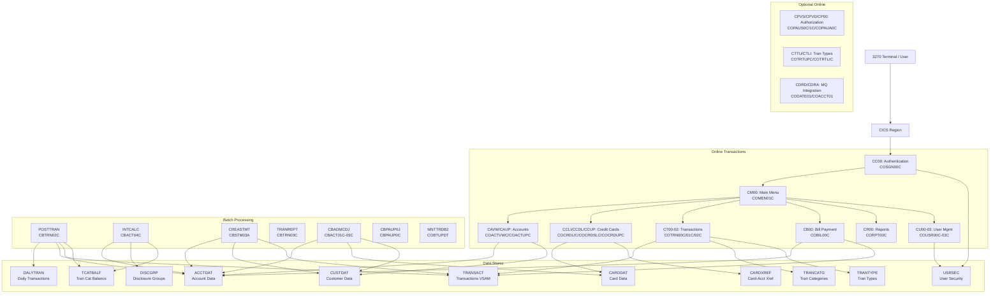
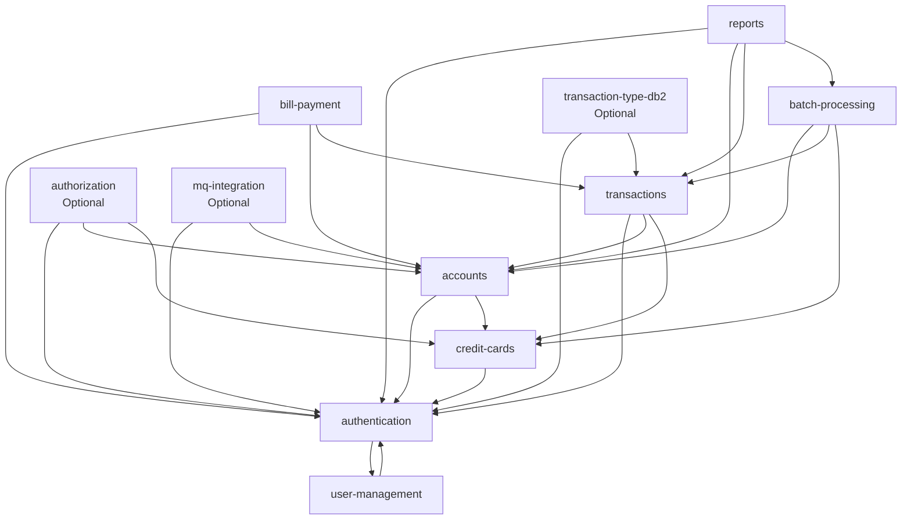

# CardDemo Mainframe Application — System Overview

CardDemo is a COBOL mainframe application simulating a credit card management system, designed to showcase AWS mainframe migration and modernization scenarios. It demonstrates industry-standard mainframe patterns including CICS online transaction processing, VSAM file I/O, JCL batch processing, RACF security, and BMS 3270 terminal screen management.

---

## Platform Statistics

| Metric | Value |
|--------|-------|
| Lines of COBOL | ~15,000+ across 40+ programs |
| CICS Transactions | 24 online transactions |
| Batch Jobs | 11 batch job definitions |
| VSAM Files | 11 datasets |
| Copybooks | 20+ data structure definitions |
| BMS Maps | 20+ screen map definitions |
| Technologies | COBOL, CICS, VSAM KSDS/AIX, JCL, RACF, Assembler (MVSWAIT, COBDATFT) |
| Optional Technologies | DB2, IMS DB, MQ |

---

## Architecture Overview

CardDemo follows a classic three-tier mainframe architecture:

1. **Presentation Layer** — CICS BMS maps (3270 terminal screens) define the character-cell UI presented to end users via TN3270 emulators or physical terminals. Each module has one or more BMS mapsets (`.BMS` source) assembled into load modules and installed in the CICS CSD.

2. **Business Logic Layer** — COBOL application programs implement both online (CICS) and batch (JCL) processing. Online programs use EXEC CICS commands to read/write VSAM files and manage screen I/O. Batch programs use standard COBOL file I/O and are executed via JCL job steps.

3. **Data Layer** — VSAM KSDS (Key-Sequenced Data Sets) store all persistent application data. Several files have Alternate Indexes (AIX) to support secondary key access patterns. Batch programs also use ESDS (Entry-Sequenced Data Sets) for sequential transaction feeds.

---

## Technology Stack

| Technology | Role |
|-----------|------|
| COBOL (Enterprise COBOL) | Primary application programming language for all online and batch programs |
| CICS (Customer Information Control System) | Online transaction processing middleware; manages terminal I/O, storage, file access |
| VSAM KSDS | Primary persistent data store for all application entities |
| VSAM AIX | Alternate Index paths for secondary key access on card, xref, and transaction files |
| VSAM ESDS | Sequential daily transaction input feed (DALYTRAN) |
| JCL (Job Control Language) | Batch job definitions; controls job steps, DD allocations, PROC invocations |
| BMS (Basic Mapping Support) | 3270 terminal screen map definitions compiled into CICS load modules |
| RACF | Mainframe security: user authentication, transaction authorization, dataset protection |
| Assembler | Utility programs: MVSWAIT (timed wait), COBDATFT (date formatting) |
| DB2 | Optional: relational storage for transaction type table (MNTTRDB2 module) |
| IMS DB | Optional: hierarchical database for pending authorization records |
| MQ (IBM MQ) | Optional: message queue integration for date inquiry and account detail services |
| GDG (Generation Data Groups) | Versioned batch input/output files for statement and report generation |

---

## MODULE_LIST_START
authentication
accounts
credit-cards
transactions
bill-payment
reports
user-management
batch-processing
authorization
transaction-type-db2
mq-integration
## MODULE_LIST_END

---

## Modules

### Module 1: authentication

**Overview:** The authentication module is the entry point for all CardDemo users. Program COSGN00C presents the signon screen (COSGN00), validates user ID and password against the USRSEC VSAM file, and populates the COCOM01Y COMMAREA with user identity and type. Based on user type (Admin `A` or Regular User `U`), COMEN01C routes to the appropriate main menu. The COMMAREA is passed between all subsequent CICS transactions as the session context carrier.

**Components:**

| Program | Description |
|---------|-------------|
| COSGN00C | Signon screen handler; validates credentials against USRSEC |
| COMEN01C | Main menu; displays admin or user menu based on CDEMO-USER-TYPE |

**CICS Transactions:**

| Transaction | Program | BMS Map | Function |
|-------------|---------|---------|----------|
| CC00 | COSGN00C | COSGN00 | User Signon |
| CM00 | COMEN01C | COMEN01 | Main Menu (Admin/User) |

**Copybooks Used:**

- `COCOM01Y` — CARDDEMO-COMMAREA (session context passed between all transactions)
- `CSUSR01Y` — SEC-USER-DATA (user security record read from USRSEC)

**Dependencies:**

- `user-management` — reads user records from USRSEC VSAM file

**User Story Examples:**

> As a **Regular User**, I want to sign on with my user ID and password so that I can access the credit card management system securely.

> As an **Admin User**, I want to be directed to the admin main menu after signon so that I can access user management and administrative functions unavailable to regular users.

> As a **System**, I want to populate the COMMAREA with user identity and type at signon so that all downstream transactions can enforce role-based access without re-authenticating.

---

### Module 2: accounts

**Overview:** The accounts module provides online viewing and updating of credit account records stored in ACCTDAT. COACTVWC presents a read-only account details screen including balance, credit limit, and account dates. COACTUPC allows authorized updates to account fields such as credit limit and active status. Both programs resolve the account via the COMMAREA-carried account ID and read the CVACT01Y-structured record.

**Components:**

| Program | Description |
|---------|-------------|
| COACTVWC | Account view; read-only display of account record from ACCTDAT |
| COACTUPC | Account update; modifies credit limit, status, and other fields in ACCTDAT |

**CICS Transactions:**

| Transaction | Program | BMS Map | Function |
|-------------|---------|---------|----------|
| CAVW | COACTVWC | COACTVW | Account View (read-only) |
| CAUP | COACTUPC | COACTUP | Account Update |

**Copybooks Used:**

- `CVACT01Y` — ACCOUNT-RECORD (primary account data structure)
- `CVACT02Y` — CARD-RECORD (linked card data)
- `CVACT03Y` — CARD-XREF-RECORD (card-to-account cross reference)
- `COCOM01Y` — CARDDEMO-COMMAREA

**Dependencies:**

- `authentication` — user must be signed on; account ID sourced from COMMAREA
- `credit-cards` — card and xref records linked to account

**User Story Examples:**

> As a **Regular User**, I want to view my account details including current balance and credit limit so that I can monitor my credit utilization.

> As an **Admin User**, I want to update a customer's credit limit so that I can respond to credit line change requests.

> As a **Regular User**, I want to view my account open date and expiration date so that I can confirm my account is in good standing.

---

### Module 3: credit-cards

**Overview:** The credit-cards module provides list, view, and update capabilities for credit card records. COCRDLIC displays a paginated list of cards associated with an account from CARDDAT. COCRDSLC shows detailed card information including card number, CVV, embossed name, and active status. COCRDUPC allows authorized changes to card active status and other editable fields. Card-to-account linkage is resolved through the CARDXREF file.

**Components:**

| Program | Description |
|---------|-------------|
| COCRDLIC | Card list; paginated display of cards for the current account |
| COCRDSLC | Card view/select; detailed display of a single card record |
| COCRDUPC | Card update; modify card active status and card details |

**CICS Transactions:**

| Transaction | Program | BMS Map | Function |
|-------------|---------|---------|----------|
| CCLI | COCRDLIC | COCRDLI | Card List |
| CCDL | COCRDSLC | COCRDSL | Card View/Select |
| CCUP | COCRDUPC | COCRDUP | Card Update |

**Copybooks Used:**

- `CVACT02Y` — CARD-RECORD (card number, CVV, embossed name, expiration, status)
- `CVACT03Y` — CARD-XREF-RECORD (card-to-customer-to-account cross reference)
- `CVACT01Y` — ACCOUNT-RECORD (parent account data)
- `COCOM01Y` — CARDDEMO-COMMAREA

**Dependencies:**

- `authentication` — user session required
- `accounts` — account context resolved before card lookup

**User Story Examples:**

> As a **Regular User**, I want to list all credit cards on my account so that I can see which cards are active and which are inactive.

> As a **Regular User**, I want to view the details of a specific card including the embossed name and expiration date so that I can verify card information.

> As an **Admin User**, I want to activate or deactivate a credit card so that I can respond to customer requests to suspend or reinstate a card.

---

### Module 4: transactions

**Overview:** The transactions module supports listing, viewing, and manually adding transaction records in the TRANSACT VSAM file. COTRN00C displays a paginated list of transactions for the current account/card, with filtering by date range. COTRN01C shows full detail for a selected transaction including merchant information. COTRN02C provides an online add-transaction capability for manual entries and adjustments.

**Components:**

| Program | Description |
|---------|-------------|
| COTRN00C | Transaction list; paginated transaction history for account/card |
| COTRN01C | Transaction view; detailed display of a single transaction record |
| COTRN02C | Transaction add; manually create a new transaction record |

**CICS Transactions:**

| Transaction | Program | BMS Map | Function |
|-------------|---------|---------|----------|
| CT00 | COTRN00C | COTRN00 | Transaction List |
| CT01 | COTRN01C | COTRN01 | Transaction View/Detail |
| CT02 | COTRN02C | COTRN02 | Add Transaction |

**Copybooks Used:**

- `CVTRA05Y` — TRAN-RECORD (full transaction data structure)
- `CVTRA03Y` — TRAN-TYPE-RECORD (transaction type code and description)
- `CVTRA04Y` — TRAN-CAT-RECORD (transaction category code and description)
- `COCOM01Y` — CARDDEMO-COMMAREA

**Dependencies:**

- `authentication` — user session required
- `accounts` — account context required for transaction scoping
- `credit-cards` — card number validation against CARDDAT/CARDXREF

**User Story Examples:**

> As a **Regular User**, I want to list my recent transactions so that I can review my spending history.

> As a **Regular User**, I want to view the full detail of a transaction including merchant name and city so that I can identify unfamiliar charges.

> As an **Admin User**, I want to manually add a transaction record so that I can post adjustments and corrections to an account.

---

### Module 5: bill-payment

**Overview:** The bill-payment module provides an online payment submission screen. COBIL00C allows a user to enter a payment amount against their account, which writes a credit transaction to TRANSACT and updates the current balance in ACCTDAT. The module enforces that the payment does not exceed the current outstanding balance and records the payment with appropriate transaction type code.

**Components:**

| Program | Description |
|---------|-------------|
| COBIL00C | Bill payment screen; accepts payment amount and posts payment transaction |

**CICS Transactions:**

| Transaction | Program | BMS Map | Function |
|-------------|---------|---------|----------|
| CB00 | COBIL00C | COBIL00 | Bill Payment |

**Copybooks Used:**

- `CVACT01Y` — ACCOUNT-RECORD (balance and limit fields)
- `CVTRA05Y` — TRAN-RECORD (payment transaction written to TRANSACT)
- `COCOM01Y` — CARDDEMO-COMMAREA

**Dependencies:**

- `authentication` — user session required
- `accounts` — account balance and status read before payment
- `transactions` — payment posted as a credit transaction record

**User Story Examples:**

> As a **Regular User**, I want to make a payment on my credit card account so that I can reduce my outstanding balance.

> As a **Regular User**, I want to see my current balance and the amount due before confirming my payment so that I can choose an appropriate payment amount.

---

### Module 6: reports

**Overview:** The reports module provides both an online report trigger screen and batch report generation programs. CORPT00C allows online users to initiate report generation for their account. CBSTM03A is the primary batch statement generation program; CBSTM03B is a helper utility called by CBSTM03A. CBTRN03C generates the transaction detail report. Both batch programs read ACCTDAT, CUSTDAT, and TRANSACT to produce formatted output.

**Components:**

| Program | Description |
|---------|-------------|
| CORPT00C | Online report request screen; triggers batch report or displays report status |
| CBSTM03A | Batch statement generation; produces monthly account statements |
| CBSTM03B | Batch statement helper; sub-program called by CBSTM03A for formatting |
| CBTRN03C | Batch transaction report; generates transaction detail reports |

**CICS Transactions:**

| Transaction | Program | BMS Map | Function |
|-------------|---------|---------|----------|
| CR00 | CORPT00C | CORPT00 | Online Report Request |

**Batch Jobs:**

| Job Name | Program | Description |
|----------|---------|-------------|
| CREASTMT | CBSTM03A | Monthly account statement generation |
| TRANREPT | CBTRN03C | Transaction detail report generation |

**Copybooks Used:**

- `CVTRA05Y` — TRAN-RECORD (transaction data for report)
- `CVACT01Y` — ACCOUNT-RECORD (account data for statement header)
- `CVCUS01Y` — CUSTOMER-RECORD (customer name and address for statement)

**Dependencies:**

- `authentication` — user session required for online trigger
- `accounts` — account data read for statement header
- `transactions` — transaction history included in statement and report
- `batch-processing` — CREASTMT and TRANREPT run within batch processing framework

**User Story Examples:**

> As a **Regular User**, I want to request generation of my account statement so that I can review all charges and payments for the billing period.

> As a **Batch Operator**, I want to run the TRANREPT job to generate a transaction detail report so that operations staff can review posted transaction activity.

> As a **Regular User**, I want to view the status of a requested report online so that I can know when it is ready for review.

---

### Module 7: user-management

**Overview:** The user-management module provides CRUD operations on user security records in the USRSEC VSAM file. Access is restricted to Admin users. COADM01C is the administrative menu entry point. COUSR00C lists all users, COUSR01C adds a new user, COUSR02C updates an existing user's details or password, and COUSR03C deletes a user. Each program enforces that only Admin-type users (CDEMO-USER-TYPE = 'A') can access these functions.

**Components:**

| Program | Description |
|---------|-------------|
| COADM01C | Admin menu; entry point to administrative functions |
| COUSR00C | User list; paginated display of all user records from USRSEC |
| COUSR01C | User add; create a new user security record |
| COUSR02C | User update; modify user name, password, or type |
| COUSR03C | User delete; remove a user security record from USRSEC |

**CICS Transactions:**

| Transaction | Program | BMS Map | Function |
|-------------|---------|---------|----------|
| CA00 | COADM01C | COADM01 | Admin Main Menu |
| CU00 | COUSR00C | COUSR00 | User List |
| CU01 | COUSR01C | COUSR01 | Add User |
| CU02 | COUSR02C | COUSR02 | Update User |
| CU03 | COUSR03C | COUSR03 | Delete User |

**Copybooks Used:**

- `CSUSR01Y` — SEC-USER-DATA (user ID, name, password, type)
- `COCOM01Y` — CARDDEMO-COMMAREA

**Dependencies:**

- `authentication` — Admin user type enforced via COMMAREA CDEMO-USER-TYPE

**User Story Examples:**

> As an **Admin User**, I want to list all system users so that I can review who has access to the CardDemo application.

> As an **Admin User**, I want to add a new user with a specified user type so that new employees can be onboarded to the system.

> As an **Admin User**, I want to update a user's password so that I can assist with password resets and credential management.

> As an **Admin User**, I want to delete a user record so that I can revoke access for employees who have left the organization.

---

### Module 8: batch-processing

**Overview:** The batch-processing module contains all batch COBOL programs executed via JCL. It handles daily transaction posting (POSTTRAN), interest calculation (INTCALC), account lifecycle management (open/close/update via CBADMCDJ), and file transfer utilities (CBEXPORT/CBIMPORT). COBSWAIT is an Assembler utility used as a synchronization wait step between job phases. Batch programs operate on VSAM files directly via JCL DD allocations without CICS.

**Components:**

| Program | Description |
|---------|-------------|
| CBTRN01C | Daily transaction validation; validates DALYTRAN records before posting |
| CBTRN02C | Transaction posting (POSTTRAN); posts validated transactions to TRANSACT, updates balances |
| CBACT01C | Account close; marks accounts as closed in ACCTDAT |
| CBACT02C | Account open; creates new account records in ACCTDAT |
| CBACT03C | Account update; updates account parameters in batch |
| CBACT04C | Interest calculation (INTCALC); calculates and posts interest charges |
| COBSWAIT | Assembler wait utility; timed synchronization step between batch phases |

**Batch Jobs:**

| Job Name | Program(s) | Description |
|----------|-----------|-------------|
| POSTTRAN | CBTRN02C | Daily transaction posting from DALYTRAN to TRANSACT |
| INTCALC | CBACT04C | Monthly interest calculation and posting |
| CBADMCDJ | CBACT01C, CBACT02C, CBACT03C | Account administration (close/open/update) |
| COMBTRAN | SORT | Merge and sort daily transaction input file |
| WAITSTEP | COBSWAIT | Synchronization wait between job steps |
| CBEXPORT | — | Export online transactions to daily batch feed |
| CBIMPORT | — | Import external transaction data into DALYTRAN |

**Copybooks Used:**

- `CVACT01Y` — ACCOUNT-RECORD (account balances and limits updated by posting and interest)
- `CVTRA05Y` — TRAN-RECORD (transaction records posted to TRANSACT)
- `CVTRA01Y` — TRAN-CAT-BAL-RECORD (category balances maintained per account)
- `CVTRA02Y` — DIS-GROUP-RECORD (interest rate lookup for INTCALC)

**Dependencies:**

- `accounts` — ACCTDAT read and updated by posting and interest jobs
- `transactions` — TRANSACT written by POSTTRAN; read by INTCALC and CREASTMT
- `credit-cards` — CARDDAT and CARDXREF validated during transaction posting

**User Story Examples:**

> As a **Batch Operator**, I want to run the POSTTRAN job to post daily transactions so that account balances are updated with all activity from the business day.

> As a **Batch Operator**, I want to run the INTCALC job to calculate and post monthly interest charges so that account balances reflect accrued interest.

> As a **Batch Operator**, I want to run the CBADMCDJ job to open and close accounts in batch so that account lifecycle changes are applied without online operator intervention.

> As a **System**, I want the WAITSTEP to synchronize job phases so that downstream steps do not execute before upstream files are fully written and closed.

---

### Module 9: authorization (Optional)

**Overview:** The authorization module is an optional extension that implements a pending authorization workflow using IMS DB, DB2, and MQ. COPAUS0C displays a summary of pending authorizations. COPAUS1C shows detail for a selected pending authorization. COPAUA0C processes an authorization decision (approve or decline). CBPAUP0C is a batch program that purges expired authorization records from IMS DB on a scheduled basis.

**Components:**

| Program | Description |
|---------|-------------|
| COPAUS0C | Pending authorization summary; lists pending auths from IMS DB |
| COPAUS1C | Pending authorization detail; full detail of a selected auth record |
| COPAUA0C | Process authorization; approve or decline a pending authorization |
| CBPAUP0C | Batch purge; removes expired authorization records from IMS DB |

**CICS Transactions:**

| Transaction | Program | BMS Map | Function |
|-------------|---------|---------|----------|
| CPVS | COPAUS0C | COPAU00 | Pending Authorization Summary |
| CPVD | COPAUS1C | COPAU01 | Pending Authorization Detail |
| CP00 | COPAUA0C | — | Process Authorization Decision |

**Batch Jobs:**

| Job Name | Program | Description |
|----------|---------|-------------|
| CBPAUP0J | CBPAUP0C | Purge expired authorization records from IMS DB |

**Technology Requirements:** IMS DB (authorization record storage), DB2 (supplemental relational data), MQ (authorization request/response messaging)

**Dependencies:**

- `authentication` — user session required for online authorization screens
- `accounts` — account status validated before authorization processing
- `credit-cards` — card number validated against CARDDAT during authorization

**User Story Examples:**

> As an **Admin User**, I want to view a summary of all pending authorizations so that I can monitor authorization queue depth and identify aged items.

> As an **Admin User**, I want to approve or decline a pending authorization so that the authorization decision is communicated back to the requesting system via MQ.

> As a **Batch Operator**, I want to run the CBPAUP0J job to purge expired authorizations so that the IMS DB authorization store does not grow unbounded with stale records.

---

### Module 10: transaction-type-db2 (Optional)

**Overview:** The transaction-type-db2 module is an optional extension that manages the transaction type and category reference tables using DB2 as the data store instead of VSAM. COTRTLIC lists all transaction types from the DB2 table. COTRTUPC provides add and edit capabilities for transaction type records. COBTUPDT is a batch program that maintains the DB2 transaction type table from a flat file feed.

**Components:**

| Program | Description |
|---------|-------------|
| COTRTUPC | Transaction type add/edit; maintains individual transaction type records in DB2 |
| COTRTLIC | Transaction type list; displays all transaction types from DB2 table |
| COBTUPDT | Batch update; loads/updates DB2 transaction type table from flat file |

**CICS Transactions:**

| Transaction | Program | BMS Map | Function |
|-------------|---------|---------|----------|
| CTTU | COTRTUPC | COTRTUP | Transaction Type Add/Edit |
| CTLI | COTRTLIC | COTRTLI | Transaction Type List |

**Batch Jobs:**

| Job Name | Program | Description |
|----------|---------|-------------|
| MNTTRDB2 | COBTUPDT | Batch maintenance of DB2 transaction type table |

**Technology Requirements:** DB2 (transaction type table storage and SQL access)

**Copybooks Used:**

- `CVTRA03Y` — TRAN-TYPE-RECORD (transaction type code and description)
- `CVTRA04Y` — TRAN-CAT-RECORD (transaction category code and description)

**Dependencies:**

- `authentication` — user session required; Admin user type enforced
- `transactions` — transaction type codes must be valid entries in this reference table

**User Story Examples:**

> As an **Admin User**, I want to add a new transaction type code and description to the DB2 reference table so that new transaction categories can be posted against accounts.

> As an **Admin User**, I want to update the description of an existing transaction type so that the description accurately reflects current business terminology.

> As an **Admin User**, I want to list all transaction types so that I can verify the reference table is complete and accurate.

---

### Module 11: mq-integration (Optional)

**Overview:** The mq-integration module is an optional extension providing MQ-based service interfaces. CODATE01 exposes a date inquiry service that returns the current mainframe date via an MQ message response, enabling integration with external systems that need a trusted date source. COACCT01 exposes an account detail inquiry service via MQ, returning ACCTDAT record data in response to an MQ request message carrying an account ID.

**Components:**

| Program | Description |
|---------|-------------|
| CODATE01 | MQ date inquiry; receives MQ request and returns current date |
| COACCT01 | MQ account inquiry; receives MQ request with account ID and returns account details |

**CICS Transactions:**

| Transaction | Program | BMS Map | Function |
|-------------|---------|---------|----------|
| CDRD | CODATE01 | — | MQ Date Inquiry |
| CDRA | COACCT01 | — | MQ Account Detail Inquiry |

**Technology Requirements:** MQ (message queue infrastructure for request/response pattern)

**Dependencies:**

- `authentication` — MQ service caller identity validated
- `accounts` — ACCTDAT read by COACCT01 to satisfy account inquiry requests

**User Story Examples:**

> As an **External System**, I want to retrieve the current mainframe date via MQ so that I can synchronize date-dependent processing with the mainframe system of record.

> As an **External System**, I want to retrieve account details via an MQ account inquiry so that downstream systems can access account data without direct VSAM access.

---

## Architecture Diagram



---

## Module Dependency Diagram



---

## Data Models

### ACCOUNT-RECORD (CVACT01Y — 300 bytes)

```cobol
       01 ACCOUNT-RECORD.
          05 ACCT-ID                    PIC 9(11).
          05 ACCT-ACTIVE-STATUS         PIC X(01).
          05 ACCT-CURR-BAL             PIC S9(10)V99.
          05 ACCT-CREDIT-LIMIT         PIC S9(10)V99.
          05 ACCT-CASH-CREDIT-LIMIT    PIC S9(10)V99.
          05 ACCT-OPEN-DATE            PIC X(10).
          05 ACCT-EXPIRAION-DATE       PIC X(10).
          05 ACCT-REISSUE-DATE         PIC X(10).
          05 ACCT-CURR-CYC-CREDIT      PIC S9(10)V99.
          05 ACCT-CURR-CYC-DEBIT       PIC S9(10)V99.
          05 ACCT-ADDR-ZIP             PIC X(10).
          05 ACCT-GROUP-ID             PIC X(10).
          05 FILLER                    PIC X(178).
```

### CARD-RECORD (CVACT02Y — 150 bytes)

```cobol
       01 CARD-RECORD.
          05 CARD-NUM                  PIC X(16).
          05 CARD-ACCT-ID              PIC 9(11).
          05 CARD-CVV-CD               PIC 9(03).
          05 CARD-EMBOSSED-NAME        PIC X(50).
          05 CARD-EXPIRAION-DATE       PIC X(10).
          05 CARD-ACTIVE-STATUS        PIC X(01).
          05 FILLER                    PIC X(59).
```

### CUSTOMER-RECORD (CVCUS01Y — 500 bytes)

```cobol
       01 CUSTOMER-RECORD.
          05 CUST-ID                   PIC 9(09).
          05 CUST-FIRST-NAME           PIC X(25).
          05 CUST-MIDDLE-NAME          PIC X(25).
          05 CUST-LAST-NAME            PIC X(25).
          05 CUST-ADDR-LINE-1          PIC X(50).
          05 CUST-ADDR-LINE-2          PIC X(50).
          05 CUST-ADDR-LINE-3          PIC X(50).
          05 CUST-ADDR-STATE-CD        PIC X(02).
          05 CUST-ADDR-COUNTRY-CD      PIC X(03).
          05 CUST-ADDR-ZIP             PIC X(10).
          05 CUST-PHONE-NUM-1          PIC X(15).
          05 CUST-PHONE-NUM-2          PIC X(15).
          05 CUST-SSN                  PIC 9(09).
          05 CUST-GOVT-ISSUED-ID       PIC X(20).
          05 CUST-DOB-YYYY-MM-DD       PIC X(10).
          05 CUST-EFT-ACCOUNT-ID       PIC X(10).
          05 CUST-PRI-CARD-HOLDER-IND  PIC X(01).
          05 CUST-FICO-CREDIT-SCORE    PIC 9(03).
          05 FILLER                    PIC X(168).
```

### TRAN-RECORD (CVTRA05Y — 350 bytes)

```cobol
       01 TRAN-RECORD.
          05 TRAN-ID                   PIC X(16).
          05 TRAN-TYPE-CD              PIC X(02).
          05 TRAN-CAT-CD               PIC 9(04).
          05 TRAN-SOURCE               PIC X(10).
          05 TRAN-DESC                 PIC X(100).
          05 TRAN-AMT                  PIC S9(09)V99.
          05 TRAN-MERCHANT-ID          PIC 9(09).
          05 TRAN-MERCHANT-NAME        PIC X(50).
          05 TRAN-MERCHANT-CITY        PIC X(50).
          05 TRAN-MERCHANT-ZIP         PIC X(10).
          05 TRAN-CARD-NUM             PIC X(16).
          05 TRAN-ORIG-TS              PIC X(26).
          05 TRAN-PROC-TS              PIC X(26).
          05 FILLER                    PIC X(19).
```

### TRAN-TYPE-RECORD (CVTRA03Y — 60 bytes)

```cobol
       01 TRAN-TYPE-RECORD.
          05 TRAN-TYPE                 PIC X(02).
          05 TRAN-TYPE-DESC            PIC X(50).
          05 FILLER                    PIC X(08).
```

### TRAN-CAT-RECORD (CVTRA04Y — 60 bytes)

```cobol
       01 TRAN-CAT-RECORD.
          05 TRAN-TYPE-CD              PIC X(02).
          05 TRAN-CAT-CD               PIC 9(04).
          05 TRAN-CAT-TYPE-DESC        PIC X(50).
          05 FILLER                    PIC X(04).
```

### SEC-USER-DATA (CSUSR01Y — 80 bytes)

```cobol
       01 SEC-USER-DATA.
          05 SEC-USR-ID                PIC X(08).
          05 SEC-USR-FNAME             PIC X(20).
          05 SEC-USR-LNAME             PIC X(20).
          05 SEC-USR-PWD               PIC X(08).
          05 SEC-USR-TYPE              PIC X(01).
             88 SEC-USR-TYPE-ADMIN     VALUE 'A'.
             88 SEC-USR-TYPE-USER      VALUE 'U'.
          05 FILLER                    PIC X(23).
```

### CARD-XREF-RECORD (CVACT03Y — 50 bytes)

```cobol
       01 CARD-XREF-RECORD.
          05 XREF-CARD-NUM             PIC X(16).
          05 XREF-CUST-ID              PIC 9(09).
          05 XREF-ACCT-ID              PIC 9(11).
          05 FILLER                    PIC X(14).
```

### TRAN-CAT-BAL-RECORD (CVTRA01Y — 50 bytes)

```cobol
       01 TRAN-CAT-BAL-RECORD.
          05 TRANCAT-ACCT-ID           PIC 9(11).
          05 TRANCAT-TYPE-CD           PIC X(02).
          05 TRANCAT-CD                PIC 9(04).
          05 TRAN-CAT-BAL              PIC S9(09)V99.
          05 FILLER                    PIC X(22).
```

### DIS-GROUP-RECORD (CVTRA02Y — 50 bytes)

```cobol
       01 DIS-GROUP-RECORD.
          05 DIS-ACCT-GROUP-ID         PIC X(10).
          05 DIS-TRAN-TYPE-CD          PIC X(02).
          05 DIS-TRAN-CAT-CD           PIC 9(04).
          05 DIS-INT-RATE              PIC S9(04)V99.
          05 FILLER                    PIC X(28).
```

### CARDDEMO-COMMAREA (COCOM01Y)

```cobol
       01 CARDDEMO-COMMAREA.
          05 CDEMO-FROM-TRANID         PIC X(04).
          05 CDEMO-FROM-PROGRAM        PIC X(08).
          05 CDEMO-TO-TRANID           PIC X(04).
          05 CDEMO-TO-PROGRAM          PIC X(08).
          05 CDEMO-USER-ID             PIC X(08).
          05 CDEMO-USER-TYPE           PIC X(01).
             88 CDEMO-USER-TYPE-ADMIN  VALUE 'A'.
             88 CDEMO-USER-TYPE-USER   VALUE 'U'.
          05 CDEMO-CUST-ID             PIC 9(09).
          05 CDEMO-CUST-FNAME          PIC X(25).
          05 CDEMO-CUST-MNAME          PIC X(25).
          05 CDEMO-CUST-LNAME          PIC X(25).
          05 CDEMO-ACCT-ID             PIC 9(11).
          05 CDEMO-ACCT-STATUS         PIC X(01).
          05 CDEMO-CARD-NUM            PIC X(16).
          05 CDEMO-LAST-MAP            PIC X(08).
          05 CDEMO-LAST-MAPSET         PIC X(08).
```

---

## VSAM Files

| Dataset | Copybook | Record Length | Organization | Description |
|---------|----------|--------------|--------------|-------------|
| USRSEC | CSUSR01Y | 80 | VSAM KSDS | User Security — RACF user records |
| ACCTDAT / ACCTFILE | CVACT01Y | 300 | VSAM KSDS | Account Data — credit account records |
| CARDDAT / CARDFILE | CVACT02Y | 150 | VSAM KSDS + AIX | Card Data — credit card records |
| CUSTDAT / CUSTFILE | CVCUS01Y | 500 | VSAM KSDS | Customer Data — customer demographics |
| CARDXREF / XREFFILE | CVACT03Y | 50 | VSAM KSDS + AIX | Card-Account-Customer Cross Reference |
| DALYTRAN | CVTRA06Y | 350 | VSAM ESDS | Daily Transaction input file |
| TRANSACT | CVTRA05Y | 350 | VSAM KSDS + AIX | Online Transaction VSAM |
| DISCGRP | CVTRA02Y | 50 | VSAM KSDS | Disclosure Groups — interest rate table |
| TRANCATG | CVTRA04Y | 60 | VSAM KSDS | Transaction Category Types |
| TRANTYPE | CVTRA03Y | 60 | VSAM KSDS | Transaction Types |
| TCATBALF | CVTRA01Y | 50 | VSAM KSDS | Transaction Category Balance per account |

---

## Business Rules

### Authentication

- User credentials (user ID + password) validated against USRSEC VSAM file at signon
- Two user types: Admin (`A`) receives the admin main menu (CA00); Regular User (`U`) receives the standard main menu (CM00)
- Session state is carried in the COCOM01Y COMMAREA, which is passed between all transactions as the inter-program communication area
- RACF provides the underlying mainframe security layer; RACF profiles required for each CICS transaction ID before deployment

### Accounts

- Account has an active status flag (`ACCT-ACTIVE-STATUS`); inactive accounts should not allow new transactions
- Credit limit (`ACCT-CREDIT-LIMIT`) and cash credit limit (`ACCT-CASH-CREDIT-LIMIT`) are tracked separately
- Current cycle credits (`ACCT-CURR-CYC-CREDIT`) and debits (`ACCT-CURR-CYC-DEBIT`) accumulate until statement cycle close
- Account group ID (`ACCT-GROUP-ID`) links the account to a disclosure group for interest rate determination

### Credit Cards

- Card linked to account and customer via CARDXREF (XREF-CARD-NUM → XREF-CUST-ID + XREF-ACCT-ID)
- Card has an independent active status (`CARD-ACTIVE-STATUS`) separate from account status
- CVV is stored in the card record (`CARD-CVV-CD`) — 3-digit numeric
- Card expiration date (`CARD-EXPIRAION-DATE`) is stored as a formatted character string

### Transactions

- Each transaction is classified by type code (`TRAN-TYPE-CD`) and category code (`TRAN-CAT-CD`)
- Transaction is linked to the originating card number (`TRAN-CARD-NUM`)
- Original timestamp (`TRAN-ORIG-TS`) and processing timestamp (`TRAN-PROC-TS`) are recorded independently
- Merchant information (ID, name, city, zip) is captured on each transaction record

### Batch Processing

- POSTTRAN posts daily transactions from DALYTRAN (ESDS input) to TRANSACT (KSDS) and updates account balances in ACCTDAT
- INTCALC calculates interest using disclosure group rates; rate determined by: `ACCT-GROUP-ID` + `TRAN-TYPE-CD` + `TRAN-CAT-CD` from DISCGRP
- CREASTMT generates monthly statements from ACCTDAT + CUSTDAT + TRANSACT
- GDG (Generation Data Groups) are used for batch input/output file versioning to support restartability and audit trails
- COMBTRAN uses SORT utility to merge and sort transaction files before the posting step
- Transaction category balances (TCATBALF) are maintained per account/type/category for accurate interest calculation

### Authorization (Optional)

- Pending authorizations are stored in IMS DB hierarchical database
- Each authorization record has an expiration timestamp
- CBPAUP0J purges expired authorization records periodically to maintain IMS DB performance
- MQ is used to communicate authorization request and response messages between CICS and external authorization systems

### Interest Calculation

- Interest rate is determined by the combination of: account group ID + transaction type code + transaction category code
- Disclosure groups (DISCGRP) define the interest rate (`DIS-INT-RATE`) for each combination
- Category balances (TCATBALF) accumulate the running balance for each account/type/category combination
- Interest charges are posted back as transaction records against the account

---

## Batch Processing Workflow

### Daily Batch Flow

1. **CBEXPORT** — Export online transactions entered during the business day to the daily batch input file (DALYTRAN)
2. **COMBTRAN** — Sort and merge the daily transaction file (DALYTRAN) using SORT utility; produces a sorted, deduplicated transaction feed
3. **POSTTRAN (CBTRN02C)** — Validate and post transactions:
   - Read DALYTRAN records sequentially
   - Validate card number against CARDDAT and CARDXREF
   - Validate account status in ACCTDAT (active accounts only)
   - Write posted transactions to TRANSACT KSDS
   - Update ACCTDAT current balance, cycle credits, and cycle debits
   - Update TCATBALF transaction category balances per account
4. **WAITSTEP (COBSWAIT)** — Assembler-based timed wait step; synchronization point between job phases to allow file closures and catalog updates to complete

### Monthly Batch Flow

1. **INTCALC (CBACT04C)** — Calculate interest:
   - Read ACCTDAT accounts sequentially
   - For each account, read TCATBALF category balances
   - Look up applicable interest rate in DISCGRP using account group ID + type/category
   - Calculate interest charge and post back to account balance
2. **CREASTMT (CBSTM03A / CBSTM03B)** — Generate account statements:
   - Read ACCTDAT account data for statement header
   - Read CUSTDAT customer demographics for name and address
   - Read TRANSACT transactions for the statement period
   - Call CBSTM03B for formatted output generation
   - Produce printed/output statement file
3. **TRANREPT (CBTRN03C)** — Generate transaction detail report:
   - Read TRANSACT for the report period
   - Produce formatted transaction listing report output

### Account Administration Batch (CBADMCDJ)

- **CBACT01C** — Close accounts: reads a close-request input file, marks accounts inactive in ACCTDAT, updates card statuses in CARDDAT
- **CBACT02C** — Open new accounts: reads an account-open request file, writes new ACCTDAT records, creates initial CARDXREF entries
- **CBACT03C** — Update account parameters: reads an account-update request file, applies parameter changes (credit limits, group IDs) to ACCTDAT

---

## User Story Development Patterns

### Story Template

```
Title: [Action] [Feature/Object] [Context]

As a [role: Admin User | Regular User | Batch Operator | System],
I want to [specific action or capability],
So that [business benefit or outcome].

Acceptance Criteria:
  Given [initial context/state]
  When [action performed]
  Then [expected outcome]
  And [additional outcome]

Technical Notes:
  - CICS Transaction: [transaction ID]
  - Program: [COBOL program name]
  - BMS Map: [map name]
  - VSAM Files: [files accessed]
  - Copybooks: [copybooks used]

Story Points: [1-2 | 3-5 | 5-8]
```

### Story Complexity Guidelines

**Simple (1–2 points):**
- Read-only screen displaying VSAM data
- Simple field validation with error messages
- Navigation between existing screens
- Examples: View account details (CAVW), List credit cards (CCLI)

**Medium (3–5 points):**
- Update or create records in VSAM
- Multiple VSAM file reads with one write/update
- Screen with complex field validation and business rule application
- Examples: Update account credit limit (CAUP), Add transaction (CT02)

**Complex (5–8 points):**
- Multi-file updates with rollback logic
- Complex batch program with multiple file operations
- New CICS transaction with multiple screen flows
- Examples: Transaction posting batch (POSTTRAN), Interest calculation (INTCALC), Statement generation (CREASTMT)

### Acceptance Criteria Patterns

- **Screen navigation:** "Given user is on [screen], when [key pressed], then [screen] is displayed"
- **VSAM read:** "Given [record] exists in [file], when [transaction executed], then [data displayed]"
- **VSAM update:** "Given valid input data, when user confirms update, then [record] updated in [VSAM file] and confirmation message displayed"
- **Error handling:** "Given [invalid condition], when [action], then error message [MSGID] displayed in DFHATTR DFHBMASB"
- **Security:** "Given user type is [U|A], when [menu accessed], then [allowed|denied] with [message]"

### Performance Budgets

| Operation | Budget |
|-----------|--------|
| Online CICS transaction response time | < 2 seconds |
| Batch daily posting (POSTTRAN) | < 4 hours |
| Monthly statement generation (CREASTMT) | < 8 hours |
| Interest calculation (INTCALC) | < 2 hours |

---

## Readiness Considerations

### Migration Readiness

- All VSAM files must be cataloged and allocated with appropriate LRECL, BLKSIZE, and key position before deployment
- RACF security profiles required for each CICS transaction ID; profiles must map to appropriate user groups
- BMS maps must be assembled and installed in the CICS CSD (CEDA INSTALL GROUP) before transactions can execute
- JCL procedures (PROCs) must be available in the system PROCLIB concatenation
- Optional modules (authorization, transaction-type-db2, mq-integration) require additional infrastructure: IMS DB subsystem, DB2 subsystem, MQ queue manager, and corresponding connection definitions in CICS

### Modernization Notes

- COMMAREA size limits (< 32KB for standard CICS) must be respected when extending COCOM01Y
- CICS storage management via GETMAIN/FREEMAIN is used in Assembler utility programs (MVSWAIT, COBDATFT)
- Date handling uses COBOL intrinsic functions (`FUNCTION CURRENT-DATE`) rather than calls to system routines
- GDG management requires proper ICF catalog setup and generation limit configuration
- AIX (Alternate Index) maintenance needed for CARDDAT, CARDXREF, and TRANSACT; AIX upgrade must be run after batch updates to those base clusters
- CBTRN01C transaction validation should be reviewed for completeness before enabling POSTTRAN in production
- All COBOL programs use fixed-format source (columns 7–72); compiler options `TRUNC(BIN)` or `TRUNC(OPT)` should be confirmed for numeric field handling during migration

---
