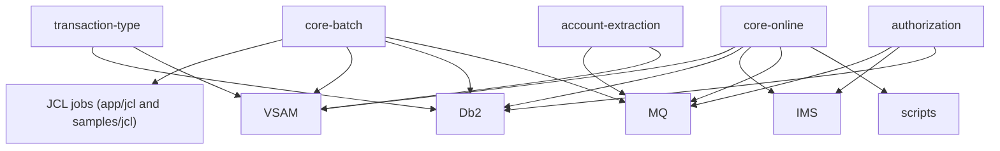

# System CardDemo - Overview for User Stories

**Version:** 1.0.0 (March 12, 2026)
**Purpose:** Single source of truth for creating industrial-strength user stories that span the base CardDemo mainframe stack plus each optional modernization module.

---

## 📊 Platform Statistics
- **Technology Stack:** IBM Enterprise COBOL (CICS programs), BMS map sets, VSAM (KSDS/ESDS/RRDS), JCL batch jobs, Db2 12 SQL, IMS DB HIDAM, IBM MQ 9, shell scripts and FTP clients running on z/OS UNIX (see `scripts/`).
- **Architecture Pattern:** 3270/BMS front-end → CICS programs → VSAM/Db2/IMS, with orchestration of nightly data refresh batches via JCL and optional MQ-driven services for integrations.
- **Key Capabilities:** Customer/account/card lifecycle management, transaction viewing/monitoring, statement/interest processing, admin user controls, and optional modules for pending authorizations, Db2-backed transaction type management, and MQ-based account extractions.
- **Supported Languages:** COBOL copybooks (`app/cpy`), BMS (`app/bms`), JCL (`app/jcl` and `samples/jcl`), Db2 DDL (`app/app-transaction-type-db2/ddl`), IMS DBD/PSB definitions, MQ definitions, and bash scripts for automation.

---

## 🏗️ High-Level Architecture

### Technology Stack
**Backend:** IBM Enterprise COBOL 5.x inside CICS TS 5.4 (programs live under `app/cbl`).  
**Frontend:** BMS map sets driving CICS transactions (`app/bms`).  
**Database:** VSAM KSDS files for customer/account/card/transaction masters, Db2 for reference data/fraud, IMS HIDAM for pending authorizations.  
**Batch:** JCL jobs `ACCTFILE`, `POSTTRAN`, `TRANIDX`, etc., plus sample JCL under `samples/jcl`.  
**Integration:** IBM MQ for asynchronous authorization and account extract flows, shell scripts under `scripts/` for submission automation, and FTP/tn3270 connectors.

### Architectural Patterns
- **BMS → CICS → Data:** Each online function maps CICS transaction ID → BMS screen → COBOL program → copybooks (`CV...`) → VSAM or shared dataset.
- **Batch Orchestration:** JCL job suite refreshes VSAM/Db2 data (`ACCTFILE`, `CARDFILE`, `TRANBKP`, `TRANIDX`), sequenced in `scripts/run_full_batch.sh` to mimic nightly refresh.
- **Async Messaging:** MQ is used for Cloud-style authorization requests (`app/app-authorization-ims-db2-mq`) and account extractions (`app/app-vsam-mq`), with defined queue names and message formats.
- **Reference Data Management:** Db2 transactional metadata is maintained by the `transaction-type` module and exported back to VSAM via `TRANEXTR`.
- **Automation Tooling:** Shell helpers (`scripts/local_compile.sh`, `remote_compile.sh`, `run_posting.sh`, etc.) wrap COBOL compiles and FTP-based JES submissions, keeping the repo executable.

---

## 📚 Module Catalog

<!-- MODULE_LIST_START -->
**Modules:** core-online, core-batch, authorization, transaction-type, account-extraction
<!-- MODULE_LIST_END -->

### 1. Core Online Experience
**ID:** `core-online`  
**Purpose:** Hosts the base CardDemo interactive experience for regular and admin users: signon, menus, account/card management, transactions, bill payments, statements, and reporting.  
**Key Components:** BMS map sets (`COCRDLI`, `COACTVW`, `COBIL00`, etc.), COBOL programs (`COSGN00C`, `COMEN01C`, `COACTVWC`, `COCRDUP`, `CBTRN02C`), copybooks (`CVACT01Y`, `CVACT02Y`, `CVTRA05Y`, `CVCUS01Y`, `CVACT03Y`), and VSAM files (`USERSEC`, `ACCTDATA`, `CARDDATA`, `CUSTDATA`, `DALYTRAN`).  
**Public APIs:**
- `CC00 / COSGN00C`: Handle signon and session initiation (PF keys drive authentication).  
- `CM00 / COMEN01C`: Main menu dispatcher for all user journeys.  
- `CAVW / COACTVWC`: Account view with non-modal scrolling and PF7/PF8 paging.  
- `CAUP / COACTUPC`: Account update screens using inline validation rules plus VSAM writes.  
- `CT00-CT02 / COTRN0xC`: Transaction list/view/add, backing `DALYTRAN` VSAM.  
- `CB00 / COBIL00C`: Bill payment, leveraging `CVACT01Y` and `CVACT02Y`.  
- `COCRDUP`, `CBTRN02C`, `CBTRN03C`: Underpin card update / posting flows for daily statement generation.  
**User Story Examples:**
- As a **regular user**, I want to see my current account balance via `CAVW` so I can decide if I can pay a bill.  
- As a **regular user**, I want to create a transaction through `CT02` so that the posting job reflects the new charge in the nightly batch.  
- As a **customer service agent**, I want to drill into `CBSTM03A` (statement generator) so I can explain charges during calls.

### 2. Core Batch Orchestration
**ID:** `core-batch`  
**Purpose:** Keeps VSAM masters, statements, interest, and reporting tables aligned via scheduled JCL jobs and automation scripts.  
**Key Components:** JCL job library (`app/jcl/*.jcl`), batch COBOL programs (`CBTRN02C`, `CBTRN03C`, `CBSTM03A`, `CBPAUP0C`), shell automation (`scripts/run_full_batch.sh`, `run_interest_calc.sh`, `run_posting.sh`), and sample job templates (`samples/jcl`).  
**Public APIs:**
- `ACCTFILE`, `CARDFILE`, `CUSTFILE`, `TRANBKP`: Refresh VSAM datasets with sample data.  
- `TRANEXTR`, `TRANIDX`, `CREASTMT`: Extract Db2/IMS data and build indexes for fast lookup.  
- `POSTTRAN`, `INTCALC`, `COMBTRAN`: Perform core posting, interest calc, and transaction merging each day.  
- `CLOSEFIL` / `OPENFIL`: Guard file accessibility for CICS interrupts.  
- `run_full_batch.sh`: Automated script that FTPs JES jobs in order and adds guard sleeps to wait for completion.  
**User Story Examples:**
- As a **batch operator**, I want `run_full_batch.sh` to submit the refresh suite in the right order so downstream jobs always read fresh data.  
- As a **release coordinator**, I want `TRANIDX` to rebuild alternate indexes before the trading day so search latencies stay under 500ms (P95).  
- As a **data engineer**, I want sample JCL in `samples/jcl` to compile and test with `remote_compile.sh` so I can validate new batch jobs.

### 3. Authorization Extension
**ID:** `authorization`  
**Purpose:** Implements pending authorization pipelines for MQ, IMS, and Db2, including fraud tagging and IMS-based history browsing.  
**Key Components:** Authorization COBOL (`COPAUA0C`, `COPAUS0C`, `COPAUS1C`, `COPAUS2C`, `CBPAUP0C`), IMS DBD/PSB (`DBPAUTP0`, `PSBPAUTB`), DB2 table `AUTHFRDS`, MQ queues (`AWS.M2.CARDDEMO.PAUTH.REQUEST/REPLY`), copybooks (`CIPAUSMY`, `CCPAURQY`, `CCPAURLY`).  
**Public APIs:**
- `MQ Request` → `COPAUA0C (CP00)`: MQ trigger reads `AWS.M2.CARDDEMO.PAUTH.REQUEST`, validates business rules, touches VSAM/IMS, responds on reply queue.  
- `CPVS/COPAUS0C` & `CPVD/COPAUS1C`: CICS screens for authorization summaries/details.  
- `CBPAUP0J`: Nightly purge of expired authorizations.  
**User Story Examples:**
- As a **fraud analyst**, I want to mark an authorization as fraudulent (`PF5` on CPVD) so the record writes to Db2 `AUTHFRDS` for analytics.  
- As a **cloud integrator**, I want MQ responses formatted as `CARD-NUM,TRANSACTION-ID,AUTH-ID-CODE,...` so downstream services can reconcile approvals.  
- As an **operator**, I want `CBPAUP0J` to clean IMS segments older than 30 days so storage costs stay predictable.

### 4. Transaction Type Management
**ID:** `transaction-type`  
**Purpose:** Provides Db2-backed CRUD for transaction type reference data with exports back to VSAM.  
**Key Components:** CICS transactions `CTTU/CTTUPC`, `CTLI/COTRTLIC`, Db2 tables `TRANSACTION_TYPE`, `TRANSACTION_TYPE_CATEGORY`, batch jobs `TRANEXTR`, `MNTTRDB2`, and Db2 SQL/CTL/DDLs under `app/app-transaction-type-db2`.  
**Public APIs:**
- `CTTU` (add/edit transaction type) and `CTLI` (list/update/delete) using embedded SQL and SQLCA error handling.  
- `TRANEXTR` job extracts Db2 data into VSAM-compatible files for `COACTVWC`.  
- `MNTTRDB2`: Batch maintenance via COBTUPDT updates.  
**User Story Examples:**
- As an **admin**, I want to insert a new transaction category via `CTTU` so the nightly `TRANEXTR` feed has the latest metadata.  
- As a **data steward**, I want `CTLI` to let me delete categories only when there are no dependent transaction types (DELETE RESTRICT).  
- As a **migration specialist**, I want the `TRANEXTR` job to output VSAM-friendly records so the legacy transaction processing pipeline can stay untouched.

### 5. Account Extraction via MQ
**ID:** `account-extraction`  
**Purpose:** Demonstrates MQ-based data extraction patterns: system date lookup and targeted account details shipped to MQ consumers.  
**Key Components:** COBOL programs `CODATE01`, `COACCT01`, MQ connection definitions, message copybooks (`app/app-vsam-mq/cbl`), and CICS transaction definitions `CDRD`/`CDRA`.  
**Public APIs:**
- `CDRD/MQ request`: Sends a `DATE` payload and expects a `DATE` response.  
- `CDRA/MQ request`: Sends `ACCOUNT-NUMBER` to the request queue and reads a 300-byte account block on the response queue.  
**User Story Examples:**
- As an **integration partner**, I want to request `CDRA` with an account number so I receive VSAM-backed account metadata asynchronously.  
- As a **platform architect**, I want `CDRD` to demonstrate MQ correlation IDs so we can re-use the pattern for other services.

---

## 🔄 Architecture Diagram

```mermaid
graph LR
    UserTerminal[(3270 Terminal / Emulator)] -->|BMS transaction| CICS[CICS Region (CardDemo)]
    CICS -->|Reads/writes| VSAM[(VSAM datasets: USERSEC, ACCTDATA, CARDDATA, DALYTRAN)]
    CICS -->|Embedded SQL| Db2[(Db2: TRANSACTION_TYPE, AUTHFRDS)]
    CICS -->|IMS API| IMS[(IMS HIDAM for pending authorizations)]
    CICS -->|MQ messages| MQ[(MQ QUEUES: PAUTH.REQUEST/REPLY, CARDDEMO.REQUEST/RESPONSE)]
    MQ -->|Triggers| Authorization[Authorization Extension]
    MQ -->|Serves| AccountExtraction[Account Extraction Extension]
    BatchJobs["JCL Batch Suite\n(app/jcl/*.jcl, samples/jcl)"] --> VSAM
    BatchJobs --> CICS
    BatchJobs --> Db2
    BatchJobs --> MQ
    Scripts["scripts/run_full_batch.sh + helpers"] --> BatchJobs
    Explorer["Operators & Admins"] --> BatchJobs
```
```

## 📌 Dependency Diagram


```

## 📊 Data Models

### Export Layout (`app/cpy/CVEXPORT.cpy`)
```cobol
01 EXPORT-RECORD.
   05 EXPORT-REC-TYPE          PIC X(1).
   05 EXPORT-TIMESTAMP         PIC X(26).
   05 EXPORT-SEQUENCE-NUM      PIC 9(9) COMP.
   05 EXPORT-BRANCH-ID         PIC X(4).
   05 EXPORT-RECORD-DATA       PIC X(460).
    05 EXPORT-ACCOUNT-DATA REDEFINES EXPORT-RECORD-DATA.
        10 EXP-ACCT-ID          PIC 9(11).
        10 EXP-ACCT-CURR-BAL    PIC S9(10)V99 COMP-3.
        10 EXP-ACCT-CREDIT-LIMIT PIC S9(10)V99.
    05 EXPORT-TRANSACTION-DATA REDEFINES EXPORT-RECORD-DATA.
        10 EXP-TRAN-ID          PIC X(16).
        10 EXP-TRAN-TYPE-CD     PIC X(02).
        10 EXP-TRAN-AMT         PIC S9(09)V99 COMP-3.
    05 EXPORT-CARD-DATA REDEFINES EXPORT-RECORD-DATA.
        10 EXP-CARD-NUM         PIC X(16).
        10 EXP-CARD-EXPIRAION-DATE PIC X(10).
```
The export layout highlights the shared 500-byte container that reuses `CVACT01Y`, `CVACT02Y`, `CVTRA05Y`, and `CVCUS01Y` copybooks for account/card/transaction/customer modeling.

### MQ Authorization Messages (`app/app-authorization-ims-db2-mq/README.md`)
```
Request: AUTH-DATE, AUTH-TIME, CARD-NUM, AUTH-TYPE, CARD-EXPIRY-DATE, MESSAGE-TYPE, MESSAGE-SOURCE, PROCESSING-CODE, TRANSACTION-AMT, MERCHANT-CATAGORY-CODE, ACQR-COUNTRY-CODE, POS-ENTRY-MODE, MERCHANT-ID, MERCHANT-NAME, MERCHANT-CITY, MERCHANT-STATE, MERCHANT-ZIP, TRANSACTION-ID.
Response: CARD-NUM, TRANSACTION-ID, AUTH-ID-CODE, AUTH-RESP-CODE, AUTH-RESP-REASON, APPROVED-AMT.
```
This message format drives MQ transactions `AWS.M2.CARDDEMO.PAUTH.REQUEST/REPLY` and populates IMS segments `PAUTSUM0/PAUTDTL1` plus Db2 table `AUTHFRDS`.

### Db2 Schema (`app/app-transaction-type-db2/README.md`)
```
CREATE TABLE CARDDEMO.TRANSACTION_TYPE(
  TR_TYPE CHAR(2) PRIMARY KEY,
  TR_DESCRIPTION VARCHAR(50)
);
CREATE TABLE CARDDEMO.TRANSACTION_TYPE_CATEGORY(
  TRC_TYPE_CODE CHAR(2) NOT NULL,
  TRC_TYPE_CATEGORY CHAR(4) NOT NULL,
  TRC_CAT_DATA VARCHAR(50),
  FOREIGN KEY(TRC_TYPE_CODE) REFERENCES TRANSACTION_TYPE(TR_TYPE)
);
```
Db2 tables are populated via `CTTU/CTLI` and consumed by nightly `TRANEXTR` to keep VSAM reference files synchronized.

---

## 📋 Business Rules by Module

### core-online - Rules
- Transaction status updates cascade to `DALYTRAN` and trigger `POSTTRAN`/`COMBTRAN` for statement correctness.
- Card activation statuses guard bill payments (`CBIL00`).  
- Account updates must preserve account-credit ratio and credit limit fields via copybooks `CVACT01Y` and `CVACT02Y`.

### core-batch - Rules
- Dataset refresh jobs (`ACCTFILE`, `CARDFILE`, `XREFFILE`) must run before posting/interest jobs.  
- `TRANIDX` rebuilds alternate indexes to keep new card numbers discoverable.  
- `CBPAUP0C` keeps expired authorization records out of active processing windows.

### authorization - Rules
- Authorization requests must correlate MQ messages to IMS segments and support PF5 fraud marking to insert into `AUTHFRDS`.  
- Expired authorizations (older than 30 days) are purged nightly via `CBPAUP0J`.  
- Fraud tags set Db2 column `AUTH_FRAUD` before capture.

### transaction-type - Rules
- Db2 `DELETE RESTRICT` ensures categories can only go away when no dependent transaction types exist.  
- `TRANEXTR` exports happen after `MNTTRDB2` to capture edits.  
- Embedded SQL uses SQLCA to capture SQLSTATE and rollback on constraint violations.

### account-extraction - Rules
- MQ responses must match correlation IDs from `CDRD`/`CDRA`.  
- Account extracts only return single records (no streaming) and include a 300-byte payload (`ACCT-RESPONSE-MSG`).  
- Date inquiry returns ISO date string per `DATE-RESPONSE-MSG` layout.

---

## 🎭 Actors & User Journeys
- **Regular User (Account Holder):** Signs on via `CC00`, navigates `CM00`, views transactions (`CT00`), pays bills (`CB00`), and reviews statements generated by `CBSTM03A`.  
- **Admin User:** Uses `CA00` menu to manage users (`CU00`-`CU03`), maintain transaction types (`CTLI`, `CTTU`), and review pending authorizations (optional `CPVS`/`CPVD`).  
- **Batch Operator:** Submits `scripts/run_full_batch.sh` and `run_posting.sh` to refresh VSAM, run posting (`POSTTRAN`), and rebuild indexes (`TRANIDX`).  
- **Integration Partner:** Sends MQ messages to `AWS.M2.CARDDEMO.PAUTH.REQUEST` or uses `CDRA` to receive VSAM-backed account data asynchronously.

---

## 🌐 Internationalization and Translation
This is a 3270/BMS-based artifact. All UI strings live inside BMS map sets under `app/bms`, and each map is assembled with `BMS` utility definitions stored in `app/bms`. There is no locale switching at runtime; translated content would require editing these BMS sources or creating duplicate map sets. When new copybooks are added, translators work with COBOL/BMS text directly.

---

## 📋 Form and Listing Patterns
- **Forms:** Each CICS transaction uses a dedicated BMS map (`COACTVW`, `COCRDSLC`, `COTRN02C`). Forms embed validation via COBOL `MOVE/IF` logic and use PF keys for navigation (PF3 to exit, PF5/PF7/PF8 for scroll).  
- **Modals:** No modal forms—everything is page-based BMS with optional pop-up screens triggered by additional transactions (e.g., `CT01` detail).  
- **Validation:** Custom rules live inside the COBOL programs, e.g., `COCRDUP` validates card numbers against `CVACT02Y` and `CVACT03Y`.  
- **Listings:** Transaction lists use `COTRN00C` with scroll control; administrative lists (`CTLI`) sample forward/backward cursor patterns.  
- **Notifications:** Status messages are emitted via `MSGAREA` fields defined in BMS copybooks (e.g., `CSMSG01Y`). There is no global toast; the BMS message area handles errors and confirmations.

---

## 🧩 User Story Patterns
- **Template:** As a `[persona]`, I want `[capability]` so that `[business value]`.  
- **Simple (1-2 pts):** Add a new BMS form field or check a VSAM flag via `COACTUPC`.  
- **Medium (3-5 pts):** Introduce a new transaction type tracked in Db2 (UI + batch export).  
- **Complex (5-8 pts):** Integrate MQ-backed authorization flows that touch IMS, Db2, and VSAM simultaneously.

## 📍 Acceptance Criteria Patterns
- **Authentication:** Signon must respect `USERSEC` VSAM security file and reject unauthorized logins via `COSGN00C`.  
- **Validation:** Updates must validate `EXP-ACCT-CURR-BAL` vs. credit limit inside `COACTUPC`.  
- **Performance:** Online screens should respond within 2s P95; JMS request/response (MQ) should complete within 5s.  
- **Error Handling:** MQ failures log to `CCPAUERY` and present a message area error on `CP00`.  
- **Data Integrity:** `TRANEXTR` must succeed (RC=0) before `COACTVWC` reads transaction type metadata.

---

## ⚡ Performance Budgets
- **CICS Screen Response:** < 2 seconds per PF action for prime screens (`CAVW`, `CBIL00`, `COCRDUP`).  
- **MQ Round trips (authorization/account extract):** < 5 seconds P95, 7 seconds max.  
- **Batch Processing:** `ACCTFILE`/`CARDFILE` should complete within 10 minutes in z/OS testbeds; `POSTTRAN` family should finish within 5 minutes after dependencies.  
- **Db2 Queries:** `CTLI` list queries should complete within 200ms for a few hundred rows (cursor-based paging).  
- **Cache (VSAM Buffers):** Keep dataset active set modest by purging old authorizations via `CBPAUP0J` (target < 2 GB of VSAM space for `PAUTSUM0`).

---

## 🚨 Readiness Considerations
### Technical Risks
- **Optional systems not installed:** Authorization module needs IMS/Db2/MQ; transaction-type module requires Db2. Mitigation: deploy base features first, then enable optional jobs once subsystems exist.  
- **Manual dataset management:** VSAM/IMS dataset creation is manual; provide sample JCL and `scripts/local_compile.sh` to prepare.  
- **Limited automation:** No native pipeline—relies on shell scripts and FTP submissions, so test coverage is manual.

### Tech Debt
- **Dataset definitions:** Copybooks and BMS maps are tightly coupled; refactors must touch both with manual testing.  
- **SQL/COBOL mix:** Embedded SQL lacks modern transaction templates; instrumentation is minimal.  
- **Documentation gap:** Aside from this doc, README and module READMEs are primary docs; we are filling the gap now.

### Sequencing for User Stories
- **Prerequisites:** Deploy VSAM datasets before CICS programs; ensure `app/csd` resources are installed via `CEDA`.  
- **Recommended order:** 1) Set up base CICS/JCL (core-online + core-batch); 2) Enable transaction-type Db2 module; 3) Activate MQ-based modules (authorization + account extraction).  

---

## 📈 Success Metrics
### Adoption
- **Target:** 100% of team demos (QA + Product) use the same `scripts/run_full_batch.sh` sequence.  
- **Engagement:** Track `POSTTRAN` job executions per week vs. dataset refresh success.
### Business Impact
- **Metric 1:** Number of authorization requests handled (target 10k/day) before failover to external MQ gateway.  
- **Metric 2:** Number of transaction type updates logged via `CTLI/CTTU` with Db2 audit entries to justify the optional module investment.

---

*Last updated: March 12, 2026.*
