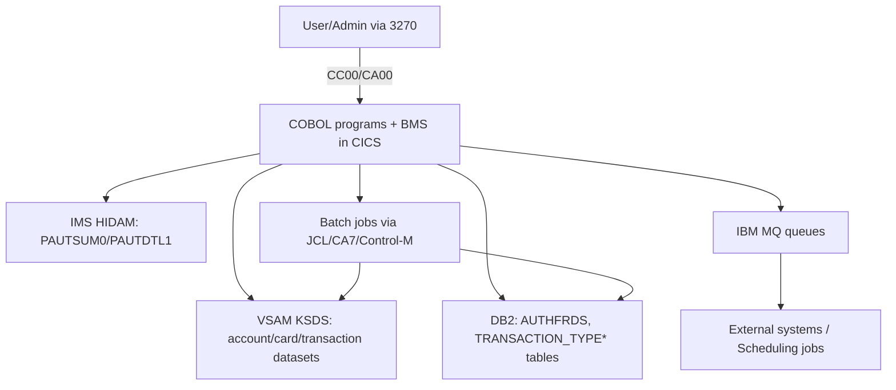

# System CardDemo - Overview for User Stories
**Version:** 2026-03-04  
**Purpose:** Single source of truth for writing user stories that span CardDemo core flows, batch operations, and its optional extensions.

---

## 📊 Platform Statistics
- **Technology Stack:** COBOL (IBM z/OS), CICS BMS maps, JCL batch orchestration, VSAM KSDS, optional DB2 12/13, IMS DB HIDAM, IBM MQ, RACF security and assembler utilities.
- **Architecture Pattern:** Transaction-driven CICS front end with batch back-end, optional DB2/IMS/MQ integrations for data persistence and messaging, and shared copybooks for data contracts.
- **Key Capabilities:** Account/card lifecycle management, transaction posting, bill payments, admin metadata management, MQ-based integrations (authorizations, account extractions), batch job orchestration for daily processing, optional fraud analytics and DB2-backed metadata.
- **Supported Languages/Notations:** COBOL, JCL, BMS macros, Assembler in `app/maclib`, embedded SQL, IMS DBD/PSB definitions, MQ message descriptors (EBCDIC CSV).

---

## 🏗️ High-Level Architecture
### Technology Stack
- **Backend:** COBOL programs running inside CICS for online work, batch COBOL launched through JCL and CA7/Control-M schedules.
- **Data Stores:** VSAM KSDS files for accounts, cards, transactions, statements; optional DB2 tables (e.g., `AUTHFRDS`, `TRANSACTION_TYPE*`) for relational metadata; IMS HIDAM segments for pending authorizations.
- **Messaging:** IBM MQ queues for external authorization/parameter exchanges and account inquiries.
- **Security & Infrastructure:** RACF for user authentication, CICS resource definitions via CSD, BMS screen layouts targeting 3270 terminals.
- **Others:** Shared copybooks in `app/cpy`, map definitions in `app/bms`, scheduler artifacts in `app/scheduler`.

### Architectural Patterns
- **Transaction Layer:** Every CICS transaction (CC00/CM00/CT02/etc.) routes through a COBOL program, references BMS mapsets, and follows message-area + `EXEC CICS` logic for validation/feedback.
- **Batch Jobs:** JCL jobs (e.g., `TRANEXTR`, `POSTTRAN`, `CREASTMT`, `COMBTRAN`) operate on VSAM datasets and can be chained via CA7/Control-M definitions.
- **Optional Integrations:** Authorization extension adds MQ-triggered transactions and two-phase commits spanning VSAM/IMS/DB2; transaction type module pairs DB2 CRUD transactions with VSAM extraction jobs; MQ account extraction extension is pure MQ request/response.
- **Authentication:** Sample users (admin `ADMIN001`, cardholder `USER0001`) authenticate through `CC00` and are routed to menu transactions such as `CA00`, `CM00`, or `CPVS`.

### 📋 Actors and Journeys
- **Regular User:** Logs in, uses `CM00` main menu, updates account/card data (`CAUP`, `CCUP`), posts transactions (`CT02`), sees pending authorizations (`CPVS/CPVD` when enabled), and initiates bill payments (`CB00`). Journeys emphasize sub-second online responses and immediate VSAM updates.
- **Admin User:** Accesses `CA00` menu, manages user records (`CU00-CU03`), updates transaction metadata via `CTTU`/`CTLI`, reviews MQ authorizations and fraud data, and monitors nightly batch jobs such as `POSTTRAN`, `CBPAUP0J`, and `TRANEXTR`.

---

## 📚 Module Catalog

<!-- MODULE_LIST_START -->
**Modules:** core-platform, authorization, transaction-type-management, mq-account-extractions
<!-- MODULE_LIST_END -->

### 1. Core Platform
**ID:** `core-platform`  
**Purpose:** Provide the mandatory CardDemo runtime baseline over CICS + VSAM: authenticate users, route menu context, maintain account/card/customer data, post online transactions, execute bill payments, and run nightly/monthly batch pipelines that keep balances, transaction files, and statements consistent.  
**Business Context:** This module is the operational backbone for all user stories. Optional modules (authorization, transaction-type-management, MQ extraction) depend on its commarea contracts, VSAM entities, scheduler cadence, and menu/navigation behavior.  
**Key Components:**  
- **Online programs + maps:** `COSGN00C/COSGN00` (sign-on), `COMEN01C/COMEN01` (menu), `COACTVWC/COACTVW` (account view), `COACTUPC/COACTUP` (account update), `COCRDUPC/COCRDUP` (card update), `COTRN02C/COTRN02` (transaction add), `COBIL00C/COBIL00` (bill payment), plus list/view/report flows (`COTRN00C`, `COTRN01C`, `CORPT00C`).  
- **Batch programs:** `CBTRN02C` (daily posting), `CBACT04C` (interest and fee computation), `CBSTM03A` (statement generation in text + HTML).  
- **Batch orchestration JCL:** `POSTTRAN`, `INTCALC`, `COMBTRAN`, `CREASTMT`, `TRANBKP`, `TRANIDX`, `OPENFIL`, `CLOSEFIL`, `WAITSTEP`, `TRANREPT`.  
- **Runtime resources:** CICS definitions in `app/csd/CARDDEMO.CSD` for files/programs/transactions; scheduler dependencies in `app/scheduler/CardDemo.ca7` and `app/scheduler/CardDemo.controlm`.  
- **Shared contracts:** copybooks in `app/cpy` such as `COCOM01Y` (commarea), `CVACT01Y` (account), `CVACT03Y` (xref), `CVTRA05Y`/`CVTRA06Y` (transaction records), `CSUSR01Y` (user security).  
**Public APIs:**  
- **CICS transactions:** `CC00`, `CM00`, `CAVW`, `CAUP`, `CCLI`, `CCDL`, `CCUP`, `CT00`, `CT01`, `CT02`, `CB00`, `CR00`, `CA00`, `CU00`, `CU01`, `CU02`, `CU03`.  
- **Batch interfaces:** `POSTTRAN`, `INTCALC`, `COMBTRAN`, `CREASTMT`, `TRANBKP`, `TRANIDX`, `TRANREPT`, `OPENFIL`, `CLOSEFIL`.  
- **Operational commands:** SDSF-driven CICS file operations in `OPENFIL/CLOSEFIL` JCL (`CEMT SET FIL(... ) OPE/CLO`).  
- **Interface example:** `CT02` writes new `TRANSACT` records after key/data validation and explicit `Y/N` confirmation; `CB00` writes a payment transaction then rewrites account balance.  
**Dependencies:**  
- **Internal modules:** base dependency for `authorization`, `transaction-type-management`, and `mq-account-extractions`; optional features are surfaced through menu routing and shared datasets/contracts.  
- **External platform:** CICS, JES/JCL execution, VSAM KSDS/AIX datasets, RACF provisioning, scheduler (CA7/Control-M).  
- **Primary VSAM datasets:** `ACCTDAT`, `CARDDAT`, `CCXREF`, `CXACAIX`, `TRANSACT`, `USRSEC`, `TCATBALF` plus daily/system transaction generations used by batch jobs.  
**Data Models and Structures:**  
- **`ACCOUNT-RECORD` (`CVACT01Y`)**: account id, active status, current balance, credit/cash limits, cycle credit/debit, open/expiry/reissue dates, account group.  
- **`CARD-XREF-RECORD` (`CVACT03Y`)**: card number -> customer id + account id mapping, including AIX lookup path by account id.  
- **`TRAN-RECORD` (`CVTRA05Y`)**: transaction id, type/category, source/description, amount, merchant metadata, card number, orig/proc timestamps.  
- **`DALYTRAN-RECORD` (`CVTRA06Y`)**: daily batch input mirror of transaction payload.  
- **`CARDDEMO-COMMAREA` (`COCOM01Y`)**: from/to transaction-program routing, user identity/type, and account/card/customer context propagation.  
**Module-Specific Business Rules:**  
- **Authentication and routing:** `CC00` rejects blank credentials, validates password from `USRSEC`, and routes admin users to `COADM01C` and cardholders to `COMEN01C`.  
- **Menu authorization:** `CM00` blocks admin-only options for non-admin users and checks option program availability with `EXEC CICS INQUIRE PROGRAM` before transfer.  
- **Account/card consistency:** account-driven operations resolve cross-reference (`CXACAIX`/`CCXREF`) before reading account/customer/card masters; missing links are surfaced as explicit map errors.  
- **Controlled updates:** `CAUP` and `CCUP` require PF5 confirmation to persist; both perform lock-for-update reads and stale-data checks before `REWRITE`, avoiding blind overwrites.  
- **Validation depth:**  
  - `CAUP`: validates dates, signed amount fields, SSN composition, FICO range, US state code, state/ZIP compatibility, and required name/address/contact fields.  
  - `CCUP`: card status must be `Y/N`; expiry month must be `1-12`; expiry year constrained to `1950-2099`; embossed name must be alphabetic/spaces.  
  - `CT02`: requires account or card key; validates amount mask (`+/-99999999.99`), date format and validity (`YYYY-MM-DD` via `CSUTLDTC`), numeric merchant id, and non-empty required attributes.  
- **Bill payment semantics:** `CB00` blocks payment when current balance is not positive, requires confirm flag, writes a payment transaction (`TRAN-TYPE-CD='02'`, category `2`), and rewrites account balance in the same flow.  
- **Batch posting and interest:**  
  - `POSTTRAN` validates incoming daily transactions against xref/account, rejects over-limit/expired-account records into `DALYREJS`, updates `TRANSACT`, `ACCTDATA`, and `TCATBALF` on success.  
  - `INTCALC` computes monthly interest from disclosure rates (`DISCGRP`) and transaction category balances (`TCATBALF`), updates accounts, and emits system transactions used by `COMBTRAN`.  
  - `CREASTMT` generates both plain-text and HTML statements from transaction/account/customer/xref data.  
**User Story Examples:**  
- As a cardholder, I want to update my mailing address via `CAUP` so that statements route to my new location.  
- As a payments analyst, I want nightly `POSTTRAN` and `INTCALC` to finish before 4:00 AM so downstream reporting jobs can start.  
- As an auditor, I want `CT01` to display transactions sorted by posting date so I can verify customer activity before statement generation.

### 2. Authorization
**ID:** `authorization`  
**Purpose:** Implement a pending-authorization processing pipeline where MQ requests are evaluated in CICS, authorization state is persisted in IMS HIDAM (`PAUTSUM0`/`PAUTDTL1`), and analyst fraud decisions are persisted in DB2 for audit/analytics.  
**Business Context:** This module models issuer-side decisioning and review workflows. It provides asynchronous partner integration (`CP00`), operational analyst tooling (`CPVS`/`CPVD`), and housekeeping (`CBPAUP0J`) so pending authorization data remains queryable and bounded.  
**Key Components:**  
- **Online processor (`COPAUA0C`, `CP00`)**: MQGET request parsing (CSV), VSAM xref/account/customer lookups, decline/approval decisioning (`00`/`05`), response creation, and IMS summary/detail writes.  
- **Summary UI (`COPAUS0C`, `CPVS`)**: account search, account/customer panel rendering, IMS summary + paged detail traversal, row selection transfer to `CPVD`.  
- **Detail/Fraud UI (`COPAUS1C`, `CPVD`)**: reason-code text mapping, next-record navigation, PF5 fraud toggle, syncpoint/rollback coordination.  
- **Fraud DB2 handler (`COPAUS2C`)**: inserts into `CARDDEMO.AUTHFRDS`; on duplicate key (`SQLCODE -803`) executes update of `AUTH_FRAUD` and `FRAUD_RPT_DATE`.  
- **Batch purge (`CBPAUP0C` via `CBPAUP0J`)**: deletes expired `PAUTDTL1` records, adjusts summary counters/amounts, deletes empty `PAUTSUM0`, checkpoints with configurable frequency.  
- **Definitions and contracts**: BMS mapsets (`COPAU00`, `COPAU01`), IMS DBD/PSB (`DBPAUTP0`, `DBPAUTX0`, `PSBPAUTB`, `PSBPAUTL`), DB2 DDL/DCL (`AUTHFRDS`, `XAUTHFRD`, `AUTHFRDS.dcl`), and CICS resources (`CRDDEMO2.csd`).  
**Public APIs:**  
- **CICS transactions:** `CP00` (MQ trigger authorization engine), `CPVS` (authorization summary), `CPVD` (authorization detail + fraud action).  
- **MQ contracts:** request CSV (`AUTH-DATE ... TRANSACTION-ID`) and response CSV (`CARD-NUM,TRANSACTION-ID,AUTH-ID-CODE,AUTH-RESP-CODE,AUTH-RESP-REASON,APPROVED-AMT`).  
- **Batch interface:** `CBPAUP0J` (`PGM=DFSRRC00`, `PARM='BMP,CBPAUP0C,PSBPAUTB'`) with `SYSIN` parameter string (`EXPIRY_DAYS,CHKP_FREQ,CHKP_DIS_FREQ,DEBUG_FLAG`).  
- **DB2 write interface:** `CARDDEMO.AUTHFRDS` insert/update invoked by `COPAUS2C` during `CPVD` PF5 fraud actions.  
**Dependencies:**  
- **Internal modules:** core-platform VSAM datasets and copybooks (`CCXREF`, `ACCTDAT`, `CUSTDAT`, `COCOM01Y`, `CVACT01Y`, `CVACT03Y`, `CVCUS01Y`).  
- **External platform:** CICS (transactions/program/mapset resources), IBM MQ (request/reply queues and trigger data), IMS DB (HIDAM database + PSB scheduling), DB2 (table/index + DB2TRAN plan mapping), JES/JCL for purge jobs.  
**Data Models and Structures:**  
- **MQ request (`CCPAURQY`)**: request fields include card, amount, merchant metadata, and transaction id.  
- **MQ response (`CCPAURLY`)**: response fields include auth id/code/reason and approved amount.  
- **IMS summary (`CIPAUSMY` / `PAUTSUM0`)**: account/customer-level counters, balances, and approved/declined amount aggregates.  
- **IMS detail (`CIPAUDTY` / `PAUTDTL1`)**: authorization key (9’s complement date/time), request/response attributes, match status (`P/D/E/M`), fraud status (`F/R`) and fraud date.  
- **DB2 fraud table (`AUTHFRDS`)**: keyed by `(CARD_NUM, AUTH_TS)`, stores auth request/response metadata plus fraud action and account/customer linkage.  
**Module-Specific Business Rules:**  
- `CP00` declines with reason `3100` when card/account/customer context is not found; declines with `4100` when transaction amount exceeds available amount.  
- `CP00` sends response with preserved MQ correlation id and then updates IMS summary/detail in the same processing cycle.  
- `CPVS` supports PF7/PF8 paging over IMS detail records and only accepts `S/s` as valid row selection command for detail transfer.  
- `CPVD` PF5 toggles fraud status between confirmed (`F`) and removed (`R`); DB2 success is required before IMS detail rewrite/commit.  
- `CBPAUP0C` computes expiry using `CURRENT-YYDDD` and the inverted IMS date key; expired detail records are deleted and summary aggregates are decremented accordingly.  
**User Story Examples:**  
- As a partner system, I want to submit a CSV-style authorization request via `AWS.M2.CARDDEMO.PAUTH.REQUEST` and receive a decision in under two seconds.  
- As a fraud analyst, I want `CPVD` to flag suspicious responses, persist `AUTH_FRAUD='Y'` in `AUTHFRDS`, and surface the reason code to the terminal.  
- As a platform engineer, I want `CBPAUP0J` to purge authorizations older than 30 days so the IMS HIDAM remains performant.

### 3. Transaction Type Management
**ID:** `transaction-type-management`  
**Purpose:** Provide DB2-backed CRUD for transaction types with VSAM-sync batch jobs for the core engine.  
**Key Components:** CICS transactions `CTTU` (add/edit) and `CTLI` (list/update/delete), DB2 precompiler artifacts (`dcl`, `ddl` directories), DB2 tables `CARDDEMO.TRANSACTION_TYPE`, `CARDDEMO.TRANSACTION_TYPE_CATEGORY`, batch jobs `TRANEXTR`, `MNTTRDB2`, copybooks for host variables/SQLCA.  
**Public APIs:** `CTTU`, `CTLI`, `TRANEXTR`, `MNTTRDB2`.  
**User Story Examples:**  
- As an admin, I want `CTTU` to create a new transaction type with description so cardholders can post it immediately.  
- As an integration engineer, I want `TRANEXTR` to export DB2 transaction metadata nightly so `CT00`/`CT02` can rely on VSAM copies.  
- As a QA lead, I want `CTLI` to prevent deletes when `TRANSACTION_TYPE_CATEGORY` references a type so data integrity stays intact.

### 4. MQ Account Extractions
**ID:** `mq-account-extractions`  
**Purpose:** Offer MQ-driven system-date and account-data inquiries demonstrating asynchronous VSAM extraction patterns.  
**Key Components:** Transactions `CDRD` (`CODATE01`) and `CDRA` (`COACCT01`), MQ definitions (`MQCONN`, `MQQUEUE` resources), request/response message formats, BMS/CICS resource definitions.  
**Public APIs:** `CDRD`, `CDRA`, MQ queues `CARDDEMO.REQUEST.QUEUE`, `CARDDEMO.RESPONSE.QUEUE`.  
**User Story Examples:**  
- As a scheduler, I want to push a date request and calibrate nightly jobs with the host date returned through `CARDDEMO.RESPONSE.QUEUE`.  
- As an aggregator, I want to retrieve account details via `CDRA` so a downstream portal can mirror VSAM account snapshots.

---

## 🔄 Architecture Diagram


## 🔗 Module Dependency Diagram
```mermaid
flowchart LR
    core-platform --> batch-processing[Batch Operations (JCL/Control-M)]
    core-platform --> authorization
    core-platform --> transaction-type-management
    core-platform --> mq-account-extractions
    authorization --> IMS
    authorization --> DB2
    authorization --> MQ
    transaction-type-management --> DB2
    transaction-type-management --> VSAM
    mq-account-extractions --> MQ
    mq-account-extractions --> VSAM
```

---

## 🔌 Public Interfaces
- **CICS transactions:** `CC00`, `CM00`, `CAUP`/`CCUP`, `CT00`/`CT01`/`CT02`, `CB00`, `CR00`, `CP00`, `CPVS`, `CPVD`, `CTTU`, `CTLI`, `CDRD`, `CDRA`.  
- **Batch jobs:** `POSTTRAN`, `CREASTMT`, `TRANEXTR`, `TRANBKP`, `OPENFIL`, `CLOSEFIL`, `CBPAUP0J`, `INTCALC`, `TRANIDX`, `COMBTRAN`.  
- **MQ queues:** `AWS.M2.CARDDEMO.PAUTH.REQUEST`, `AWS.M2.CARDDEMO.PAUTH.REPLY`, `CARDDEMO.REQUEST.QUEUE`, `CARDDEMO.RESPONSE.QUEUE`.  
- **DB2 tables:** `CARDDEMO.TRANSACTION_TYPE`, `CARDDEMO.TRANSACTION_TYPE_CATEGORY`, `AUTHFRDS`.  
- **IMS database:** HIDAM `DBPAUTP0` with segments `PAUTSUM0`, `PAUTDTL1`, and index `PAUTINDX`.

**Sample MQ authorization request (CSV fields):**
```
AUTH-DATE,AUTH-TIME,CARD-NUM,AUTH-TYPE,CARD-EXPIRY-DATE,MESSAGE-TYPE,MESSAGE-SOURCE,PROCESSING-CODE,TRANSACTION-AMT,MERCHANT-CATAGORY-CODE,ACQR-COUNTRY-CODE,POS-ENTRY-MODE,MERCHANT-ID,MERCHANT-NAME,MERCHANT-CITY,MERCHANT-STATE,MERCHANT-ZIP,TRANSACTION-ID
```

**Sample MQ response:**
```
CARD-NUM,TRANSACTION-ID,AUTH-ID-CODE,AUTH-RESP-CODE,AUTH-RESP-REASON,APPROVED-AMT
```

---

## 📊 Data Models
### AUTHFRDS (DB2)
```sql
CREATE TABLE <schema>.AUTHFRDS (
  CARD_NUM CHAR(16) NOT NULL,
  AUTH_TS TIMESTAMP NOT NULL,
  AUTH_RESP_CODE CHAR(2),
  PROCESSING_CODE CHAR(6),
  TRANSACTION_AMT DECIMAL(12,2),
  MATCH_STATUS CHAR(1),
  AUTH_FRAUD CHAR(1),
  FRAUD_RPT_DATE DATE,
  PRIMARY KEY(CARD_NUM, AUTH_TS)
);
```
### IMS segments
- `PAUTSUM0`: root authorization summary segment.  
- `PAUTDTL1`: child authorization detail segment.  
- `PAUTINDX`: HIDAM index for quick lookups.
### MQ message formats (COBOL-style)
```cobol
01 AUTH-REQUEST.
   05 AUTH-DATE        PIC X(8).
   05 AUTH-TIME        PIC X(6).
   05 CARD-NUM         PIC X(16).
   05 TRANSACTION-AMT  PIC 9(12)V99.
   05 MERCHANT-ID      PIC X(15).
   05 TRANSACTION-ID   PIC X(15).
```

---

## 📋 Business Rules by Module
### Core Platform
- Transactions require active records in VSAM datasets (`ACCTDATA`, `CARDDATA`, `TRANSACT`).  
- Bill payments (`CB00`) validate available balance before posting and prompt PF keys for confirmation.  
- Cross-reference lookups (`CARDXREF`) ensure card/account pair consistency during updates.
### Authorization
- `CP00` parses CSV MQ requests, decides approval/decline, and returns a correlated response (`TRANSACTION-ID` echoed) before writing pending authorization records into IMS.  
- Decisioning uses VSAM + IMS balances; missing card/account/customer paths map to reason `3100`, and over-limit requests map to `4100`.  
- `CPVD` PF5 toggles fraud status (`F`/`R`) and invokes DB2 insert/update on `AUTHFRDS`; IMS detail is rewritten only when DB2 update succeeds.  
- `CBPAUP0J`/`CBPAUP0C` remove expired detail records using configurable expiry days, decrement summary counters/amounts, and delete empty summary roots with periodic checkpoints.
### Transaction Type Management
- DB2 delete operations are blocked when `TRANSACTION_TYPE_CATEGORY` references a type (`DELETE RESTRICT`).  
- Batch `TRANEXTR` exports DB2 rows into VSAM-friendly files every run so online transactions keep their local reference data.  
- Static SQL uses host variables and SQLCA checks; every non-zero SQLCODE triggers rollback.
### MQ Account Extractions
- Each MQ request carries a correlation ID that must appear in the response queue payload.  
- Account detail requests verify VSAM account presence before populating the 300-byte `ACCOUNT-DATA` response.  
- Date requests simply return the host date and correlation ID regardless of payload content.

---

## 🌐 Internationalization and Translation
CardDemo does not rely on filesystem-based i18n catalogs. All screen text lives inside BMS mapsets (`COSGN00`, `COACTUP`, `COPAU00`, etc.) compiled into the CICS map library, and translations (if needed) are handled by deploying alternate mapsets or copybooks. There is no `locales/` or JSON/YAML locale folder.

---

## 📋 Form and Listing Patterns
### Form Pattern
- CICS BMS maps define fields and PF keys; every form ties to a COBOL copybook with PIC clauses.  
- Validation occurs in COBOL routines that set `MSGSET/MSGID`/`MESSAGE` and `RETURN` to redisplay the map.  
- Forms may run inside modals only within the 3270 terminal (PF keys), so there are no reusable base UI components beyond BMS macros.
### Listing Pattern
- Lists such as `CT00`, `CPVS`, and `CTLI` read VSAM sequentially with manual paging (`READ NEXT`, `READ PREV`).  
- Actions (edit, delete) are PF key-driven, and the message area displays results or warnings.  
- Notifications are embedded in the map (PF messages) instead of toast/snackbar widgets.

---

## 🎯 User Story Patterns
### Templates
- **Cardholder:** As a cardholder, I want [feature] so that [benefit].  
- **Admin:** As an administrator, I want [control] to keep [metadata/operations] reliable.  
- **Integrator:** As an integration developer, I want [MQ/DB2 contract] so that [external system] can consume CardDemo data.
### Complexity Guidelines
- **Simple (1-2 pts):** Update a BMS message or extend an existing VSAM field.  
- **Medium (3-5 pts):** Add a new validation path involving DB2 or MQ, or extend a batch job with new dataset handling.  
- **Complex (6-8 pts):** Add a new MQ-driven transaction that spans VSAM → IMS → DB2 or rework nightly batch dependencies.
### Acceptance Criteria Patterns
- **Core Platform:** Must authenticate via `CC00`, update VSAM, and show success/failure via BMS message area; invalid input must refresh the map with error messaging.  
- **Authorization:** MQ requests must write to IMS before responding; fraud marking updates DB2 and refreshes the detail screen.  
- **Transaction Type Management:** CRUD operations must run against DB2 with SQLCA validation and propagate to VSAM via `TRANEXTR`.  
- **MQ Account Extractions:** Responses must include correlated IDs, proper field lengths (10+ chars for IDs, 300 for account data), and handle MQ timeouts gracefully.

---

## ⚡ Performance Budgets
- **Online transactions:** Target <1 second for approval UI flows (`CAUP`, `CT02`, `CPVS`).  
- **MQ authorizations:** Aim for <2 seconds end-to-end queue round-trip plus IMS/DB2 persistence.  
- **Batch jobs:** `POSTTRAN`, `CREASTMT`, `TRANEXTR`, and `TRANIDX` should complete within 15–30 minutes nightly; `CBPAUP0J` should finish within maintenance window.  
- **Database operations:** DB2 operations should stay under 500 ms (P95) for admin screens; IMS reads/writes under 250 ms for pending authorizations.  
- **Data loads:** VSAM dataset refreshes (`ACCTFILE`, `CARDFILE`) should finish within 20 minutes.

---

## 🚨 Readiness Considerations
### Technical Risks
1. **Missing datasets:** Required VSAM and DB2/IMS objects must be provisioned before online/batch jobs run; failure halts most flows.  
2. **Optional subsystem dependencies:** MQ, IMS, and DB2 must all be wired before `CP00`, `CTTU`, `CDRD`, and `CDRA` can operate.  
3. **SQLCA/Binding drift:** Precompiled DB2 programs depend on correct DB2 plan/bind; mismatched SQLCA causes immediate CICS abends.
### Tech Debt
- **Copybook drift:** Shared copybooks (e.g., `CVACT02Y`) require synchronized changes; inconsistencies risk data corruption.  
- **Scheduler visibility:** CA7/Control-M definitions in `app/scheduler` need better documentation for new team members.
### Sequencing for User Stories
- **Prerequisites:** Provision VSAM datasets, define CICS resources, register RACF users, load optional DB2/IMS/MQ definitions.  
- **Recommended order:** 1) Core platform baseline (authentication → transaction posting → batch), 2) Transaction type DB2 integration, 3) Authorization MQ stack, 4) MQ account extractions.

---

## 📈 Success Metrics
### Adoption
- **Target:** 100% of pilot teams run the nightly batch pipeline within 3 hours of the scheduled start.  
- **Engagement:** Admins execute `TRANEXTR` weekly and assess MQ-authorization results through `CPVS/CPVD`.  
- **Retention:** Teams continue leveraging CardDemo as a regression bench when optional extensions are enabled.
### Business Impact
- **Metric 1:** Cut manual authorization testing time by 50% by routing requests through the MQ-based `CP00`/`CPVS` screens.  
- **Metric 2:** Ensure new transaction types appear in VSAM within a single nightly `TRANEXTR` run so postings stay accurate.

*Last updated: 2026-03-04*
