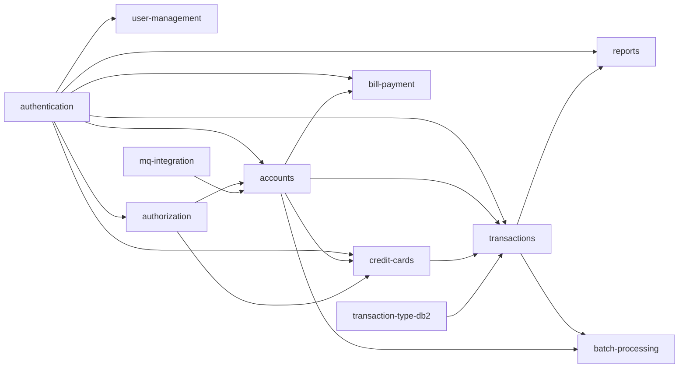

# System CardDemo - Overview for User Stories

**Version:** 2026-03-12  
**Purpose:** Single source of truth for creating well-structured User Stories

---

## 📊 Platform Statistics

- **Technology Stack:** COBOL, CICS, VSAM, DB2, IMS DB, IBM MQ, JCL, BMS
- **Architecture Pattern:** CICS Online Transaction Processing + Batch Batch COBOL jobs (VSAM-based)
- **Key Capabilities:** Credit card account management, transaction processing, authorization, bill payment, reporting, user/security management
- **Application Type:** Mainframe Credit Card Management (demo/reference application by AWS)
- **Target Platform:** IBM z/OS with CICS TS, VSAM, optional DB2 and IMS extensions

---

## 🏗️ High-Level Architecture

### Technology Stack
**Transaction Processing:** CICS (Customer Information Control System)  
**Programming Language:** IBM COBOL  
**Data Storage:** VSAM (KSDS/ESDS files) — primary; DB2 relational DB — optional extension; IMS DB hierarchical DB — authorization extension  
**Messaging:** IBM MQ — optional extensions  
**Job Scheduling:** JCL batch jobs, CA7 / Control-M scheduler definitions included  
**Screen Definitions:** BMS (Basic Mapping Support) map definitions

### Architectural Patterns
- **CICS Pseudo-Conversational:** Each program receives control, processes user input, sends a screen, and returns. Navigation state carried in COMMAREA.
- **VSAM KSDS Files:** Core data stored in key-sequenced VSAM datasets (ACCTDAT, CUSTDAT, CARDDAT, CARDXREF, TRANSACT, USRSEC, TCATBALF, DISCGRP).
- **Batch / Online Separation:** Batch COBOL programs (CB prefix) run via JCL; online CICS programs (CO prefix) handle interactive processing.
- **Copybook-Driven Data Structures:** All data records defined in reusable COBOL copybooks (`.cpy`), referenced by both online and batch programs.
- **User Type Gating:** Two user types — `U` (regular user) and `A` (admin) — control menu access and permitted operations.

### Program Naming Conventions
| Prefix | Type | Examples |
|--------|------|---------|
| `COSGN` | Signon/auth | COSGN00C |
| `COMEN` / `COADM` | Menus | COMEN01C, COADM01C |
| `COACT` | Account online | COACTVWC, COACTUPC |
| `COCRD` | Credit card online | COCRDSLC, COCRDLIC, COCRDUPC |
| `COTRN` | Transaction online | COTRN00C, COTRN01C, COTRN02C |
| `COBIL` | Bill payment | COBIL00C |
| `CORPT` | Reports | CORPT00C |
| `COUSR` | User management | COUSR00C–COUSR03C |
| `CBACT` | Account batch | CBACT01C–CBACT04C |
| `CBTRN` | Transaction batch | CBTRN01C–CBTRN03C |
| `CBCUS` | Customer batch | CBCUS01C |
| `COPAU` | Authorization (IMS/MQ) | COPAUA0C, COPAUS0C–COPAUS2C |
| `COTRT` | Transaction Type DB2 | COTRTLIC, COTRTUPC |

### CICS Transaction IDs
| TranID | Program | Function |
|--------|---------|---------|
| CC00 | COSGN00C | Signon |
| CM00 | COMEN01C | User Main Menu |
| CA00 | COADM01C | Admin Menu |
| CV00 | COACTVWC | Account View |
| CU00 | COUSR00C | User List |
| CB00 | COBIL00C | Bill Payment |
| CR00 | CORPT00C | Transaction Reports |
| CP00 | COPAUA0C | Authorization Processing |
| CTTU | COTRTUPC | Transaction Type Edit (DB2) |
| CTLI | COTRTLIC | Transaction Type List (DB2) |
| CDRD | CODATE01 | Date Inquiry via MQ |
| CDRA | COACCT01 | Account Inquiry via MQ |

---

## 📚 Module Catalog

<!-- MODULE_LIST_START -->
**Modules:** authentication, accounts, credit-cards, transactions, bill-payment, reports, user-management, batch-processing, authorization, transaction-type-db2, mq-integration
<!-- MODULE_LIST_END -->

---

### 1. Authentication
**ID:** `authentication`  
**Purpose:** Control user signon/signoff and session state for the CardDemo application.  
**Key Components:** `COSGN00C` (signon screen/logic), `CSUSR01Y` (user security copybook), `USRSEC` VSAM file  
**User Types:** Admin (`A`), Regular User (`U`)  
**VSAM Files Used:** `USRSEC`

**Screens/Maps:** `COSGN00` (BMS signon map)

**Flow:**
1. User enters User ID + Password on signon screen (TranID: CC00).
2. Program reads USRSEC file to validate credentials.
3. On success, sets user type in COMMAREA and transfers to appropriate menu (CM00 for users, CA00 for admins).
4. Failed logins display error message; signon re-presented.

**Business Rules:**
- User ID: up to 8 characters; Password: up to 8 characters.
- User type determines accessible menus and operations (`A` = admin, `U` = regular).
- Session state passed through CICS COMMAREA (`CARDDEMO-COMMAREA` in `COCOM01Y`).

**User Story Examples:**
- As a cardholder, I want to log in with my user ID and password so that I can access my account information securely.
- As an admin, I want to log in and be redirected to the admin menu so that I can manage users and system settings.

---

### 2. Accounts
**ID:** `accounts`  
**Purpose:** View and update credit card account information including balances, limits, and status.  
**Key Components:** `COACTVWC` (account view), `COACTUPC` (account update)  
**VSAM Files Used:** `ACCTDAT`, `CUSTDAT`, `CARDXREF` (cross-reference)  
**Copybooks:** `CVACT01Y` (account record), `CVCUS01Y` (customer record)

**Screens/Maps:** `COACTVW` (account view), `COACTUP` (account update)

**Account Record Fields (`CVACT01Y`):**
```
ACCOUNT-RECORD:
  ACCT-ID                  PIC 9(11)       - Account identifier
  ACCT-ACTIVE-STATUS       PIC X(1)        - Account status (A=active)
  ACCT-CURR-BAL            PIC S9(10)V99   - Current balance
  ACCT-CREDIT-LIMIT        PIC S9(10)V99   - Credit limit
  ACCT-CASH-CREDIT-LIMIT   PIC S9(10)V99   - Cash credit limit
  ACCT-OPEN-DATE           PIC X(10)       - Open date (YYYY-MM-DD)
  ACCT-EXPIRAION-DATE      PIC X(10)       - Expiration date
  ACCT-REISSUE-DATE        PIC X(10)       - Reissue date
  ACCT-CURR-CYC-CREDIT     PIC S9(10)V99   - Current cycle credits
  ACCT-CURR-CYC-DEBIT      PIC S9(10)V99   - Current cycle debits
  ACCT-ADDR-ZIP            PIC X(10)       - ZIP code
  ACCT-GROUP-ID            PIC X(10)       - Discount group ID
```

**Business Rules:**
- Account looked up by account ID or via card number cross-reference.
- Account update screen allows modification of limits, status, and group ID.
- Both regular users and admins can view accounts; update may require admin.

**User Story Examples:**
- As a cardholder, I want to view my current balance and credit limit so that I can manage my spending.
- As an admin, I want to update an account's credit limit so that I can respond to customer credit requests.

---

### 3. Credit Cards
**ID:** `credit-cards`  
**Purpose:** List, view, and update credit card records associated with accounts.  
**Key Components:** `COCRDLIC` (card list), `COCRDSLC` (card detail/select), `COCRDUPC` (card update)  
**VSAM Files Used:** `CARDDAT`, `CARDXREF`, `ACCTDAT`, `CUSTDAT`  
**Copybooks:** `CVCRD01Y` (card work areas)

**Screens/Maps:** `COCRDLI` (card list), `COCRDSL` (card select/view), `COCRDUP` (card update)

**Card Data (CARDXREF cross-reference):**
```
Card Cross-Reference Record:
  CARD-NUM       PIC 9(16)   - 16-digit card number
  CUST-ID        PIC 9(9)    - Customer ID
  ACCT-ID        PIC 9(11)   - Account ID
```

**Business Rules:**
- Card list is pageable (forward/backward).
- Cards are linked to accounts via `CARDXREF` VSAM file (alternate key).
- Card update allows changes to card status and expiration details.
- Card number is 16 digits.

**User Story Examples:**
- As a cardholder, I want to see a list of credit cards on my account so that I can identify active cards.
- As an admin, I want to update a card's status so that I can block compromised cards.

---

### 4. Transactions
**ID:** `transactions`  
**Purpose:** List, view, and add credit card transactions online; batch-post daily transactions.  
**Key Components:** `COTRN00C` (transaction list), `COTRN01C` (transaction view), `COTRN02C` (transaction add)  
**VSAM Files Used:** `TRANSACT`, `ACCTDAT`, `CARDXREF`, `CUSTDAT`  
**Copybooks:** `CVTRA05Y` (transaction record), `CVTRA01Y`–`CVTRA07Y`

**Screens/Maps:** `COTRN00` (list), `COTRN01` (view), `COTRN02` (add)

**Transaction Record Fields (`CVTRA05Y`):**
```
TRAN-RECORD (350 bytes):
  TRAN-ID              PIC X(16)       - Transaction ID
  TRAN-TYPE-CD         PIC X(2)        - Transaction type code
  TRAN-CAT-CD          PIC 9(4)        - Category code
  TRAN-SOURCE          PIC X(10)       - Source system
  TRAN-DESC            PIC X(100)      - Description
  TRAN-AMT             PIC S9(9)V99    - Amount
  TRAN-MERCHANT-ID     PIC 9(9)        - Merchant ID
  TRAN-MERCHANT-NAME   PIC X(50)       - Merchant name
  TRAN-MERCHANT-CITY   PIC X(50)       - Merchant city
  TRAN-MERCHANT-ZIP    PIC X(10)       - Merchant ZIP
  TRAN-CARD-NUM        PIC X(16)       - Card number
  TRAN-ORIG-TS         PIC X(26)       - Original timestamp
  TRAN-PROC-TS         PIC X(26)       - Processing timestamp
```

**Business Rules:**
- Transaction list is pageable (scrollable).
- Transaction Add (`COTRN02C`) creates new transaction records in the TRANSACT VSAM file.
- Transaction type codes and category codes reference the TRANSACT type reference data.
- Daily transaction processing done via batch jobs (CBTRN01C/CBTRN02C).

**User Story Examples:**
- As a cardholder, I want to view my transaction history so that I can verify charges and detect fraud.
- As an admin, I want to add a manual transaction so that I can process credits or adjustments.

---

### 5. Bill Payment
**ID:** `bill-payment`  
**Purpose:** Allow cardholders to pay their account balance online.  
**Key Components:** `COBIL00C` (bill payment program)  
**VSAM Files Used:** `TRANSACT`, `ACCTDAT`, `CXACAIX` (alternate index)

**Screens/Maps:** `COBIL00` (bill payment map)

**Business Rules:**
- Bill payment creates a payment transaction record in the TRANSACT file.
- Reduces current balance by payment amount.
- Validates account exists and is active before processing.
- Payment recorded with source `ONLINE` and appropriate transaction type.
- TranID: `CB00`

**User Story Examples:**
- As a cardholder, I want to pay my credit card balance online so that I can avoid late fees.
- As a cardholder, I want to see my current balance before making a payment so that I can decide how much to pay.

---

### 6. Reports
**ID:** `reports`  
**Purpose:** Generate and print transaction reports by submitting batch jobs from the online environment.  
**Key Components:** `CORPT00C` (report request), batch report programs (`CBSTM03A`, `CBSTM03B`)  
**VSAM Files Used:** `TRANSACT`

**Screens/Maps:** `CORPT00` (report request map)

**Business Rules:**
- Report request requires date range (start date, end date) in YYYY-MM-DD format.
- Report submitted by writing JCL to an extra-partition TDQ (transient data queue).
- Batch jobs produce printed output (SYSOUT).
- TranID: `CR00`

**User Story Examples:**
- As a cardholder, I want to generate a transaction report for a date range so that I can review my spending history.
- As an admin, I want to print a statement report so that I can provide account summaries to customers.

---

### 7. User Management
**ID:** `user-management`  
**Purpose:** Admin-only module to list, add, update, and delete users in the security file.  
**Key Components:** `COUSR00C` (user list), `COUSR01C` (user add), `COUSR02C` (user update), `COUSR03C` (user delete)  
**VSAM Files Used:** `USRSEC`  
**Copybooks:** `CSUSR01Y` (user security record)

**Screens/Maps:** `COUSR00`–`COUSR03` (user management screens)

**User Record Fields (`CSUSR01Y`):**
```
SEC-USER-DATA (80 bytes):
  SEC-USR-ID       PIC X(8)    - User ID
  SEC-USR-FNAME    PIC X(20)   - First name
  SEC-USR-LNAME    PIC X(20)   - Last name
  SEC-USR-PWD      PIC X(8)    - Password
  SEC-USR-TYPE     PIC X(1)    - User type (A=Admin, U=User)
  SEC-USR-FILLER   PIC X(23)   - Reserved
```

**Business Rules:**
- Only admin users (`A`) can access user management (Admin Menu options 1–4).
- User list is pageable (10 users per page).
- Passwords stored in USRSEC file (no encryption noted — demo only).
- User ID uniqueness enforced on add.
- TranIDs: CU00 (list), CU01 (add), CU02 (update), CU03 (delete)

**User Story Examples:**
- As an admin, I want to add a new user so that new employees can access the system.
- As an admin, I want to update a user's type so that I can promote a regular user to admin.
- As an admin, I want to delete a user so that departing employees lose system access.

---

### 8. Batch Processing
**ID:** `batch-processing`  
**Purpose:** Perform bulk data processing: account reads/reports, transaction posting, interest calculation, statement generation, customer file operations.  
**Key Components:**

| Program | Function |
|---------|---------|
| `CBACT01C` | Read account file, write to output/array/VBR files |
| `CBACT02C` | Account file processing |
| `CBACT03C` | Account file processing |
| `CBACT04C` | Interest calculation (reads TCATBALF, DISCGRP; posts interest transactions) |
| `CBTRN01C` | Post daily transactions from DALYTRAN to TRANSACT + update accounts/TCATBALF |
| `CBTRN02C` | Post daily transactions (alternate approach with reject file) |
| `CBTRN03C` | Transaction batch processing |
| `CBCUS01C` | Customer file processing |
| `CBSTM03A` | Statement generation part A |
| `CBSTM03B` | Statement generation part B |
| `CBEXPORT` | Export account/transaction data |
| `CBIMPORT` | Import account/transaction data |
| `CSUTLDTC` | Date utility program |

**JCL Jobs (key ones):**

| JCL | Function |
|-----|---------|
| `POSTTRAN.jcl` | Post daily transactions (runs CBTRN01C/02C) |
| `INTCALC.jcl` | Interest calculation (runs CBACT04C) |
| `CREASTMT.JCL` | Create statements (runs CBSTM03A/B) |
| `ACCTFILE.jcl` | Account file VSAM definition |
| `TRANREPT.jcl` | Transaction report |
| `DALYREJS.jcl` | Daily rejects processing |
| `COMBTRAN.jcl` | Combine transactions |

**VSAM Files:**

| File DD | Description |
|---------|-------------|
| `ACCTFILE`/`ACCTDAT` | Account master (KSDS, key=ACCT-ID) |
| `CUSTFILE`/`CUSTDAT` | Customer master (KSDS, key=CUST-ID) |
| `CARDFILE`/`CARDDAT` | Card master (KSDS, key=CARD-NUM) |
| `XREFFILE`/`CARDXREF` | Card/Account/Customer cross-reference |
| `TRANSACT`/`TRANFILE` | Transaction file (KSDS, key=TRAN-ID) |
| `USRSEC` | User security file |
| `TCATBALF` | Transaction category balance (per acct/type/cat) |
| `DISCGRP` | Discount group interest rates |
| `DALYTRAN` | Daily transaction input (sequential) |
| `DALYREJS` | Daily transaction rejects (sequential) |

**Business Rules:**
- Interest calculated using DISCGRP rates applied to TCATBALF per account group.
- Daily transactions validated against account/card/xref before posting.
- Rejected transactions written to DALYREJS file.
- Statements generated by reading transaction history for a billing period.

**User Story Examples:**
- As a batch operator, I want to run daily transaction posting so that account balances are updated nightly.
- As a batch operator, I want to calculate interest so that monthly interest charges are applied to accounts.
- As a batch operator, I want to generate customer statements so that cardholders receive their monthly bills.

---

### 9. Authorization
**ID:** `authorization`  
**Purpose:** Real-time credit card authorization processing via IBM MQ and IMS DB, with DB2-based fraud detection. (Extension module)  
**Key Components:** `COPAUA0C` (authorization decision), `COPAUS0C`–`COPAUS2C` (authorization screens), `CBPAUP0C` (batch purge), `PAUDBLOD`/`PAUDBUNL` (IMS load/unload)  
**Technologies:** CICS, IMS DB, DB2, IBM MQ, VSAM  
**IMS Databases:** DBPAUTP0 (authorization), DBPAUTX0 (index)  
**DB2 Tables:** `AUTHFRDS` (fraud detection)  
**MQ Queues:** Request queue, Reply queue

**Screens/Maps:** `COPAU00` (authorization summary), `COPAU01` (authorization detail)

**Authorization Flow:**
1. External POS/cloud client sends authorization request via MQ.
2. `COPAUA0C` (TranID: CP00) triggered by MQ message arrival.
3. Program reads card/account/customer data from VSAM.
4. Applies business rules: available credit check, account status, fraud flags.
5. Writes authorization record to IMS DB.
6. Sends approval/decline response to reply MQ queue.
7. Fraud data stored in DB2 AUTHFRDS table.

**Business Rules:**
- Authorization approved if: account active + available credit ≥ requested amount + no fraud flags.
- Declined for: insufficient credit, inactive account, fraud detected.
- Authorization records stored hierarchically in IMS DB (parent: account, child: auth detail).
- Authorizations expire and are purged by batch job `CBPAUP0C`.
- Up to 500 authorization requests processed per CICS trigger invocation.

**User Story Examples:**
- As a merchant terminal, I want to submit an authorization request via MQ so that I can verify the card is valid before completing a sale.
- As a cardholder, I want to view pending authorizations on my account so that I can track recent transactions.
- As an admin, I want to review authorization history for fraud investigation purposes.

---

### 10. Transaction Type DB2
**ID:** `transaction-type-db2`  
**Purpose:** Manage transaction type reference data stored in DB2 (optional extension replacing/supplementing VSAM-based transaction type data).  
**Key Components:** `COTRTLIC` (list/update/delete), `COTRTUPC` (add/edit), `COBTUPDT` (batch maintenance)  
**Technologies:** CICS, DB2 with embedded static SQL  
**DB2 Tables:** `CARDDEMO.TRANSACTION_TYPE`, `CARDDEMO.TRANSACTION_TYPE_CATEGORY`

**Screens/Maps:** `COTRTLI` (list), `COTRTUP` (update)

**DB2 Schema:**
```sql
-- CARDDEMO.TRANSACTION_TYPE
TR_TYPE        CHAR(2)        PRIMARY KEY   -- Transaction type code
TR_DESCRIPTION VARCHAR(50)                  -- Transaction description

-- CARDDEMO.TRANSACTION_TYPE_CATEGORY
TRC_TYPE_CODE     CHAR(2)     PK, FK → TRANSACTION_TYPE.TR_TYPE
TRC_TYPE_CATEGORY CHAR(4)     PK            -- Category code
TRC_CAT_DATA      VARCHAR(50)               -- Category description
```

**Business Rules:**
- Transaction type codes are 2-character alphanumeric.
- Delete of a transaction type restricted if related category records exist (FK constraint).
- List screen supports forward/backward cursor paging through DB2 result sets.
- Batch job `TRANEXTR` extracts DB2 data to VSAM-compatible files for base app integration.
- Admin Menu options 5 (list) and 6 (add/edit), TranIDs: `CTLI`, `CTTU`.

**User Story Examples:**
- As an admin, I want to add a new transaction type in DB2 so that new payment categories are available for processing.
- As an admin, I want to browse and update transaction type descriptions so that they reflect current business terminology.

---

### 11. MQ Integration
**ID:** `mq-integration`  
**Purpose:** Asynchronous integration patterns using IBM MQ — account data inquiry and system date inquiry via request/response messaging.  
**Key Components:** `COACCT01` (account inquiry via MQ), `CODATE01` (date inquiry via MQ)  
**Technologies:** CICS, IBM MQ, VSAM  
**MQ Queues:** `CARDDEMO.REQUEST.QUEUE`, `CARDDEMO.RESPONSE.QUEUE`

**Message Formats:**
```cobol
-- Date Request/Response:
DATE-REQUEST-MSG:  REQUEST-TYPE PIC X(4) 'DATE', REQUEST-ID PIC X(8)
DATE-RESPONSE-MSG: RESPONSE-TYPE PIC X(4), RESPONSE-ID PIC X(8), SYSTEM-DATE PIC X(10)

-- Account Request/Response:
ACCT-REQUEST-MSG:  REQUEST-TYPE PIC X(4) 'ACCT', REQUEST-ID PIC X(8), ACCOUNT-NUMBER PIC X(11)
ACCT-RESPONSE-MSG: RESPONSE-TYPE PIC X(4), RESPONSE-ID PIC X(8), ACCOUNT-DATA PIC X(300)
```

**Business Rules:**
- Request/response correlation by REQUEST-ID.
- Account data retrieved from VSAM ACCTDAT in response to MQ request.
- TranIDs: `CDRD` (date), `CDRA` (account).

**User Story Examples:**
- As an external system, I want to request account details via MQ so that I can integrate with CardDemo without direct VSAM access.
- As an operations team, I want to query the system date via MQ so that I can synchronize external processes.

---

## 🔄 Architecture Diagram

```mermaid
graph TB
    subgraph ONLINE["Online CICS Programs"]
        SGN["COSGN00C\nSignon CC00"]
        MENU_U["COMEN01C\nUser Menu CM00"]
        MENU_A["COADM01C\nAdmin Menu CA00"]
        ACTVW["COACTVWC\nAccount View"]
        ACTUP["COACTUPC\nAccount Update"]
        CRDLI["COCRDLIC\nCard List"]
        CRDSL["COCRDSLC\nCard View"]
        CRDUP["COCRDUPC\nCard Update"]
        TRN00["COTRN00C\nTran List"]
        TRN01["COTRN01C\nTran View"]
        TRN02["COTRN02C\nTran Add"]
        BIL["COBIL00C\nBill Pay CB00"]
        RPT["CORPT00C\nReports CR00"]
        USR0["COUSR00C\nUser List"]
        USR1["COUSR01C\nUser Add"]
        USR2["COUSR02C\nUser Upd"]
        USR3["COUSR03C\nUser Del"]
        AUTH["COPAUA0C\nAuth CP00"]
        AUTVW["COPAUS0C\nAuth View"]
        TTLI["COTRTLIC\nTT List CTLI"]
        TTUP["COTRTUPC\nTT Upd CTTU"]
    end

    subgraph BATCH["Batch COBOL Programs (JCL)"]
        BACT1["CBACT01C\nAcct Read"]
        BACT4["CBACT04C\nInterest Calc"]
        BTRN1["CBTRN01C\nDaily Post"]
        BTRN2["CBTRN02C\nDaily Post Alt"]
        BSTM["CBSTM03A/B\nStatements"]
        BEXP["CBEXPORT\nExport"]
        BIMP["CBIMPORT\nImport"]
    end

    subgraph VSAM["VSAM Datasets"]
        ACCTDAT["ACCTDAT\nAccount Master"]
        CUSTDAT["CUSTDAT\nCustomer Master"]
        CARDDAT["CARDDAT\nCard Master"]
        XREFDAT["CARDXREF\nCard/Acct XRef"]
        TRANSACT["TRANSACT\nTransactions"]
        USRSEC["USRSEC\nUser Security"]
        TCATBAL["TCATBALF\nCat Balances"]
        DISCGRP["DISCGRP\nDiscount Groups"]
        DALYTRAN["DALYTRAN\nDaily Tran Input"]
    end

    subgraph EXT["Extension Data Stores"]
        DB2["DB2\nTran Types\nFraud Data"]
        IMS["IMS DB\nAuth Records"]
        MQ["IBM MQ\nAuth Requests\nMQ Inquiries"]
    end

    SGN --> MENU_U & MENU_A
    MENU_U --> ACTVW & ACTUP & CRDLI & CRDSL & CRDUP & TRN00 & TRN01 & TRN02 & RPT & BIL & AUTVW
    MENU_A --> USR0 & USR1 & USR2 & USR3 & TTLI & TTUP

    ACTVW & ACTUP --> ACCTDAT & CUSTDAT & XREFDAT
    CRDLI & CRDSL & CRDUP --> CARDDAT & XREFDAT & ACCTDAT
    TRN00 & TRN01 & TRN02 --> TRANSACT & ACCTDAT
    BIL --> TRANSACT & ACCTDAT
    RPT --> TRANSACT
    USR0 & USR1 & USR2 & USR3 --> USRSEC
    TTLI & TTUP --> DB2
    AUTH --> ACCTDAT & CUSTDAT & XREFDAT & IMS & DB2 & MQ
    AUTVW --> IMS

    BTRN1 & BTRN2 --> DALYTRAN & TRANSACT & ACCTDAT & XREFDAT & TCATBAL
    BACT4 --> TCATBAL & ACCTDAT & DISCGRP & TRANSACT
    BSTM --> TRANSACT & ACCTDAT
    BEXP & BIMP --> ACCTDAT & CUSTDAT & CARDDAT
```



---

## 📐 Module Dependency Diagram



---

## 📊 Data Models

### Account Record (`CVACT01Y`)
```cobol
01 ACCOUNT-RECORD.
  05 ACCT-ID                PIC 9(11)       -- Account ID (primary key)
  05 ACCT-ACTIVE-STATUS     PIC X(1)        -- Status: 'Y'=active, 'N'=inactive
  05 ACCT-CURR-BAL          PIC S9(10)V99   -- Current balance
  05 ACCT-CREDIT-LIMIT      PIC S9(10)V99   -- Credit limit
  05 ACCT-CASH-CREDIT-LIMIT PIC S9(10)V99   -- Cash advance limit
  05 ACCT-OPEN-DATE         PIC X(10)       -- YYYY-MM-DD
  05 ACCT-EXPIRAION-DATE    PIC X(10)       -- YYYY-MM-DD
  05 ACCT-REISSUE-DATE      PIC X(10)       -- YYYY-MM-DD
  05 ACCT-CURR-CYC-CREDIT   PIC S9(10)V99   -- Credits this cycle
  05 ACCT-CURR-CYC-DEBIT    PIC S9(10)V99   -- Debits this cycle
  05 ACCT-ADDR-ZIP          PIC X(10)       -- ZIP code
  05 ACCT-GROUP-ID          PIC X(10)       -- Discount group for interest calc
```

### Customer Record (`CVCUS01Y`)
```cobol
01 CUSTOMER-RECORD.
  05 CUST-ID               PIC 9(9)        -- Customer ID
  05 CUST-FIRST-NAME       PIC X(25)
  05 CUST-MIDDLE-NAME      PIC X(25)
  05 CUST-LAST-NAME        PIC X(25)
  05 CUST-ADDR-LINE-1      PIC X(50)
  05 CUST-ADDR-LINE-2      PIC X(50)
  05 CUST-ADDR-LINE-3      PIC X(50)
  05 CUST-ADDR-STATE-CD    PIC X(2)
  05 CUST-ADDR-COUNTRY-CD  PIC X(3)
  05 CUST-ADDR-ZIP         PIC X(10)
  05 CUST-PHONE-NUM-1      PIC X(15)
  05 CUST-PHONE-NUM-2      PIC X(15)
  05 CUST-SSN              PIC 9(9)
  05 CUST-GOVT-ISSUED-ID   PIC X(20)
  05 CUST-DOB-YYYY-MM-DD   PIC X(10)
  05 CUST-EFT-ACCOUNT-ID   PIC X(10)
  05 CUST-PRI-CARD-HOLDER-IND PIC X(1)
  05 CUST-FICO-CREDIT-SCORE   PIC 9(3)    -- FICO score (0-850)
```

### Transaction Record (`CVTRA05Y`)
```cobol
01 TRAN-RECORD.
  05 TRAN-ID              PIC X(16)       -- Transaction ID (primary key)
  05 TRAN-TYPE-CD         PIC X(2)        -- Transaction type code
  05 TRAN-CAT-CD          PIC 9(4)        -- Category code
  05 TRAN-SOURCE          PIC X(10)       -- Source system
  05 TRAN-DESC            PIC X(100)      -- Description
  05 TRAN-AMT             PIC S9(9)V99    -- Amount
  05 TRAN-MERCHANT-ID     PIC 9(9)        -- Merchant ID
  05 TRAN-MERCHANT-NAME   PIC X(50)
  05 TRAN-MERCHANT-CITY   PIC X(50)
  05 TRAN-MERCHANT-ZIP    PIC X(10)
  05 TRAN-CARD-NUM        PIC X(16)       -- Associated card number
  05 TRAN-ORIG-TS         PIC X(26)       -- Original timestamp
  05 TRAN-PROC-TS         PIC X(26)       -- Processing timestamp
```

### User Security Record (`CSUSR01Y`)
```cobol
01 SEC-USER-DATA.
  05 SEC-USR-ID      PIC X(8)   -- User ID (primary key)
  05 SEC-USR-FNAME   PIC X(20)  -- First name
  05 SEC-USR-LNAME   PIC X(20)  -- Last name
  05 SEC-USR-PWD     PIC X(8)   -- Password (plaintext - demo only)
  05 SEC-USR-TYPE    PIC X(1)   -- 'A'=Admin, 'U'=Regular User
  05 SEC-USR-FILLER  PIC X(23)
```

### Transaction Category Balance (`CVTRA01Y`)
```cobol
01 TRAN-CAT-BAL-RECORD.
  05 TRAN-CAT-KEY.
     10 TRANCAT-ACCT-ID     PIC 9(11)   -- Account ID
     10 TRANCAT-TYPE-CD     PIC X(2)    -- Transaction type code
     10 TRANCAT-CD          PIC 9(4)    -- Category code
  05 TRAN-CAT-BAL           PIC S9(9)V99 -- Running balance for this category
```

### COMMAREA (`COCOM01Y`)
```cobol
01 CARDDEMO-COMMAREA.
  05 CDEMO-GENERAL-INFO.
     10 CDEMO-FROM-TRANID   PIC X(4)
     10 CDEMO-FROM-PROGRAM  PIC X(8)
     10 CDEMO-TO-TRANID     PIC X(4)
     10 CDEMO-TO-PROGRAM    PIC X(8)
     10 CDEMO-USER-ID       PIC X(8)
     10 CDEMO-USER-TYPE     PIC X(1)    -- 'A'=Admin, 'U'=User
     10 CDEMO-PGM-CONTEXT   PIC 9(1)    -- 0=enter, 1=re-enter
  05 CDEMO-CUSTOMER-INFO.
     10 CDEMO-CUST-ID       PIC 9(9)
     10 CDEMO-CUST-FNAME    PIC X(25)
     ...
  05 CDEMO-ACCOUNT-INFO.
     10 CDEMO-ACCT-ID       PIC 9(11)
     10 CDEMO-ACCT-STATUS   PIC X(1)
  05 CDEMO-CARD-INFO.
     10 CDEMO-CARD-NUM      PIC 9(16)
```

---

## 📋 Business Rules by Module

### Authentication
- Credentials validated against USRSEC VSAM file on every signon.
- User type (`A` or `U`) determines accessible menus and programs.
- Session state (user ID, user type, last program) carried in COMMAREA.
- No session timeout handling noted in code (demo application).

### Accounts
- Account ID is 11 digits (numeric).
- Available credit = Credit Limit − Current Balance.
- Account status must be active (`Y`) for transactions.
- Accounts linked to customers via CUSTDAT and to cards via CARDXREF.

### Credit Cards
- Card numbers are 16 digits.
- One card may be linked to one account and one customer.
- CARDXREF provides the three-way linkage: CARD-NUM ↔ CUST-ID ↔ ACCT-ID.
- Card expiration enforced in authorization processing.

### Transactions
- Transaction ID is 16 characters alphanumeric.
- All monetary amounts use implicit 2-decimal precision (V99 in COBOL).
- Transactions are posted to TRANSACT file and account balance updated.
- Transaction type and category codes must exist in reference data.
- Rejected transactions (invalid card/account) written to DALYREJS.

### Bill Payment
- Payment transaction created with type/source indicating online payment.
- Account current balance reduced by payment amount.
- Cycle credit counter updated.

### Interest Calculation (Batch)
- Interest calculated per account per transaction category.
- Interest rate looked up from DISCGRP file by ACCT-GROUP-ID + TRAN-TYPE-CD.
- Interest charge posted as a new TRANSACT record.

### Authorization (Extension)
- Available credit check: `ACCT-CREDIT-LIMIT - ACCT-CURR-BAL >= requested amount`.
- Account must be active.
- Response codes: APPROVED / DECLINED with reason codes.
- Authorization records expire and are purged by batch.

---

## 🎯 User Story Patterns

### Templates by Domain

#### Account Management Stories
**Pattern:** As a [cardholder/admin], I want [account action] so that [business value]
- Example: As a cardholder, I want to view my current balance so that I can manage my spending.
- Example: As an admin, I want to update account credit limits so that I can respond to credit requests.

#### Transaction Stories  
**Pattern:** As a [cardholder/admin], I want [transaction action] so that [outcome]
- Example: As a cardholder, I want to view my transaction history so that I can verify charges.
- Example: As an admin, I want to add a credit transaction so that I can reverse an erroneous charge.

#### Batch Operations Stories
**Pattern:** As a [batch operator/system], I want [batch process] to run so that [data outcome]
- Example: As a batch operator, I want daily transactions posted nightly so that balances are current.
- Example: As a system, I want interest calculated monthly so that finance charges appear on statements.

#### User Administration Stories
**Pattern:** As an admin, I want [user action] so that [security/access outcome]
- Example: As an admin, I want to create new user accounts so that employees can access the system.

### Story Complexity Guidelines
- **Simple (1-2 pts):** View-only screens (account view, transaction list, authorization view), signon/signoff, read-only reports.
- **Medium (3-5 pts):** Update operations (account update, card update), bill payment, user add/update/delete, transaction add, DB2 transaction type maintenance.
- **Complex (5-8 pts):** Full batch job implementation (daily posting, interest calculation), authorization processing (MQ+IMS+DB2), statement generation, multi-system integration.

### Acceptance Criteria Patterns
- **View screens:** Must display all fields from the data record; must handle not-found condition with user message.
- **Update screens:** Must validate all input fields; must display confirmation before committing; must refresh display after save.
- **Batch jobs:** Must process all records; must write rejected records to error file; must print totals.
- **Security:** Must verify user type before allowing admin operations; must reject unauthorized access with error message.
- **Performance:** CICS transactions must respond within 2 seconds; batch jobs complete within scheduled window.

---

## ⚡ Performance Budgets

- **CICS Response Time:** < 2s for all interactive transactions
- **Batch Throughput:** Daily transaction posting must complete within overnight batch window
- **VSAM I/O:** Indexed access (KSDS) for all primary lookups; sequential for batch
- **MQ Authorization:** ≤ 500 requests processed per CICS trigger invocation

---

## 🚨 Readiness Considerations

### Technical Notes
- **VSAM Dependency:** All core data stored in VSAM — migration to DB2/relational requires significant re-engineering.
- **DB2 Extensions:** Optional modules (transaction-type-db2, authorization) require DB2 subsystem setup.
- **IMS Dependency:** Authorization module requires IMS DB configuration.
- **MQ Dependency:** Authorization and MQ integration modules require IBM MQ configuration.
- **Security:** Demo app stores passwords in plaintext in USRSEC — not suitable for production without enhancement.
- **No REST APIs:** All interfaces are CICS BMS screens or MQ messages; no HTTP/REST layer.

### Tech Debt
- **Plaintext Passwords:** USRSEC stores passwords unencrypted → requires password hashing for production.
- **No Audit Trail:** No audit logging of updates → requires CICS journal or DB2 audit table additions.
- **Date Handling:** Date utility program (CSUTLDTC) handles date math — Y2K-era patterns.

### Recommended Development Sequence
1. Authentication → User Management (foundation for all access)
2. Accounts → Credit Cards (core data entities)
3. Transactions → Bill Payment (core business operations)
4. Batch Processing (daily operational jobs)
5. Reports (analytics layer)
6. Authorization / DB2 / MQ extensions (advanced integrations)

---

## 📈 Success Metrics

### System Health
- **Batch Completion Rate:** 100% of nightly batch jobs complete within window
- **Transaction Post Rate:** All daily transactions processed without rejects
- **Authorization Response:** Approval/decline decisions within SLA

### Business Impact
- **Account Balance Accuracy:** Balance reflects all posted transactions within 24 hours
- **Statement Generation:** All active accounts receive monthly statements
- **User Access Control:** All admin operations require verified admin user type

---

*Last updated: 2026-03-12*
