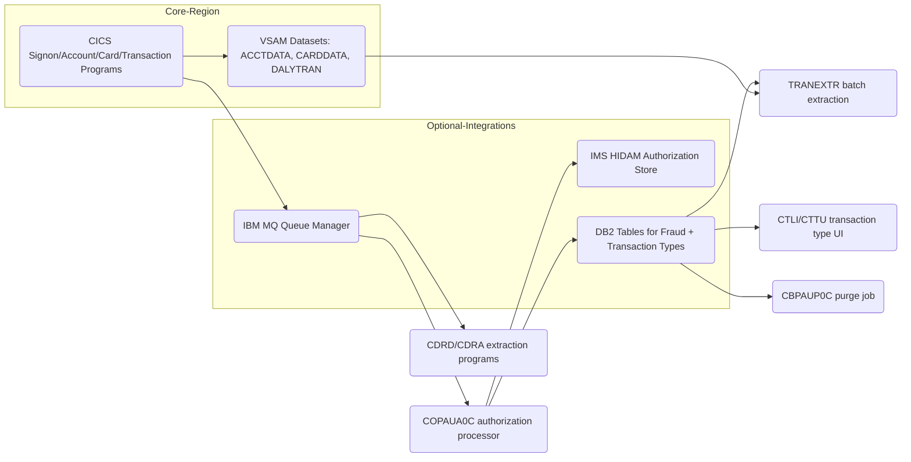
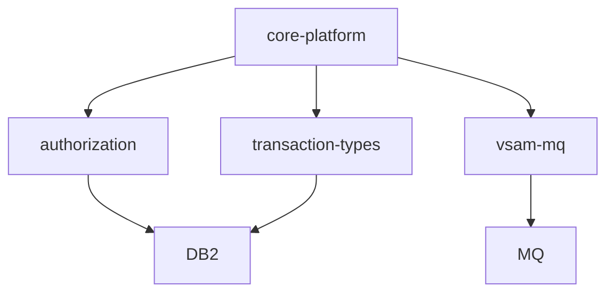

# System CardDemo - Overview for User Stories

**Version:** 1.0.0 (per README)  
**Purpose:** Single source of truth for US-centric modernization work on the CardDemo mainframe credit card management platform.

---

## 📊 Platform Statistics

- **Technology Stack:** COBOL 5.x, CICS, JCL batch jobs, VSAM KSDS/ESDS/RRDS datasets, optional IMS DB, DB2, IBM MQ, z/OS subsystem tooling.  
- **Architecture Pattern:** Transaction gateway (CICS) with screen mapsets feeding VSAM data, batch jobs for initialize/refresh, and optional IMS/DB2/MQ domains for enriched services.  
- **Key Capabilities:** Account and card lifecycle management, transaction posting and reporting, bill payments, user administration, MQ-based authorizations and account extractions, DB2 enrollment of reference data, and sample batch utilities.  
- **Supported Languages:** English only—the UI is implemented with BMS map text under `app/bms`; there are no separate locale files or translation layers.

---

## 🏗️ High-Level Architecture

### Technology Stack
**Backend:** COBOL programs (CICS + batch).  
**Frontend:** BMS map-driven 3270 screens managed by CICS programs (`COSGN00C`, `COACTVW`, `COTRN00C`, etc.).  
**Database:** VSAM (KSDS/ESDS/RRDS) for account/card/transaction data, optional IMS HIDAM for authorizations, DB2 tables for fraud analytics and transaction-type authority.  
**Messaging:** IBM MQ handles asynchronous authorization and extraction request/response flows.  
**Utilities:** JCL + helper scripts (`scripts/run_full_batch.sh`, compile templates) orchestrate batch workloads and resource installation.

### Architectural Patterns
- **Service Layer:** Each CICS transaction program (e.g., `COCRDUPC`, `COTRTUPC`) encapsulates business logic, validates user input via copybooks, and interacts with VSAM datasets or external systems.  
- **Repository Pattern:** Data access is abstracted through copybooks (`CVACT01Y`, `CVTRA06Y`, `CVCUS01Y`, etc.) that define structured VSAM record layouts, ensuring consistent field layout across programs.  
- **Integration Gates:** Optional modules expose MQ queue handlers (`COPAUA0C` for authorizations, `CDRD`/`CDRA` for account extractions) and batch jobs that sync IMS/DB2 with VSAM sources.  
- **Multi-tenancy:** High-level qualifier (HLQ) naming isolates datasets (e.g., `AWS.M2.CARDDEMO.*`).  
- **Authentication:** Hard-coded CICS userids (ADMIN001, USER0001) with RACF-managed profiles; signon handled in transaction `CC00`/program `COSGN00C`.

---

## 📚 Module Catalog

<!-- MODULE_LIST_START -->
**Modules:** core-platform, authorization, transaction-types, vsam-mq
<!-- MODULE_LIST_END -->

### 1. Core Platform
**ID:** `core-platform`  
**Purpose:** Deliver the baseline credit card management experience—user signon, account/card/transaction CRUD, billing, reporting, and admin utilities—entirely inside CICS using VSAM datasets and BMS mapsets.  
**Key Components:** `COSGN00C` (signon), `COACTVW`/`COACTVWC` (account view), `COCRDLIC`/`COCRDUP` (card list/update), `COTRN00C`/`CT02` (transaction list/add), `COBIL00C` (bill payment), `CBSTM03A` (reports), VSAM datasets (`AWS.M2.CARDDEMO.*`), and batch jobs (`POSTTRAN`, `INTCALC`, `TRANIDX`).  
**Public APIs:**  
- `CC00`/`COSGN00C`: authentication entry point (PF keys enforce user roles).  
- `CT00`/`COTRN00C` & `CT02`/`COTRN02C`: transaction list/add flows, rely on `CVTRA06Y` daily transaction records.  
- `CB00`/`COBIL00C`: bill payment process that updates account balance and writes to `DALYTRAN`.  
- Batch orchestration via JCL (example `POSTTRAN` → `INTCALC` → `TRANIDX`, all orchestrated by `scripts/run_full_batch.sh`).  
**Dependencies:** VSAM datasets (`ACCTDATA`, `CARDDATA`, `DALYTRAN`, etc.), copybooks in `app/cpy`, and the `scripts` toolchain for batch submission.  
**User Story Examples:**  
- As a cardholder, I want to view my account and card balances (COACTVW/CCLI) so that I can verify charges before paying.  
- As an operations analyst, I want batch posting (`POSTTRAN`) to run after data refresh so that daily statements include all transactions.  
**Acceptance Criteria Patterns:**  
- Validate PF keys, confirm role-based visibility, and enforce dataset locks before writing to VSAM.  
- Every interaction that mutates `DALYTRAN` must update `TRANBKP` or `COMBTRAN` to keep the KSDS copy in sync.  
- Batch scripts must submit jobs in documented order with 5–10 second pauses (per `scripts/run_full_batch.sh`) to avoid JES overload.

### 2. Authorization
**ID:** `authorization`  
**Purpose:** Provide MQ-driven credit card authorization processing with IMS storage for pending authorizations, DB2 fraud tracking, and batch cleanup.  
**Key Components:** `COPAUA0C` (MQ-triggered authorization handler), `COPAUS0C`/`COPAUS1C` (summary/detail BMS screens), `COPAUS2C` (fraud marking/DB2 updates), `CBPAUP0C` (batch purge), IMS DBD/PSB definitions, MQ queue definitions, DB2 table `AUTHFRDS`.  
**Public APIs:**  
- MQ `AWS.M2.CARDDEMO.PAUTH.REQUEST` (comma-separated authorization request payload) and `AWS.M2.CARDDEMO.PAUTH.REPLY` (response payload).  
- CICS transactions `CP00` (MQ-triggered processing), `CPVS` (summary), `CPVD` (details).  
- Batch `CBPAUP0J` for expired authorization purge.  
**Dependencies:** MQ listener configuration, IMS HIDAM segments (`PAUTSUM0`/`PAUTDTL1`), DB2 table `AUTHFRDS`, and fraud DML from `COPAUS2C`.  
**User Story Examples:**  
- As a merchant simulator, I want MQ-based authorization so that I can confirm approvals/declines quickly.  
- As a fraud analyst, I want to mark suspicious authorizations via `CPVD` so they are recorded in DB2.  
**Acceptance Criteria Patterns:**  
- Requests must parse the defined CSV order, call VSAM cross-reference files (`CVCRD01Y`), and respond before MQ timeout.  
- Fraud marking writes `AUTHFRDS` via DB2 static SQL and preserves two-phase commit semantics.  
- Expired authorizations are removed daily by `CBPAUP0J`; unmatched holds reduce available credit slots.

### 3. Transaction Types
**ID:** `transaction-types`  
**Purpose:** Enable administrators to manage transaction-type metadata through DB2 while keeping VSAM copies in sync for high-performance CICS processing.  
**Key Components:** `CTTU`/`COTRTUPC` (add/edit), `CTLI`/`COTRTLIC` (list/update/delete), batch `MNTTRDB2` with `COBTUPDT`, DB2 tables `TRANSACTION_TYPE` and `TRANSACTION_TYPE_CATEGORY`, cursor-driven screens, extraction job `TRANEXTR`.  
**Public APIs:**  
- CICS `CTLI` for browsing with forward/backward cursor scrolling and delete options, `CTTU` for create/update flows.  
- Batch `CREADB21` to build DB2 tables and `TRANEXTR`+`MNTTRDB2` to sync with VSAM.  
**Dependencies:** DB2 subsystem, CICS DB2 plans/transactions, `TRANEXTR` output VSAM files consumed by core transactions, Admin Menu entries (options 5/6).  
**User Story Examples:**  
- As an admin, I want to edit a transaction category description while preserving referential integrity so that reports stay accurate.  
- As a batch operator, I want `TRANEXTR` to regenerate VSAM-friendly files after DB2 edits so that live transactions use the latest metadata.  
**Acceptance Criteria Patterns:**  
- DB2 static SQL uses SQLCA to enforce commits/rollbacks.  
- Deletes check `TRANSACTION_TYPE_CATEGORY` foreign key (delete restrict).  
- CICS screen must allow PF7/PF8 paging with DB2 cursors and refresh the Admin Menu when jobs succeed.

### 4. VSAM MQ Extractions
**ID:** `vsam-mq`  
**Purpose:** Demonstrate MQ-based extraction patterns for system dates and account details, keeping asynchronous data exchange in sync with VSAM datasets.  
**Key Components:** transactions `CDRD` (`CODATE01`) and `CDRA` (`COACCT01`), MQ queue definitions, VSAM dataset access for account lookups, BMS screens for request/responses.  
**Public APIs:**  
- `CDRD` request/response message pair (DATE request/response structure).  
- `CDRA` request/response message pair (ACCT request/response structure).  
**Dependencies:** IBM MQ queues (`CARDDEMO.REQUEST.QUEUE`, `CARDDEMO.RESPONSE.QUEUE`), VSAM account records (`CVACT01Y`, `CVCUS01Y`), CICS MQCONN/MQQUEUE resources.  
**User Story Examples:**  
- As a distributed system, I want `CDRA` to return account metadata via MQ so that modernization tools can consume the same data as 3270 apps.  
- As a tester, I want `CDRD` to validate system date retrieval with message correlation IDs.  
**Acceptance Criteria Patterns:**  
- Messages must follow the `REQUEST-TYPE` header plus payload structure defined under Technical Details; responses must reuse correlation IDs for pairing.  
- Errors surface through MQ error handling logic instead of truncating VSAM lookups.

---

## 🔄 Architecture Diagram


```

## 🔗 Module Dependency Map


```

## 🧭 Actors and Journeys

### Actors
- **Regular Users:** Access their accounts, cards, and transactions via CICS screens (CC00 → CM00).  
- **Admin Users:** Manage user records, transaction types, and optional authorization data via the Admin Menu (CA00 + CTLI/CTTU).  
- **Systems/Integrations:** MQ clients and batch jobs interact with the platform through queue definitions and JCL.

### Journeys
1. **Cardholder Journey:** Log in with `CC00`, choose `COACTVW`/`COACTVWC` to inspect account/card state, optionally `CCLI` to view cards, run `CB00` for bill payment, and verify via `CR00` reports.  
2. **Admin Journey:** Sign in, open CA00 Admin Menu, list users (`CU00`), modify transaction types (`CTLI`/`CTTU`), and let `TRANEXTR` sync DB2 updates back to VSAM.  
3. **Authorization Flow:** MQ client hits `AWS.M2.CARDDEMO.PAUTH.REQUEST`, `COPAUA0C` approves/declines with VSAM/IMS read and writes `AWS.M2.CARDDEMO.PAUTH.REPLY`; analysts view via `CPVS`/`CPVD` and mark fraud via `COPAUS2C`.

---

## 📊 Data Models

### Account Record (`CVACT01Y` copybook, 300 bytes)
```cobol
01 ACCOUNT-RECORD.
   05 ACCT-ID               PIC 9(11).
   05 ACCT-ACTIVE-STATUS    PIC X(01).
   05 ACCT-CURR-BAL         PIC S9(10)V99.
   05 ACCT-CREDIT-LIMIT     PIC S9(10)V99.
   05 ACCT-CASH-CREDIT-LIMITPIC S9(10)V99.
   05 ACCT-OPEN-DATE        PIC X(10).
   05 ACCT-EXPIRAION-DATE   PIC X(10).
   05 ACCT-REISSUE-DATE     PIC X(10).
   05 ACCT-CURR-CYC-CREDIT  PIC S9(10)V99.
   05 ACCT-CURR-CYC-DEBIT   PIC S9(10)V99.
   05 ACCT-ADDR-ZIP         PIC X(10).
   05 ACCT-GROUP-ID         PIC X(10).
   05 FILLER                PIC X(178).
```

### Daily Transaction Record (`CVTRA06Y` copybook)
```cobol
01 DALYTRAN-RECORD.
   05 DALYTRAN-ID           PIC X(16).
   05 DALYTRAN-TYPE-CD      PIC X(02).
   05 DALYTRAN-CAT-CD       PIC 9(04).
   05 DALYTRAN-SOURCE       PIC X(10).
   05 DALYTRAN-DESC         PIC X(100).
   05 DALYTRAN-AMT          PIC S9(09)V99.
   05 DALYTRAN-MERCHANT-ID  PIC 9(09).
   05 DALYTRAN-MERCHANT-NAMEPIC X(50).
   05 DALYTRAN-MERCHANT-CITYPIC X(50).
   05 DALYTRAN-MERCHANT-ZIP PIC X(10).
   05 DALYTRAN-CARD-NUM     PIC X(16).
   05 DALYTRAN-ORIG-TS      PIC X(26).
   05 DALYTRAN-PROC-TS      PIC X(26).
   05 FILLER                PIC X(20).
```

### Authorization MQ Messages
```csv
AUTH-DATE, AUTH-TIME, CARD-NUM, AUTH-TYPE, CARD-EXPIRY-DATE, MESSAGE-TYPE, MESSAGE-SOURCE,
PROCESSING-CODE, TRANSACTION-AMT, MERCHANT-CATAGORY-CODE, ACQR-COUNTRY-CODE, POS-ENTRY-MODE,
MERCHANT-ID, MERCHANT-NAME, MERCHANT-CITY, MERCHANT-STATE, MERCHANT-ZIP, TRANSACTION-ID
```
```csv
CARD-NUM, TRANSACTION-ID, AUTH-ID-CODE, AUTH-RESP-CODE, AUTH-RESP-REASON, APPROVED-AMT
```

### DB2 Tables
```sql
CREATE TABLE CARDDEMO.AUTHFRDS (
  CARD_NUM CHAR(16) NOT NULL,
  AUTH_TS TIMESTAMP NOT NULL,
  AUTH_RESP_CODE CHAR(2),
  AUTH_FRAUD CHAR(1),
  PRIMARY KEY(CARD_NUM, AUTH_TS)
);

CREATE TABLE CARDDEMO.TRANSACTION_TYPE (
  TR_TYPE CHAR(2) NOT NULL PRIMARY KEY,
  TR_DESCRIPTION VARCHAR(50)
);

CREATE TABLE CARDDEMO.TRANSACTION_TYPE_CATEGORY (
  TRC_TYPE_CODE CHAR(2) NOT NULL,
  TRC_TYPE_CATEGORY CHAR(4) NOT NULL,
  TRC_CAT_DATA VARCHAR(50),
  FOREIGN KEY(TRC_TYPE_CODE) REFERENCES TRANSACTION_TYPE(TR_TYPE) ON DELETE RESTRICT
);
```

### IMS Structure (Authorization)
- Root segment `PAUTSUM0` holds summaries of pending authorizations keyed by `AUTH_SEQ`.  
- Child segment `PAUTDTL1` holds detail rows (merchant/address) for each summary entry, indexed by `PAUTINDX`.
- PSBs `PSBPAUTL`/`PSBPAUTB` expose BMP/LOAD interfaces used by CICS programs and batch purges.

---

## 📋 Business Rules by Module

### Core Platform Rules
- Customers can only change card/account data after passing signon (transaction `CC00`).  
- Bill payments update account balances atomically, generating `DALYTRAN` records that also feed `TRANBKP`.  
- Batch refresh script (`scripts/run_full_batch.sh`) submits JCL order with built-in pauses to avoid JES saturation.

### Authorization Rules
- Authorization requests must follow the exact MQ CSV ordering; missing fields trigger MQ rejection.  
- Fraud marking via `COPAUS2C` toggles `AUTH_FRAUD` and records a timestamp in DB2, ensuring two-phase commit when IMS updates occur.  
- Expired authorizations are purged nightly (`CBPAUP0J`) and release any reserved credit from VSAM cross-reference datasets.

### Transaction-Type Rules
- DB2 deletes are blocked when child categories exist (`DELETE RESTRICT`).  
- `TRANEXTR` keeps VSAM transaction-type reference files aligned after DB2 mutations.  
- CICS screens use DB2 cursors (PF7/PF8) to prevent over-fetching data into limited 3270 screens.

### VSAM MQ Rules
- `CDRA` and `CDRD` always set `REQUEST-TYPE` on MQ payloads and rely on correlation IDs for pairing.  
- Queue names (`CARDDEMO.REQUEST.QUEUE`, `CARDDEMO.RESPONSE.QUEUE`) are defined via `csd/` resources and managed by the MQCONN/MQQUEUE definitions.  
- Errors in MQ flows bubble up with exit codes instead of silent data loss.

---

## 🌐 Internationalization and Translation

- UI text is embedded in BMS maps (`app/bms/**`); there are no `locales/` or `.json` translations.  
- All labels, prompts, and help text currently target English-speaking operations teams.  
- Future US-focused stories should plan for language support only if new UI layers are added (for now, translation would mean editing BMS text directly).

---

## 📋 Form and Listing Patterns

- Every screen is defined by one or more BMS mapsets (e.g., `COACTVW` for account view, `COTRTLI` for transaction-type list).  
- Forms are page-based, field definitions come from copybooks, and validation occurs in COBOL/COBOL copybook logic rather than shared UI components (no BaseForm/DataTable components exist).  
- Listings (e.g., CTLI) use PF7/PF8 for paging and PF keys (PF5) for actions; there is no client-side pagination, everything is driven by DB2 cursor positioning.  
- Notifications (errors/success) are rendered immediately on the same 3270 page using standard BMS text fields (makes use of `CSMSG01Y`, `CSMSG02Y` copybooks).

---

## 🎯 User Story Development Patterns

### Templates per Domain
- **Account Management:** As a customer, I want to [view/update account info] so that [I can reconcile charges].  
- **Authorization:** As a fraud analyst, I want to [review/mark authorizations] so that [I can feed accurate data to DB2].  
- **Admin Reference:** As an admin, I want to [edit transaction types or users] so that [critical metadata stays consistent].  
- **Integration:** As a systems engineer, I want to [send MQ requests] so that [external systems can reuse CardDemo data].

### Complexity Guidelines
- **Simple (1-2 pts):** Modify a single CICS transaction page or refresh a copybook.  
- **Medium (3-5 pts):** Add a new field that flows from VSAM to a BMS map and to batch (requires shared copybook updates).  
- **Complex (5-8 pts):** Introduce a new MQ/DB2/IMS integration with two-phase commit, new datasets, and transaction-type impacts.

### Acceptance Criteria Patterns
- **Authentication:** Users must be validated (`CC00` + RACF profile).  
- **Validation:** COBOL logic must enforce field-level limits defined in copybooks (e.g., `ACCT-ID` length 11).  
- **Performance:** CICS screens must respond in <2 seconds; MQ responses must return within 1 second (per MQ tunable).  
- **Error Handling:** PF key errors are surfaced using BMS `CSMSG` copybooks and entry is blocked until corrected.

---

## ⚡ Performance Budgets

- **Interactive CICS Response:** Target <2 seconds per transaction (COACT*, COCRD*, CT* flows).  
- **MQ Response:** Authorization/extraction patterns must respond within 1 second per queue round trip to keep merchants/test harnesses happy.  
- **Batch Runtime:** Full refresh script (`scripts/run_full_batch.sh` entries) is budgeted for ~6 minutes, with 5-10 second sleeps between job submissions to stay under JES churn.  
- **DB2 Queries:** Static SQL for transaction types and fraud lookups should finish within 200 ms (P95) on the target z/OS subsystem.  
- **Cache Hit Ratio:** VSAM index lookups (e.g., `CARDDAT`, `TRANBKP`) should aim for >90% to avoid sequential reads.

---

## 🚨 Readiness Considerations

### Technical Risks
- **RISK-1 (Mainframe Access):** Need dependable JES/JCL/FTP tunnels (`2121:`, `tnftp` script).  
  → Mitigation: Validate `scripts/run_full_batch.sh` before rollout and document alternative submission steps.  
- **RISK-2 (Optional Systems):** DB2/IMS/MQ are optional but required for modules—lack of connectivity blocks those modules.  
  → Mitigation: Provide fallbacks (disable optional menu entries) and include gating tests that verify `CREADB21`, `CBPAUP0J`, `COPAUA0C` before release.

### Tech Debt
- **DEBT-1:** COBOL copybooks predate modern naming conventions and contain unused filler (e.g., `FILLER PIC X(178)` in `CVACT01Y`).  
  → Resolution: Rationalize copybooks when enhancing related code to keep field offsets predictable.
- **DEBT-2:** Documentation for MQ message correlation is textual only; consider automating schema validation if new queue types are added.

### Sequencing for User Stories
- **Prerequisites:** Create datasets (`AWS.M2.CARDDEMO.*`), compile programs via provided templates, define CICS resources (mapsets, transactions), and ensure base HLQ is configured.  
- **Recommended order:** 1. Core dataset initialization (JCL jobs + `scripts/run_full_batch.sh`). 2. CICS resource installation (CSD, `CEDA INSTALL`). 3. Optional modules (authorization → IMS/DB2 + MQ; transaction types → DB2; VSAM/MQ).  
- **Postconditions:** Run validation flows (e.g., `CT02`, `CDRA`, `CP00`) plus DB2 `TRANEXTR` to ensure consumed VSAM files have expected data.

---

## 📈 Success Metrics

### Adoption
- **Target:** 100% of US proof-of-concept runs use at least the core module and one optional module (authorization or transaction-types).  
- **Engagement:** Track the number of MQ requests processed daily by `COPAUA0C`/`CDRA`.  
- **Retention:** Monitor repeated use of Admin Menu options (5/6) across releases; success is seeing consistent DB2 updates via `TRANEXTR`.

### Business Impact
- **Metric-1:** Reduce manual dataset refresh time by 30% using `scripts/run_full_batch.sh` automation.  
- **Metric-2:** Increase fraud detection coverage by ensuring DB2 `AUTHFRDS` contains all marked authorizations from `CPVD`/`COPAUS2C` workflows.

*Last updated: March 12, 2026*
