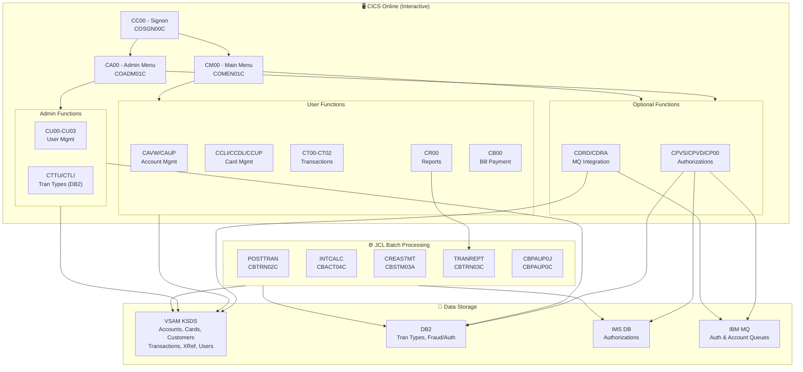
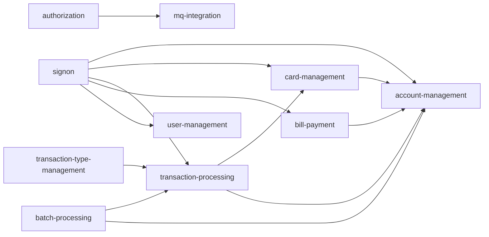

# System CardDemo - Overview for User Stories

**Version:** 2026-03-06  
**Purpose:** Single source of truth for creating well-structured User Stories

---

## 📊 Platform Statistics

- **Technology Stack:** COBOL, CICS, VSAM (KSDS with AIX), JCL, RACF, Assembler; Optional: DB2, IMS DB, MQ
- **Architecture Pattern:** Mainframe online (CICS) + batch processing; event-driven via MQ (optional)
- **Key Capabilities:** Credit card account management, card management, transaction processing, bill payment, reporting, user/admin management, optional credit card authorization/fraud detection
- **Supported Languages:** English (US)
- **Application Version:** CardDemo v1.0
- **License:** Apache 2.0

---

## 🏗️ High-Level Architecture

### Technology Stack
**Core Runtime:** IBM CICS (Transaction Processing)  
**Language:** COBOL (primary), Assembler (utilities)  
**Storage:** VSAM KSDS with Alternate Index (AIX)  
**Batch:** JCL with standard utilities (IDCAMS, IEBGENER, SORT) and custom COBOL programs  
**Security:** RACF  
**Optional:** DB2 (relational), IMS DB (hierarchical), IBM MQ (messaging)

### Architectural Patterns
- **Two-Tier (Online + Batch):** CICS handles interactive sessions; JCL batch jobs run independently for heavy processing (posting, interest, statements)
- **Screen-Map Separation:** BMS maps define screen layouts; separate COBOL programs handle business logic
- **Copybook-Driven Data Models:** Shared COBOL copybooks define record structures for all datasets
- **VSAM KSDS with AIX:** Primary data store for accounts, cards, customers, transactions with keyed + alternate key access
- **Multi-Role Access:** Regular users and admin users with separate menus and function access
- **Transaction Code Entry:** All CICS transactions identified by 4-character codes (CC00, CM00, etc.)

### Entry Points
- **Online:** Start via CICS transaction `CC00` (Signon)
  - Admin: `ADMIN001` / `PASSWORD`
  - User: `USER0001` / `PASSWORD`
- **Batch:** Submit JCL jobs in defined sequence (see Running Batch Jobs)

---

## 📚 Module Catalog

<!-- MODULE_LIST_START -->
**Modules:** signon, account-management, card-management, transaction-processing, bill-payment, user-management, batch-processing, authorization, transaction-type-management, mq-integration
<!-- MODULE_LIST_END -->

---

### 1. Signon
**ID:** `signon`  
**Purpose:** Authenticates users against the VSAM user security file; routes to the appropriate menu based on user type (regular vs. admin).  
**Key Components:** `COSGN00C.cbl` (program), `COSGN00.bms` (screen map), `CSUSR01Y.cpy` (user record copybook)  
**CICS Transaction:** `CC00`  
**VSAM Dataset:** `AWS.M2.CARDDEMO.USRSEC.PS` (user security file)

**Transactions:**
- `CC00` → `COSGN00C` — presents login screen, validates credentials, routes to `CM00` (user menu) or `CA00` (admin menu)

**User Story Examples:**
- As a cardholder, I want to sign in with my user ID and password so that I can access my account securely.
- As an admin, I want to authenticate with admin credentials so that I can manage users and system configuration.

---

### 2. Account Management
**ID:** `account-management`  
**Purpose:** Allows authenticated users to view and update their credit card account details including balances, credit limits, dates, and zip code.  
**Key Components:** `COACTVWC.cbl` (view), `COACTUPC.cbl` (update), `COACTUP.bms`/`COACTVW.bms` (screens), `CVACT01Y.cpy` (account record)  
**CICS Transactions:** `CAVW` (view), `CAUP` (update)  
**VSAM Dataset:** `AWS.M2.CARDDEMO.ACCTDATA.PS`

**Transactions:**
- `CAVW` → `COACTVWC` — read-only view of account record
- `CAUP` → `COACTUPC` — update account fields

**User Story Examples:**
- As a cardholder, I want to view my current balance and credit limit so that I can plan my spending.
- As a cardholder, I want to update my billing zip code so that my address information stays current.

---

### 3. Card Management
**ID:** `card-management`  
**Purpose:** Manage credit cards: list all cards on an account, view card details (including CVV), and update card information or status.  
**Key Components:** `COCRDLIC.cbl` (list), `COCRDSLC.cbl` (view/select), `COCRDUPC.cbl` (update), `CVACT02Y.cpy` (card record), `CVACT03Y.cpy` (card-xref record)  
**CICS Transactions:** `CCLI` (list), `CCDL` (view), `CCUP` (update)  
**VSAM Datasets:** `AWS.M2.CARDDEMO.CARDDATA.PS`, `AWS.M2.CARDDEMO.CARDXREF.PS`

**Transactions:**
- `CCLI` → `COCRDLIC` — paginated list of cards for an account
- `CCDL` → `COCRDSLC` — view card detail
- `CCUP` → `COCRDUPC` — update card fields (name, expiry, active status)

**User Story Examples:**
- As a cardholder, I want to see all cards linked to my account so that I have an overview of my portfolio.
- As a cardholder, I want to view my card details including expiration date so that I can verify the card is valid.
- As a cardholder, I want to deactivate a lost card so that unauthorized charges are prevented.

---

### 4. Transaction Processing
**ID:** `transaction-processing`  
**Purpose:** View transaction history, add new transactions, and generate transaction reports from the CICS online environment.  
**Key Components:** `COTRN00C.cbl` (list), `COTRN01C.cbl` (view), `COTRN02C.cbl` (add), `CORPT00C.cbl` (report), `CVTRA05Y.cpy` (transaction record), `CVTRA06Y.cpy` (daily transaction)  
**CICS Transactions:** `CT00` (list), `CT01` (view), `CT02` (add), `CR00` (report)  
**VSAM Dataset:** `AWS.M2.CARDDEMO.TRANSACT.VSAM.KSDS`

**Transactions:**
- `CT00` → `COTRN00C` — paginated transaction list by account
- `CT01` → `COTRN01C` — view single transaction detail
- `CT02` → `COTRN02C` — add a new transaction (manual entry)
- `CR00` → `CORPT00C` — trigger/view transaction reports (submits `TRANREPT` batch)

**User Story Examples:**
- As a cardholder, I want to view my transaction history so that I can track my spending.
- As a cardholder, I want to view the details of a specific transaction so that I can verify charges.
- As a cardholder, I want to add a manual transaction so that a special purchase is recorded.
- As a cardholder, I want to generate a transaction report so that I have a summary for a date range.

---

### 5. Bill Payment
**ID:** `bill-payment`  
**Purpose:** Process bill payments against a credit card account, updating the account balance.  
**Key Components:** `COBIL00C.cbl` (program), `COBIL00.bms` (screen)  
**CICS Transaction:** `CB00`  
**VSAM Datasets:** `AWS.M2.CARDDEMO.ACCTDATA.PS`, `AWS.M2.CARDDEMO.CARDXREF.PS`

**Transactions:**
- `CB00` → `COBIL00C` — enter payment amount; updates account current balance

**User Story Examples:**
- As a cardholder, I want to pay my bill so that my account balance is reduced.
- As a cardholder, I want to confirm the payment amount before submitting so that I avoid errors.

---

### 6. User Management
**ID:** `user-management`  
**Purpose:** Admin-only module to list, add, update, and delete users in the VSAM user security file.  
**Key Components:** `COUSR00C.cbl` (list), `COUSR01C.cbl` (add), `COUSR02C.cbl` (update), `COUSR03C.cbl` (delete), `CSUSR01Y.cpy` (user record)  
**CICS Transactions:** `CU00` (list), `CU01` (add), `CU02` (update), `CU03` (delete)  
**VSAM Dataset:** `AWS.M2.CARDDEMO.USRSEC.PS`

**Access:** Admin users only (via Admin Menu `CA00`)

**Transactions:**
- `CU00` → `COUSR00C` — paginated user list
- `CU01` → `COUSR01C` — add new user (ID, name, password, type)
- `CU02` → `COUSR02C` — update user details
- `CU03` → `COUSR03C` — delete user record

**User Story Examples:**
- As an admin, I want to create new user accounts so that new employees can access the system.
- As an admin, I want to update a user's password so that account security can be maintained.
- As an admin, I want to delete a user so that terminated employees lose access.
- As an admin, I want to list all users so that I can audit system access.

---

### 7. Batch Processing
**ID:** `batch-processing`  
**Purpose:** Nightly/scheduled batch jobs that perform transaction posting, interest calculation, statement generation, data maintenance, and file management.  
**Key Components:** `CBTRN01C.cbl` (transaction validation), `CBTRN02C.cbl` (transaction posting), `CBTRN03C.cbl` (transaction report), `CBACT01C.cbl`–`CBACT04C.cbl` (account utilities + interest calc), `CBSTM03A.CBL`/`CBSTM03B.CBL` (statement generation), `CBEXPORT.cbl`/`CBIMPORT.cbl` (data export/import), `CBCUS01C.cbl` (customer batch), `CSUTLDTC.cbl` (date utilities), `COBSWAIT.cbl` (batch wait utility)  
**Scheduler:** `CardDemo.ca7` (CA7), `CardDemo.controlm` (Control-M)  
**JCL Jobs:** POSTTRAN, INTCALC, COMBTRAN, CREASTMT, TRANREPT, TRANBKP, and many others

**Key Batch Flows:**
1. **Transaction Posting** (POSTTRAN → CBTRN02C): Reads daily transactions from `DALYTRAN`, validates card/account cross-reference, posts to transaction VSAM, updates account balance and category balances, rejects invalid records to `DALYREJS`.
2. **Interest Calculation** (INTCALC → CBACT04C): Reads transaction category balances (`TCATBALF`), looks up interest rates in disclosure groups (`DISCGRP`), computes interest, updates account balances.
3. **Statement Generation** (CREASTMT → CBSTM03A): Combines transactions and produces formatted customer statements.
4. **Transaction Report** (TRANREPT → CBTRN03C): Generates transaction reports; triggered from online (`CR00`).
5. **Data Maintenance**: ACCTFILE, CARDFILE, CUSTFILE, XREFFILE, TRANFILE — refresh VSAM datasets from source.

**User Story Examples:**
- As a system operator, I want to run the nightly transaction posting job so that daily transactions are applied to accounts.
- As a system operator, I want to schedule interest calculation so that account balances reflect accrued interest.
- As a cardholder, I want monthly statements generated automatically so that I receive a summary of my activity.

---

### 8. Authorization (Optional)
**ID:** `authorization`  
**Purpose:** Real-time credit card authorization processing via IBM MQ; stores authorization records in IMS DB with fraud analytics in DB2. Includes pending authorization viewing and batch purging.  
**Key Components:** `COPAUA0C.cbl` (MQ authorization processor), `COPAUS0C.cbl` (pending auth summary), `COPAUS1C.cbl` (pending auth detail), `CBPAUP0C.cbl` (batch purge), `CIPAUDTY.cpy`/`CIPAUSMY.cpy` (IMS data structures)  
**CICS Transactions:** `CPVS` (summary), `CPVD` (detail), `CP00` (MQ-triggered processor)  
**Dependencies:** IMS DB (`DBPAUTP0`), DB2 (`AUTHFRDS`), MQ queues

**Transactions:**
- `CP00` → `COPAUA0C` — MQ-triggered; processes authorization requests/responses; reads/updates IMS, inserts to DB2
- `CPVS` → `COPAUS0C` — display pending authorization summary from IMS + VSAM
- `CPVD` → `COPAUS1C` — display authorization detail; update IMS, insert DB2 fraud record

**Batch:**
- `CBPAUP0J` → `CBPAUP0C` — purge expired authorizations from IMS

**User Story Examples:**
- As a merchant system, I want to submit authorization requests via MQ so that transactions are approved or declined in real time.
- As a cardholder, I want to view pending authorizations so that I can see holds on my account.
- As a fraud analyst, I want authorization events logged in DB2 so that I can run fraud analytics queries.
- As a system operator, I want expired authorizations purged nightly so that IMS storage is managed.

---

### 9. Transaction Type Management (Optional)
**ID:** `transaction-type-management`  
**Purpose:** Admin maintenance of transaction type reference data stored in DB2; demonstrates embedded static SQL, cursor processing, and CRUD operations against a relational database.  
**Key Components:** `COTRTUPC.cbl` (add/edit), `COTRTLIC.cbl` (list/update/delete), `COBTUPDT.cbl` (batch maintenance), `TRNTYPE.ddl`/`TRNTYCAT.ddl` (DB2 schema)  
**CICS Transactions:** `CTTU` (add/edit), `CTLI` (list)  
**Dependencies:** DB2 tables `TRNTYPE`, `TRNTYCAT`; syncs to VSAM via `TRANEXTR`

**Transactions:**
- `CTTU` → `COTRTUPC` — add or update a transaction type in DB2
- `CTLI` → `COTRTLIC` — list, update, or delete transaction types using forward/backward DB2 cursors

**Batch:**
- `MNTTRDB2` → `COBTUPDT` — batch update of DB2 transaction type table
- `TRANEXTR` → `DSNTIAUL` — extract DB2 data and create VSAM-compatible files

**User Story Examples:**
- As an admin, I want to add a new transaction type in DB2 so that new transaction categories can be processed.
- As an admin, I want to delete obsolete transaction types so that the reference data stays clean.
- As a system operator, I want to extract DB2 transaction types to VSAM so that batch processing uses current reference data.

---

### 10. MQ Integration (Optional)
**ID:** `mq-integration`  
**Purpose:** Demonstrates asynchronous MQ request/response patterns for account and date inquiries from external systems.  
**Key Components:** `COACCT01.cbl` (account via MQ), `CODATE01.cbl` (date via MQ)  
**CICS Transactions:** `CDRA` (account details), `CDRD` (system date)  
**Dependencies:** IBM MQ queues (`CARDDEMO.REQUEST.QUEUE`, `CARDDEMO.RESPONSE.QUEUE`)

**Transactions:**
- `CDRD` → `CODATE01` — respond to MQ date inquiry requests
- `CDRA` → `COACCT01` — respond to MQ account detail requests

**User Story Examples:**
- As an external system, I want to query account details via MQ so that I can integrate without direct database access.
- As an integration developer, I want to test MQ request/response patterns so that I can model asynchronous communication.

---

## 🔄 Architecture Diagram



### Module Dependency Diagram



---

## 📊 Data Models

### ACCOUNT-RECORD (CVACT01Y) — Record Length 300
```cobol
01  ACCOUNT-RECORD.
    05  ACCT-ID                   PIC 9(11).          -- Unique account identifier
    05  ACCT-ACTIVE-STATUS        PIC X(01).          -- 'Y' active, 'N' inactive
    05  ACCT-CURR-BAL             PIC S9(10)V99.      -- Current balance (signed decimal)
    05  ACCT-CREDIT-LIMIT         PIC S9(10)V99.      -- Credit limit
    05  ACCT-CASH-CREDIT-LIMIT    PIC S9(10)V99.      -- Cash advance credit limit
    05  ACCT-OPEN-DATE            PIC X(10).          -- YYYY-MM-DD
    05  ACCT-EXPIRAION-DATE       PIC X(10).          -- YYYY-MM-DD
    05  ACCT-REISSUE-DATE         PIC X(10).          -- YYYY-MM-DD
    05  ACCT-CURR-CYC-CREDIT      PIC S9(10)V99.      -- Current cycle credits
    05  ACCT-CURR-CYC-DEBIT       PIC S9(10)V99.      -- Current cycle debits
    05  ACCT-ADDR-ZIP             PIC X(10).          -- Billing zip code
    05  ACCT-GROUP-ID             PIC X(10).          -- Disclosure group identifier
    05  FILLER                    PIC X(178).
```
**VSAM Dataset:** `AWS.M2.CARDDEMO.ACCTDATA.PS` (FB, 300)

---

### CUSTOMER-RECORD (CVCUS01Y) — Record Length 500
```cobol
01  CUSTOMER-RECORD.
    05  CUST-ID                   PIC 9(09).          -- Customer identifier
    05  CUST-FIRST-NAME           PIC X(25).
    05  CUST-MIDDLE-NAME          PIC X(25).
    05  CUST-LAST-NAME            PIC X(25).
    05  CUST-ADDR-LINE-1          PIC X(50).
    05  CUST-ADDR-LINE-2          PIC X(50).
    05  CUST-ADDR-LINE-3          PIC X(50).
    05  CUST-ADDR-STATE-CD        PIC X(02).
    05  CUST-ADDR-COUNTRY-CD      PIC X(03).
    05  CUST-ADDR-ZIP             PIC X(10).
    05  CUST-PHONE-NUM-1          PIC X(15).
    05  CUST-PHONE-NUM-2          PIC X(15).
    05  CUST-SSN                  PIC 9(09).          -- Social Security Number
    05  CUST-GOVT-ISSUED-ID       PIC X(20).
    05  CUST-DOB-YYYY-MM-DD       PIC X(10).
    05  CUST-EFT-ACCOUNT-ID       PIC X(10).
    05  CUST-PRI-CARD-HOLDER-IND  PIC X(01).
    05  CUST-FICO-CREDIT-SCORE    PIC 9(03).
    05  FILLER                    PIC X(168).
```
**VSAM Dataset:** `AWS.M2.CARDDEMO.CUSTDATA.PS` (FB, 500)

---

### CARD-RECORD (CVACT02Y) — Record Length 150
```cobol
01  CARD-RECORD.
    05  CARD-NUM                  PIC X(16).          -- 16-digit card number
    05  CARD-ACCT-ID              PIC 9(11).          -- Linked account ID
    05  CARD-CVV-CD               PIC 9(03).          -- CVV security code
    05  CARD-EMBOSSED-NAME        PIC X(50).          -- Name on card
    05  CARD-EXPIRAION-DATE       PIC X(10).          -- YYYY-MM-DD
    05  CARD-ACTIVE-STATUS        PIC X(01).          -- 'Y' active
    05  FILLER                    PIC X(59).
```
**VSAM Dataset:** `AWS.M2.CARDDEMO.CARDDATA.PS` (FB, 150)

---

### CARD-XREF-RECORD (CVACT03Y) — Record Length 50
```cobol
01 CARD-XREF-RECORD.
    05  XREF-CARD-NUM             PIC X(16).          -- Card number (key)
    05  XREF-CUST-ID              PIC 9(09).          -- Customer identifier
    05  XREF-ACCT-ID              PIC 9(11).          -- Account identifier
    05  FILLER                    PIC X(14).
```
**VSAM Dataset:** `AWS.M2.CARDDEMO.CARDXREF.PS` (FB, 50)

---

### TRAN-RECORD (CVTRA05Y) — Record Length 350
```cobol
01  TRAN-RECORD.
    05  TRAN-ID                   PIC X(16).          -- Transaction identifier
    05  TRAN-TYPE-CD              PIC X(02).          -- Transaction type code
    05  TRAN-CAT-CD               PIC 9(04).          -- Category code
    05  TRAN-SOURCE               PIC X(10).          -- Source system
    05  TRAN-DESC                 PIC X(100).         -- Description
    05  TRAN-AMT                  PIC S9(09)V99.      -- Amount (signed)
    05  TRAN-MERCHANT-ID          PIC 9(09).
    05  TRAN-MERCHANT-NAME        PIC X(50).
    05  TRAN-MERCHANT-CITY        PIC X(50).
    05  TRAN-MERCHANT-ZIP         PIC X(10).
    05  TRAN-CARD-NUM             PIC X(16).          -- Card used
    05  TRAN-ORIG-TS              PIC X(26).          -- Origination timestamp
    05  TRAN-PROC-TS              PIC X(26).          -- Processing timestamp
    05  FILLER                    PIC X(20).
```
**VSAM Dataset:** `AWS.M2.CARDDEMO.TRANSACT.VSAM.KSDS` (FB, 350)

---

### SEC-USER-DATA (CSUSR01Y) — Record Length 80
```cobol
01 SEC-USER-DATA.
    05 SEC-USR-ID                 PIC X(08).          -- 8-char user ID
    05 SEC-USR-FNAME              PIC X(20).          -- First name
    05 SEC-USR-LNAME              PIC X(20).          -- Last name
    05 SEC-USR-PWD                PIC X(08).          -- 8-char password
    05 SEC-USR-TYPE               PIC X(01).          -- 'U' user, 'A' admin
    05 SEC-USR-FILLER             PIC X(23).
```
**VSAM Dataset:** `AWS.M2.CARDDEMO.USRSEC.PS` (FB, 80)

---

### TRAN-TYPE-RECORD (CVTRA03Y) — Record Length 60
```cobol
01  TRAN-TYPE-RECORD.
    05  TRAN-TYPE                 PIC X(02).          -- 2-char type code
    05  TRAN-TYPE-DESC            PIC X(50).          -- Description
    05  FILLER                    PIC X(08).
```
**VSAM Dataset:** `AWS.M2.CARDDEMO.TRANTYPE.PS` / DB2 `TRNTYPE` table

---

### TRAN-CAT-RECORD (CVTRA04Y) — Record Length 60
```cobol
01  TRAN-CAT-RECORD.
    05  TRAN-CAT-KEY.
        10  TRAN-TYPE-CD          PIC X(02).
        10  TRAN-CAT-CD           PIC 9(04).
    05  TRAN-CAT-TYPE-DESC        PIC X(50).
    05  FILLER                    PIC X(04).
```
**VSAM Dataset:** `AWS.M2.CARDDEMO.TRANCATG.PS` / DB2 `TRNTYCAT` table

---

### DIS-GROUP-RECORD (CVTRA02Y) — Record Length 50
```cobol
01  DIS-GROUP-RECORD.
    05  DIS-GROUP-KEY.
        10 DIS-ACCT-GROUP-ID      PIC X(10).          -- Account group
        10 DIS-TRAN-TYPE-CD       PIC X(02).
        10 DIS-TRAN-CAT-CD        PIC 9(04).
    05  DIS-INT-RATE              PIC S9(04)V99.       -- Interest rate %
    05  FILLER                    PIC X(28).
```
**VSAM Dataset:** `AWS.M2.CARDDEMO.DISCGRP.PS`

---

### TRAN-CAT-BAL-RECORD (CVTRA01Y) — Record Length 50
```cobol
01  TRAN-CAT-BAL-RECORD.
    05  TRAN-CAT-KEY.
        10 TRANCAT-ACCT-ID        PIC 9(11).
        10 TRANCAT-TYPE-CD        PIC X(02).
        10 TRANCAT-CD             PIC 9(04).
    05  TRAN-CAT-BAL              PIC S9(09)V99.       -- Balance per category
    05  FILLER                    PIC X(22).
```
**VSAM Dataset:** `AWS.M2.CARDDEMO.TCATBALF.PS`

---

## 📋 Business Rules by Module

### Signon Rules
- User ID: 8 characters, stored in `SEC-USR-ID`
- Password: 8 characters, stored in `SEC-USR-PWD`
- User type `A` → routes to Admin Menu (`CA00`); type `U` → Main Menu (`CM00`)
- Invalid credentials: error message displayed, user remains on signon screen
- No account lockout mechanism in base application

### Account Management Rules
- Account status must be `Y` (active) for account updates
- Credit limit must be ≥ current balance
- Cash credit limit must be ≤ credit limit
- Balance is maintained as signed decimal (COMP-3)
- Account Group ID links to disclosure groups for interest rate determination

### Card Management Rules
- Card number is 16 characters
- CVV is 3 digits
- A card must link to a valid account via `CARD-ACCT-ID`
- Card cross-reference (`CARDXREF`) links card → customer → account
- Cards can be active (`Y`) or inactive (`N`)

### Transaction Processing Rules
- Transaction ID is 16 characters
- Transaction amount is signed (credits are negative, debits are positive)
- Each transaction references a card number (resolved to account via XREF)
- Transaction type code (2 chars) + category code (4 digits) determine disclosure group and interest rate
- Invalid card numbers result in rejected records written to `DALYREJS`
- Timestamps use 26-character format (YYYY-MM-DD HH:MM:SS.MMMMMM)

### Bill Payment Rules
- Payment reduces `ACCT-CURR-BAL`
- Payment amount must be > 0
- Payment is applied immediately to account balance in VSAM

### Interest Calculation Rules
- Interest rate determined by: `ACCT-GROUP-ID` + `TRAN-TYPE-CD` + `TRAN-CAT-CD` → `DIS-INT-RATE`
- Interest is calculated per transaction category balance
- Results update `ACCT-CURR-BAL` and `ACCT-CURR-CYC-CREDIT`/`ACCT-CURR-CYC-DEBIT`

### User Management Rules
- User ID must be unique in the security file
- Password is stored as plain text (8 chars) — no encryption in base application
- User type must be `U` (regular) or `A` (admin)
- Admin can delete any user except themselves (application-controlled)

### Authorization Rules (Optional)
- Authorization requests arrive via MQ; processed by `COPAUA0C` (MQ-triggered)
- Authorization records stored in IMS hierarchical database
- Approved/declined decision logged in DB2 for fraud analytics
- Expired authorizations purged by batch job `CBPAUP0J`
- Authorization details (amount, merchant, card, decision) stored in IMS

---

## 📋 CICS Transaction Inventory

| Transaction | Program  | Module                    | Function                           |
|:------------|:---------|:--------------------------|:-----------------------------------|
| CC00        | COSGN00C | signon                    | Signon Screen                      |
| CM00        | COMEN01C | signon                    | Main Menu                          |
| CA00        | COADM01C | user-management           | Admin Menu                         |
| CAVW        | COACTVWC | account-management        | Account View                       |
| CAUP        | COACTUPC | account-management        | Account Update                     |
| CCLI        | COCRDLIC | card-management           | Credit Card List                   |
| CCDL        | COCRDSLC | card-management           | Credit Card View                   |
| CCUP        | COCRDUPC | card-management           | Credit Card Update                 |
| CT00        | COTRN00C | transaction-processing    | Transaction List                   |
| CT01        | COTRN01C | transaction-processing    | Transaction View                   |
| CT02        | COTRN02C | transaction-processing    | Transaction Add                    |
| CR00        | CORPT00C | transaction-processing    | Transaction Reports                |
| CB00        | COBIL00C | bill-payment              | Bill Payment                       |
| CPVS        | COPAUS0C | authorization             | Pending Authorization Summary      |
| CPVD        | COPAUS1C | authorization             | Pending Authorization Details      |
| CP00        | COPAUA0C | authorization             | Process Authorization (MQ trigger) |
| CU00        | COUSR00C | user-management           | List Users                         |
| CU01        | COUSR01C | user-management           | Add User                           |
| CU02        | COUSR02C | user-management           | Update User                        |
| CU03        | COUSR03C | user-management           | Delete User                        |
| CTTU        | COTRTUPC | transaction-type-management | Tran Type add/edit (DB2)         |
| CTLI        | COTRTLIC | transaction-type-management | Tran Type list/update/delete (DB2)|
| CDRD        | CODATE01 | mq-integration            | System Date via MQ                 |
| CDRA        | COACCT01 | mq-integration            | Account Details via MQ             |

---

## ⚙️ Batch Job Inventory

| Job      | Program  | Module                    | Function                                     |
|:---------|:---------|:--------------------------|:---------------------------------------------|
| DUSRSECJ | IEBGENER | user-management           | Load initial user security file              |
| ACCTFILE | IDCAMS   | account-management        | Refresh account VSAM from source             |
| CARDFILE | IDCAMS   | card-management           | Refresh card VSAM from source                |
| CUSTFILE | IDCAMS   | account-management        | Refresh customer VSAM from source            |
| XREFFILE | IDCAMS   | card-management           | Refresh card-account xref VSAM               |
| TRANFILE | IDCAMS   | transaction-processing    | Load initial transaction VSAM                |
| TRANBKP  | IDCAMS   | transaction-processing    | Backup transaction VSAM                      |
| TRANCATG | IDCAMS   | transaction-processing    | Load transaction category types              |
| TRANTYPE | IDCAMS   | transaction-processing    | Load transaction type file                   |
| DISCGRP  | IDCAMS   | batch-processing          | Load disclosure group file                   |
| TCATBALF | IDCAMS   | batch-processing          | Load transaction category balance file       |
| POSTTRAN | CBTRN02C | batch-processing          | Post daily transactions                      |
| INTCALC  | CBACT04C | batch-processing          | Calculate interest charges                   |
| COMBTRAN | SORT     | batch-processing          | Combine daily + system transactions          |
| CREASTMT | CBSTM03A | batch-processing          | Generate customer statements                 |
| TRANREPT | CBTRN03C | transaction-processing    | Generate transaction report                  |
| TRANIDX  | IDCAMS   | transaction-processing    | Define AIX on transaction VSAM               |
| OPENFIL  | IEFBR14  | batch-processing          | Open VSAM files for CICS                     |
| CLOSEFIL | IEFBR14  | batch-processing          | Close VSAM files from CICS                   |
| WAITSTEP | COBSWAIT | batch-processing          | Wait step (timer utility)                    |
| CREADB21 | DSNTEP4  | transaction-type-management | Create DB2 database and load tables        |
| TRANEXTR | DSNTIAUL | transaction-type-management | Extract DB2 data to VSAM                   |
| MNTTRDB2 | COBTUPDT | transaction-type-management | Batch maintain DB2 transaction types       |
| CBPAUP0J | CBPAUP0C | authorization             | Purge expired authorizations from IMS        |

---

## 🌐 VSAM Dataset Reference

| Dataset                                | Description                    | Copybook  | Rec Len | Organization   |
|:---------------------------------------|:-------------------------------|:----------|--------:|:---------------|
| AWS.M2.CARDDEMO.USRSEC.PS              | User Security                  | CSUSR01Y  | 80      | KSDS (keyed)   |
| AWS.M2.CARDDEMO.ACCTDATA.PS            | Account Data                   | CVACT01Y  | 300     | KSDS (keyed)   |
| AWS.M2.CARDDEMO.CARDDATA.PS            | Card Data                      | CVACT02Y  | 150     | KSDS (keyed)   |
| AWS.M2.CARDDEMO.CUSTDATA.PS            | Customer Data                  | CVCUS01Y  | 500     | KSDS (keyed)   |
| AWS.M2.CARDDEMO.CARDXREF.PS            | Card-Account-Customer Xref     | CVACT03Y  | 50      | KSDS (keyed)   |
| AWS.M2.CARDDEMO.TRANSACT.VSAM.KSDS    | Online Transactions            | CVTRA05Y  | 350     | KSDS with AIX  |
| AWS.M2.CARDDEMO.DALYTRAN.PS            | Daily Transaction Batch Input  | CVTRA06Y  | 350     | Sequential     |
| AWS.M2.CARDDEMO.DISCGRP.PS             | Disclosure Groups (rates)      | CVTRA02Y  | 50      | KSDS (keyed)   |
| AWS.M2.CARDDEMO.TRANCATG.PS            | Transaction Category Types     | CVTRA04Y  | 60      | Sequential     |
| AWS.M2.CARDDEMO.TRANTYPE.PS            | Transaction Types              | CVTRA03Y  | 60      | Sequential     |
| AWS.M2.CARDDEMO.TCATBALF.PS            | Transaction Category Balances  | CVTRA01Y  | 50      | KSDS (keyed)   |

---

## 🎯 Patterns for User Stories

### Templates by Domain

#### Account & Card Stories
**Pattern:** As a [cardholder], I want [account/card action] so that [financial/security benefit]
- As a cardholder, I want to view my current balance so that I can make spending decisions.
- As a cardholder, I want to update my billing zip code so that my billing information is accurate.
- As a cardholder, I want to deactivate a compromised card so that unauthorized use is prevented.

#### Transaction Stories
**Pattern:** As a [cardholder/analyst], I want [transaction action] so that [tracking/reconciliation value]
- As a cardholder, I want to view my transaction history so that I can track spending.
- As a cardholder, I want to add a manual transaction so that out-of-band purchases are recorded.

#### Admin/User Management Stories
**Pattern:** As an admin, I want to [user management action] so that [access control/security value]
- As an admin, I want to create new user accounts so that new employees can access the system.
- As an admin, I want to delete terminated user accounts so that access is revoked promptly.

#### Batch/Operations Stories
**Pattern:** As a [system operator], I want [batch action] so that [data integrity/financial accuracy]
- As a system operator, I want to run nightly transaction posting so that accounts reflect daily activity.
- As a system operator, I want automated interest calculation so that accrued interest is applied on schedule.

#### Authorization Stories (Optional)
**Pattern:** As a [merchant system/analyst/cardholder], I want [auth action] so that [real-time/compliance value]
- As a merchant system, I want to submit authorization requests via MQ so that transactions are validated in real time.
- As a cardholder, I want to view pending authorizations so that I can see holds on my account.

### Story Complexity Guidelines

| Complexity | Points | Characteristics | Examples |
|:-----------|:-------|:----------------|:---------|
| Simple     | 1–2    | Single VSAM read/write, existing screen, no new logic | View account details, read user list |
| Medium     | 3–5    | Multi-file access, validation logic, XREF lookups | Bill payment, transaction add, user add/update |
| Complex    | 5–8    | Multi-system (DB2/IMS/MQ), batch integration, cross-file updates | Transaction posting, interest calc, authorization processing |
| Epic       | 8+     | New optional module, full new workflow | Add new optional extension, new MQ channel integration |

### Acceptance Criteria Patterns

- **Authentication:** System must validate user ID + password against `USRSEC.PS`; reject invalid credentials with error message
- **Balance Validation:** Credit limit must be ≥ 0; cash limit must be ≤ credit limit
- **Transaction Integrity:** Card number must exist in CARDXREF before transaction is accepted
- **Performance:** Online CICS transactions must respond within 2 seconds under normal load
- **Batch Completion:** Batch jobs must complete within nightly maintenance window; rejections written to DALYREJS
- **Error Handling:** All file I/O errors must display user-facing error codes; abend conditions must produce diagnostic messages

---

## ⚡ Performance Budgets

- **CICS Response Time:** < 2s for all online transactions (P95)
- **Batch Window:** Full batch cycle (POSTTRAN + INTCALC + CREASTMT) must complete within nightly batch window
- **VSAM I/O:** Random VSAM reads < 50ms; sequential file scans sized by record counts
- **MQ Latency:** Authorization request/response round-trip < 500ms (optional)
- **DB2 Queries:** Cursor-based queries < 200ms for transaction type listing (optional)

---

## 🚨 Readiness Considerations

### Technical Risks
- **Plain-text Passwords:** `SEC-USR-PWD` stored as plain text → migrate to hashed passwords during modernization
- **No Account Lockout:** Multiple failed login attempts not tracked → add lockout logic in modernized version
- **VSAM Sequential Scans:** Batch jobs perform sequential file reads → can become bottlenecks at scale
- **Hardcoded Dataset Names:** JCL uses fixed HLQ `AWS.M2` → parameterize via symbolic variables for portability

### Tech Debt
- **COBOL Coding Style Variation:** Codebase intentionally mixes styles to exercise migration tooling → normalize during modernization
- **No Unit Tests:** No automated test framework in COBOL code → add testing harness as part of modernization
- **Filler Fields:** Large filler areas in records leave room for future fields → document before use

### Sequencing for US
- **Prerequisites:** Base signon + VSAM datasets must be operational before any user/account/card stories
- **Optional modules require:** DB2 tables populated (transaction-type-management); IMS/MQ configured (authorization, mq-integration)
- **Recommended order:** signon → account-management → card-management → transaction-processing → bill-payment → user-management → batch-processing → optional modules

---

## 📈 Success Metrics

### Adoption
- **Target:** All existing cardholders can authenticate and navigate the application
- **Engagement:** >90% of daily transactions processed successfully by batch jobs
- **Retention:** Zero unauthorized access events (security metric)

### Business Impact
- **Transaction Accuracy:** 100% of posted transactions match source daily transaction file (no unexplained rejects)
- **Interest Correctness:** Interest calculations match expected rates in disclosure group file
- **Statement Delivery:** Statements generated for all active accounts within nightly batch window

---

*Last updated: 2026-03-06*
