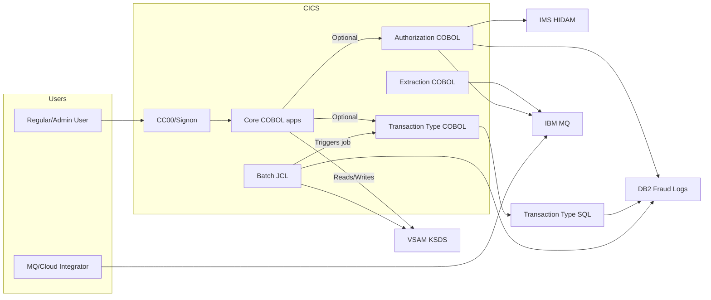

# System CardDemo - Overview for User Stories

**Version:** March 12, 2026  
**Purpose:** Single source of truth for crafting US-centric stories that span COBOL/CICS batch jobs, optional DB2/IMS/MQ extensions, and the supporting dataset landscape.

---

## 📊 Platform Statistics

- **Technology Stack:** COBOL (Enterprise COBOL), BMS mapsets, JCL, CICS, IMS DB (HIDAM), DB2, MQ, VSAM KSDS/KSD with AIX, RACF for authentication.
- **Architecture Pattern:** Transactional mainframe: CICS online layer orchestrates business logic via COBOL programs, writes to VSAM, and calls optional IMS/DB2/MQ sub-systems; batch jobs coordinate nightly data refresh and migrations.
- **Key Capabilities:** Account management, credit card lifecycle (view/update/add), transaction posting/reporting, bill payments, statement generation, pending authorization auditing, transaction-type governance, and MQ/VSAM data extraction.
- **Supported Languages:** US English textual flows in BMS mapsets, English-only job documentation and copybooks.

## 👥 Actors and Journeys

- **Regular User:** Signs on via `CC00`, lands on `CM00`, then views account/card detail (`CAVW`, `CCLI`, `CCDL`), posts a transaction (`CT02`), or pulls reports (`CR00`). Journeys include viewing statements (`CREASTMT`) and pending authorizations (`CPVS`/`CPVD`).
- **Admin User:** Authenticates as `ADMIN001`, opens the Admin Menu (`CA00`), manages users (`CU00` series), tunes transaction taxonomy (`CTTU`, `CTLI`), and triggers batch jobs (`CREADB21`, `COMBTRAN`).
- **Cloud/MQ Integrator (Authorization Module):** Sends MQ messages to `AWS.M2.CARDDEMO.PAUTH.REQUEST`, awaits replies on `AWS.M2.CARDDEMO.PAUTH.REPLY`, and consumes CICS `CP00` for request processing plus `COPAUA0C` to respond.
- **Batch Operator:** Runs JCL suites (`POSTTRAN`, `TRANIDX`, `OPENFIL`, `CBPAUP0J`, `MNTTRDB2`) via JCL scheduler to refresh VSAM/Db2 datasets.

## 🏗️ High-Level Architecture

### Technology Stack
**Backend:** COBOL under CICS 5.x/6.x (COSGN00C, COMEN01C, etc.)  
**Data Stores:** VSAM KSDS (Card/Account/Transaction), IMS HIDAM (authorization summary/details), DB2 (fraud log, transaction-type catalog)  
**Messaging & Integrations:** IBM MQ for authorization and data extraction, IMS DB/PDB, optional FTP and JCL utilities.  
**Scheduling:** CA7/Control-M job decks in `app/scheduler` automate nightly batch flows.

### Architectural Patterns
- **Transaction Gateway:** CICS programs act as controllers; BMS maps render screens, and copybooks (`app/cpy`, `app/cpy-bms`, `app/app-authorization-ims-db2-mq/cpy`, etc.) define record layouts.
- **Service Layer:** COBOL programs encapsulate chunks of business logic (e.g., `COACTVWC` for account view, `COPAUA0C` for MQ-driven authorizations, `COTRTUPC` for transaction-type management).
- **Data Duality:** Core transaction processing reads primary data from VSAM, while DB2 mirrors transaction-type metadata and stores fraud logs; IMS maintains nested authorization trees.
- **Authentication:** RACF manages user credentials; signon screen `CC00` and mapset `COSGN00` serve as gatekeepers.
- **Optionality Toggle:** Certain functionality (authorization queues, DB2 tables, MQ listeners) is dormant until optional modules are installed and their CICS resources defined via `app/app-.../csd` and `CARDDEMO.CSD`.

---

## 📚 Module Catalog

<!-- MODULE_LIST_START -->
**Modules:** core-carddemo, authorizations, transaction-type-management, account-extractions
<!-- MODULE_LIST_END -->

### 1. Core CardDemo
**ID:** `core-carddemo`  
**Purpose:** Provide the foundational credit card experience: account/card/transaction CRUD, reporting, billing, and security operations.
**Key Components:** COBOL programs in `app/cbl`, BMS mapsets in `app/bms`, copybooks in `app/cpy`/`app/cpy-bms`, datasets in `app/data`, job decks in `app/jcl`, CICS definitions in `app/csd`, and macros in `app/maclib`.
**Public APIs:**
- `CC00 / COSGN00C` (Signon), `CM00 / COMEN01C` (Main menu)  
- `CAVW`, `CAUP`, `CCLI`, `CCDL`, `CCUP`, `CT00`–`CT02`, `CR00`, `CB00` (Account/card/transaction screens)  
- JCL jobs: `POSTTRAN`, `CREASTMT`, `TRANIDX`, `OPENFIL`, `COMBTRAN`, `TRANBKP`, `CREADB21`, `TRANEXTR`, `DUSRSECJ`, `CBPAUP0J`, `MNTTRDB2`, `WAITSTEP`  
**User Story Examples:**
- As a regular user, I want to drill into my transaction history (`CT01`) so I can verify charges before paying my bill (`CB00`).
- As an admin, I want to add a new user via `CU01` so that I can grant controlled access to the platform.

### 2. Authorizations
**ID:** `authorizations`  
**Purpose:** Emulate cloud-to-mainframe credit card authorization flows that ingest MQ requests, apply business rules, store IMS detail, and persist fraud hits in DB2.
**Key Components:** COBOL programs (`COPAUA0C`, `COPAUS0C`, `COPAUS1C`, `COPAUS2C`, `CBPAUP0C`), IMS definitions (`app/app-authorization-ims-db2-mq/ims`), DB2 scripts (`app/app-authorization-ims-db2-mq/ddl`, `dcl`), MQ configuration (`app/app-authorization-ims-db2-mq/jcl`, `.csd`), copybooks (`CIPAUSMY`, `CCPAURQY`, etc.).
**Public APIs:**
- MQ queues: `AWS.M2.CARDDEMO.PAUTH.REQUEST` (input) and `.REPLY` (response) with comma-separated payloads.  
- CICS transactions: `CP00` (request runner), `CPVS`/`CPVD` (summary/detail screens), navigation via PF keys.  
- Batch: `CBPAUP0J` (purge expired authorizations), `CBPAUP0C` (batch COBOL purge)  
**User Story Examples:**
- As a fraud analyst, I want to review pending authorizations in `CPVS` and mark fraud (`COPAUS2C`) so that DB2 analytics can be accurate.
- As an integrator, I want a deterministic MQ response pattern for system-date (`CDRD`) and account detail (`CDRA`) requests triggered by optional flows.

### 3. Transaction Type Management
**ID:** `transaction-type-management`  
**Purpose:** Let administrators CRUD transaction-type reference data in DB2 while keeping VSAM caches in sync for the core posting engine.
**Key Components:** COBOL programs `COTRTUPC`, `COTRTLIC`, batch jobs `CREADB21`, `TRANEXTR`, `MNTTRDB2`, DB2 DDL (`CARDDEMO.TRANSACTION_TYPE`, `CARDDEMO.TRANSACTION_TYPE_CATEGORY`), declarations (`app/app-transaction-type-db2/dcl`), copybooks, and CICS mapsets (`COTRTUP`, `COTRTLI`).
**Public APIs:**
- CICS transactions `CTTU` (add/edit), `CTLI` (list/update/delete).  
- Batch: `CREADB21` (create DB2 tables), `TRANEXTR` (extract data into VSAM), `MNTTRDB2` (batch maintenance).  
**User Story Examples:**
- As an admin, I want to add a new transaction category via `CTTU` and publish it to VSAM so the posting job can accept new codes.
- As an operations user, I want to review and delete old transaction types via `CTLI` while honoring DB2 referential constraints.

### 4. Account Extractions
**ID:** `account-extractions`  
**Purpose:** Demonstrate MQ-driven VSAM data extraction for asynchronous communication (system date, account details) with request/response correlation.
**Key Components:** COBOL programs `CODATE01`, `COACCT01`, MQ connection definitions (`app/app-vsam-mq/csd`), queue declarations (`app/app-vsam-mq/jcl`), message copybooks, VSAM account files.
**Public APIs:**
- CICS transactions `CDRD` (system date MQ request), `CDRA` (account detail MQ request).  
- MQ resources: `CARDDEMO.REQUEST.QUEUE`, `CARDDEMO.RESPONSE.QUEUE`, MQCONN/MQQUEUE definitions in CICS.
**User Story Examples:**
- As an integration tester, I want to send `ACCT-REQUEST-MSG` via MQ and receive `ACCT-RESPONSE-MSG` so that asynchronous flows can be validated.
- As a compliance lead, I want to verify that the request/response correlation ID matches the MQ metadata on `CARDDEMO.RESPONSE.QUEUE`.

---

## 🔄 Architecture Diagram



---

## 📊 Data Models

### Authorization Fraud Records (DB2)
```sql
CREATE TABLE <<db2-schema>>.AUTHFRDS (
  CARD_NUM CHAR(16) NOT NULL,
  AUTH_TS TIMESTAMP NOT NULL,
  AUTH_TYPE CHAR(4),
  CARD_EXPIRY_DATE CHAR(4),
  MESSAGE_TYPE CHAR(6),
  …
  -- APPENDED FIELDS: FRAUD_RPT_DATE, ACCT_ID (DECIMAL(11)), CUST_ID (DECIMAL(9))
  PRIMARY KEY (CARD_NUM, AUTH_TS)
);
```

### IMS Authorization Hierarchy
- Root segment `PAUTSUM0` stores per-card summary and references child segment `PAUTDTL1` for detail lines.
- Index segment `PAUTINDX` (DBPAUTX0) maintains search keys.  
- BMP PSB `PSBPAUTB`/Load PSB `PSBPAUTL` expose online detail via `COPAUS0C` and `COPAUS1C`.

### MQ Message Formats (app/app-authorization-ims-db2-mq)
```cobol
01 AUTH-REQUEST-MSG.
   05 AUTH-DATE PIC X(8).
   05 AUTH-TIME PIC X(6).
   05 CARD-NUM PIC X(16).
   05 AUTH-TYPE PIC X(4).
   …
01 AUTH-RESPONSE-MSG.
   05 CARD-NUM.
   05 TRANSACTION-ID.
   05 AUTH-ID-CODE PIC X(6).
   05 AUTH-RESP-CODE PIC X(2).
   05 AUTH-RESP-REASON PIC X(4).
   05 APPROVED-AMT PIC 9(7)V99.
```

### Transaction-Type Tables (DB2)
- Table `CARDDEMO.TRANSACTION_TYPE` (`TR_TYPE`, `TR_DESCRIPTION`).
- Table `CARDDEMO.TRANSACTION_TYPE_CATEGORY` (`TRC_TYPE_CODE`, `TRC_TYPE_CATEGORY`, `TRC_CAT_DATA`) with DELETE RESTRICT.
- Extraction job `TRANEXTR` emits VSAM-friendly payloads consumed by `CT00`/`CT01` posting routines.

### Base VSAM Records (`app/cpy`)
- Records such as `CMSTACT0` (Customer Account), `CVACT02Y` (Card), `CVTRA06Y` (Transaction) define PIC clauses for all CRUD screens. These copybooks are reused by BMS programs (e.g., `COACTVWC`, `CT02`).

---

## 📋 Business Rules by Module

### Core CardDemo
- **Security:** RACF-bound signon (`CC00`) plus user CRUD (CU00–CU03) to keep access scoped.
- **Transactional Integrity:** Posting jobs (`POSTTRAN`, `COMBTRAN`, `CREASTMT`) must complete before `OPENFIL`/`CLOSEFIL` run.
- **Statement Generation:** Statement job (`CREASTMT`) aggregates `TRANBKP` output for user-facing reports.

### Authorizations
- **Request Validation:** MQ input is validated in `COPAUA0C`; missing data results in descriptive error rows logged to `AUTHFRAUD`.
- **Persistence:** Approvals/declines saved to IMS/HIDAM segments; fraud markings update `AUTHFRDS` and set `AUTH_FRAUD` flag.
- **Retention:** `CBPAUP0J` purges records older than the configured window and adjusts available credit counts.

### Transaction Type Management
- **Dual Persistence:** Every successful `CTTU`/`CTLI` mutation updates DB2 and triggers `TRANEXTR` to refresh VSAM caches before the next posting job.
- **Referential Safety:** Deletes are blocked by the `DELETE RESTRICT` constraint on `CARDDEMO.TRANSACTION_TYPE_CATEGORY`.
- **Batch Reconciliation:** `MNTTRDB2` reconciles VSAM and DB2 metadata nightly.

### Account Extractions
- **MQ Correlation:** Request/response IDs must match (`REQUEST-ID`/`RESPONSE-ID`) to close the message exchange on `CARDDEMO.RESPONSE.QUEUE`.
- **VSAM Lookups:** `COACCT01` reads VSAM account files using `ACCOUNT-DATA` copybook structure.
- **Attribute Exposure:** System date reference (`CDRD`) exposes `SYSTEM-DATE` field in `DATE-RESPONSE-MSG` as part of compliance logging.

---

## 🌐 Internationalization and Translation

- The UI surface is purely BMS-based; there are no external JSON/i18n bundles. Instead, labels and help text reside directly in BMS mapsets under `app/bms` (e.g., `COACTVW`, `COPAU00`).
- Text reuse comes from copybooks in `app/cpy-bms`, which define field-level names (e.g., `COCRDLI` list headings) and are shipped with the dataset.
- Any future translation work would need to duplicate mapsets or use map-level translation records; there is no runtime locale switching today.

## 📋 Form and Listing Patterns

- **Form Architecture:** Each user-facing screen is a BMS map (PF keys, 3270 layout). There are no Vue/React components—COBOL programs drive forms via mapsets plus copybooks (`app/cpy`, `app/app-authorization-ims-db2-mq/cpy`).
- **Validation:** COBOL `PIC` clauses and `IF` logic inside programs (`COACTUPC`, `COTRN02C`, `COPAUS0C`). Numeric fields leverage `PIC 9`/`COMP` declarations; error statuses are rendered by updating map fields and toggling PF keys.
- **Notifications:** Errors and status messages are embedded into map lines rather than toasts; the program rewrites the screen with descriptive text.
- **Listings:** Lists use BMS scroll (PF7/PF8) plus pick-and-enter logic handled in programs like `COTRN01C`, `COPAUS0C`, `COTRTLIC`. Buttons are physical PF keys, so actions are triggered by `MOVE` statements bound to indicator fields.

---

## 🎯 User Story Development Patterns

- **Core Template:** As a [persona], I want [CICS transaction or batch job change] so that [business outcome].
- **Story Complexity:** 1–2 pts for small screen tweaks (text updates on `CCLI`), 3–5 pts for new validation/DB2 logic (`CTTU`), 5+ pts for MQ+IMS integration changes (`CP00`).
- **Acceptance Criteria Patterns:**
  - **Authorization:** Must update IMS `PAUTDTL1`, persist DB2 fraud flag, and respond on MQ queue `AWS.M2.CARDDEMO.PAUTH.REPLY` within the transaction window.
  - **Validation:** Must ensure COBOL PIC errors show on the map and batch jobs do not commit partial data.
  - **Performance:** CICS interactive journeys should stay under <2s CPU wait; batch jobs should finish within 120s for standard data volumes.

---

## ⚡ Performance Budgets

- **Interactive CICS transactions:** P95 response time < 2.0 seconds (leveraging short-quanta COBOL logic and VSAM indexes).  
- **MQ round-trip (authorization/request):** < 6 seconds from queue put to reply get.  
- **DB2 operations (CTTU/CTLI, fraud logging):** < 500 ms for key updates under moderate load.  
- **Batch jobs (`POSTTRAN`, `TRANEXTR`, `CREASTMT`, `CBPAUP0J`):** Should complete within 2 minutes per job on modern z/OS engines when running at <80% queue depth.  
- **Cache freshness:** `TRANEXTR` must run after any DB2 change so VSAM files used by posting jobs never lag more than one batch window.

---

## 🚨 Readiness Considerations

### Technical Risks
- **MQ Dependency Drift:** Authorization flows rely on correctly defined MQCONN/MQQUEUE resources; missing definitions cause `CP00` failures. → Mitigation: include verification job that runs `CEMT GET MQCONN` before deployment.
- **Legacy Copybook Coupling:** Multiple programs share copybooks in `app/cpy` and `app/cpy-bms`; careless edits can break multiple mapsets. → Mitigation: centralize copybook updates and regenerate dependent mapsets after changes.
- **DB2 Constraint Enforcement:** `DELETE RESTRICT` rules make transaction-type deletes brittle. → Mitigation: Sequence migration stories to refresh VSAM/Db2 caches before allowing deletes.

### Tech Debt
- **Manual Dataset Provisioning:** The installation process still requires human dataset creation; automation by parameterized JCL is a future story.  → Resolution plan: capture current `app/jcl` jobs and add Terraform or Ansible wrappers.
- **Monitoring Gap:** No built-in telemetry for MQ throughput or authorization job health. → Resolution plan: add logging after MQ PUT/GET operations and feed to z/OS SMF.

### Sequencing for User Stories
- **Prerequisites:** Core CardDemo must be installed before optional modules; MQ/DB2 connections must exist before feature stories referencing those integrations.
- **Recommended Order:** Hardening base screens → Add transaction-type DB2 sync → Enable MQ-based authorizations → Layer account extraction MQ flows.

---

## 📈 Success Metrics

### Adoption
- **Target:** 100% of modernization POCs should use the credit card workflow (`CC00` -> `CT00`/`CB00`).
- **Engagement:** Track number of times optional transaction-type admin flows (`CTTU`, `CTLI`) are exercised via CICS logbook analysis.
- **Retention:** Keep MQ authorization story usage stable by ensuring at least 5 MQ authorizations run per test cycle via `AWS.M2.CARDDEMO.PAUTH` queues.

### Business Impact
- **Fraud Detection:** Reduce manual fraud review time by 30% by surfacing `CPVS`/`CPVD` summaries and `AUTHFRDS` insights.  
- **Reference Data Reliability:** Ensure `TRANEXTR` runs nightly so VSAM posting jobs always see the latest DB2 catalogue, preventing misposted transactions.  
- **Operational Readiness:** Automate `CBPAUP0J` to purge stale authorizations and keep IMS dataset footprint within budget.

*Last updated: March 12, 2026*
