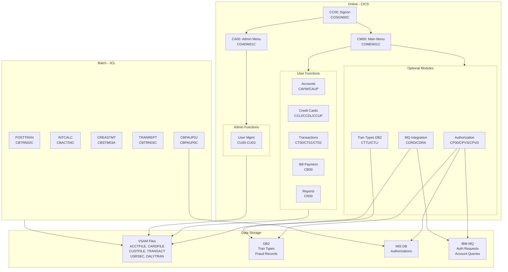
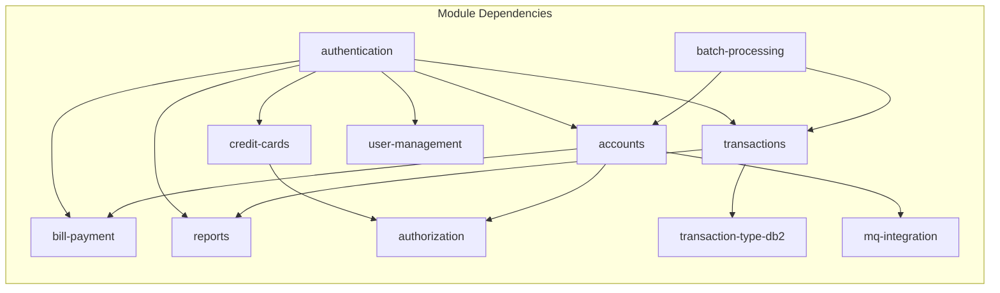

# System CardDemo - Overview for User Stories

**Version:** 2025-03-06  
**Purpose:** Single source of truth for creating well-structured User Stories

---

## 📊 Platform Statistics

- **Technology Stack:** COBOL, CICS, VSAM, JCL, RACF, Assembler; Optional: DB2, IMS DB, MQ
- **Architecture Pattern:** Online CICS transaction processing + Batch JCL processing, VSAM KSDS with AIX data stores
- **Key Capabilities:** Credit card management, account management, transaction processing, bill payment, reporting, user management, optional authorizations/fraud detection
- **Application Version:** CardDemo v1.0
- **Target Environment:** IBM z/OS Mainframe (AWS Blu Age / Micro Focus compatible)

---

## 🏗️ High-Level Architecture

### Technology Stack
**Online Runtime:** IBM CICS (Transaction Processing)  
**Batch Runtime:** JCL with z/OS utilities  
**Language:** COBOL (primary), Assembler (utilities)  
**Data Storage:** VSAM KSDS (primary), VSAM ESDS/RRDS, GDG  
**Screen Rendering:** BMS (Basic Mapping Support)  
**Security:** RACF  
**Optional – Database:** IBM DB2 (relational), IBM IMS DB (hierarchical)  
**Optional – Messaging:** IBM MQ

### Architectural Patterns
- **Commarea Pattern:** CICS programs pass state between screens using DFHCOMMAREA
- **Copybook-driven Data Models:** All record layouts defined in reusable copybooks (`.cpy`)
- **BMS Maps:** Each online screen has a corresponding BMS map defining field layout
- **Batch / Online Integration:** Batch jobs close/open VSAM files to reload or process data; CICS reads from same VSAM files online
- **Two-tier User Roles:** Regular users (self-service) and Admin users (administration)
- **Optional Module Pattern:** Extended functionality (DB2, IMS, MQ) layered on top of the base VSAM application without changing core code

### CICS Transaction Entry Points

| Transaction | Program    | Entry Screen                 |
|:------------|:-----------|:-----------------------------|
| CC00        | COSGN00C   | Signon Screen                |
| CM00        | COMEN01C   | User Main Menu               |
| CA00        | COADM01C   | Admin Menu                   |
| CAVW        | COACTVWC   | Account View                 |
| CAUP        | COACTUPC   | Account Update               |
| CCLI        | COCRDLIC   | Credit Card List             |
| CCDL        | COCRDSLC   | Credit Card View             |
| CCUP        | COCRDUPC   | Credit Card Update           |
| CT00        | COTRN00C   | Transaction List             |
| CT01        | COTRN01C   | Transaction View             |
| CT02        | COTRN02C   | Transaction Add              |
| CR00        | CORPT00C   | Transaction Reports          |
| CB00        | COBIL00C   | Bill Payment                 |
| CU00        | COUSR00C   | User List (Admin)            |
| CU01        | COUSR01C   | Add User (Admin)             |
| CU02        | COUSR02C   | Update User (Admin)          |
| CU03        | COUSR03C   | Delete User (Admin)          |
| CPVS        | COPAUS0C   | Pending Auth Summary (Optional) |
| CPVD        | COPAUS1C   | Pending Auth Detail (Optional)  |
| CP00        | COPAUA0C   | Process Auth Requests (Optional)|
| CTTU        | COTRTUPC   | Tran Type Add/Edit (Optional)   |
| CTLI        | COTRTLIC   | Tran Type List/Delete (Optional)|
| CDRD        | CODATE01   | System Date via MQ (Optional)   |
| CDRA        | COACCT01   | Account via MQ (Optional)       |

---

## 📚 Module Catalog

<!-- MODULE_LIST_START -->
**Modules:** authentication, accounts, credit-cards, transactions, bill-payment, reports, user-management, batch-processing, authorization, transaction-type-db2, mq-integration
<!-- MODULE_LIST_END -->

---

### 1. Authentication
**ID:** `authentication`  
**Purpose:** Controls user signon/signoff and session initialization for the CardDemo application.  
**Key Components:** `COSGN00C` (CICS), `COSGN00` (BMS map), `USRSEC` VSAM file, `CSUSR01Y` copybook  
**Transaction:** `CC00`  
**VSAM Files:** `USRSEC` – User Security file (record length 80, copybook `CSUSR01Y`)

**Key Operations:**
- Display signon screen
- Validate User ID and Password against USRSEC VSAM file
- Determine user type (Regular `R` / Admin `A`)
- Route authenticated users to Main Menu (CM00) or Admin Menu (CA00)
- Display error messages for invalid credentials

**Business Rules:**
- Default admin credentials: `ADMIN001` / `PASSWORD`
- Default user credentials: `USER0001` / `PASSWORD`
- User type flag (`SEC-USR-TYPE`) drives menu routing: `R` → Main Menu, `A` → Admin Menu
- Sessions are maintained via CICS COMMAREA

**User Story Examples:**
- As a cardholder, I want to log in with my User ID and Password so that I can access my account
- As a system administrator, I want to log in so that I can perform administrative functions
- As a security auditor, I want failed logins to be handled gracefully so that unauthorized access is blocked

---

### 2. Accounts
**ID:** `accounts`  
**Purpose:** Enables viewing and updating credit card account information.  
**Key Components:** `COACTVWC` (CICS view), `COACTUPC` (CICS update), `COACTUP`/`COACTVW` (BMS maps)  
**Transactions:** `CAVW` (view), `CAUP` (update)  
**VSAM Files:** `ACCTFILE` – Account Master (record length 300, copybook `CVACT01Y`)

**Key Operations:**
- View account balance, credit limit, cash credit limit
- View account open date, expiration date, reissue date
- View cycle credits and debits
- Update account fields (balance, limits, dates, group ID)

**Data Model – ACCOUNT-RECORD (CVACT01Y):**
```
01 ACCOUNT-RECORD.
   05 ACCT-ID                  PIC 9(11)       -- Account identifier
   05 ACCT-ACTIVE-STATUS       PIC X(01)       -- Account status (A=Active)
   05 ACCT-CURR-BAL            PIC S9(10)V99   -- Current balance
   05 ACCT-CREDIT-LIMIT        PIC S9(10)V99   -- Credit limit
   05 ACCT-CASH-CREDIT-LIMIT   PIC S9(10)V99   -- Cash advance limit
   05 ACCT-OPEN-DATE           PIC X(10)       -- Date opened (YYYY-MM-DD)
   05 ACCT-EXPIRAION-DATE      PIC X(10)       -- Expiration date
   05 ACCT-REISSUE-DATE        PIC X(10)       -- Reissue date
   05 ACCT-CURR-CYC-CREDIT     PIC S9(10)V99   -- Current cycle credits
   05 ACCT-CURR-CYC-DEBIT      PIC S9(10)V99   -- Current cycle debits
   05 ACCT-ADDR-ZIP            PIC X(10)       -- ZIP code
   05 ACCT-GROUP-ID            PIC X(10)       -- Discount group ID
```

**Business Rules:**
- Account ID is 11 digits
- Active status controls account usability
- Credit limit must be >= current balance for new transactions
- Group ID links to discount/rate tables

**User Story Examples:**
- As a cardholder, I want to view my current balance and credit limit so that I can manage my spending
- As a cardholder, I want to see my account open and expiration dates so that I can plan for card renewal
- As a customer service rep, I want to update account credit limits so that I can serve customer requests

---

### 3. Credit Cards
**ID:** `credit-cards`  
**Purpose:** Manages credit card records – listing, viewing details, and updating card information.  
**Key Components:** `COCRDLIC` (list), `COCRDSLC` (view), `COCRDUPC` (update); BMS maps `COCRDLI`, `COCRDSL`, `COCRDUP`  
**Transactions:** `CCLI` (list), `CCDL` (view), `CCUP` (update)  
**VSAM Files:** `CARDFILE` – Card Master (record length 150, copybook `CVACT02Y`); `CARDXREF` – Card/Account cross-reference (copybook `CVACT03Y`)

**Key Operations:**
- List all credit cards for an account
- View card details (card number, expiry, CVV, embossed name, status)
- Update card information (status, expiry, embossed name)
- Navigate between cards via PF keys

**Data Model – CARD-RECORD (CVACT02Y):**
```
01 CARD-RECORD.
   05 CARD-NUM               PIC X(16)    -- 16-digit card number
   05 CARD-ACCT-ID           PIC 9(11)    -- Associated account ID
   05 CARD-CVV-CD            PIC 9(03)    -- CVV security code
   05 CARD-EMBOSSED-NAME     PIC X(50)    -- Name on card
   05 CARD-EXPIRAION-DATE    PIC X(10)    -- Expiry date (YYYY-MM-DD)
   05 CARD-ACTIVE-STATUS     PIC X(01)    -- Status (Y=Active, N=Inactive)
```

**Business Rules:**
- Card number is 16 digits
- CVV is 3 digits
- Card status `Y` = active, `N` = inactive/blocked
- Cards link to accounts via CARDXREF (CVACT03Y)

**User Story Examples:**
- As a cardholder, I want to see all my credit cards so that I can choose which card to use
- As a cardholder, I want to view my card expiration date so that I know when to request a replacement
- As a customer service rep, I want to update card status so that I can activate or block cards

---

### 4. Transactions
**ID:** `transactions`  
**Purpose:** View, add, and process credit card transactions.  
**Key Components:** `COTRN00C` (list), `COTRN01C` (view), `COTRN02C` (add); BMS maps `COTRN00`, `COTRN01`, `COTRN02`  
**Transactions:** `CT00` (list), `CT01` (view), `CT02` (add)  
**VSAM Files:** `TRANSACT` – Transaction Master KSDS with AIX (record length 350, copybook `CVTRA05Y`); `DALYTRAN` – Daily transaction file (copybook `CVTRA06Y`)

**Key Operations:**
- List transactions with pagination (forward/backward)
- View individual transaction details
- Add new transactions to the TRANSACT file
- Cross-reference transactions to cards and accounts

**Data Model – TRAN-RECORD (CVTRA05Y):**
```
01 TRAN-RECORD.
   05 TRAN-ID               PIC X(16)        -- Transaction ID
   05 TRAN-TYPE-CD          PIC X(02)        -- Transaction type code
   05 TRAN-CAT-CD           PIC 9(04)        -- Category code
   05 TRAN-SOURCE           PIC X(10)        -- Source system
   05 TRAN-DESC             PIC X(100)       -- Description
   05 TRAN-AMT              PIC S9(09)V99    -- Transaction amount
   05 TRAN-MERCHANT-ID      PIC 9(09)        -- Merchant identifier
   05 TRAN-MERCHANT-NAME    PIC X(50)        -- Merchant name
   05 TRAN-MERCHANT-CITY    PIC X(50)        -- Merchant city
   05 TRAN-MERCHANT-ZIP     PIC X(10)        -- Merchant ZIP
   05 TRAN-CARD-NUM         PIC X(16)        -- Card number used
   05 TRAN-ORIG-TS          PIC X(26)        -- Original timestamp
   05 TRAN-PROC-TS          PIC X(26)        -- Processing timestamp
```

**Reference Data:**
- `TRANTYPE` – Transaction type codes (VSAM + optional DB2; copybook `CVTRA03Y`)
- `TRANCATG` – Transaction category codes (VSAM + optional DB2; copybook `CVTRA04Y`)
- `DISCGRP` – Disclosure groups (copybook `CVTRA02Y`)
- `TCATBALF` – Transaction category balances (copybook `CVTRA01Y`)

**Business Rules:**
- Transaction amount supports up to 9 digits + 2 decimal places
- Transaction type and category codes must be valid reference data
- Daily transactions (`DALYTRAN`) are posted to master via batch `POSTTRAN` / `CBTRN02C`
- AIX (alternate index) on TRANSACT file enables lookup by card number

**User Story Examples:**
- As a cardholder, I want to list my recent transactions so that I can review my spending
- As a cardholder, I want to view transaction details including merchant name and amount so that I can identify charges
- As a cardholder, I want to add a new transaction so that I can record purchases made

---

### 5. Bill Payment
**ID:** `bill-payment`  
**Purpose:** Allows cardholders to pay their account balance.  
**Key Components:** `COBIL00C` (CICS), `COBIL00` (BMS map)  
**Transaction:** `CB00`  
**VSAM Files:** Reads `ACCTFILE` and `TRANSACT`

**Key Operations:**
- Display current account balance
- Process full or partial balance payment
- Post payment transaction to transaction file
- Update account balance

**Business Rules:**
- Payment amount must be positive and ≤ current balance
- Payments are recorded as transactions in the TRANSACT file
- Account balance is updated after successful payment

**User Story Examples:**
- As a cardholder, I want to pay my balance so that I can reduce what I owe
- As a cardholder, I want to see my current balance before paying so that I know how much I owe
- As a cardholder, I want confirmation after payment so that I know my payment was processed

---

### 6. Reports
**ID:** `reports`  
**Purpose:** Generate and view transaction reports.  
**Key Components:** `CORPT00C` (CICS report submission), `CBTRN03C` (batch report generation), `CBSTM03A`/`CBSTM03B` (statement generation); BMS map `CORPT00`  
**Transaction:** `CR00`  
**JCL Jobs:** `TRANREPT` (CBTRN03C), `CREASTMT` (CBSTM03A)

**Key Operations:**
- Submit batch transaction report job from CICS
- Generate transaction detail report (batch)
- Produce account statement (batch)
- Print transaction data with categories and amounts

**Business Rules:**
- Reports are generated in batch via JCL submitted from CICS (Internal Reader)
- Statement uses GDG (Generation Data Group) for versioned output
- Reports include transaction type/category breakdowns

**User Story Examples:**
- As a cardholder, I want to generate a transaction report so that I can see my spending history
- As a cardholder, I want to receive a monthly statement so that I can track my transactions

---

### 7. User Management
**ID:** `user-management`  
**Purpose:** Admin functions for managing user accounts in the system (list, add, update, delete).  
**Key Components:** `COUSR00C` (list), `COUSR01C` (add), `COUSR02C` (update), `COUSR03C` (delete); BMS maps `COUSR00`–`COUSR03`  
**Transactions:** `CU00` (list), `CU01` (add), `CU02` (update), `CU03` (delete)  
**VSAM Files:** `USRSEC` – User Security file (copybook `CSUSR01Y`)

**Key Operations:**
- List all users (admin access required)
- Add new regular or admin users
- Update user details (name, password, type)
- Delete users from the system

**Data Model – SEC-USER-DATA (CSUSR01Y):**
```
01 SEC-USER-DATA.
   05 SEC-USR-ID       PIC X(08)   -- User ID (8 characters)
   05 SEC-USR-FNAME    PIC X(20)   -- First name
   05 SEC-USR-LNAME    PIC X(20)   -- Last name
   05 SEC-USR-PWD      PIC X(08)   -- Password (8 characters)
   05 SEC-USR-TYPE     PIC X(01)   -- User type: R=Regular, A=Admin
   05 SEC-USR-FILLER   PIC X(23)
```

**Business Rules:**
- Only Admin users can access user management screens
- User ID is max 8 characters
- Password is max 8 characters (no encryption in base app)
- User type `R` = Regular, `A` = Admin
- Deleting a user removes them from USRSEC permanently

**User Story Examples:**
- As an admin, I want to list all users so that I can manage system access
- As an admin, I want to add a new user so that I can grant access to a new employee
- As an admin, I want to update a user's password so that I can help with credential resets
- As an admin, I want to delete a user so that I can revoke access for departing employees

---

### 8. Batch Processing
**ID:** `batch-processing`  
**Purpose:** Offline data processing for transaction posting, interest calculation, statement generation, data loading, and reporting.  
**Key Components:**

| Program    | Type  | Function                                         |
|:-----------|:------|:-------------------------------------------------|
| CBACT01C   | Batch | Read and print account data file                 |
| CBACT02C   | Batch | Read and print card data file                    |
| CBACT03C   | Batch | Read and print account cross-reference file      |
| CBACT04C   | Batch | Interest calculation                             |
| CBCUS01C   | Batch | Read and print customer data file                |
| CBTRN01C   | Batch | Post daily transaction file (variant 1)          |
| CBTRN02C   | Batch | Post daily transaction file (POSTTRAN job)       |
| CBTRN03C   | Batch | Print transaction detail report (TRANREPT job)   |
| CBSTM03A   | Batch | Produce transaction statement (CREASTMT job)     |
| CBSTM03B   | Batch | Statement sub-component                          |
| CBEXPORT   | Batch | Export customer data for branch migration        |
| CBIMPORT   | Batch | Import customer data from branch migration       |

**Key JCL Jobs:**

| Job       | Purpose                                          |
|:----------|:-------------------------------------------------|
| POSTTRAN  | Core transaction posting (CBTRN02C)              |
| INTCALC   | Interest calculation (CBACT04C)                  |
| CREASTMT  | Statement generation (CBSTM03A) with GDG         |
| TRANREPT  | Transaction report (CBTRN03C)                    |
| COMBTRAN  | Combine daily + system transactions (SORT)       |
| TRANBKP   | Backup transaction database (IDCAMS)             |
| CLOSEFIL  | Close VSAM files for CICS (IEFBR14)              |
| OPENFIL   | Open VSAM files for CICS (IEFBR14)               |
| ACCTFILE  | Load account master (IDCAMS)                     |
| CARDFILE  | Load card master (IDCAMS)                        |
| CUSTFILE  | Load customer database (IDCAMS)                  |
| XREFFILE  | Load card/account cross-reference (IDCAMS)       |
| DUSRSECJ  | Initialize user security file (IEBGENER)         |
| DISCGRP   | Load disclosure group file (IDCAMS)              |
| TRANCATG  | Load transaction category types (IDCAMS)         |
| TRANTYPE  | Load transaction type file (IDCAMS)              |
| TCATBALF  | Load transaction category balance (IDCAMS)       |

**Business Rules:**
- Batch jobs must run with CICS files closed (`CLOSEFIL` before, `OPENFIL` after)
- POSTTRAN reads DALYTRAN and posts to TRANSACT VSAM
- INTCALC calculates interest based on account balances and group rates (DISCGRP)
- COMBTRAN merges system and daily transactions before statement generation
- Statements use GDG (Generation Data Groups) for history retention

**User Story Examples:**
- As a batch operator, I want to run POSTTRAN daily so that all transactions are posted to accounts
- As a finance team member, I want to run INTCALC monthly so that interest is applied correctly
- As an operations team member, I want automated batch scheduling so that reports run overnight

---

### 9. Authorization
**ID:** `authorization`  
**Purpose:** (Optional module) Real-time credit card authorization processing using IMS DB, DB2, and MQ. Includes fraud detection capability.  
**Key Components:** `COPAUA0C` (authorization decision), `COPAUS0C` (summary view), `COPAUS1C` (detail view), `COPAUS2C` (fraud mark), `CBPAUP0C` (batch purge)  
**Transactions:** `CP00` (process), `CPVS` (summary), `CPVD` (detail)  
**Technologies:** CICS, IMS DB (hierarchical storage), DB2 (fraud analytics), MQ (request/response), VSAM

**Key Operations:**
- Receive authorization requests via MQ (triggered by MQ message)
- Validate account and customer data via VSAM cross-reference
- Apply business rules to approve/decline authorization
- Store authorization record in IMS hierarchical database
- Send authorization response to reply MQ queue
- View authorization summary and details from CICS
- Mark authorizations as fraudulent
- Batch purge expired authorization records

**Business Rules:**
- MQ trigger starts `COPAUA0C` for each authorization request
- Account data retrieved from VSAM cross-reference
- Authorization results (approve/decline) stored in IMS DB
- Fraud marking inserts record into DB2 for analytics
- `CBPAUP0J` JCL runs `CBPAUP0C` to purge expired authorizations
- Two-phase commit across IMS DB and DB2

**User Story Examples:**
- As a cardholder, I want real-time authorization of my transactions so that I'm protected from fraud
- As a fraud analyst, I want to view pending authorizations so that I can identify suspicious patterns
- As a fraud analyst, I want to mark authorizations as fraudulent so that I can flag them for investigation

---

### 10. Transaction Type DB2
**ID:** `transaction-type-db2`  
**Purpose:** (Optional module) Maintain transaction type reference data in DB2 using CICS and batch programs. Demonstrates DB2 integration patterns.  
**Key Components:** `COTRTUPC` (add/edit), `COTRTLIC` (list/delete), `COBTUPDT` (batch maintenance); BMS maps `COTRTUP`, `COTRTLI`  
**Transactions:** `CTTU` (add/edit), `CTLI` (list/delete)  
**Technologies:** CICS, DB2 (static embedded SQL, cursors, SQLCA), VSAM integration

**Key Operations:**
- List transaction types from DB2 with forward/backward cursor navigation
- Add new transaction type records to DB2
- Update existing transaction type codes and descriptions
- Delete transaction types from DB2
- Batch extract DB2 data to VSAM-compatible files (TRANEXTR job)
- Batch maintenance updates (MNTTRDB2 job / COBTUPDT)

**Business Rules:**
- Transaction type codes must be unique in DB2
- CTTU transaction supports both Insert and Update via static embedded SQL
- CTLI demonstrates forward and backward cursor processing
- TRANEXTR job extracts DB2 data to VSAM for use by the base application
- Proper SQLCA error handling required for all DB2 operations

**User Story Examples:**
- As an admin, I want to add new transaction types so that new merchant categories can be processed
- As an admin, I want to list and edit transaction types so that I can maintain accurate reference data
- As an admin, I want to delete obsolete transaction types so that the reference data stays clean

---

### 11. MQ Integration
**ID:** `mq-integration`  
**Purpose:** (Optional module) Asynchronous account data extraction and date inquiry via IBM MQ request/response patterns.  
**Key Components:** `CODATE01` (date inquiry), `COACCT01` (account inquiry)  
**Transactions:** `CDRD` (system date), `CDRA` (account details)  
**Technologies:** CICS, IBM MQ, VSAM

**Key Operations:**
- Send system date inquiry request via MQ and receive response (CDRD/CODATE01)
- Send account details inquiry via MQ and receive response (CDRA/COACCT01)
- Demonstrate asynchronous MQ request/response patterns

**Business Rules:**
- Programs use MQ request/response pattern (send to request queue, receive from reply queue)
- Demonstrates integration between CICS and external MQ-based systems
- COACCT01 reads account data from VSAM and returns via MQ response

**User Story Examples:**
- As a developer, I want to demonstrate MQ integration so that external systems can query account data asynchronously
- As an integration architect, I want to use MQ for decoupled communication so that systems can be independently scaled

---

## 🔄 Architecture Diagram





---

## 📊 Data Models

### VSAM Files Summary

| VSAM File    | Record Len | Copybook   | Description                             |
|:-------------|:----------:|:-----------|:----------------------------------------|
| USRSEC       | 80         | CSUSR01Y   | User Security – user IDs and passwords  |
| ACCTFILE     | 300        | CVACT01Y   | Account Master – account balances/limits|
| CARDFILE     | 150        | CVACT02Y   | Card Master – card numbers/status       |
| CUSTFILE     | 500        | CVCUS01Y   | Customer Master – personal information  |
| CARDXREF     | 50         | CVACT03Y   | Card/Account/Customer cross-reference   |
| TRANSACT     | 350        | CVTRA05Y   | Online Transaction Master (KSDS+AIX)    |
| DALYTRAN     | 350        | CVTRA06Y   | Daily Transaction input for batch       |
| TRANTYPE     | 60         | CVTRA03Y   | Transaction Type reference              |
| TRANCATG     | 60         | CVTRA04Y   | Transaction Category reference          |
| DISCGRP      | 50         | CVTRA02Y   | Disclosure Groups / Interest rates      |
| TCATBALF     | 50         | CVTRA01Y   | Transaction Category Balances           |

### Customer Record (CVCUS01Y) – Record Length 500

```cobol
01 CUSTOMER-RECORD.
   05 CUST-ID                    PIC 9(09)    -- 9-digit customer ID
   05 CUST-FIRST-NAME            PIC X(25)    -- First name
   05 CUST-MIDDLE-NAME           PIC X(25)    -- Middle name
   05 CUST-LAST-NAME             PIC X(25)    -- Last name
   05 CUST-ADDR-LINE-1           PIC X(50)    -- Address line 1
   05 CUST-ADDR-LINE-2           PIC X(50)    -- Address line 2
   05 CUST-ADDR-LINE-3           PIC X(50)    -- Address line 3
   05 CUST-ADDR-STATE-CD         PIC X(02)    -- State code
   05 CUST-ADDR-COUNTRY-CD       PIC X(03)    -- Country code
   05 CUST-ADDR-ZIP              PIC X(10)    -- ZIP code
   05 CUST-PHONE-NUM-1           PIC X(15)    -- Primary phone
   05 CUST-PHONE-NUM-2           PIC X(15)    -- Secondary phone
   05 CUST-SSN                   PIC 9(09)    -- Social Security Number
   05 CUST-GOVT-ISSUED-ID        PIC X(20)    -- Government-issued ID
   05 CUST-DOB-YYYY-MM-DD        PIC X(10)    -- Date of birth
   05 CUST-EFT-ACCOUNT-ID        PIC X(10)    -- EFT account for payments
   05 CUST-PRI-CARD-HOLDER-IND   PIC X(01)    -- Primary cardholder indicator
   05 CUST-FICO-CREDIT-SCORE     PIC 9(03)    -- FICO credit score
```

---

## 📋 Business Rules by Module

### Authentication Rules
- User ID: exactly 8 characters (padded with spaces)
- Password: exactly 8 characters
- User type `R` routes to Main Menu; `A` routes to Admin Menu
- Session state maintained in CICS COMMAREA

### Account Rules
- Account ID: 11 numeric digits
- Balance uses signed packed decimal format `S9(10)V99`
- Active status `A` = active account; blank or other = inactive

### Credit Card Rules
- Card number: 16 digits (PAN)
- CVV: 3 digits
- Active status `Y` = active, `N` = inactive/blocked

### Transaction Rules
- Transaction ID: 16 characters
- Amount: signed `S9(09)V99` (supports up to $9,999,999.99)
- Type and category codes must exist in reference files
- Original timestamp and processing timestamp recorded separately

### Bill Payment Rules
- Payment amount must be > 0
- Payments recorded as transaction records

### Batch Processing Rules
- VSAM files must be closed before batch jobs that reload data
- POSTTRAN processes DALYTRAN records sequentially
- Interest is calculated using DISCGRP rates per account group
- Statements use GDG versioning

---

## 🎯 Patterns for User Stories

### Templates by Domain

#### Account Management Stories
**Pattern:** As a [cardholder/CSR] I want [account action] so that [financial outcome]
- As a cardholder, I want to view my current balance so that I can monitor my available credit
- As a CSR, I want to update credit limits so that I can respond to limit increase requests

#### Transaction Stories  
**Pattern:** As a [cardholder/analyst] I want [transaction visibility] so that [financial tracking]
- As a cardholder, I want to see transaction details so that I can verify charges
- As a cardholder, I want to add manual transactions so that I can track cash expenses

#### Admin Stories
**Pattern:** As an admin I want [user management action] so that [access control outcome]
- As an admin, I want to add users so that new employees can access the system
- As an admin, I want to delete users so that departing employees lose access

#### Batch Operation Stories
**Pattern:** As a [batch operator/finance team] I want [batch job] to run so that [business process]
- As a batch operator, I want POSTTRAN to run nightly so that daily transactions are posted
- As a finance team, I want INTCALC to run monthly so that interest is applied accurately

### Story Complexity Guidelines
- **Simple (1-2 pts):** View a screen (account view, transaction list, card list)
- **Medium (3-5 pts):** Update/add data with validation (account update, add transaction, user management)
- **Complex (5-8 pts):** Multi-system operations (authorization with IMS+DB2+MQ, batch job chains, statement generation)
- **Epic (8+ pts):** Full new module integration (e.g., new optional module with new data storage)

### Acceptance Criteria Patterns
- **Signon:** Must validate User ID and Password; invalid credentials → error message on screen
- **Data Validation:** Must reject non-numeric values in numeric fields; must enforce field length limits
- **Authorization (CICS):** PF key navigation must work; screen must refresh with updated data
- **Batch:** Job must complete with return code 0; output file must have expected record count
- **Error Handling:** CICS ABEND must be caught; meaningful error message displayed to user
- **Performance:** CICS response < 3 seconds for screen display; batch < configured runtime window

---

## ⚡ Performance Budgets

- **CICS Response Time:** < 3 seconds (screen display / data retrieval)
- **Batch Window:** POSTTRAN, INTCALC, CREASTMT must complete within nightly batch window
- **VSAM I/O:** Sequential reads for batch; keyed reads for online (< 100ms)
- **MQ Response:** Authorization response < 30 seconds (real-time processing)

---

## 🚨 Readiness Considerations

### Technical Risks
- **VSAM File Sharing:** CICS and batch cannot access the same VSAM file simultaneously → Mitigation: CLOSEFIL/OPENFIL jobs manage file availability
- **Optional Module Dependencies:** DB2, IMS, MQ modules require additional infrastructure → Mitigation: Modules are independent and can be installed separately
- **No Password Encryption:** Base application stores passwords in plain text → Mitigation: RACF integration provides production security layer

### Tech Debt
- **Typo in CVACT01Y/CVACT02Y:** Field name `ACCT-EXPIRAION-DATE` / `CARD-EXPIRAION-DATE` (missing 't') → No functional impact, preserve for compatibility
- **Mixed COBOL styles:** Application intentionally uses varied coding patterns to support migration tooling testing

### Sequencing for US
- **Prerequisites:** Authentication must work before any other function
- **Recommended order:** authentication → accounts → credit-cards → transactions → bill-payment → reports → user-management → batch-processing → authorization → transaction-type-db2 → mq-integration

---

## 📈 Success Metrics

### Adoption
- **Target:** All credit card management functions accessible from CICS terminal
- **Engagement:** Cardholder can complete view/update cycle within 3 CICS transactions
- **Retention:** Batch jobs complete reliably within nightly window

### Business Impact
- **Transaction Processing:** Daily transactions posted within batch window
- **Account Accuracy:** Account balances reflect all posted transactions and interest calculations
- **Security:** Only authenticated users access their own account data

---

*Last updated: 2025-03-06*
